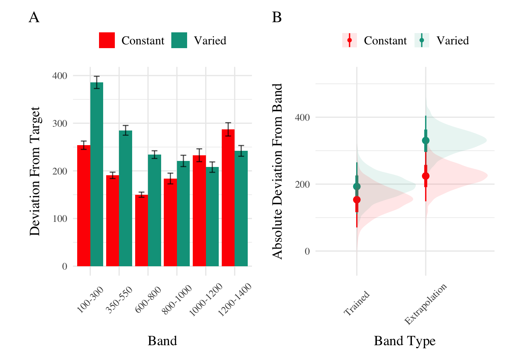

::: {.cell}

```{.r .cell-code}
pacman::p_load(dplyr,purrr,tidyr,tibble,ggplot2,
  brms,tidybayes, rstanarm,emmeans,broom,bayestestR,
  stringr, here,conflicted, patchwork, knitr,kableExtra)

walk(c("brms","dplyr","bayestestR"), conflict_prefer_all, quiet = TRUE)
walk(c("Display_Functions","org_functions"), ~ source(here::here(paste0("Functions/", .x, ".R"))))
e1 <- readRDS(here("data/e1_08-21-23.rds")) 
e1Sbjs <- e1 |> group_by(id,condit) |> summarise(n=n())
testE1 <- e1 |> filter(expMode2 == "Test")
nbins=5
trainE1 <-  e1 |> filter(expMode2=="Train") |> group_by(id,condit, vb) |> 
    mutate(Trial_Bin = cut( gt.train, breaks = seq(1, max(gt.train),length.out=nbins+1),include.lowest = TRUE, labels=FALSE)) 
trainE1_max <- trainE1 |> filter(Trial_Bin == nbins, bandInt==800)
```
:::


### Analyses Strategy

All data processing and statistical analyses were performed in R version 4.32 @rcoreteamLanguageEnvironmentStatistical2020. To assess differences between groups, we used Bayesian Mixed Effects Regression. Model fitting was performed with the brms package in R @burknerBrmsPackageBayesian2017, and descriptive stats and tables were extracted with the BayestestR package @makowskiBayestestRDescribingEffects2019. Mixed effects regression enables us to take advantage of partial pooling, simultaneously estimating parameters at the individual and group level. Our use of Bayesian, rather than frequentist methods allows us to directly quantify the uncertainty in our parameter estimates, as well as circumventing convergence issues common to the frequentist analogues of our mixed models. 

Each model was set to run with 4 chains, 5000 iterations per chain, with the first 2500 discarded as warmup chains. Rhat values were within an acceptable range, with values \<=1.02 (see appendix for diagnostic plots). We used uninformative priors for the fixed effects of the model (condition and velocity band), and weakly informative Student T distributions for for the random effects. For each model, we report the median values of the posterior distribution, and 95% credible intervals. EXPLAIN WHAT PARAMETERS REPRESENT AND WHAT HDI & PD 

For the testing phase of all experiments, we compare varied and constant performance across two measures, deviation and discrimination. Deviation was quantified as the absolute deviation from the nearest boundary of the velocity band, or set to 0 if the throw velocity fell anywhere inside the target band. Thus, when the target band was 600-800, throws of 400, 650, and 1100 would result in deviation values of 200, 0, and 300, respectively. The degree of discrimination between bands was  measured by fitting a linear model to the testing throws of each subjects, with the lower end of the target velocity band as the predicted variable, and the x velocity produced by the participants as the predictor variable. Participants who reliably discriminated between velocity bands tended to have positive slopes with values \~1, while participants who made throws irrespective of the current target band would have slopes \~0.


```{=tex}
\begin{equation}
dist_{ij} = \beta_0 + \beta_1 \cdot condit_{ij} + \beta_2 \cdot band_{ij} + \beta_3 \cdot condit_{ij} \cdot band_{ij} + b_{0i} + b_{1i} \cdot band_{ij} + \epsilon_{ij}
\end{equation}
```


### Results


::: {.cell}

```{.r .cell-code}
trainE1 |> ggplot(aes(x = Trial_Bin, y = dist, color = condit)) +
    stat_summary(geom = "line", fun = mean) +
    stat_summary(geom = "errorbar", fun.data = mean_se, width = .4, alpha = .7) +
    facet_wrap(~vb)+
    scale_x_continuous(breaks = seq(1, nbins + 1)) +
    theme(legend.title=element_blank()) + 
    labs(y = "Deviation", x="Training Block") 
```

::: {.cell-output-display}
{#fig-e1-train-dev width=672}
:::
:::

::: {#tbl-e1-train-dist .cell tbl-cap='Experiment 1 - Learning curves. '}

```{.r .cell-code}
bmm_e1_train<- trainE1_max %>% 
  brm(dist ~ condit, 
      file=here("data/model_cache/e1_train_deviation"),
      data = .,
      iter = 2000,
      chains = 4,
      control = list(adapt_delta = .94, max_treedepth = 13))
mtr1 <- as.data.frame(describe_posterior(bmm_e1_train, centrality = "Mean"))[, c(1,2,4,5,6)]
colnames(mtr1) <- c("Term", "Estimate","95% CrI Lower", "95% CrI Upper", "pd")

mtr1 |> mutate(across(where(is.numeric), \(x) round(x, 2))) |>
  tibble::remove_rownames() |> 
  mutate(Term = stringr::str_remove(Term, "b_")) |>
   kable(booktabs = TRUE)
```

::: {.cell-output-display}

`````{=html}
<table>
 <thead>
  <tr>
   <th style="text-align:left;"> Term </th>
   <th style="text-align:right;"> Estimate </th>
   <th style="text-align:right;"> 95% CrI Lower </th>
   <th style="text-align:right;"> 95% CrI Upper </th>
   <th style="text-align:right;"> pd </th>
  </tr>
 </thead>
<tbody>
  <tr>
   <td style="text-align:left;"> Intercept </td>
   <td style="text-align:right;"> 106.34 </td>
   <td style="text-align:right;"> 95.46 </td>
   <td style="text-align:right;"> 117.25 </td>
   <td style="text-align:right;"> 1 </td>
  </tr>
  <tr>
   <td style="text-align:left;"> conditVaried </td>
   <td style="text-align:right;"> 79.64 </td>
   <td style="text-align:right;"> 57.92 </td>
   <td style="text-align:right;"> 101.63 </td>
   <td style="text-align:right;"> 1 </td>
  </tr>
</tbody>
</table>

`````

:::

```{.r .cell-code}
cdtr1 <- get_coef_details(bmm_e1_train, "conditVaried")
```
:::


*Training*. @fig-e1-train-dev displays the average deviations across training blocks (recall that the varied group trains from 3 bands and the constant group from 1). We compared the training conditions from the final training block, on the position for which both groups trained (band 800-1000). Full model results are shown in @tbl-e1-train-dist. The varied group had a significantly greater deviation than the constant group.  (β = 79.64, 95% CrI \[57.92, 101.63\]; pd = 100%). 


::: {#tbl-e1-bmm-dist .cell tbl-cap='E1. Training vs. Extrapolation'}

```{.r .cell-code}
#options(brms.backend="cmdstanr",mc.cores=4)
modelFile <- paste0(here::here("data/model_cache/"), "e1_dist_Cond_Type_RF_2")
bmtd <- brm(dist ~ condit * bandType + (1|bandInt) + (1|id), 
    data=testE1, file=modelFile,
    iter=5000,chains=4, control = list(adapt_delta = .94, max_treedepth = 13))
                        
#bayestestR::describe_posterior(bmtd)

mted1 <- as.data.frame(describe_posterior(bmtd, centrality = "Mean"))[, c(1,2,4,5,6)]
colnames(mted1) <- c("Term", "Estimate","95% CrI Lower", "95% CrI Upper", "pd")


# r_bandInt_params <- get_variables(bmtd)[grepl("r_bandInt", get_variables(bmtd))]
# posterior_summary(bmtd,variable=r_bandInt_params)
# 
# r_bandInt_params <- get_variables(bmtd)[grepl("r_id:bandInt", get_variables(bmtd))]
# posterior_summary(bmtd,variable=r_bandInt_params)

mted1 |> mutate(across(where(is.numeric), \(x) round(x, 2))) |>
  tibble::remove_rownames() |> 
  mutate(Term = stringr::str_remove(Term, "b_")) |> kable(booktabs = TRUE)
```

::: {.cell-output-display}

`````{=html}
<table>
 <thead>
  <tr>
   <th style="text-align:left;"> Term </th>
   <th style="text-align:right;"> Estimate </th>
   <th style="text-align:right;"> 95% CrI Lower </th>
   <th style="text-align:right;"> 95% CrI Upper </th>
   <th style="text-align:right;"> pd </th>
  </tr>
 </thead>
<tbody>
  <tr>
   <td style="text-align:left;"> Intercept </td>
   <td style="text-align:right;"> 152.55 </td>
   <td style="text-align:right;"> 70.63 </td>
   <td style="text-align:right;"> 229.85 </td>
   <td style="text-align:right;"> 1.0 </td>
  </tr>
  <tr>
   <td style="text-align:left;"> conditVaried </td>
   <td style="text-align:right;"> 39.00 </td>
   <td style="text-align:right;"> -21.10 </td>
   <td style="text-align:right;"> 100.81 </td>
   <td style="text-align:right;"> 0.9 </td>
  </tr>
  <tr>
   <td style="text-align:left;"> bandTypeExtrapolation </td>
   <td style="text-align:right;"> 71.51 </td>
   <td style="text-align:right;"> 33.24 </td>
   <td style="text-align:right;"> 109.60 </td>
   <td style="text-align:right;"> 1.0 </td>
  </tr>
  <tr>
   <td style="text-align:left;"> conditVaried:bandTypeExtrapolation </td>
   <td style="text-align:right;"> 66.46 </td>
   <td style="text-align:right;"> 32.76 </td>
   <td style="text-align:right;"> 99.36 </td>
   <td style="text-align:right;"> 1.0 </td>
  </tr>
</tbody>
</table>

`````

:::

```{.r .cell-code}
cdted1 <- get_coef_details(bmtd, "conditVaried")
cdted2 <-get_coef_details(bmtd, "bandTypeExtrapolation")
cdted3 <-get_coef_details(bmtd, "conditVaried:bandTypeExtrapolation")
```
:::


*Testing.* To compare conditions in the testing stage, we first fit a model predicting deviation from the target band as a function of training condition and band type, with random intercepts for participants and bands. The model is shown in @tbl-e1-bmm-dist. The effect of training condition was not reliably different from 0 (β = 39, 95% CrI \[-21.1, 100.81\]; pd = 89.93%). The extrapolation testing items had a significantly greater deviation than the interpolation band (β = 71.51, 95% CrI \[33.24, 109.6\]; pd = 99.99%). The interaction between training condition and band type was significant (β = 66.46, 95% CrI \[32.76, 99.36\]; pd = 99.99%), with the varied group showing a greater deviation than the constant group in the extrapolation bands. See @fig-e1-test-dev.  


::: {.cell}

```{.r .cell-code}
pe1td <- testE1 |>  ggplot(aes(x = vb, y = dist,fill=condit)) +
    stat_summary(geom = "bar", position=position_dodge(), fun = mean) +
    stat_summary(geom = "errorbar", position=position_dodge(.9), fun.data = mean_se, width = .4, alpha = .7) + 
  theme(legend.title=element_blank(),axis.text.x = element_text(angle = 45, hjust = 0.5, vjust = 0.5)) +
  labs(x="Band", y="Deviation From Target")

condEffects <- function(m,xvar){
  m |> ggplot(aes(x = {{xvar}}, y = .value, color = condit, fill = condit)) + 
  stat_dist_pointinterval() + 
  stat_halfeye(alpha=.1, height=.5) +
  theme(legend.title=element_blank(),axis.text.x = element_text(angle = 45, hjust = 0.5, vjust = 0.5)) 
  
}

pe1ce <- bmtd |> emmeans( ~condit + bandType) |>
  gather_emmeans_draws() |>
 condEffects(bandType) + labs(y="Absolute Deviation From Band", x="Band Type")

(pe1td + pe1ce) + plot_annotation(tag_levels= 'A')
```

::: {.cell-output-display}
{#fig-e1-test-dev width=672}
:::
:::

::: {#tbl-e1-bmm-vx .cell tbl-cap='Experiment 1. Bayesian Mixed Model Predicting Vx as a function of condition (Constant vs. Varied) and Velocity Band'}

```{.r .cell-code}
e1_vxBMM <- brm(vx ~ condit * bandInt + (1 + bandInt|id),
                        data=test,file=paste0(here::here("data/model_cache", "e1_testVxBand_RF_5k")),
                        iter=5000,chains=4,silent=0,
                        control=list(adapt_delta=0.94, max_treedepth=13))

GetModelStats(e1_vxBMM) |> 
  kable(booktabs = TRUE)
```

::: {.cell-output-display}

`````{=html}
<table>
 <thead>
  <tr>
   <th style="text-align:left;"> Term </th>
   <th style="text-align:right;"> Estimate </th>
   <th style="text-align:right;"> 95% CrI Lower </th>
   <th style="text-align:right;"> 95% CrI Upper </th>
   <th style="text-align:right;"> pd </th>
  </tr>
 </thead>
<tbody>
  <tr>
   <td style="text-align:left;"> Intercept </td>
   <td style="text-align:right;"> 408.55 </td>
   <td style="text-align:right;"> 327.00 </td>
   <td style="text-align:right;"> 490.61 </td>
   <td style="text-align:right;"> 1.00 </td>
  </tr>
  <tr>
   <td style="text-align:left;"> conditVaried </td>
   <td style="text-align:right;"> 164.05 </td>
   <td style="text-align:right;"> 45.50 </td>
   <td style="text-align:right;"> 278.85 </td>
   <td style="text-align:right;"> 1.00 </td>
  </tr>
  <tr>
   <td style="text-align:left;"> Band </td>
   <td style="text-align:right;"> 0.71 </td>
   <td style="text-align:right;"> 0.62 </td>
   <td style="text-align:right;"> 0.80 </td>
   <td style="text-align:right;"> 1.00 </td>
  </tr>
  <tr>
   <td style="text-align:left;"> condit*Band </td>
   <td style="text-align:right;"> -0.14 </td>
   <td style="text-align:right;"> -0.26 </td>
   <td style="text-align:right;"> -0.01 </td>
   <td style="text-align:right;"> 0.98 </td>
  </tr>
</tbody>
</table>

`````

:::

```{.r .cell-code}
cd1 <- get_coef_details(e1_vxBMM, "conditVaried")
sc1 <- get_coef_details(e1_vxBMM, "bandInt")
intCoef1 <- get_coef_details(e1_vxBMM, "conditVaried:bandInt")
```
:::


Finally, to assess the ability of both conditions to discriminate between velocity bands, we fit a model predicting velocity as a function of training condition and velocity band, with random intercepts and random slopes for each participant. See @tbl-e1-bmm-vx for the full model results. The estimated coefficient for training condition (β = 164.05, 95% CrI \[45.5, 278.85\]) suggests that the varied group tends to produce harder throws than the constant group, but is not in and of itself useful for assessing discrimination. Most relevant to the issue of discrimination is the slope on Velocity Band (β = 0.71, 95% CrI \[0.62, 0.8\]). Although the median slope does fall underneath the ideal of value of 1, the fact that the 95% credible interval does not contain 0 provides strong evidence that participants exhibited some discrimination between bands. The estimate for the interaction between slope and condition (β = -0.14, 95% CrI \[-0.26, -0.01\]), suggests that the discrimination was somewhat modulated by training condition, with the varied participants showing less sensitivity between bands than the constant condition. This difference is depicted visually in @fig-e1-test-vx. 


::: {.cell}

```{.r .cell-code}
pe1tv <- testE1 %>% group_by(id,vb,condit) |> plot_distByCondit()

pe1vce <- e1_vxBMM |> emmeans( ~condit + bandInt,re_formula=NA, 
                       at = list(bandInt = c(100, 350, 600, 800, 1000, 1200))) |>
  gather_emmeans_draws() |> 
  condEffects(bandInt) +
  stat_lineribbon(alpha = .25, size = 1, .width = c(.95)) +
  scale_x_continuous(breaks = c(100, 350, 600, 800, 1000, 1200), 
                     labels = levels(testE1$vb), 
                     limits = c(0, 1400)) + 
  scale_y_continuous(expand=expansion(add=100),breaks=round(seq(0,2000,by=200),2)) +
  theme(legend.title=element_blank()) + 
  labs(y="Velcoity", x="Band")

fe <- fixef(e1_vxBMM)[,1]
fixed_effect_bandInt <- fixef(e1_vxBMM)[,1]["bandInt"]
fixed_effect_interaction <- fixef(e1_vxBMM)[,1]["conditVaried:bandInt"]

re <- data.frame(ranef(e1_vxBMM, pars = "bandInt")$id[, ,'bandInt']) |> 
  rownames_to_column("id") |> 
  left_join(e1Sbjs,by="id") |>
  mutate(adjust= fixed_effect_bandInt + fixed_effect_interaction*(condit=="Varied"),slope = Estimate + adjust )


pid_den1 <- ggplot(re, aes(x = slope, fill = condit)) + 
  geom_density(alpha=.5) + 
  xlim(c(min(re$slope)-.3, max(re$slope)+.3))+
   theme(legend.title=element_blank()) + 
  labs(x="Slope Coefficient",y="Density")

pid_slopes1 <- re |>  mutate(id=reorder(id,slope)) |>
  ggplot(aes(y=id, x=slope,fill=condit,color=condit)) + 
    geom_pointrange(aes(xmin=Q2.5+adjust, xmax=Q97.5+adjust)) + 
     theme(legend.title=element_blank()) + 
    labs(x="Estimated Slope", y="Participant")  + 
    ggh4x::facet_wrap2(~condit,axes="all",scales="free_y")

pe1tv / (pe1vce + pid_den1 + pid_slopes1) + plot_annotation(tag_levels= 'A')
```

::: {.cell-output-display}
{#fig-e1-test-vx width=1152}
:::
:::
