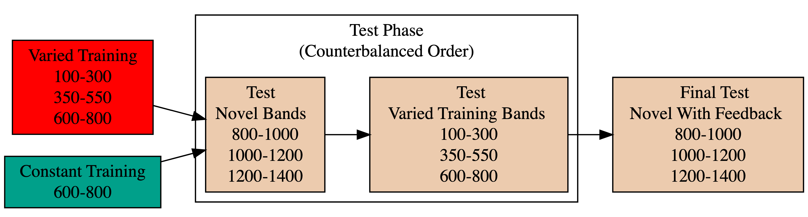
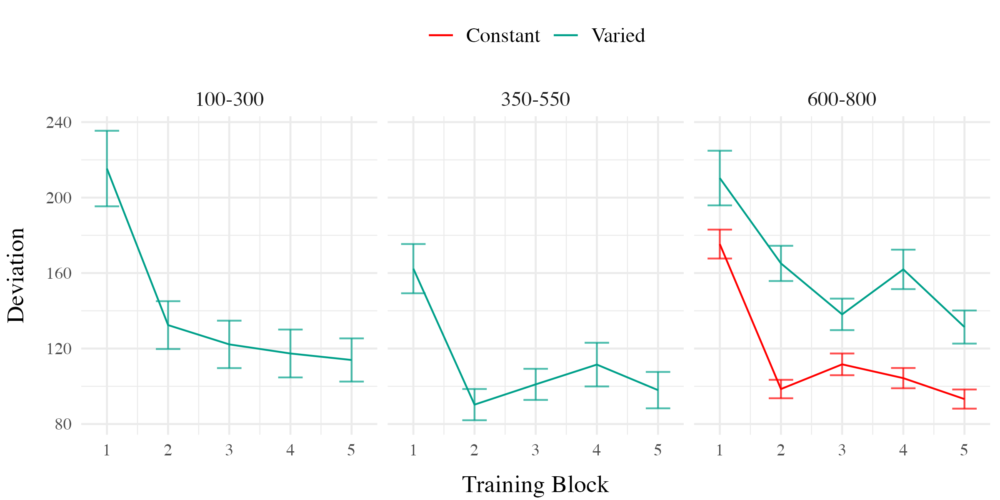
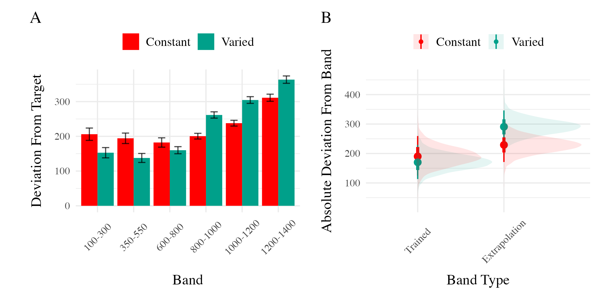
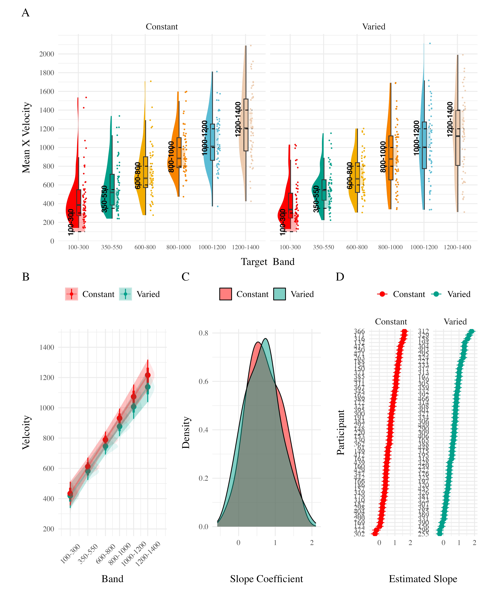

::: {.cell}

:::

@fig-design-e2 illustrates the design of Experiment 2. The stages of the experiment (i.e. training, testing no-feedback, test with feedback), are identical to that of Experiment 1. The only change is that Experiment 2 participants train, and then test, on bands in the reverse order of Experiment 1 (i.e. training on the softer bands; and testing on the harder bands). 

:::{.cell .column-screen-inset-right fig-width="8" fig-height="2.5" fig-responsive=false eval=false layout-align="default"}

:::{.cell-output-display}

:::{#fig-design-e2}

:::{}
:::

Experiment 2 Design. Constant and Varied participants complete different training conditions. The training and testing bands are the reverse of Experiment 1. 
:::
:::
:::

::: {#fig-design-e2}

Experiment 2 Design. Constant and Varied participants complete different training conditions. The training and testing bands are the reverse of Experiment 1.
:::

::: {.cell}

:::

::: {#fig-e2-train-dev}

E2. Deviations from target band across training blocks. 
:::

::: {.cell}

:::

::: {#tbl-e2-train-dist}

| Term         | Estimate | 95% CrI Lower | 95% CrI Upper |  pd |
|:-------------|---------:|--------------:|--------------:|----:|
| Intercept    |    91.01 |         80.67 |        101.26 |   1 |
| conditVaried |    36.15 |         16.35 |         55.67 |   1 |

: **Experiment 2 - End of training performance**. The Intercept represents the average of the baseline (constant condition), and the conditVaried coefficient reflects the difference between the constant and varied groups. A larger positive coefficient indicates a greater deviation (lower accuracy) for the varied group.  {.sm}

:::

\

*Training*. @fig-e2-train-dev presents the deviations across training blocks for both constant and varied training groups. We again compared training performance on the band common to both groups (600-800). The full model results are shown in Table 1. The varied group had a significantly greater deviation than the constant group in the final training block, ( $\beta$ = 36.15, 95% CrI \[16.35, 55.67\]; pd = 99.95%).

::: {.cell}

:::

::: {#tbl-e2-bmm-dist}

| Term                               | Estimate | 95% CrI Lower | 95% CrI Upper |   pd |
|:-----------------------------------|---------:|--------------:|--------------:|-----:|
| Intercept                          |   190.91 |        125.03 |        259.31 | 1.00 |
| conditVaried                       |   -20.58 |        -72.94 |         33.08 | 0.78 |
| bandTypeExtrapolation              |    38.09 |         -6.94 |         83.63 | 0.95 |
| conditVaried:bandTypeExtrapolation |    82.00 |         41.89 |        121.31 | 1.00 |

: **Experiment 2 testing accuracy**. Main effects of condition and band type (training vs. extrapolation), and the interaction between the two factors. Larger coefficient estimates indicate larger deviations from the baselines (constant & trained bands) - and a positive interaction coefficient indicates disproporionate deviation for the varied condition on the extrapolation bands {.striped .hover .sm}
:::

*Testing.* The analysis of testing accuracy examined deviations from the target band as influenced by training condition (Varied vs. Constant) and band type (training vs. extrapolation bands). The results, summarized in @tbl-e2-bmm-dist, reveal no significant main effect of training condition ($\beta$ = -20.58, 95% CrI \[-72.94, 33.08\]; pd = 77.81%). However, the interaction between training condition and band type was significant ($\beta$ = 82, 95% CrI \[41.89, 121.31\]; pd = 100%), with the varied group showing disproportionately larger deviations compared to the constant group on the extrapolation bands (see @fig-e2-test-dev).

::: {.cell}

:::

::: {#fig-e2-test-dev}

E2. A) Deviations from target band during testing without feedback stage. B) Estimated marginal means for the interaction between training condition and band type. Error bars represent 95% confidence intervals.
:::

### Discimination 

::: {.cell}

:::

::: {#tbl-e2-bmm-vx}

| Term         | Estimate | 95% CrI Lower | 95% CrI Upper |   pd |
|:-------------|---------:|--------------:|--------------:|-----:|
| Intercept    |   362.64 |        274.85 |        450.02 | 1.00 |
| conditVaried |    -8.56 |       -133.97 |        113.98 | 0.55 |
| Band         |     0.71 |          0.58 |          0.84 | 1.00 |
| condit\*Band |    -0.06 |         -0.24 |          0.13 | 0.73 |

Experiment 2. Bayesian Mixed Model Predicting Vx as a function of condition (Constant vs. Varied) and Velocity Band {.striped .hover .sm}
:::

Finally, to assess the ability of both conditions to discriminate between velocity bands, we fit a model predicting velocity as a function of training condition and velocity band, with random intercepts and random slopes for each participant. The full model results are shown in @tbl-e2-bmm-vx. The overall slope on target velocity band predictor was significantly positive, ($\beta$ = 0.71, 95% CrI \[0.58, 0.84\]; pd= 100%), indicating that participants exhibited discrimination between bands. The interaction between slope and condition was not significant, ($\beta$ = -0.06, 95% CrI \[-0.24, 0.13\]; pd= `rintCoef2$pd`), suggesting that the two conditions did not differ in their ability to discriminate between bands (see @fig-e2-test-vx). 

::: {.cell}

:::



::: {#fig-e2-test-vx}

Experiment 2. Conditional effect of training condition and Band. Ribbons indicate 95% HDI. The steepness of the lines serves as an indicator of how well participants discriminated between velocity bands.

:::

## E2 Discussion  
