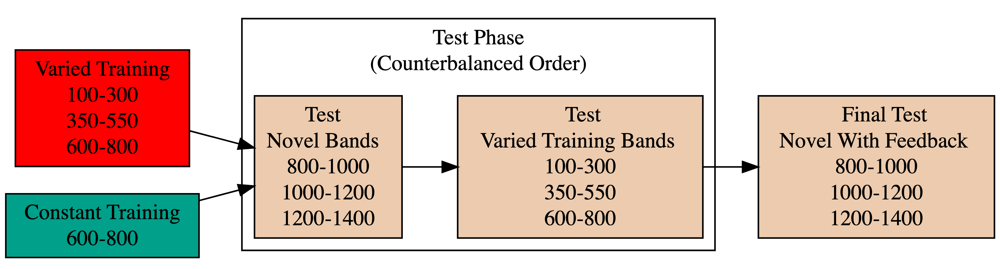

::: {.cell}

```{.r .cell-code}
pacman::p_load(dplyr,purrr,tidyr,tibble,ggplot2,
  brms,tidybayes, rstanarm,emmeans,broom,bayestestR,
  stringr, here,conflicted, patchwork, knitr,kableExtra)
#options(brms.backend="cmdstanr",mc.cores=4)
walk(c("brms","dplyr","bayestestR"), conflict_prefer_all, quiet = TRUE)
walk(c("Display_Functions","org_functions"), ~ source(here::here(paste0("Functions/", .x, ".R"))))
e2 <- readRDS(here("data/e2_08-04-23.rds")) 
e2Sbjs <- e2 |> group_by(id,condit) |> summarise(n=n())
testE2 <- e2 |> filter(expMode2 == "Test")
nbins=5
trainE2 <-  e2 |> filter(expMode2=="Train") |> group_by(id,condit, vb) |> 
    mutate(Trial_Bin = cut( gt.train, breaks = seq(1, max(gt.train),length.out=nbins+1),include.lowest = TRUE, labels=FALSE)) 
trainE2_max <- trainE2 |> filter(Trial_Bin == nbins, bandInt==600)
```
:::


@fig-design-e2 illustrates the design of Experiment 2. The stages of the experiment (i.e. training, testing no-feedback, test with feedback), are identical to that of Experiment 1. The only change is that Experiment 2 participants train, and then test, on bands in the reverse order of Experiment 1 (i.e. training on the softer bands; and testing on the harder bands). 


:::{.cell .column-screen-inset-right fig-width="8" fig-height="2.5" fig-responsive=false eval=false layout-align="default"}

:::{.cell-output-display}

:::{#fig-design-e2}

:::{}
:::


Experiment 2 Design. Constant and Varied participants complete different training conditions. The training and testing bands are the reverse of Experiment 1. 
:::
:::
:::


::: {#fig-design-e2}



Experiment 2 Design. Constant and Varied participants complete different training conditions. The training and testing bands are the reverse of Experiment 1.
:::


::: {.cell}

```{.r .cell-code}
p1 <- trainE2 |> ggplot(aes(x = Trial_Bin, y = dist, color = condit)) +
    stat_summary(geom = "line", fun = mean) +
    stat_summary(geom = "errorbar", fun.data = mean_se, width = .4, alpha = .7) +
    facet_wrap(~vb)+
    scale_x_continuous(breaks = seq(1, nbins + 1)) +
    theme(legend.title=element_blank()) + 
    labs(y = "Deviation", x="Training Block") 
#ggsave(here("Assets/figs/e2_train_deviation.png"), p1, width = 8, height = 4,bg="white")
```
:::


::: {#fig-e2-train-dev}


E2. Deviations from target band across training blocks. 
:::


::: {.cell}

```{.r .cell-code}
bmm_e2_train <- trainE2_max %>% 
  brm(dist ~ condit, 
      file=here("data/model_cache/e2_train_deviation"),
      data = .,
      iter = 2000,
      chains = 4,
      control = list(adapt_delta = .94, max_treedepth = 13))

mtr2 <- as.data.frame(describe_posterior(bmm_e2_train, centrality = "Mean"))[, c(1,2,4,5,6)]
colnames(mtr2) <- c("Term", "Estimate","95% CrI Lower", "95% CrI Upper", "pd")

cdtr2 <- get_coef_details(bmm_e2_train, "conditVaried")
# mtr2 |> mutate(across(where(is.numeric), \(x) round(x, 2))) |>
#   tibble::remove_rownames() |> 
#   mutate(Term = stringr::str_remove(Term, "b_")) |>
#   kable(escape=F,booktabs=T) 
```
:::


::: {#tbl-e2-train-dist}

| Term         | Estimate | 95% CrI Lower | 95% CrI Upper |  pd |
|:-------------|---------:|--------------:|--------------:|----:|
| Intercept    |    91.01 |         80.67 |        101.26 |   1 |
| conditVaried |    36.15 |         16.35 |         55.67 |   1 |

: **Experiment 2 - End of training performance**. The Intercept represents the average of the baseline (constant condition), and the conditVaried coefficient reflects the difference between the constant and varied groups. A larger positive coefficient indicates a greater deviation (lower accuracy) for the varied group.  {.sm}

:::

\

*Training*. @fig-e2-train-dev presents the deviations across training blocks for both constant and varied training groups. We again compared training performance on the band common to both groups (600-800). The full model results are shown in Table 1. The varied group had a significantly greater deviation than the constant group in the final training block, ( $\beta$ = 36.15, 95% CrI \[16.35, 55.67\]; pd = 99.95%).


::: {.cell}

```{.r .cell-code}
modelFile <- paste0(here::here("data/model_cache/"), "e2_dist_Cond_Type_RF_2")
bmtd2 <- brm(dist ~ condit * bandType + (1|bandInt) + (1|id), 
    data=testE2, file=modelFile,
    iter=5000,chains=4, control = list(adapt_delta = .94, max_treedepth = 13))
                        
# mted2 <- as.data.frame(describe_posterior(bmtd2, centrality = "Mean"))[, c(1,2,4,5,6)]
# colnames(mted2) <- c("Term", "Estimate","95% CrI Lower", "95% CrI Upper", "pd")
# mted2 |> mutate(across(where(is.numeric), \(x) round(x, 2))) |>
#   tibble::remove_rownames() |> 
#   mutate(Term = stringr::str_remove(Term, "b_")) |>
#   kable(booktabs=TRUE) 

cd2ted1 <- get_coef_details(bmtd2, "conditVaried")
cd2ted2 <-get_coef_details(bmtd2, "bandTypeExtrapolation")
cd2ted3 <-get_coef_details(bmtd2, "conditVaried:bandTypeExtrapolation")
```
:::


::: {#tbl-e2-bmm-dist}

| Term                               | Estimate | 95% CrI Lower | 95% CrI Upper |   pd |
|:-----------------------------------|---------:|--------------:|--------------:|-----:|
| Intercept                          |   190.91 |        125.03 |        259.31 | 1.00 |
| conditVaried                       |   -20.58 |        -72.94 |         33.08 | 0.78 |
| bandTypeExtrapolation              |    38.09 |         -6.94 |         83.63 | 0.95 |
| conditVaried:bandTypeExtrapolation |    82.00 |         41.89 |        121.31 | 1.00 |


: **Experiment 2 testing accuracy**. Main effects of condition and band type (training vs. extrapolation), and the interaction between the two factors. Larger coefficient estimates indicate larger deviations from the baselines (constant & trained bands) - and a positive interaction coefficient indicates disproporionate deviation for the varied condition on the extrapolation bands {.striped .hover .sm}
:::

*Testing.* The analysis of testing accuracy examined deviations from the target band as influenced by training condition (Varied vs. Constant) and band type (training vs. extrapolation bands). The results, summarized in @tbl-e2-bmm-dist, reveal no significant main effect of training condition ($\beta$ = -20.58, 95% CrI \[-72.94, 33.08\]; pd = 77.81%). However, the interaction between training condition and band type was significant ($\beta$ = 82, 95% CrI \[41.89, 121.31\]; pd = 100%), with the varied group showing disproportionately larger deviations compared to the constant group on the extrapolation bands (see @fig-e2-test-dev).


::: {.cell}

```{.r .cell-code}
pe2td <- testE2 |>  ggplot(aes(x = vb, y = dist,fill=condit)) +
    stat_summary(geom = "bar", position=position_dodge(), fun = mean) +
    stat_summary(geom = "errorbar", position=position_dodge(.9), fun.data = mean_se, width = .4, alpha = .7) + 
  theme(legend.title=element_blank(),axis.text.x = element_text(angle = 45, hjust = 0.5, vjust = 0.5)) +
  labs(x="Band", y="Deviation From Target")

condEffects <- function(m,xvar){
  m |> ggplot(aes(x = {{xvar}}, y = .value, color = condit, fill = condit)) + 
  stat_dist_pointinterval() + 
  stat_halfeye(alpha=.1, height=.5) +
  theme(legend.title=element_blank(),axis.text.x = element_text(angle = 45, hjust = 0.5, vjust = 0.5)) 
}

pe2ce <- bmtd2 |> emmeans( ~condit + bandType) |>
  gather_emmeans_draws() |>
 condEffects(bandType) + labs(y="Absolute Deviation From Band", x="Band Type")

p2 <- (pe2td + pe2ce) + plot_annotation(tag_levels= 'A')
#ggsave(here::here("Assets/figs", "e2_test-dev.png"), p2, width=8, height=4, bg="white")
```
:::


::: {#fig-e2-test-dev}


E2. A) Deviations from target band during testing without feedback stage. B) Estimated marginal means for the interaction between training condition and band type. Error bars represent 95% confidence intervals.
:::


### Discimination 


::: {.cell}

```{.r .cell-code}
##| label: tbl-e2-bmm-vx
##| tbl-cap: "Experiment 2. Bayesian Mixed Model Predicting Vx as a function of condition (Constant vs. Varied) and Velocity Band"

e2_vxBMM <- brm(vx ~ condit * bandInt + (1 + bandInt|id),
                        data=test,file=paste0(here::here("data/model_cache", "e2_testVxBand_RF_5k")),
                        iter=5000,chains=4,silent=0,
                        control=list(adapt_delta=0.94, max_treedepth=13))

#GetModelStats(e2_vxBMM ) |> kable(escape=F,booktabs=T, caption="Fit to all 6 bands")

cd2 <- get_coef_details(e2_vxBMM, "conditVaried")
sc2 <- get_coef_details(e2_vxBMM, "bandInt")
intCoef2 <- get_coef_details(e2_vxBMM, "conditVaried:bandInt")
```
:::


::: {#tbl-e2-bmm-vx}

| Term         | Estimate | 95% CrI Lower | 95% CrI Upper |   pd |
|:-------------|---------:|--------------:|--------------:|-----:|
| Intercept    |   362.64 |        274.85 |        450.02 | 1.00 |
| conditVaried |    -8.56 |       -133.97 |        113.98 | 0.55 |
| Band         |     0.71 |          0.58 |          0.84 | 1.00 |
| condit\*Band |    -0.06 |         -0.24 |          0.13 | 0.73 |

Experiment 2. Bayesian Mixed Model Predicting Vx as a function of condition (Constant vs. Varied) and Velocity Band {.striped .hover .sm}
:::

Finally, to assess the ability of both conditions to discriminate between velocity bands, we fit a model predicting velocity as a function of training condition and velocity band, with random intercepts and random slopes for each participant. The full model results are shown in @tbl-e2-bmm-vx. The overall slope on target velocity band predictor was significantly positive, ($\beta$ = 0.71, 95% CrI \[0.58, 0.84\]; pd= 100%), indicating that participants exhibited discrimination between bands. The interaction between slope and condition was not significant, ($\beta$ = -0.06, 95% CrI \[-0.24, 0.13\]; pd= `rintCoef2$pd`), suggesting that the two conditions did not differ in their ability to discriminate between bands (see @fig-e2-test-vx). 


::: {.cell}

```{.r .cell-code}
pe2tv <- testE2 %>% group_by(id,vb,condit) |> plot_distByCondit()

pe2vce <- e2_vxBMM |> emmeans( ~condit + bandInt,re_formula=NA, 
                       at = list(bandInt = c(100, 350, 600, 800, 1000, 1200))) |>
  gather_emmeans_draws() |> 
  condEffects(bandInt) +
  stat_lineribbon(alpha = .25, size = 1, .width = c(.95)) +
  scale_x_continuous(breaks = c(100, 350, 600, 800, 1000, 1200), 
                     labels = levels(testE2$vb), 
                     limits = c(0, 1400)) + 
scale_y_continuous(expand=expansion(add=100),breaks=round(seq(0,2000,by=200),2)) +
  theme(legend.title=element_blank()) + 
  labs(y="Velcoity", x="Band")

fe <- fixef(e2_vxBMM)[,1]
fixed_effect_bandInt <- fixef(e2_vxBMM)[,1]["bandInt"]
fixed_effect_interaction <- fixef(e2_vxBMM)[,1]["conditVaried:bandInt"]

re <- data.frame(ranef(e2_vxBMM, pars = "bandInt")$id[, ,'bandInt']) |> 
  rownames_to_column("id") |> 
  left_join(e2Sbjs,by="id") |>
  mutate(adjust= fixed_effect_bandInt + fixed_effect_interaction*(condit=="Varied"),slope = Estimate + adjust )

pid_den2 <- ggplot(re, aes(x = slope, fill = condit)) + 
  geom_density(alpha=.5) + 
  xlim(c(min(re$slope)-.3, max(re$slope)+.3))+
   theme(legend.title=element_blank()) + 
  labs(x="Slope Coefficient",y="Density")

pid_slopes2 <- re |>  mutate(id=reorder(id,slope)) |>
  ggplot(aes(y=id, x=slope,fill=condit,color=condit)) + 
    geom_pointrange(aes(xmin=Q2.5+adjust, xmax=Q97.5+adjust)) + 
      theme(legend.title=element_blank(), 
        axis.text.y = element_text(size=6) ) + 
    labs(x="Estimated Slope", y="Participant")  + 
    ggh4x::facet_wrap2(~condit,axes="all",scales="free_y")

p3 <- pe2tv / (pe2vce + pid_den2 + pid_slopes2) + plot_annotation(tag_levels= 'A')
#ggsave(here::here("Assets/figs", "e2_test-vx.png"), p3,width=9,height=11, bg="white",dpi=600)
#p3
```
:::





::: {#fig-e2-test-vx}


Experiment 2. Conditional effect of training condition and Band. Ribbons indicate 95% HDI. The steepness of the lines serves as an indicator of how well participants discriminated between velocity bands.

:::


## E2 Discussion  
