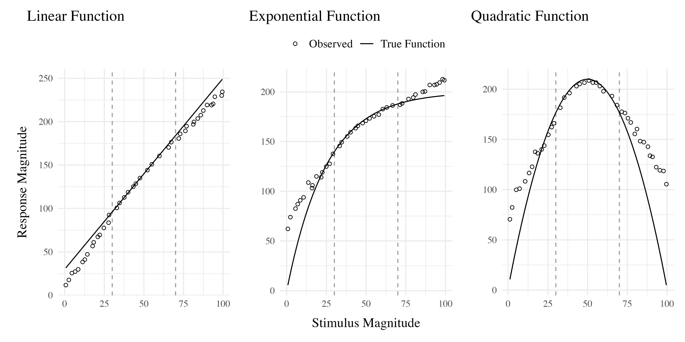

# Introduction


In project 1, I applied model-based techniques to quantify and control for the similarity between training and testing experience, which in turn enabled us to account for the difference between varied and constant training via an extended version of a similarity based generalization model. In project 2, we will go a step further, implementing a full process model capable of both 1) producing novel responses and 2) modeling behavior in both the learning and testing stages of the experiment. Project 2 also places a greater emphasis on extrapolation performance following training. Although varied training has often been purported to be particularly beneficial for generalization or transfer, few experiments have compared varied and constant training in contexts with unambiguous extrapolation testing. 

## Function Learning and Extrapolation

The study of human function learning investigates how people learn relationships between continuous input and output values.  Function learning is studied both in tasks where individuals are exposed to a sequence of input/output pairs [@deloshExtrapolationSineQua1997; @mcdanielEffectsSpacedMassed2013], or situations where observers are presented with a an incomplete scatterplot or line graph and make predictions about regions of the plot that don't contain data [@ciccioneCanHumansPerform2021a; @courrieuQuickApproximationBivariate2012; @saidExtrapolationAccuracyUnderestimates2021;@schulzCommunicatingCompositionalPatterns2020].

@carrollFunctionalLearningLearning1963 conducted the earliest work on function learning. Input stimuli and output responses were both lines of varying length. The correct output response was related to the length of the input line by a linear, quadratic, or random function.  Participants in the linear and quadratic performed above chance levels during extrapolation testing, with those in the linear condition performing the best overall. Carroll argued that these results were best explained by a ruled based model wherein learners form an abstract representation of the underlying function. Subsequent work by @brehmerHypothesesRelationsScaled1974,testing a wider array of functional forms, provided further evidence for superior extrapolation in tasks with linear functions. Brehmer argued that individuals start out with an assumption of a linear function, but  given sufficient error will progressively test alternative hypothesis with polynomials of greater degree. @kohFunctionLearningInduction1991 employed a visuomotor function learning task, wherein participants were trained on examples from an unknown function relating the length of an input line to the duration of a response (time between keystrokes). In this domain, participants performed best when the relation between line length and response duration was determined by a power, as opposed to linear function. Koh & Meyer developed the log-polynomial adaptive-regression model to account for their results. 

The first significant challenge to the rule-based accounts of function learning was put forth by @deloshExtrapolationSineQua1997 .  In their task, participants learned to associate stimulus magnitudes with response magnitudes that were related via either linear, exponential, or quadratic function. Participants approached ceiling performance by the end of training in each function condition, and were able to correctly respond in interpolation testing trials. All three conditions demonstrated some capacity for extrapolation, however participants in the linear condition tended to underestimate the true function, while exponential and quadratic participants reliably overestimated the true function on extrapolation trials. Extrapolation and interpolation performance are depicted in @fig-delosh-extrap.

The authors evaluated both of the rule-based models introduced in earlier research (with some modifications enabling trial-by-trial learning). The polynomial hypothesis testing model [@carrollFunctionalLearningLearning1963; @brehmerHypothesesRelationsScaled1974] tended to mimic the true function closely in extrapolation, and thus offered a poor account of the human data.  The log-polynomial adaptive regression model [@kohFunctionLearningInduction1991] was able to mimic some of the  systematic deviations produced by human subjects, but also predicted overestimation in cases where underestimation occurred. 

The authors also introduced two new function-learning models. The Associative Learning Model (ALM) and the extrapolation-association model (EXAM). ALM is a two layer connectionist model adapted from the ALCOVE model in the category learning literature [@kruschkeALCOVEExemplarbasedConnectionist1992]. ALM belongs to the general class of radial-basis function neural networks, and can be considered a similarity-based model in the sense that the nodes in the input layer of the network are activated as a function of distance. The EXAM model retains the same similarity based activation and associative learning mechanisms as ALM, while being augmented with a linear rule response mechanism. When presented with novel  stimuli, EXAM will retrieve the most similar input-output examples encountered during training, and from those examples compute a local slope. ALM was able to provide a good account of participant training and interpolation data in all three function conditions, however it was unable to extrapolate. EXAM, on the other hand, was able to reproduce both the extrapolation underestimation, as well as the quadratic and exponential overestimation patterns exhibited by the human participants. Subsequent research identified some limitations in EXAM's ability to account for cases where human participants learn and extrapolate sinusoidal function @bottNonmonotonicExtrapolationFunction2004 or to scenarios where different functions apply to different regions of the input space @kalishPopulationLinearExperts2004, though EXAM has been shown to provide a good account of human learning and extrapolation in tasks with bi-linear, V shaped input spaces @mcdanielPredictingTransferPerformance2009.


::: {.cell}
::: {.cell-output-display}
{#fig-delosh-extrap width=3000}
:::
:::


# Methods

## Participants

Data was collected from 647 participants (after exclusions). The results shown below consider data from subjects in our initial experiment, which consisted of 196 participants (106 constant, 90 varied). The follow-up experiments entailed minor manipulations: 1) reversing the velocity bands that were trained on vs. novel during testing; 2) providing ordinal rather than numerical feedback during training (e.g. correct, too low, too high). The data from these subsequent experiments are largely consistently with our initial results shown below.

## Task

We developed a novel visuomotor extrapolation task, termed the Hit The Wall task, wherein participants learned to launch a projectile such that it hit a rectangle at the far end of the screen with an appropriate amount of force. Although the projectile had both x and y velocity components, only the x-dimension was relevant for the task.  [Link to task demo](https://pcl.sitehost.iu.edu/tg/HTW/HTW_Index.html?sonaid=){target="_blank"}

## Procedure

The HTW task involved launching projectiles to hit a target displayed on the computer screen. Participants completed a total of 90 trials during the training stage. In the varied training condition, participants encountered three velocity bands (800-1000, 1000-1200, and 1200-1400). In contrast, participants in the constant training condition encountered only one velocity band (800-1000).

During the training stage, participants in both conditions also completed "no feedback" trials, where they received no information about their performance. These trials were randomly interleaved with the regular training trials.

Following the training stage, participants proceeded to the testing stage, which consisted of three phases. In the first phase, participants completed "no-feedback" testing from three novel extrapolation bands (100-300, 350-550, and 600-800), with each band consisting of 15 trials.

In the second phase of testing, participants completed "no-feedback" testing from the three velocity bands used during the training stage (800-1000, 1000-1200, and 1200-1400). In the constant training condition, two of these bands were novel, while in the varied training condition, all three bands were encountered during training.

The third and final phase of testing involved "feedback" testing for each of the three extrapolation bands (100-300, 350-550, and 600-800), with each band consisting of 10 trials. Participants received feedback on their performance during this phase.

Throughout the experiment, participants' performance was measured by calculating the distance between the produced x-velocity of the projectiles and the closest edge of the current velocity band. Lower distances indicated better performance.

After completing the experiment, participants were debriefed and provided with an opportunity to ask questions about the study.


:::{.cell .column-screen-inset-right fig-width="6" fig-height="2.5" fig-responsive=false}

:::{.cell-output-display}

:::{#fig-design-e1}

:::{}
```{=html}
<svg width="576" height="240" viewbox="0.00 0.00 643.85 174.00" xmlns="http://www.w3.org/2000/svg" xlink="http://www.w3.org/1999/xlink" style="; max-width: none; max-height: none">
<g id="graph0" class="graph" transform="scale(1 1) rotate(0) translate(4 170)">
<polygon fill="white" stroke="transparent" points="-4,4 -4,-170 639.85,-170 639.85,4 -4,4"></polygon>
<g id="clust1" class="cluster">
<title>cluster</title>
<polygon fill="none" stroke="black" points="152.49,-8 152.49,-158 455,-158 455,-8 152.49,-8"></polygon>
<text text-anchor="middle" x="303.74" y="-141.4" font-family="Times,serif" font-size="14.00">Test Phase </text>
<text text-anchor="middle" x="303.74" y="-124.6" font-family="Times,serif" font-size="14.00">(Counterbalanced Order)</text>
</g>
<!-- data1 -->
<g id="node1" class="node">
<title>data1</title>
<polygon fill="#ff0000" stroke="black" points="118.54,-137.7 5.95,-137.7 5.95,-62.3 118.54,-62.3 118.54,-137.7"></polygon>
<text text-anchor="middle" x="62.24" y="-121" font-family="Times,serif" font-size="14.00"> Varied Training </text>
<text text-anchor="middle" x="62.24" y="-104.2" font-family="Times,serif" font-size="14.00">800-1000</text>
<text text-anchor="middle" x="62.24" y="-87.4" font-family="Times,serif" font-size="14.00">1000-1200</text>
<text text-anchor="middle" x="62.24" y="-70.6" font-family="Times,serif" font-size="14.00">1200-1400</text>
</g>
<!-- Test1 -->
<g id="node4" class="node">
<title>Test1</title>
<polygon fill="#eccbae" stroke="black" points="252.81,-108 160.38,-108 160.38,-16 252.81,-16 252.81,-108"></polygon>
<text text-anchor="middle" x="206.59" y="-91.4" font-family="Times,serif" font-size="14.00">Test &nbsp;</text>
<text text-anchor="middle" x="206.59" y="-74.6" font-family="Times,serif" font-size="14.00">Novel Bands </text>
<text text-anchor="middle" x="206.59" y="-57.8" font-family="Times,serif" font-size="14.00">100-300</text>
<text text-anchor="middle" x="206.59" y="-41" font-family="Times,serif" font-size="14.00">350-550</text>
<text text-anchor="middle" x="206.59" y="-24.2" font-family="Times,serif" font-size="14.00">600-800</text>
</g>
<!-- data1&#45;&gt;Test1 -->
<g id="edge1" class="edge">
<title>data1-&gt;Test1</title>
<path fill="none" stroke="black" d="M118.69,-85.2C129.1,-82.42 139.98,-79.51 150.39,-76.74"></path>
<polygon fill="black" stroke="black" points="151.43,-80.08 160.19,-74.12 149.62,-73.32 151.43,-80.08"></polygon>
</g>
<!-- data2 -->
<g id="node2" class="node">
<title>data2</title>
<polygon fill="#00a08a" stroke="black" points="124.73,-44.6 -0.24,-44.6 -0.24,-3.4 124.73,-3.4 124.73,-44.6"></polygon>
<text text-anchor="middle" x="62.24" y="-28.2" font-family="Times,serif" font-size="14.00"> Constant Training </text>
<text text-anchor="middle" x="62.24" y="-11.4" font-family="Times,serif" font-size="14.00">800-1000</text>
</g>
<!-- data2&#45;&gt;Test1 -->
<g id="edge2" class="edge">
<title>data2-&gt;Test1</title>
<path fill="none" stroke="black" d="M124.85,-40.45C133.39,-42.72 142.11,-45.05 150.51,-47.3"></path>
<polygon fill="black" stroke="black" points="149.64,-50.68 160.2,-49.88 151.44,-43.92 149.64,-50.68"></polygon>
</g>
<!-- Test3 -->
<g id="node3" class="node">
<title>Test3</title>
<polygon fill="#eccbae" stroke="black" points="635.77,-108 483.07,-108 483.07,-16 635.77,-16 635.77,-108"></polygon>
<text text-anchor="middle" x="559.42" y="-91.4" font-family="Times,serif" font-size="14.00"> &nbsp;&nbsp;&nbsp;Final Test </text>
<text text-anchor="middle" x="559.42" y="-74.6" font-family="Times,serif" font-size="14.00"> &nbsp;Novel With Feedback &nbsp;</text>
<text text-anchor="middle" x="559.42" y="-57.8" font-family="Times,serif" font-size="14.00">100-300</text>
<text text-anchor="middle" x="559.42" y="-41" font-family="Times,serif" font-size="14.00">350-550</text>
<text text-anchor="middle" x="559.42" y="-24.2" font-family="Times,serif" font-size="14.00">600-800</text>
</g>
<!-- Test2 -->
<g id="node5" class="node">
<title>Test2</title>
<polygon fill="#eccbae" stroke="black" points="447.15,-108 288.55,-108 288.55,-16 447.15,-16 447.15,-108"></polygon>
<text text-anchor="middle" x="367.85" y="-91.4" font-family="Times,serif" font-size="14.00"> &nbsp;Test </text>
<text text-anchor="middle" x="367.85" y="-74.6" font-family="Times,serif" font-size="14.00"> &nbsp;Varied Training Bands &nbsp;</text>
<text text-anchor="middle" x="367.85" y="-57.8" font-family="Times,serif" font-size="14.00">800-1000</text>
<text text-anchor="middle" x="367.85" y="-41" font-family="Times,serif" font-size="14.00">1000-1200</text>
<text text-anchor="middle" x="367.85" y="-24.2" font-family="Times,serif" font-size="14.00">1200-1400</text>
</g>
<!-- Test1&#45;&gt;Test2 -->
<g id="edge3" class="edge">
<title>Test1-&gt;Test2</title>
<path fill="none" stroke="black" d="M252.8,-62C260.95,-62 269.7,-62 278.59,-62"></path>
<polygon fill="black" stroke="black" points="278.67,-65.5 288.67,-62 278.67,-58.5 278.67,-65.5"></polygon>
</g>
<!-- Test2&#45;&gt;Test3 -->
<g id="edge4" class="edge">
<title>Test2-&gt;Test3</title>
<path fill="none" stroke="black" d="M447.05,-62C455.55,-62 464.24,-62 472.83,-62"></path>
<polygon fill="black" stroke="black" points="472.84,-65.5 482.84,-62 472.84,-58.5 472.84,-65.5"></polygon>
</g>
</g>
</svg>
```
:::


Experiment 1 Design. Constant and Varied participants complete different training conditions.
:::
:::
:::


## Analyses Strategy

All data processing and statistical analyses were performed in R version 4.31 @rcoreteamLanguageEnvironmentStatistical2020. To assess differences between groups, we used Bayesian Mixed Effects Regression. Model fitting was performed with the brms package in R @burknerBrmsPackageBayesian2017, and descriptive stats and tables were extracted with the BayestestR package @makowskiBayestestRDescribingEffects2019a. Mixed effects regression enables us to take advantage of partial pooling, simultaneously estimating parameters at the individual and group level. Our use of Bayesian, rather than frequentist methods allows us to directly quantify the uncertainty in our parameter estimates, as well as circumventing convergence issues common to the frequentist analogues of our mixed models. For each model, we report the median values of the posterior distribution, and 95% credible intervals.

Each model was set to run with 4 chains, 5000 iterations per chain, with the first 2500 of which were discarded as warmup chains. Rhat values were generally within an acceptable range, with values \<=1.02 (see appendix for diagnostic plots). We used uninformative priors for the fixed effects of the model (condition and velocity band), and weakly informative Student T distributions for for the random effects.

We compared varied and constant performance across two measures, deviation and discrimination. Deviation was quantified as the absolute deviation from the nearest boundary of the velocity band, or set to 0 if the throw velocity fell anywhere inside the target band. Thus, when the target band was 600-800, throws of 400, 650, and 1100 would result in deviation values of 200, 0, and 300, respectively. Discrimination was measured by fitting a linear model to the testing throws of each subjects, with the lower end of the target velocity band as the predicted variable, and the x velocity produced by the participants as the predictor variable. Participants who reliably discriminated between velocity bands tended to have positive slopes with values \~1, while participants who made throws irrespective of the current target band would have slopes \~0.


::: {#tbl-e1-test-nf-deviation .cell layout-align="center" tbl-cap='Testing Deviation - Empirical Summary' tbl-subcap='["Full datasets","Intersection of samples with all labels available"]'}
::: {.cell-output-display}


|Band      |Band Type     | Mean| Median|  Sd|
|:---------|:-------------|----:|------:|---:|
|100-300   |Extrapolation |  254|    148| 298|
|350-550   |Extrapolation |  191|    110| 229|
|600-800   |Extrapolation |  150|     84| 184|
|800-1000  |Trained       |  184|    106| 242|
|1000-1200 |Extrapolation |  233|    157| 282|
|1200-1400 |Extrapolation |  287|    214| 290|


:::

::: {.cell-output-display}


|Band      |Band Type     | Mean| Median|  Sd|
|:---------|:-------------|----:|------:|---:|
|100-300   |Extrapolation |  386|    233| 426|
|350-550   |Extrapolation |  285|    149| 340|
|600-800   |Extrapolation |  234|    144| 270|
|800-1000  |Trained       |  221|    149| 248|
|1000-1200 |Trained       |  208|    142| 226|
|1200-1400 |Trained       |  242|    182| 235|


:::
:::


## Results

### Testing Phase - No feedback.

In the first part of the testing phase, participants are tested from each of the velocity bands, and receive no feedback after each throw.

#### Deviation From Target Band

Descriptive summaries testing deviation data are provided in @tbl-e1-test-nf-deviation and @fig-e1-test-dev. To model differences in accuracy between groups, we used Bayesian mixed effects regression models to the trial level data from the testing phase. The primary model predicted the absolute deviation from the target velocity band (dist) as a function of training condition (condit), target velocity band (band), and their interaction, with random intercepts and slopes for each participant (id).


```{=tex}
\begin{equation}
dist_{ij} = \beta_0 + \beta_1 \cdot condit_{ij} + \beta_2 \cdot band_{ij} + \beta_3 \cdot condit_{ij} \cdot band_{ij} + b_{0i} + b_{1i} \cdot band_{ij} + \epsilon_{ij}
\end{equation}
```


::: {.cell layout-align="center"}
::: {.cell-output-display}
{#fig-e1-test-dev fig-align='center' width=100%}
:::
:::

::: {#tbl-e1-bmm-dist .cell layout-align="center" tbl-cap='Experiment 1. Bayesian Mixed Model predicting absolute deviation as a function of condition (Constant vs. Varied) and Velocity Band' tbl-subcap='["Constant Testing1 - Deviation","Varied Testing - Deviation"]'}
::: {.cell-output-display}


Table: Coefficients

|Term         | Estimate| 95% CrI Lower| 95% CrI Upper|   pd|
|:------------|--------:|-------------:|-------------:|----:|
|Intercept    |   205.09|        136.86|        274.06| 1.00|
|conditVaried |   157.44|         60.53|        254.90| 1.00|
|Band         |     0.01|         -0.07|          0.08| 0.57|
|condit*Band  |    -0.16|         -0.26|         -0.06| 1.00|


:::

::: {.cell-output-display}


|contrast          | Band|   value|  lower|  upper|   pd|
|:-----------------|----:|-------:|------:|------:|----:|
|Constant - Varied |  100| -141.49| -229.2| -53.83| 1.00|
|Constant - Varied |  350| -101.79| -165.6| -36.32| 1.00|
|Constant - Varied |  600|  -62.02| -106.2| -14.77| 1.00|
|Constant - Varied |  800|  -30.11|  -65.1|   6.98| 0.94|
|Constant - Varied | 1000|    2.05|  -33.5|  38.41| 0.54|
|Constant - Varied | 1200|   33.96|  -11.9|  81.01| 0.92|


:::
:::


The model predicting absolute deviation (dist) showed clear effects of both training condition and target velocity band (Table X). Overall, the varied training group showed a larger deviation relative to the constant training group (β = 157.44, 95% CI \[60.53, 254.9\]). Deviation also depended on target velocity band, with lower bands showing less deviation. See @tbl-e1-bmm-dist for full model output.


#### Discrimination between bands

In addition to accuracy/deviation, we also assessed the ability of participants to reliably discriminate between the velocity bands (i.e. responding differently when prompted for band 600-800 than when prompted for band 150-350). @tbl-e1-test-nf-vx shows descriptive statistics of this measure, and Figure 1 visualizes the full distributions of throws for each combination of condition and velocity band. To quantify discrimination, we again fit Bayesian Mixed Models as above, but this time the dependent variable was the raw x velocity generated by participants on each testing trial.


```{=tex}
\begin{equation}
vx_{ij} = \beta_0 + \beta_1 \cdot condit_{ij} + \beta_2 \cdot bandInt_{ij} + \beta_3 \cdot condit_{ij} \cdot bandInt_{ij} + b_{0i} + b_{1i} \cdot bandInt_{ij} + \epsilon_{ij}
\end{equation}
```


::: {.cell layout-align="center"}
::: {.cell-output-display}
{#fig-e1-test-vx fig-align='center' width=100%}
:::
:::

::: {#tbl-e1-test-nf-vx .cell layout-align="center" tbl-cap='Testing vx - Empirical Summary' tbl-subcap='["Constant","Varied"]'}
::: {.cell-output-display}


|Band      |Band Type     | Mean| Median|  Sd|
|:---------|:-------------|----:|------:|---:|
|100-300   |Extrapolation |  524|    448| 327|
|350-550   |Extrapolation |  659|    624| 303|
|600-800   |Extrapolation |  770|    724| 300|
|800-1000  |Trained       | 1001|    940| 357|
|1000-1200 |Extrapolation | 1167|   1104| 430|
|1200-1400 |Extrapolation | 1283|   1225| 483|


:::

::: {.cell-output-display}


|Band      |Band Type     | Mean| Median|  Sd|
|:---------|:-------------|----:|------:|---:|
|100-300   |Extrapolation |  664|    533| 448|
|350-550   |Extrapolation |  768|    677| 402|
|600-800   |Extrapolation |  876|    813| 390|
|800-1000  |Trained       | 1064|   1029| 370|
|1000-1200 |Trained       | 1180|   1179| 372|
|1200-1400 |Trained       | 1265|   1249| 412|


:::
:::

::: {#tbl-e1-bmm-vx .cell layout-align="center" tbl-cap='Experiment 1. Bayesian Mixed Model Predicting Vx as a function of condition (Constant vs. Varied) and Velocity Band' tbl-subcap='["Model fit to all 6 bands","Model fit to 3 extrapolation bands"]'}
::: {.cell-output-display}


Table: Fit to all 6 bands

|Term         | Estimate| 95% CrI Lower| 95% CrI Upper|   pd|
|:------------|--------:|-------------:|-------------:|----:|
|Intercept    |   408.55|        327.00|        490.61| 1.00|
|conditVaried |   164.05|         45.50|        278.85| 1.00|
|Band         |     0.71|          0.62|          0.80| 1.00|
|condit*Band  |    -0.14|         -0.26|         -0.01| 0.98|


:::

::: {.cell-output-display}


Table: Fit to 3 extrapolation bands

|Term         | Estimate| 95% CrI Lower| 95% CrI Upper|   pd|
|:------------|--------:|-------------:|-------------:|----:|
|Intercept    |   478.47|        404.00|        551.45| 1.00|
|conditVaried |   142.04|         37.17|        247.59| 1.00|
|Band         |     0.50|          0.42|          0.57| 1.00|
|condit*Band  |    -0.07|         -0.17|          0.04| 0.89|


:::
:::


See @tbl-e1-bmm-vx for the full model results. The estimated coefficient for training condition ($B$ = 164.05, 95% CrI \[45.5, 278.85\]) suggests that the varied group tends to produce harder throws than the constant group, but is not in and of itself useful for assessing discrimination. Most relevant to the issue of discrimination is the slope on Velocity Band ($B$ = 0.71, 95% CrI \[0.62, 0.8\]). Although the median slope does fall underneath the ideal of value of 1, the fact that the 95% credible interval does not contain 0 provides strong evidence that participants exhibited some discrimination between bands. The estimate for the interaction between slope and condition ($B$ = -0.14, 95% CrI \[-0.26, -0.01\]), suggests that the discrimination was somewhat modulated by training condition, with the varied participants showing less senitivity between vands than the constant condition. This difference is depicted visually in @fig-e1-bmm-vx.@tbl-e1-slope-quartile shows the average slope coefficients for varied and constant participants separately for each quartile. The constant participant participants appear to have larger slopes across quartiles, but the difference between conditions may be less pronounced for the top quartiles of subjects who show the strongest discrimination. Figure @fig-e1-bmm-bx2 shows the distributions of slope values for each participant, and the compares the probability density of slope coefficients between training conditions. @fig-e1-indv-slopes 

The second model, which focused solely on extrapolation bands, revealed similar patterns. The Velocity Band term ($B$ = 0.5, 95% CrI \[0.42, 0.57\]) still demonstrates a high degree of discrimination ability. However, the posterior distribution for interaction term ($B$ = -0.07, 95% CrI \[-0.17, 0.04\] ) does across over 0, suggesting that the evidence for decreased discrimination ability for the varied participants is not as strong when considering only the three extrapolation bands.


::: {#fig-e1-bmm-vx .cell layout-ncol="2" layout-align="center"}
::: {.cell-output-display}
{#fig-e1-bmm-vx-1 fig-align='center' width=100%}
:::

::: {.cell-output-display}
{#fig-e1-bmm-vx-2 fig-align='center' width=100%}
:::

Conditional effect of training condition and Band. Ribbons indicate 95% HDI. The steepness of the lines serves as an indicator of how well participants discriminated between velocity bands.
:::

::: {#tbl-e1-slope-quartile .cell layout-align="center" tbl-cap='Slope coefficients by quartile, per condition'}
::: {.cell-output-display}


|Condition | Q_0%_mean| Q_25%_mean| Q_50%_mean| Q_75%_mean| Q_100%_mean|
|:---------|---------:|----------:|----------:|----------:|-----------:|
|Constant  |    -0.109|      0.482|      0.695|      0.931|         1.4|
|Varied    |    -0.205|      0.270|      0.586|      0.900|         1.3|


:::
:::

::: {#fig-e1-bmm-bx2 .cell layout-ncol="2" layout-align="center"}
::: {.cell-output-display}
{#fig-e1-bmm-bx2-1 fig-align='center' width=100%}
:::

::: {.cell-output-display}
{#fig-e1-bmm-bx2-2 fig-align='center' width=100%}
:::

Slope distributions between condition
:::


test


::: {#fig-e1-indv-slopes .cell layout-align="center"}
::: {.cell-output-display}
{#fig-e1-indv-slopes-1 fig-align='center' width=100%}
:::

::: {.cell-output-display}
{#fig-e1-indv-slopes-2 fig-align='center' width=100%}
:::

Subset of Varied and Constant Participants with the smallest and largest estimated slope values. Red lines represent the best fitting line for each participant, gray lines are 200 random samples from the posterior distribution. Colored points and intervals at each band represent the empirical median and 95% HDI.
:::


# Experiment 2


@fig-design-e2 illustrates the design of Experiment 2. The stages of the experiment (i.e. training, testing no-feedback, test with feedback), are identical to that of Experiment 1. The only change is that Experiment 2 participants train, and then test, on bands in the reverse order of Experiment 1 (i.e. training on the softer bands; and testing on the harder bands). 


:::{.cell .column-screen-inset-right fig-width="6" fig-height="2.5" fig-responsive=false}

:::{.cell-output-display}

:::{#fig-design-e2}

:::{}
```{=html}
<svg width="576" height="240" viewbox="0.00 0.00 647.35 174.00" xmlns="http://www.w3.org/2000/svg" xlink="http://www.w3.org/1999/xlink" style="; max-width: none; max-height: none">
<g id="graph0" class="graph" transform="scale(1 1) rotate(0) translate(4 170)">
<polygon fill="white" stroke="transparent" points="-4,4 -4,-170 643.35,-170 643.35,4 -4,4"></polygon>
<g id="clust1" class="cluster">
<title>cluster</title>
<polygon fill="none" stroke="black" points="152.49,-8 152.49,-158 458.5,-158 458.5,-8 152.49,-8"></polygon>
<text text-anchor="middle" x="305.49" y="-141.4" font-family="Times,serif" font-size="14.00">Test Phase </text>
<text text-anchor="middle" x="305.49" y="-124.6" font-family="Times,serif" font-size="14.00">(Counterbalanced Order)</text>
</g>
<!-- data1 -->
<g id="node1" class="node">
<title>data1</title>
<polygon fill="#ff0000" stroke="black" points="118.54,-137.7 5.95,-137.7 5.95,-62.3 118.54,-62.3 118.54,-137.7"></polygon>
<text text-anchor="middle" x="62.24" y="-121" font-family="Times,serif" font-size="14.00"> Varied Training </text>
<text text-anchor="middle" x="62.24" y="-104.2" font-family="Times,serif" font-size="14.00">100-300</text>
<text text-anchor="middle" x="62.24" y="-87.4" font-family="Times,serif" font-size="14.00">350-550</text>
<text text-anchor="middle" x="62.24" y="-70.6" font-family="Times,serif" font-size="14.00">600-800</text>
</g>
<!-- Test1 -->
<g id="node4" class="node">
<title>Test1</title>
<polygon fill="#eccbae" stroke="black" points="256.06,-108 160.63,-108 160.63,-16 256.06,-16 256.06,-108"></polygon>
<text text-anchor="middle" x="208.34" y="-91.4" font-family="Times,serif" font-size="14.00">Test &nbsp;</text>
<text text-anchor="middle" x="208.34" y="-74.6" font-family="Times,serif" font-size="14.00">Novel Bands &nbsp;</text>
<text text-anchor="middle" x="208.34" y="-57.8" font-family="Times,serif" font-size="14.00">800-1000</text>
<text text-anchor="middle" x="208.34" y="-41" font-family="Times,serif" font-size="14.00">1000-1200</text>
<text text-anchor="middle" x="208.34" y="-24.2" font-family="Times,serif" font-size="14.00">1200-1400</text>
</g>
<!-- data1&#45;&gt;Test1 -->
<g id="edge1" class="edge">
<title>data1-&gt;Test1</title>
<path fill="none" stroke="black" d="M118.54,-85.42C129.01,-82.66 139.97,-79.77 150.49,-76.99"></path>
<polygon fill="black" stroke="black" points="151.62,-80.31 160.4,-74.38 149.83,-73.55 151.62,-80.31"></polygon>
</g>
<!-- data2 -->
<g id="node2" class="node">
<title>data2</title>
<polygon fill="#00a08a" stroke="black" points="124.73,-44.6 -0.24,-44.6 -0.24,-3.4 124.73,-3.4 124.73,-44.6"></polygon>
<text text-anchor="middle" x="62.24" y="-28.2" font-family="Times,serif" font-size="14.00"> Constant Training </text>
<text text-anchor="middle" x="62.24" y="-11.4" font-family="Times,serif" font-size="14.00">600-800</text>
</g>
<!-- data2&#45;&gt;Test1 -->
<g id="edge2" class="edge">
<title>data2-&gt;Test1</title>
<path fill="none" stroke="black" d="M124.77,-40.23C133.35,-42.49 142.13,-44.8 150.61,-47.04"></path>
<polygon fill="black" stroke="black" points="149.84,-50.46 160.41,-49.62 151.63,-43.69 149.84,-50.46"></polygon>
</g>
<!-- Test3 -->
<g id="node3" class="node">
<title>Test3</title>
<polygon fill="#eccbae" stroke="black" points="639.27,-108 486.57,-108 486.57,-16 639.27,-16 639.27,-108"></polygon>
<text text-anchor="middle" x="562.92" y="-91.4" font-family="Times,serif" font-size="14.00"> &nbsp;&nbsp;&nbsp;Final Test </text>
<text text-anchor="middle" x="562.92" y="-74.6" font-family="Times,serif" font-size="14.00"> &nbsp;Novel With Feedback &nbsp;</text>
<text text-anchor="middle" x="562.92" y="-57.8" font-family="Times,serif" font-size="14.00">800-1000</text>
<text text-anchor="middle" x="562.92" y="-41" font-family="Times,serif" font-size="14.00">1000-1200</text>
<text text-anchor="middle" x="562.92" y="-24.2" font-family="Times,serif" font-size="14.00">1200-1400</text>
</g>
<!-- Test2 -->
<g id="node5" class="node">
<title>Test2</title>
<polygon fill="#eccbae" stroke="black" points="450.65,-108 292.05,-108 292.05,-16 450.65,-16 450.65,-108"></polygon>
<text text-anchor="middle" x="371.35" y="-91.4" font-family="Times,serif" font-size="14.00"> &nbsp;Test </text>
<text text-anchor="middle" x="371.35" y="-74.6" font-family="Times,serif" font-size="14.00"> &nbsp;Varied Training Bands &nbsp;</text>
<text text-anchor="middle" x="371.35" y="-57.8" font-family="Times,serif" font-size="14.00">100-300</text>
<text text-anchor="middle" x="371.35" y="-41" font-family="Times,serif" font-size="14.00">350-550</text>
<text text-anchor="middle" x="371.35" y="-24.2" font-family="Times,serif" font-size="14.00">600-800</text>
</g>
<!-- Test1&#45;&gt;Test2 -->
<g id="edge3" class="edge">
<title>Test1-&gt;Test2</title>
<path fill="none" stroke="black" d="M256.35,-62C264.51,-62 273.22,-62 282.07,-62"></path>
<polygon fill="black" stroke="black" points="282.09,-65.5 292.09,-62 282.09,-58.5 282.09,-65.5"></polygon>
</g>
<!-- Test2&#45;&gt;Test3 -->
<g id="edge4" class="edge">
<title>Test2-&gt;Test3</title>
<path fill="none" stroke="black" d="M450.55,-62C459.05,-62 467.74,-62 476.33,-62"></path>
<polygon fill="black" stroke="black" points="476.34,-65.5 486.34,-62 476.34,-58.5 476.34,-65.5"></polygon>
</g>
</g>
</svg>
```
:::


Experiment 2 Design. Constant and Varied participants complete different training conditions. The training and testing bands are the reverse of Experiment 1. 
:::
:::
:::


## E2 Results

### Testing Phase - No feedback. 

In the first part of the testing phase, participants are tested from each of the velocity bands, and receive no feedback after each throw. 


#### Deviation From Target Band

Descriptive summaries testing deviation data are provided in @tbl-e2-test-nf-deviation and @fig-e2-test-dev. 
To model differences in accuracy between groups, we used Bayesian mixed effects regression models to the trial level data from the testing phase. The primary model predicted the absolute deviation from the target velocity band (dist) as a function of training condition (condit), target velocity band (band), and their interaction, with random intercepts and slopes for each participant (id). 

\begin{equation}
dist_{ij} = \beta_0 + \beta_1 \cdot condit_{ij} + \beta_2 \cdot band_{ij} + \beta_3 \cdot condit_{ij} \cdot band_{ij} + b_{0i} + b_{1i} \cdot band_{ij} + \epsilon_{ij}
\end{equation}


::: {#tbl-e2-test-nf-deviation .cell layout-align="center" tbl-cap='Testing Deviation - Empirical Summary' tbl-subcap='["Constant Testing - Deviation","Varied Testing - Deviation"]'}
::: {.cell-output-display}


|Band      |Band Type     | Mean| Median|  Sd|
|:---------|:-------------|----:|------:|---:|
|100-300   |Extrapolation |  206|     48| 317|
|350-550   |Extrapolation |  194|     86| 268|
|600-800   |Trained       |  182|    112| 240|
|800-1000  |Extrapolation |  200|    129| 233|
|1000-1200 |Extrapolation |  238|    190| 234|
|1200-1400 |Extrapolation |  311|    254| 288|


:::

::: {.cell-output-display}


|Band      |Band Type     | Mean| Median|  Sd|
|:---------|:-------------|----:|------:|---:|
|100-300   |Trained       |  153|     25| 266|
|350-550   |Trained       |  138|     53| 233|
|600-800   |Trained       |  160|    120| 183|
|800-1000  |Extrapolation |  261|    207| 257|
|1000-1200 |Extrapolation |  305|    258| 273|
|1200-1400 |Extrapolation |  363|    314| 297|


:::
:::

::: {.cell layout-align="center"}
::: {.cell-output-display}
{#fig-e2-test-dev fig-align='center' width=100%}
:::
:::

::: {#tbl-e2-bmm-dist .cell layout-align="center" tbl-cap='Experiment 2. Bayesian Mixed Model predicting absolute deviation as a function of condition (Constant vs. Varied) and Velocity Band' tbl-subcap='["Model fits","Contrasts"]'}
::: {.cell-output-display}


|Term         | Estimate| 95% CrI Lower| 95% CrI Upper|   pd|
|:------------|--------:|-------------:|-------------:|----:|
|Intercept    |   151.71|         90.51|        215.86| 1.00|
|conditVaried |   -70.33|       -156.87|         16.66| 0.94|
|Band         |     0.10|          0.02|          0.18| 1.00|
|condit*Band  |     0.12|          0.02|          0.23| 0.99|


:::

::: {.cell-output-display}


|contrast          | Band| value|  lower|  upper|   pd|
|:-----------------|----:|-----:|------:|------:|----:|
|Constant - Varied |  100|  57.6|  -20.5| 135.32| 0.93|
|Constant - Varied |  350|  26.6|  -30.9|  83.84| 0.83|
|Constant - Varied |  600|  -4.3|  -46.7|  38.52| 0.58|
|Constant - Varied |  800| -29.3|  -69.4|  11.29| 0.92|
|Constant - Varied | 1000| -54.6| -101.1|  -5.32| 0.98|
|Constant - Varied | 1200| -79.6| -139.5| -15.45| 0.99|


:::
:::


The model predicting absolute deviation showed a modest tendency for the varied training group to have lower deviation compared to the constant training group (β = -70.33, 95% CI \[-156.87, 16.66\]),with 94% of the posterior distribution being less than 0. This suggests a potential benefit of training with variation, though the evidence is not definitive.


#### Discrimination between Velocity Bands

In addition to accuracy/deviation. We also assessed the ability of participants to reliably discriminate between the velocity bands (i.e. responding differently when prompted for band 600-800 than when prompted for band 150-350). @tbl-e2-test-nf-vx shows descriptive statistics of this measure, and Figure 1 visualizes the full distributions of throws for each combination of condition and velocity band. To quantify discrimination, we again fit Bayesian Mixed Models as above, but this time the dependent variable was the raw x velocity generated by participants. 

\begin{equation}
vx_{ij} = \beta_0 + \beta_1 \cdot condit_{ij} + \beta_2 \cdot bandInt_{ij} + \beta_3 \cdot condit_{ij} \cdot bandInt_{ij} + b_{0i} + b_{1i} \cdot bandInt_{ij} + \epsilon_{ij}
\end{equation}


::: {.cell layout-align="center"}
::: {.cell-output-display}
{#fig-e2-test-vx fig-align='center' width=100%}
:::
:::

::: {#tbl-e2-test-nf-vx .cell layout-ncol="2" layout-align="center" tbl-cap='Testing vx - Empirical Summary' tbl-subcap='["Constant Testing - vx","Varied Testing - vx"]'}
::: {.cell-output-display}


|Band      |Band Type     | Mean| Median|  Sd|
|:---------|:-------------|----:|------:|---:|
|100-300   |Extrapolation |  457|    346| 354|
|350-550   |Extrapolation |  597|    485| 368|
|600-800   |Trained       |  728|    673| 367|
|800-1000  |Extrapolation |  953|    913| 375|
|1000-1200 |Extrapolation | 1064|   1012| 408|
|1200-1400 |Extrapolation | 1213|   1139| 493|


:::

::: {.cell-output-display}


|Band      |Band Type     | Mean| Median|  Sd|
|:---------|:-------------|----:|------:|---:|
|100-300   |Trained       |  410|    323| 297|
|350-550   |Trained       |  582|    530| 303|
|600-800   |Trained       |  696|    641| 316|
|800-1000  |Extrapolation |  910|    848| 443|
|1000-1200 |Extrapolation | 1028|    962| 482|
|1200-1400 |Extrapolation | 1095|   1051| 510|


:::
:::

::: {#tbl-e2-bmm-vx .cell layout-align="center" tbl-cap='Experiment 2. Bayesian Mixed Model Predicting Vx as a function of condition (Constant vs. Varied) and Velocity Band'}
::: {.cell-output-display}


|Term         | Estimate| 95% CrI Lower| 95% CrI Upper|   pd|
|:------------|--------:|-------------:|-------------:|----:|
|Intercept    |   362.64|        274.85|        450.02| 1.00|
|conditVaried |    -8.56|       -133.97|        113.98| 0.55|
|Band         |     0.71|          0.58|          0.84| 1.00|
|condit*Band  |    -0.06|         -0.24|          0.13| 0.73|


:::
:::


See @tbl-e2-bmm-vx for the full model results. 

When examining discrimination ability using the model predicting raw x-velocity, the results were less clear than those of the absolute deviation analysis. The slope on Velocity Band (β = 0.71, 95% CrI \[0.58, 0.84\]) indicates that participants showed good discrimination between bands overall. However, the interaction term suggested this effect was not modulated by training condition (β = -0.06, 95% CrI \[-0.24, 0.13\]) Thus, while varied training may provide some advantage for accuracy, both training conditions seem to have similar abilities to discriminate between velocity bands.


::: {.cell layout-align="center"}
::: {.cell-output-display}
{#fig-e2-bmm-vx fig-align='center' width=100%}
:::
:::


# Experiment 3


The major manipulation adjustment of experiment 3 is for participants to receive ordinal feedback during training, in contrast to the continuous feedback of the earlier experiments. Ordinal feedback informs participants whether a throw was too soft, too hard, or fell within the target velocity range. Experiment 3 participants were randomly assigned to both a training condition (Constant vs. Varied) and a Band Order condition (original order used in Experiment 1, or the Reverse order of Experiment 2). 


## Results

### Testing Phase - No feedback. 

In the first part of the testing phase, participants are tested from each of the velocity bands, and receive no feedback after each throw. Note that these no-feedback testing trials are identical to those of Experiment 1 and 2, as the ordinal feedback only occurs during the training phase, and final testing phase, of Experiment 3. 


#### Deviation From Target Band

Descriptive summaries testing deviation data are provided in @tbl-e3-test-nf-deviation and @fig-e3-test-dev. 
To model differences in accuracy between groups, we fit Bayesian mixed effects regression models to the trial level data from the testing phase. The primary model predicted the absolute deviation from the target velocity band (dist) as a function of training condition (condit), target velocity band (band), and their interaction, with random intercepts and slopes for each participant (id). 


::: {#tbl-e3-test-nf-deviation .cell layout-align="center" tbl-cap='Testing Deviation - Empirical Summary' tbl-subcap='["Constant Testing - Deviation","Varied Testing - Deviation"]'}
::: {.cell-output-display}


|Band      |Band Type     | Mean| Median|  Sd|
|:---------|:-------------|----:|------:|---:|
|100-300   |Extrapolation |  396|    325| 350|
|350-550   |Extrapolation |  278|    176| 299|
|600-800   |Extrapolation |  173|    102| 215|
|800-1000  |Trained       |  225|    126| 284|
|1000-1200 |Extrapolation |  253|    192| 271|
|1200-1400 |Extrapolation |  277|    210| 262|


:::

::: {.cell-output-display}


|Band      |Band Type     | Mean| Median|  Sd|
|:---------|:-------------|----:|------:|---:|
|100-300   |Extrapolation |  383|    254| 385|
|350-550   |Extrapolation |  287|    154| 318|
|600-800   |Extrapolation |  213|    140| 244|
|800-1000  |Trained       |  199|    142| 209|
|1000-1200 |Trained       |  222|    163| 221|
|1200-1400 |Trained       |  281|    227| 246|


:::

::: {.cell-output-display}


|Band      |Band Type     | Mean| Median|  Sd|
|:---------|:-------------|----:|------:|---:|
|100-300   |Extrapolation |  403|    334| 383|
|350-550   |Extrapolation |  246|    149| 287|
|600-800   |Trained       |  155|     82| 209|
|800-1000  |Extrapolation |  207|    151| 241|
|1000-1200 |Extrapolation |  248|    220| 222|
|1200-1400 |Extrapolation |  322|    281| 264|


:::

::: {.cell-output-display}


|Band      |Band Type     | Mean| Median|  Sd|
|:---------|:-------------|----:|------:|---:|
|100-300   |Trained       |  153|      0| 307|
|350-550   |Trained       |  147|     55| 258|
|600-800   |Trained       |  159|    107| 192|
|800-1000  |Extrapolation |  221|    160| 235|
|1000-1200 |Extrapolation |  244|    185| 235|
|1200-1400 |Extrapolation |  324|    264| 291|


:::
:::

::: {.cell layout-align="center"}
::: {.cell-output-display}
{#fig-e3-test-dev fig-align='center' width=100%}
:::
:::

::: {#tbl-e3-bmm-dist .cell layout-align="center" tbl-cap='Experiment 3. Bayesian Mixed Model predicting absolute deviation as a function of condition (Constant vs. Varied) and Velocity Band'}
::: {.cell-output-display}


|Term         | Estimate| 95% CrI Lower| 95% CrI Upper|   pd|
|:------------|--------:|-------------:|-------------:|----:|
|Intercept    |   306.47|        243.89|        368.75| 1.00|
|conditVaried |   -90.65|       -182.79|          3.75| 0.97|
|Band         |    -0.07|         -0.13|          0.00| 0.97|
|condit*Band  |     0.09|         -0.01|          0.19| 0.96|


:::
:::


The effect of training condition in Experiment 3 showed a similar pattern to Experiment 2, with the varied group tending to have lower deviation than the constant group (β = -90.65, 95% CrI \[-182.79, 3.75\]), with 97% of the posterior distribution falling under 0. 


::: {.cell layout-align="center"}
::: {.cell-output-display}
{#fig-e3-bmm-dist fig-align='center' width=100%}
:::
:::


#### Discrimination between Velocity Bands

In addition to accuracy/deviation. We also assessed the ability of participants to reliably discriminate between the velocity bands (i.e. responding differently when prompted for band 600-800 than when prompted for band 150-350). @tbl-e3-test-nf-vx shows descriptive statistics of this measure, and Figure 1 visualizes the full distributions of throws for each combination of condition and velocity band. To quantify discrimination, we again fit Bayesian Mixed Models as above, but this time the dependent variable was the raw x velocity generated by participants. 

\begin{equation}
vx_{ij} = \beta_0 + \beta_1 \cdot condit_{ij} + \beta_2 \cdot bandInt_{ij} + \beta_3 \cdot condit_{ij} \cdot bandInt_{ij} + b_{0i} + b_{1i} \cdot bandInt_{ij} + \epsilon_{ij}
\end{equation}


::: {.cell layout-align="center"}
::: {.cell-output-display}
{#fig-e3-test-vx fig-align='center' width=100%}
:::
:::

::: {#tbl-e3-test-nf-vx .cell layout-align="center" tbl-cap='Testing vx - Empirical Summary' tbl-subcap='["Constant Testing - vx","Varied Testing - vx"]'}
::: {.cell-output-display}


|Band      |Band Type     | Mean| Median|  Sd|
|:---------|:-------------|----:|------:|---:|
|100-300   |Extrapolation |  680|    625| 370|
|350-550   |Extrapolation |  771|    716| 357|
|600-800   |Extrapolation |  832|    786| 318|
|800-1000  |Trained       | 1006|    916| 417|
|1000-1200 |Extrapolation | 1149|   1105| 441|
|1200-1400 |Extrapolation | 1180|   1112| 443|


:::

::: {.cell-output-display}


|Band      |Band Type     | Mean| Median|  Sd|
|:---------|:-------------|----:|------:|---:|
|100-300   |Extrapolation |  667|    554| 403|
|350-550   |Extrapolation |  770|    688| 383|
|600-800   |Extrapolation |  869|    814| 358|
|800-1000  |Trained       |  953|    928| 359|
|1000-1200 |Trained       | 1072|   1066| 388|
|1200-1400 |Trained       | 1144|   1093| 426|


:::

::: {.cell-output-display}


|Band      |Band Type     | Mean| Median|  Sd|
|:---------|:-------------|----:|------:|---:|
|100-300   |Extrapolation |  684|    634| 406|
|350-550   |Extrapolation |  729|    679| 350|
|600-800   |Trained       |  776|    721| 318|
|800-1000  |Extrapolation |  941|    883| 387|
|1000-1200 |Extrapolation | 1014|    956| 403|
|1200-1400 |Extrapolation | 1072|   1014| 442|


:::

::: {.cell-output-display}


|Band      |Band Type     | Mean| Median|  Sd|
|:---------|:-------------|----:|------:|---:|
|100-300   |Trained       |  392|    270| 343|
|350-550   |Trained       |  540|    442| 343|
|600-800   |Trained       |  642|    588| 315|
|800-1000  |Extrapolation |  943|    899| 394|
|1000-1200 |Extrapolation | 1081|   1048| 415|
|1200-1400 |Extrapolation | 1185|   1129| 500|


:::
:::

::: {#tbl-e3-bmm-vx .cell layout-align="center" tbl-cap='Experiment 3. Bayesian Mixed Model Predicting Vx as a function of condition (Constant vs. Varied) and Velocity Band'}
::: {.cell-output-display}


|Term         | Estimate| 95% CrI Lower| 95% CrI Upper| pd|
|:------------|--------:|-------------:|-------------:|--:|
|Intercept    |   607.67|        536.02|        679.87|  1|
|conditVaried |  -167.76|       -277.14|        -64.08|  1|
|Band         |     0.44|          0.35|          0.52|  1|
|condit*Band  |     0.18|          0.06|          0.31|  1|


:::
:::


See @tbl-e3-bmm-vx for the full model results. 

Slope estimates for experiment 3 suggest that participants were capable of distinguishing between velocity bands even when provided only ordinal feedback during training (β = 0.44, 95% CrI \[0.35, 0.52\]). Unlike the previous two experiments, the posterior distribution for the interaction between condition and band was consistently positive, suggestive of superior discrimination for the varied participants 
β = 0.18, 95% CrI \[0.06, 0.31\]. 


# Modeling

In project 1, we applied model-based techniques to quantify and control for the similarity between training and testing experience, which in turn enabled us to account for the difference between varied and constant training via an extended version of a similarity based generalization model. In project 2, we will go a step further, implementing a full process model capable of both 1) producing novel responses and 2) modeling behavior in both the learning and testing stages of the experiment. For this purpose, we will apply the associative learning model (ALM) and the EXAM model of function learning (DeLosh 1997). ALM is a simple connectionist learning model which closely resembles Kruschke's ALCOVE model (Kruscke 1992), with modifications to allow for the generation of continuous responses.

## ALM & Exam Description

@deloshExtrapolationSineQua1997 introduced the associative learning model (ALM), a connectionist model within the popular class of radial-basis networks. ALM was inspired by, and closely resembles Kruschke's influential ALCOVE model of categorization [@kruschkeALCOVEExemplarbasedConnectionist1992]. 

ALM is a localist neural network model, with each input node corresponding to a particular stimulus, and each output node corresponding to a particular response value. The units in the input layer activate as a function of their Gaussian similarity to the input stimulus. So, for example, an input stimulus of value 55 would induce maximal activation of the input unit tuned to 55. Depending on thevalue of the generalization parameter, the nearby units (e.g. 54 and 56; 53 and 57) may also activate to some degree. ALM is structured with input and output nodes that correspond to regions of the stimulus space, and response space, respectively. The units in the input layer activate as a function of their similarity to a presented stimulus. As was the case with the exemplar-based models, similarity in ALM is exponentially decaying function of distance. The input layer is fully connected to the output layer, and the activation for any particular output node is simply the weighted sum of the connection weights between that node and the input activations. The network then produces a response by taking the weighted average of the output units (recall that each output unit has a value corresponding to a particular response). During training, the network receives feedback which activates each output unit as a function of its distance from the ideal level of activation necessary to produce the correct response. The connection weights between input and output units are then updated via the standard delta learning rule, where the magnitude of weight changes are controlled by a learning rate parameter.

See  for a full specification of the equations that define ALM and EXAM.





## Model Table
### ALM Activation & Response
| Step | Equation | Description |
|------|----------|-------------|
| **ALM Activation & Response**  |           |
| Input Activation | $a_i(X) = \frac{e^{-c(X-X_i)^2}}{\sum_{k=1}^M e^{-c(X-X_k)^2}}$ | Activation of each input node $X_i$, is a function of the Gaussian similarity between the node value and stimulus X.  |
| Output Activation                 | $O_j(X) = \sum_{k=1}^M w_{ji} \cdot a_i(X)$ | Activation of each Output unit $O_j$ is the weighted sum of the input activations and association weights.   |
| Output Probability                | $P[Y_j|X] = \frac{O_j(X)}{\sum_{k=1}^M O_k(X)}$ | Each output node has associated response, $Y_j$. The probability of response $Y_j$ is determined by the ratio of output activations.  |
| Mean Output                       | $m(x) = \sum_{j=1}^L Y_j \cdot \frac{O_j(x)}{\sum_{k=1}^M O_k(X)}$   | The response to stimulus x is the weighted average of the response probabilities. |
| **ALM Learning**                  |                                                                                                                                                          |
| Feedback Activation               | $f_j(Z) = e^{-c(Z-Y_j)^2}$                  | After responding, feedback signal Z is presented, activating each output node via the Gaussian similarity to the ideal response. |
| Update Weights                    | $w_{ji}(t + 1) = w_{ji}(t) + \alpha \cdot (f_j(Z(t)) - O_j(X(t)) \cdot a_i(X(t))$    | Delta rule to update weights. Magnitude of weight changes controlled by learning rate parameter alpha.  |  
| **EXAM**                          |                                                                                                                                                          |
| Extrapolation                     | $P[X_i|X] = \frac{a_i(X)}{\sum_{k=1}^M a_k(X)}$ | Novel test stimulus X activates input nodes associated with trained stimuli.     |
|                                   | $E[Y|X_i] = m(X_i) + \frac{m(X_{i+1})-m(X_{i-1})}{X_{i+1}-X_{i-1}} \cdot [X - X_i]$ | Slope value computed from nearest training instances and then added to the response associated with the nearest training instance,m(x)    |               





## Model Fitting and Comparison

Following the procedure used by @mcdanielPredictingTransferPerformance2009, we will assess the ability of both ALM and EXAM to account for the empirical data when fitting the models to 1) only the training data, and 2) both training and testing data. Models will be fit directly to the trial by trial data of each individual participants, both by minimizing the root-mean squared deviation (RMSE), and by maximizing log likelihood. Because ALM has been shown to do poorly at accounting for human patterns extrapolation [@deloshExtrapolationSineQua1997], we will also fit the extended EXAM version of the model, which operates identically to ALM during training, but includes a linear extrapolation mechanism for generating novel responses during testing.

# References