# Introduction

A longstanding issue across both science and instruction has been to understand how various aspects of an educational curriculum or training program influence learning acquisition and generalization. One such aspect, which has received a great deal of research attention, is the variability of examples experienced during training ([Raviv et al., 2022](#ref-ravivHowVariabilityShapes2022)). The influence of training variation has been studied in numerous domains, including category learning ([Cohen et al., 2001](#ref-cohenCategoryVariabilityExemplar2001); [Posner & Keele, 1968](#ref-posnerGenesisAbstractIdeas1968)), visuomotor learning ([Berniker et al., 2014](#ref-bernikerEffectsTrainingBreadth2014) ; [Schmidt, 1975](#ref-schmidtSchemaTheoryDiscrete1975)), language learning ([Perry et al., 2010](#ref-perryLearnLocallyThink2010)), and education ([Braithwaite & Goldstone, 2015](#ref-braithwaiteEffectsVariationPrior2015); [Guo et al., 2014](#ref-guoEffectsExampleVariability2014)). The pattern of results is complex, with numerous studies finding both beneficial ([Braun et al., 2009](#ref-braunMotorTaskVariation2009); [Catalano & Kleiner, 1984](#ref-catalanoDistantTransferCoincident1984a); [Roller et al., 2001](#ref-rollerVariablePracticeLenses2001)), as well as null or negative effects ([Brekelmans et al., 2022](#ref-brekelmansDoesHighVariability2022) ; [Hu & Nosofsky, 2024](#ref-huHighvariabilityTrainingDoes2024); [Van Rossum, 1990](#ref-vanrossumSchmidtSchemaTheory1990)). The present study seeks to contribute to the large body of existing research by examining the influence of variability in visuomotor function learning - a domain in which it has been relatively under-studied.

## Function Learning and Extrapolation

The study of human function learning investigates how people learn relationships between continuous input and output values. Function learning is studied both in tasks where individuals are exposed to a sequence of input/output pairs ([DeLosh et al., 1997](#ref-deloshExtrapolationSineQua1997); [McDaniel et al., 2013](#ref-mcdanielEffectsSpacedMassed2013)), or situations where observers are presented with a an incomplete scatterplot or line graph and make predictions about regions of the plot that don't contain data ([Ciccione & Dehaene, 2021](#ref-ciccioneCanHumansPerform2021a); [Courrieu, 2012](#ref-courrieuQuickApproximationBivariate2012); [Said & Fischer, 2021](#ref-saidExtrapolationAccuracyUnderestimates2021); [Schulz et al., 2020](#ref-schulzCommunicatingCompositionalPatterns2020)).

Carroll ([1963](#ref-carrollFunctionalLearningLearning1963)) conducted the earliest work on function learning. Input stimuli and output responses were both lines of varying length. The correct output response was related to the length of the input line by a linear, quadratic, or random function. Participants in the linear and quadratic performed above chance levels during extrapolation testing, with those in the linear condition performing the best overall. Carroll argued that these results were best explained by a ruled based model wherein learners form an abstract representation of the underlying function. Subsequent work by Brehmer ([1974](#ref-brehmerHypothesesRelationsScaled1974)),testing a wider array of functional forms, provided further evidence for superior extrapolation in tasks with linear functions. Brehmer argued that individuals start out with an assumption of a linear function, but given sufficient error will progressively test alternative hypothesis with polynomials of greater degree. Koh & Meyer ([1991](#ref-kohFunctionLearningInduction1991)) employed a visuomotor function learning task, wherein participants were trained on examples from an unknown function relating the length of an input line to the duration of a response (time between keystrokes). In this domain, participants performed best when the relation between line length and response duration was determined by a power, as opposed to linear function. Koh & Meyer developed the log-polynomial adaptive-regression model to account for their results.

The first significant challenge to the rule-based accounts of function learning was put forth by DeLosh et al. ([1997](#ref-deloshExtrapolationSineQua1997)) . In their task, participants learned to associate stimulus magnitudes with response magnitudes that were related via either linear, exponential, or quadratic function. Participants approached ceiling performance by the end of training in each function condition, and were able to correctly respond in interpolation testing trials. All three conditions demonstrated some capacity for extrapolation, however participants in the linear condition tended to underestimate the true function, while exponential and quadratic participants reliably overestimated the true function on extrapolation trials. Extrapolation and interpolation performance are depicted in <a href="#fig-delosh-extrap" class="quarto-xref">Figure 1</a>.

The authors evaluated both of the rule-based models introduced in earlier research (with some modifications enabling trial-by-trial learning). The polynomial hypothesis testing model ([Brehmer, 1974](#ref-brehmerHypothesesRelationsScaled1974); [Carroll, 1963](#ref-carrollFunctionalLearningLearning1963)) tended to mimic the true function closely in extrapolation, and thus offered a poor account of the human data. The log-polynomial adaptive regression model ([Koh & Meyer, 1991](#ref-kohFunctionLearningInduction1991)) was able to mimic some of the systematic deviations produced by human subjects, but also predicted overestimation in cases where underestimation occurred.

The authors also introduced two new function-learning models. The Associative Learning Model (ALM) and the extrapolation-association model (EXAM). ALM is a two layer connectionist model adapted from the ALCOVE model in the category learning literature ([Kruschke, 1992](#ref-kruschkeALCOVEExemplarbasedConnectionist1992)). ALM belongs to the general class of radial-basis function neural networks, and can be considered a similarity-based model in the sense that the nodes in the input layer of the network are activated as a function of distance. The EXAM model retains the same similarity based activation and associative learning mechanisms as ALM, while being augmented with a linear rule response mechanism. When presented with novel stimuli, EXAM will retrieve the most similar input-output examples encountered during training, and from those examples compute a local slope. ALM was able to provide a good account of participant training and interpolation data in all three function conditions, however it was unable to extrapolate. EXAM, on the other hand, was able to reproduce both the extrapolation underestimation, as well as the quadratic and exponential overestimation patterns exhibited by the human participants. Subsequent research identified some limitations in EXAM's ability to account for cases where human participants learn and extrapolate sinusoidal function Bott & Heit ([2004](#ref-bottNonmonotonicExtrapolationFunction2004)) or to scenarios where different functions apply to different regions of the input space Kalish et al. ([2004](#ref-kalishPopulationLinearExperts2004)), though EXAM has been shown to provide a good account of human learning and extrapolation in tasks with bi-linear, V shaped input spaces Mcdaniel et al. ([2009](#ref-mcdanielPredictingTransferPerformance2009)).

### Variability and Function Learning

The influence of variability on function learning tasks has received relatively little attention. The study by DeLosh et al. ([1997](#ref-deloshExtrapolationSineQua1997)) (described in detail above) did include a variability manipulation (referred to as density in their paper), wherein participants were trained with either either 8, 20, or 50 unique input-output pairs, with the total number of training trials held constant. They found a minimal influence of variability on training performance, and no difference between groups in interpolation or extrapolation, with all three variability conditions displaying accurate interpolation, and linearly biased extrapolation that was well accounted for by the EXAM model.

In the domain of visuomotor learning, van Dam & Ernst ([2015](#ref-vandamMappingShapeVisuomotor2015)) employed a task which required participants to learn a linear function between the spikiness of shape stimuli and the correct horizontal position to make a rapid pointing response. The shapes ranged from very spiky to completely circular at the extreme ends of the space. Participants trained with intermediate shapes from a lower variation (2 shapes) or higher variation (5 shapes) condition, with the 2 items of the lower varied condition matching the items used on the extreme ends of the higher variation training space. Learning was significantly slower in the higher variation group. However, the two conditions did not differ when tested with novel shapes, with both groups producing extrapolation responses of comparable magnitudes to the most similar training item, rather than in accordance with the true linear function. The authors accounted for both learning and extrapolation performance with a Bayesian learning model. Similar to ALM, the bayesian model assumes that generalization occurs as a Gaussian function of the distance between stimuli. However unlike ALM, the bayesian learning model utilizes more elaborate probabilistic stimulus representations, with a separate Kalman Filter for each shape stimulus.

## Overview Of Present Study

The present study investigates the influence of training variability on learning, generalization, and extrapolation in a uni-dimensional visuomotor function learning task. To the best of our knowledge, this research is the first to employ the classic constant vs. varied training manipulation, commonly used in the literature on the benefits of variability, in the context of a uni-dimensional function learning task. Across three experiments, we compare constant and varied training conditions in terms of learning performance, extrapolation accuracy, and the ability to reliably discriminate between stimuli.

To account for the empirical results, we will apply a series of computational models, including the Associative Learning Model (ALM) and the Extrapolation-Association Model (EXAM). Notably, this study is the first to employ approximate Bayesian computation (ABC) to fit these models to individual subject data, enabling us to thoroughly investigate the full range of posterior predictions of each model, and to examine the the ability of these influential models of function learning to account for both the group level and individual level data.

# Methods

## Participants

Data was collected from 647 participants (after exclusions). The results shown below consider data from subjects in our initial experiment, which consisted of 196 participants (106 constant, 90 varied). The follow-up experiments entailed minor manipulations: 1) reversing the velocity bands that were trained on vs. novel during testing; 2) providing ordinal rather than numerical feedback during training (e.g. correct, too low, too high). The data from these subsequent experiments are largely consistently with our initial results shown below.

## Task

We developed a novel visuomotor extrapolation task, termed the Hit The Wall task, wherein participants learned to launch a projectile such that it hit a rectangle at the far end of the screen with an appropriate amount of force. Although the projectile had both x and y velocity components, only the x-dimension was relevant for the task.  <a href="https://pcl.sitehost.iu.edu/tg/HTW/HTW_Index.html?sonaid=" target="_blank">Link to task demo</a>

## Procedure

The HTW task involved launching projectiles to hit a target displayed on the computer screen. Participants completed a total of 90 trials during the training stage. In the varied training condition, participants encountered three velocity bands (800-1000, 1000-1200, and 1200-1400). In contrast, participants in the constant training condition encountered only one velocity band (800-1000).

During the training stage, participants in both conditions also completed "no feedback" trials, where they received no information about their performance. These trials were randomly interleaved with the regular training trials.

Following the training stage, participants proceeded to the testing stage, which consisted of three phases. In the first phase, participants completed "no-feedback" testing from three novel extrapolation bands (100-300, 350-550, and 600-800), with each band consisting of 15 trials.

In the second phase of testing, participants completed "no-feedback" testing from the three velocity bands used during the training stage (800-1000, 1000-1200, and 1200-1400). In the constant training condition, two of these bands were novel, while in the varied training condition, all three bands were encountered during training.

The third and final phase of testing involved "feedback" testing for each of the three extrapolation bands (100-300, 350-550, and 600-800), with each band consisting of 10 trials. Participants received feedback on their performance during this phase.

Throughout the experiment, participants' performance was measured by calculating the distance between the produced x-velocity of the projectiles and the closest edge of the current velocity band. Lower distances indicated better performance.

After completing the experiment, participants were debriefed and provided with an opportunity to ask questions about the study.

<svg width="576" height="240" viewbox="0.00 0.00 643.85 174.00" xmlns="http://www.w3.org/2000/svg" xlink="http://www.w3.org/1999/xlink" style="; max-width: none; max-height: none">
<g id="graph0" class="graph" transform="scale(1 1) rotate(0) translate(4 170)">
<polygon fill="white" stroke="transparent" points="-4,4 -4,-170 639.85,-170 639.85,4 -4,4"></polygon>
<g id="clust1" class="cluster">
<title>cluster</title>
<polygon fill="none" stroke="black" points="152.49,-8 152.49,-158 455,-158 455,-8 152.49,-8"></polygon>
<text text-anchor="middle" x="303.74" y="-141.4" font-family="Times,serif" font-size="14.00">Test Phase </text>
<text text-anchor="middle" x="303.74" y="-124.6" font-family="Times,serif" font-size="14.00">(Counterbalanced Order)</text>
</g>
<!-- data1 -->
<g id="node1" class="node">
<title>data1</title>
<polygon fill="#ff0000" stroke="black" points="118.54,-137.7 5.95,-137.7 5.95,-62.3 118.54,-62.3 118.54,-137.7"></polygon>
<text text-anchor="middle" x="62.24" y="-121" font-family="Times,serif" font-size="14.00"> Varied Training </text>
<text text-anchor="middle" x="62.24" y="-104.2" font-family="Times,serif" font-size="14.00">800-1000</text>
<text text-anchor="middle" x="62.24" y="-87.4" font-family="Times,serif" font-size="14.00">1000-1200</text>
<text text-anchor="middle" x="62.24" y="-70.6" font-family="Times,serif" font-size="14.00">1200-1400</text>
</g>
<!-- Test1 -->
<g id="node4" class="node">
<title>Test1</title>
<polygon fill="#eccbae" stroke="black" points="252.81,-108 160.38,-108 160.38,-16 252.81,-16 252.81,-108"></polygon>
<text text-anchor="middle" x="206.59" y="-91.4" font-family="Times,serif" font-size="14.00">Test &nbsp;</text>
<text text-anchor="middle" x="206.59" y="-74.6" font-family="Times,serif" font-size="14.00">Novel Bands </text>
<text text-anchor="middle" x="206.59" y="-57.8" font-family="Times,serif" font-size="14.00">100-300</text>
<text text-anchor="middle" x="206.59" y="-41" font-family="Times,serif" font-size="14.00">350-550</text>
<text text-anchor="middle" x="206.59" y="-24.2" font-family="Times,serif" font-size="14.00">600-800</text>
</g>
<!-- data1&#45;&gt;Test1 -->
<g id="edge1" class="edge">
<title>data1-&gt;Test1</title>
<path fill="none" stroke="black" d="M118.69,-85.2C129.1,-82.42 139.98,-79.51 150.39,-76.74"></path>
<polygon fill="black" stroke="black" points="151.43,-80.08 160.19,-74.12 149.62,-73.32 151.43,-80.08"></polygon>
</g>
<!-- data2 -->
<g id="node2" class="node">
<title>data2</title>
<polygon fill="#00a08a" stroke="black" points="124.73,-44.6 -0.24,-44.6 -0.24,-3.4 124.73,-3.4 124.73,-44.6"></polygon>
<text text-anchor="middle" x="62.24" y="-28.2" font-family="Times,serif" font-size="14.00"> Constant Training </text>
<text text-anchor="middle" x="62.24" y="-11.4" font-family="Times,serif" font-size="14.00">800-1000</text>
</g>
<!-- data2&#45;&gt;Test1 -->
<g id="edge2" class="edge">
<title>data2-&gt;Test1</title>
<path fill="none" stroke="black" d="M124.85,-40.45C133.39,-42.72 142.11,-45.05 150.51,-47.3"></path>
<polygon fill="black" stroke="black" points="149.64,-50.68 160.2,-49.88 151.44,-43.92 149.64,-50.68"></polygon>
</g>
<!-- Test3 -->
<g id="node3" class="node">
<title>Test3</title>
<polygon fill="#eccbae" stroke="black" points="635.77,-108 483.07,-108 483.07,-16 635.77,-16 635.77,-108"></polygon>
<text text-anchor="middle" x="559.42" y="-91.4" font-family="Times,serif" font-size="14.00"> &nbsp;&nbsp;&nbsp;Final Test </text>
<text text-anchor="middle" x="559.42" y="-74.6" font-family="Times,serif" font-size="14.00"> &nbsp;Novel With Feedback &nbsp;</text>
<text text-anchor="middle" x="559.42" y="-57.8" font-family="Times,serif" font-size="14.00">100-300</text>
<text text-anchor="middle" x="559.42" y="-41" font-family="Times,serif" font-size="14.00">350-550</text>
<text text-anchor="middle" x="559.42" y="-24.2" font-family="Times,serif" font-size="14.00">600-800</text>
</g>
<!-- Test2 -->
<g id="node5" class="node">
<title>Test2</title>
<polygon fill="#eccbae" stroke="black" points="447.15,-108 288.55,-108 288.55,-16 447.15,-16 447.15,-108"></polygon>
<text text-anchor="middle" x="367.85" y="-91.4" font-family="Times,serif" font-size="14.00"> &nbsp;Test </text>
<text text-anchor="middle" x="367.85" y="-74.6" font-family="Times,serif" font-size="14.00"> &nbsp;Varied Training Bands &nbsp;</text>
<text text-anchor="middle" x="367.85" y="-57.8" font-family="Times,serif" font-size="14.00">800-1000</text>
<text text-anchor="middle" x="367.85" y="-41" font-family="Times,serif" font-size="14.00">1000-1200</text>
<text text-anchor="middle" x="367.85" y="-24.2" font-family="Times,serif" font-size="14.00">1200-1400</text>
</g>
<!-- Test1&#45;&gt;Test2 -->
<g id="edge3" class="edge">
<title>Test1-&gt;Test2</title>
<path fill="none" stroke="black" d="M252.8,-62C260.95,-62 269.7,-62 278.59,-62"></path>
<polygon fill="black" stroke="black" points="278.67,-65.5 288.67,-62 278.67,-58.5 278.67,-65.5"></polygon>
</g>
<!-- Test2&#45;&gt;Test3 -->
<g id="edge4" class="edge">
<title>Test2-&gt;Test3</title>
<path fill="none" stroke="black" d="M447.05,-62C455.55,-62 464.24,-62 472.83,-62"></path>
<polygon fill="black" stroke="black" points="472.84,-65.5 482.84,-62 472.84,-58.5 472.84,-65.5"></polygon>
</g>
</g>
</svg>

Figure 2: Experiment 1 Design. Constant and Varied participants complete different training conditions.

## Analyses Strategy

All data processing and statistical analyses were performed in R version 4.31 Team ([2020](#ref-rcoreteamLanguageEnvironmentStatistical2020)). To assess differences between groups, we used Bayesian Mixed Effects Regression. Model fitting was performed with the brms package in R Bürkner ([2017](#ref-burknerBrmsPackageBayesian2017)), and descriptive stats and tables were extracted with the BayestestR package Makowski et al. ([2019](#ref-makowskiBayestestRDescribingEffects2019)). Mixed effects regression enables us to take advantage of partial pooling, simultaneously estimating parameters at the individual and group level. Our use of Bayesian, rather than frequentist methods allows us to directly quantify the uncertainty in our parameter estimates, as well as circumventing convergence issues common to the frequentist analogues of our mixed models. For each model, we report the median values of the posterior distribution, and 95% credible intervals.

Each model was set to run with 4 chains, 5000 iterations per chain, with the first 2500 of which were discarded as warmup chains. Rhat values were generally within an acceptable range, with values \<=1.02 (see appendix for diagnostic plots). We used uninformative priors for the fixed effects of the model (condition and velocity band), and weakly informative Student T distributions for for the random effects.

We compared varied and constant performance across two measures, deviation and discrimination. Deviation was quantified as the absolute deviation from the nearest boundary of the velocity band, or set to 0 if the throw velocity fell anywhere inside the target band. Thus, when the target band was 600-800, throws of 400, 650, and 1100 would result in deviation values of 200, 0, and 300, respectively. Discrimination was measured by fitting a linear model to the testing throws of each subjects, with the lower end of the target velocity band as the predicted variable, and the x velocity produced by the participants as the predictor variable. Participants who reliably discriminated between velocity bands tended to have positive slopes with values ~1, while participants who made throws irrespective of the current target band would have slopes ~0.

| Band      | Band Type     | Mean | Median |  Sd |
|:----------|:--------------|-----:|-------:|----:|
| 100-300   | Extrapolation |  254 |    148 | 298 |
| 350-550   | Extrapolation |  191 |    110 | 229 |
| 600-800   | Extrapolation |  150 |     84 | 184 |
| 800-1000  | Trained       |  184 |    106 | 242 |
| 1000-1200 | Extrapolation |  233 |    157 | 282 |
| 1200-1400 | Extrapolation |  287 |    214 | 290 |

(a) Full datasets

| Band      | Band Type     | Mean | Median |  Sd |
|:----------|:--------------|-----:|-------:|----:|
| 100-300   | Extrapolation |  386 |    233 | 426 |
| 350-550   | Extrapolation |  285 |    149 | 340 |
| 600-800   | Extrapolation |  234 |    144 | 270 |
| 800-1000  | Trained       |  221 |    149 | 248 |
| 1000-1200 | Trained       |  208 |    142 | 226 |
| 1200-1400 | Trained       |  242 |    182 | 235 |

(b) Intersection of samples with all labels available

Table 1: Testing Deviation - Empirical Summary

## Results

### Testing Phase - No feedback.

In the first part of the testing phase, participants are tested from each of the velocity bands, and receive no feedback after each throw.

#### Deviation From Target Band

Descriptive summaries testing deviation data are provided in <a href="#tbl-e1-test-nf-deviation" class="quarto-xref">Table 1</a> and <a href="#fig-e1-test-dev" class="quarto-xref">Figure 3</a>. To model differences in accuracy between groups, we used Bayesian mixed effects regression models to the trial level data from the testing phase. The primary model predicted the absolute deviation from the target velocity band (dist) as a function of training condition (condit), target velocity band (band), and their interaction, with random intercepts and slopes for each participant (id).

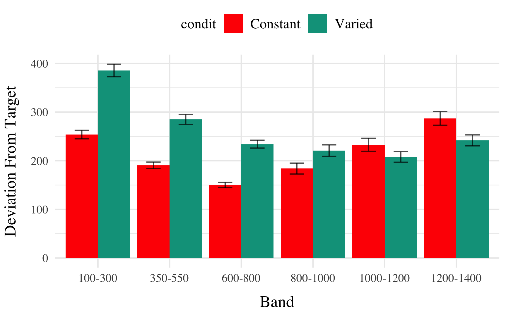

| Term         | Estimate | 95% CrI Lower | 95% CrI Upper |   pd |
|:-------------|---------:|--------------:|--------------:|-----:|
| Intercept    |   205.09 |        136.86 |        274.06 | 1.00 |
| conditVaried |   157.44 |         60.53 |        254.90 | 1.00 |
| Band         |     0.01 |         -0.07 |          0.08 | 0.57 |
| condit\*Band |    -0.16 |         -0.26 |         -0.06 | 1.00 |

(a) Constant Testing1 - Deviation

| contrast          | Band |   value |  lower |  upper |   pd |
|:------------------|-----:|--------:|-------:|-------:|-----:|
| Constant - Varied |  100 | -141.49 | -229.2 | -53.83 | 1.00 |
| Constant - Varied |  350 | -101.79 | -165.6 | -36.32 | 1.00 |
| Constant - Varied |  600 |  -62.02 | -106.2 | -14.77 | 1.00 |
| Constant - Varied |  800 |  -30.11 |  -65.1 |   6.98 | 0.94 |
| Constant - Varied | 1000 |    2.05 |  -33.5 |  38.41 | 0.54 |
| Constant - Varied | 1200 |   33.96 |  -11.9 |  81.01 | 0.92 |

(b) Varied Testing - Deviation

Table 2: Experiment 1. Bayesian Mixed Model predicting absolute deviation as a function of condition (Constant vs. Varied) and Velocity Band

The model predicting absolute deviation (dist) showed clear effects of both training condition and target velocity band (Table X). Overall, the varied training group showed a larger deviation relative to the constant training group (β = 157.44, 95% CI \[60.53, 254.9\]). Deviation also depended on target velocity band, with lower bands showing less deviation. See <a href="#tbl-e1-bmm-dist" class="quarto-xref">Table 2</a> for full model output.

#### Discrimination between bands

In addition to accuracy/deviation, we also assessed the ability of participants to reliably discriminate between the velocity bands (i.e. responding differently when prompted for band 600-800 than when prompted for band 150-350). <a href="#tbl-e1-test-nf-vx" class="quarto-xref">Table 3</a> shows descriptive statistics of this measure, and Figure 1 visualizes the full distributions of throws for each combination of condition and velocity band. To quantify discrimination, we again fit Bayesian Mixed Models as above, but this time the dependent variable was the raw x velocity generated by participants on each testing trial.

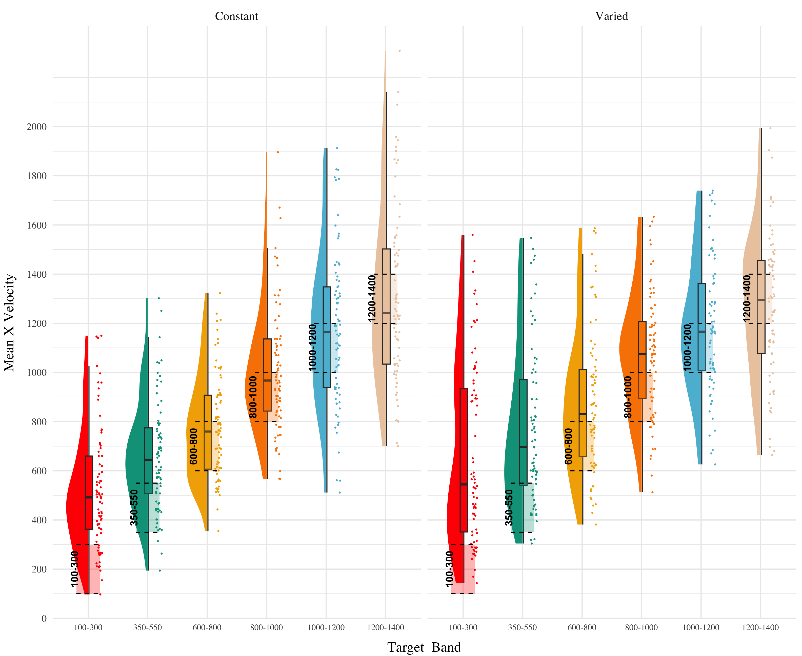

| Band      | Band Type     | Mean | Median |  Sd |
|:----------|:--------------|-----:|-------:|----:|
| 100-300   | Extrapolation |  524 |    448 | 327 |
| 350-550   | Extrapolation |  659 |    624 | 303 |
| 600-800   | Extrapolation |  770 |    724 | 300 |
| 800-1000  | Trained       | 1001 |    940 | 357 |
| 1000-1200 | Extrapolation | 1167 |   1104 | 430 |
| 1200-1400 | Extrapolation | 1283 |   1225 | 483 |

(a) Constant

| Band      | Band Type     | Mean | Median |  Sd |
|:----------|:--------------|-----:|-------:|----:|
| 100-300   | Extrapolation |  664 |    533 | 448 |
| 350-550   | Extrapolation |  768 |    677 | 402 |
| 600-800   | Extrapolation |  876 |    813 | 390 |
| 800-1000  | Trained       | 1064 |   1029 | 370 |
| 1000-1200 | Trained       | 1180 |   1179 | 372 |
| 1200-1400 | Trained       | 1265 |   1249 | 412 |

(b) Varied

Table 3: Testing vx - Empirical Summary

| Term         | Estimate | 95% CrI Lower | 95% CrI Upper |   pd |
|:-------------|---------:|--------------:|--------------:|-----:|
| Intercept    |   408.55 |        327.00 |        490.61 | 1.00 |
| conditVaried |   164.05 |         45.50 |        278.85 | 1.00 |
| Band         |     0.71 |          0.62 |          0.80 | 1.00 |
| condit\*Band |    -0.14 |         -0.26 |         -0.01 | 0.98 |

(a) Model fit to all 6 bands

| Term         | Estimate | 95% CrI Lower | 95% CrI Upper |   pd |
|:-------------|---------:|--------------:|--------------:|-----:|
| Intercept    |   497.49 |        431.26 |        566.17 | 1.00 |
| conditVaried |   124.79 |         26.61 |        224.75 | 0.99 |
| Band         |     0.49 |          0.42 |          0.56 | 1.00 |
| condit\*Band |    -0.06 |         -0.16 |          0.04 | 0.88 |

(b) Model fit to 3 extrapolation bands

Table 4: Experiment 1. Bayesian Mixed Model Predicting Vx as a function of condition (Constant vs. Varied) and Velocity Band

See <a href="#tbl-e1-bmm-vx" class="quarto-xref">Table 4</a> for the full model results. The estimated coefficient for training condition ($B$ = 164.05, 95% CrI \[45.5, 278.85\]) suggests that the varied group tends to produce harder throws than the constant group, but is not in and of itself useful for assessing discrimination. Most relevant to the issue of discrimination is the slope on Velocity Band ($B$ = 0.71, 95% CrI \[0.62, 0.8\]). Although the median slope does fall underneath the ideal of value of 1, the fact that the 95% credible interval does not contain 0 provides strong evidence that participants exhibited some discrimination between bands. The estimate for the interaction between slope and condition ($B$ = -0.14, 95% CrI \[-0.26, -0.01\]), suggests that the discrimination was somewhat modulated by training condition, with the varied participants showing less senitivity between vands than the constant condition. This difference is depicted visually in <a href="#fig-e1-bmm-vx" class="quarto-xref">Figure 5</a>.@tbl-e1-slope-quartile shows the average slope coefficients for varied and constant participants separately for each quartile. The constant participant participants appear to have larger slopes across quartiles, but the difference between conditions may be less pronounced for the top quartiles of subjects who show the strongest discrimination. Figure <a href="#fig-e1-bmm-bx2" class="quarto-xref">Figure 6</a> shows the distributions of slope values for each participant, and the compares the probability density of slope coefficients between training conditions. <a href="#fig-e1-indv-slopes" class="quarto-xref">Figure 7</a>

The second model, which focused solely on extrapolation bands, revealed similar patterns. The Velocity Band term ($B$ = 0.49, 95% CrI \[0.42, 0.56\]) still demonstrates a high degree of discrimination ability. However, the posterior distribution for interaction term ($B$ = -0.06, 95% CrI \[-0.16, 0.04\] ) does across over 0, suggesting that the evidence for decreased discrimination ability for the varied participants is not as strong when considering only the three extrapolation bands.

<table>
<colgroup>
<col style="width: 100%" />
</colgroup>
<tbody>
<tr class="odd">
<td style="text-align: center;">

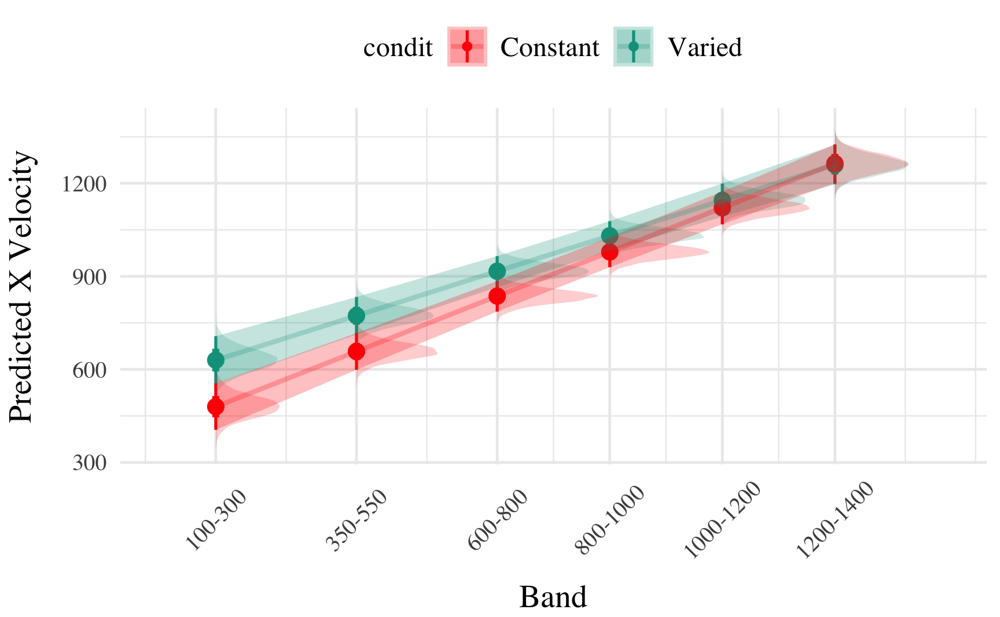
&#10;
</td>
</tr>
</tbody>
</table>

<table>
<colgroup>
<col style="width: 100%" />
</colgroup>
<tbody>
<tr class="odd">
<td style="text-align: center;">

&#10;
</td>
</tr>
</tbody>
</table>

Figure 5: Conditional effect of training condition and Band. Ribbons indicate 95% HDI. The steepness of the lines serves as an indicator of how well participants discriminated between velocity bands.

| Condition | Q_0%\_mean | Q_25%\_mean | Q_50%\_mean | Q_75%\_mean | Q_100%\_mean |
|:----------|-----------:|------------:|------------:|------------:|-------------:|
| Constant  |     -0.106 |       0.477 |       0.692 |       0.935 |          1.4 |
| Varied    |     -0.201 |       0.268 |       0.588 |       0.900 |          1.3 |

Table 5: Slope coefficients by quartile, per condition

<table>
<colgroup>
<col style="width: 100%" />
</colgroup>
<tbody>
<tr class="odd">
<td style="text-align: center;">

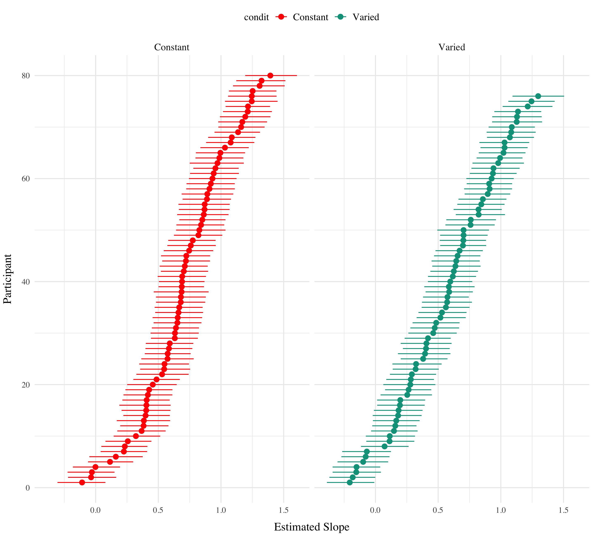
&#10;
</td>
</tr>
</tbody>
</table>

<table>
<colgroup>
<col style="width: 100%" />
</colgroup>
<tbody>
<tr class="odd">
<td style="text-align: center;">

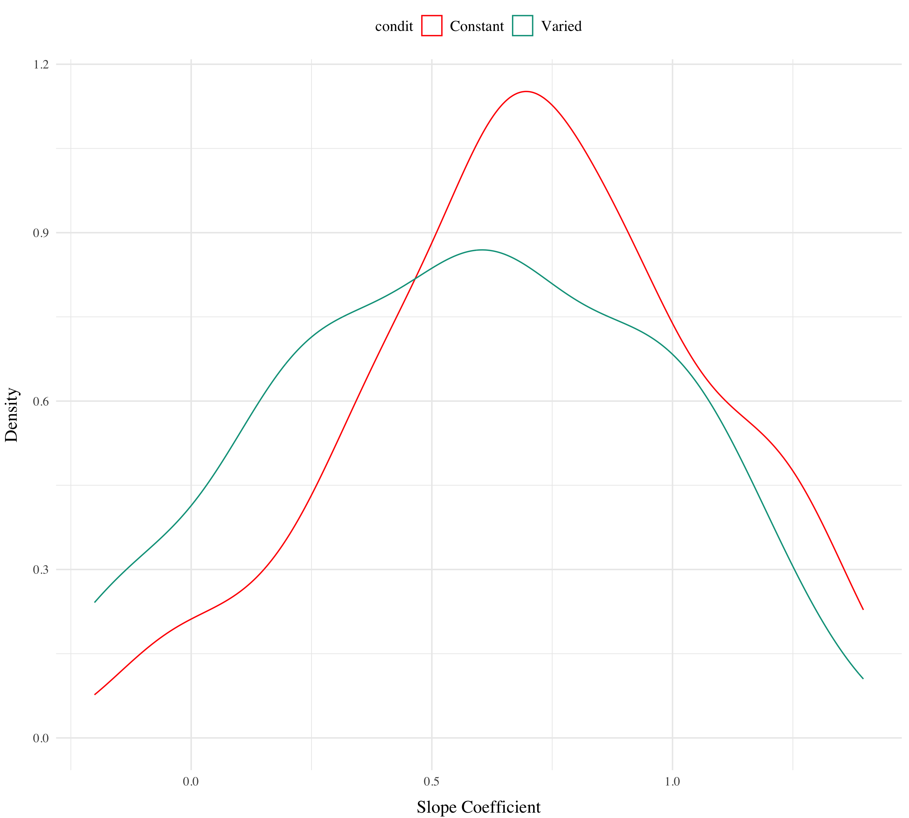
&#10;
</td>
</tr>
</tbody>
</table>

Figure 6: Slope distributions between condition

test

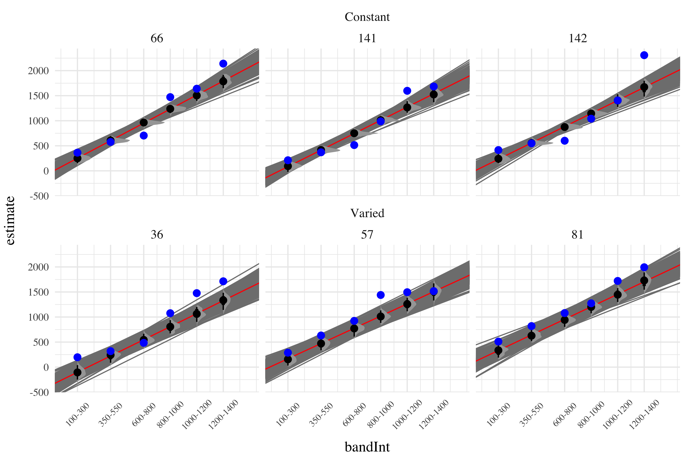

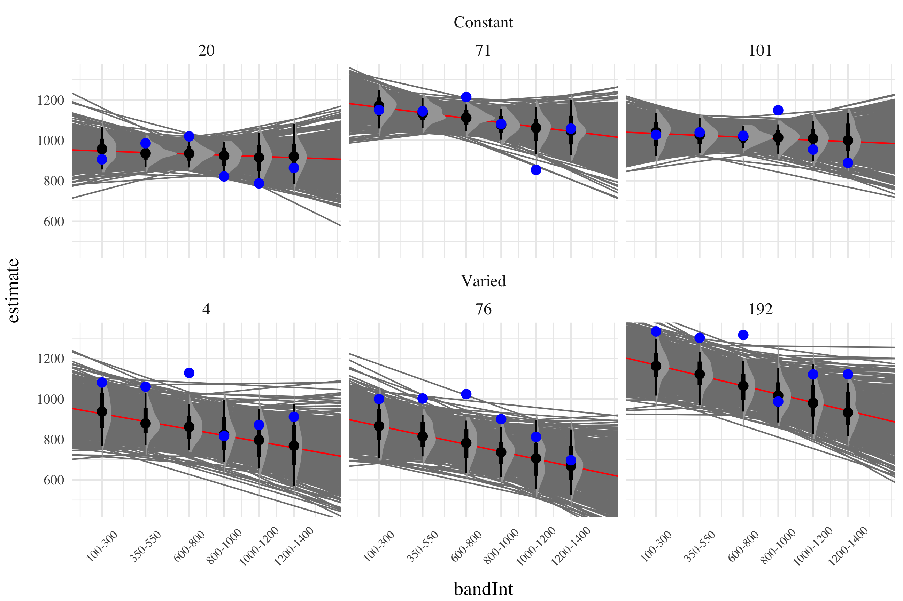

Figure 7: Subset of Varied and Constant Participants with the smallest and largest estimated slope values. Red lines represent the best fitting line for each participant, gray lines are 200 random samples from the posterior distribution. Colored points and intervals at each band represent the empirical median and 95% HDI.

# Experiment 2

<a href="#fig-design-e2" class="quarto-xref">Figure 8</a> illustrates the design of Experiment 2. The stages of the experiment (i.e. training, testing no-feedback, test with feedback), are identical to that of Experiment 1. The only change is that Experiment 2 participants train, and then test, on bands in the reverse order of Experiment 1 (i.e. training on the softer bands; and testing on the harder bands).

<svg width="576" height="240" viewbox="0.00 0.00 647.35 174.00" xmlns="http://www.w3.org/2000/svg" xlink="http://www.w3.org/1999/xlink" style="; max-width: none; max-height: none">
<g id="graph0" class="graph" transform="scale(1 1) rotate(0) translate(4 170)">
<polygon fill="white" stroke="transparent" points="-4,4 -4,-170 643.35,-170 643.35,4 -4,4"></polygon>
<g id="clust1" class="cluster">
<title>cluster</title>
<polygon fill="none" stroke="black" points="152.49,-8 152.49,-158 458.5,-158 458.5,-8 152.49,-8"></polygon>
<text text-anchor="middle" x="305.49" y="-141.4" font-family="Times,serif" font-size="14.00">Test Phase </text>
<text text-anchor="middle" x="305.49" y="-124.6" font-family="Times,serif" font-size="14.00">(Counterbalanced Order)</text>
</g>
<!-- data1 -->
<g id="node1" class="node">
<title>data1</title>
<polygon fill="#ff0000" stroke="black" points="118.54,-137.7 5.95,-137.7 5.95,-62.3 118.54,-62.3 118.54,-137.7"></polygon>
<text text-anchor="middle" x="62.24" y="-121" font-family="Times,serif" font-size="14.00"> Varied Training </text>
<text text-anchor="middle" x="62.24" y="-104.2" font-family="Times,serif" font-size="14.00">100-300</text>
<text text-anchor="middle" x="62.24" y="-87.4" font-family="Times,serif" font-size="14.00">350-550</text>
<text text-anchor="middle" x="62.24" y="-70.6" font-family="Times,serif" font-size="14.00">600-800</text>
</g>
<!-- Test1 -->
<g id="node4" class="node">
<title>Test1</title>
<polygon fill="#eccbae" stroke="black" points="256.06,-108 160.63,-108 160.63,-16 256.06,-16 256.06,-108"></polygon>
<text text-anchor="middle" x="208.34" y="-91.4" font-family="Times,serif" font-size="14.00">Test &nbsp;</text>
<text text-anchor="middle" x="208.34" y="-74.6" font-family="Times,serif" font-size="14.00">Novel Bands &nbsp;</text>
<text text-anchor="middle" x="208.34" y="-57.8" font-family="Times,serif" font-size="14.00">800-1000</text>
<text text-anchor="middle" x="208.34" y="-41" font-family="Times,serif" font-size="14.00">1000-1200</text>
<text text-anchor="middle" x="208.34" y="-24.2" font-family="Times,serif" font-size="14.00">1200-1400</text>
</g>
<!-- data1&#45;&gt;Test1 -->
<g id="edge1" class="edge">
<title>data1-&gt;Test1</title>
<path fill="none" stroke="black" d="M118.54,-85.42C129.01,-82.66 139.97,-79.77 150.49,-76.99"></path>
<polygon fill="black" stroke="black" points="151.62,-80.31 160.4,-74.38 149.83,-73.55 151.62,-80.31"></polygon>
</g>
<!-- data2 -->
<g id="node2" class="node">
<title>data2</title>
<polygon fill="#00a08a" stroke="black" points="124.73,-44.6 -0.24,-44.6 -0.24,-3.4 124.73,-3.4 124.73,-44.6"></polygon>
<text text-anchor="middle" x="62.24" y="-28.2" font-family="Times,serif" font-size="14.00"> Constant Training </text>
<text text-anchor="middle" x="62.24" y="-11.4" font-family="Times,serif" font-size="14.00">600-800</text>
</g>
<!-- data2&#45;&gt;Test1 -->
<g id="edge2" class="edge">
<title>data2-&gt;Test1</title>
<path fill="none" stroke="black" d="M124.77,-40.23C133.35,-42.49 142.13,-44.8 150.61,-47.04"></path>
<polygon fill="black" stroke="black" points="149.84,-50.46 160.41,-49.62 151.63,-43.69 149.84,-50.46"></polygon>
</g>
<!-- Test3 -->
<g id="node3" class="node">
<title>Test3</title>
<polygon fill="#eccbae" stroke="black" points="639.27,-108 486.57,-108 486.57,-16 639.27,-16 639.27,-108"></polygon>
<text text-anchor="middle" x="562.92" y="-91.4" font-family="Times,serif" font-size="14.00"> &nbsp;&nbsp;&nbsp;Final Test </text>
<text text-anchor="middle" x="562.92" y="-74.6" font-family="Times,serif" font-size="14.00"> &nbsp;Novel With Feedback &nbsp;</text>
<text text-anchor="middle" x="562.92" y="-57.8" font-family="Times,serif" font-size="14.00">800-1000</text>
<text text-anchor="middle" x="562.92" y="-41" font-family="Times,serif" font-size="14.00">1000-1200</text>
<text text-anchor="middle" x="562.92" y="-24.2" font-family="Times,serif" font-size="14.00">1200-1400</text>
</g>
<!-- Test2 -->
<g id="node5" class="node">
<title>Test2</title>
<polygon fill="#eccbae" stroke="black" points="450.65,-108 292.05,-108 292.05,-16 450.65,-16 450.65,-108"></polygon>
<text text-anchor="middle" x="371.35" y="-91.4" font-family="Times,serif" font-size="14.00"> &nbsp;Test </text>
<text text-anchor="middle" x="371.35" y="-74.6" font-family="Times,serif" font-size="14.00"> &nbsp;Varied Training Bands &nbsp;</text>
<text text-anchor="middle" x="371.35" y="-57.8" font-family="Times,serif" font-size="14.00">100-300</text>
<text text-anchor="middle" x="371.35" y="-41" font-family="Times,serif" font-size="14.00">350-550</text>
<text text-anchor="middle" x="371.35" y="-24.2" font-family="Times,serif" font-size="14.00">600-800</text>
</g>
<!-- Test1&#45;&gt;Test2 -->
<g id="edge3" class="edge">
<title>Test1-&gt;Test2</title>
<path fill="none" stroke="black" d="M256.35,-62C264.51,-62 273.22,-62 282.07,-62"></path>
<polygon fill="black" stroke="black" points="282.09,-65.5 292.09,-62 282.09,-58.5 282.09,-65.5"></polygon>
</g>
<!-- Test2&#45;&gt;Test3 -->
<g id="edge4" class="edge">
<title>Test2-&gt;Test3</title>
<path fill="none" stroke="black" d="M450.55,-62C459.05,-62 467.74,-62 476.33,-62"></path>
<polygon fill="black" stroke="black" points="476.34,-65.5 486.34,-62 476.34,-58.5 476.34,-65.5"></polygon>
</g>
</g>
</svg>

Figure 8: Experiment 2 Design. Constant and Varied participants complete different training conditions. The training and testing bands are the reverse of Experiment 1.

## E2 Results

### Testing Phase - No feedback.

In the first part of the testing phase, participants are tested from each of the velocity bands, and receive no feedback after each throw.

#### Deviation From Target Band

Descriptive summaries testing deviation data are provided in <a href="#tbl-e2-test-nf-deviation" class="quarto-xref">Table 6</a> and <a href="#fig-e2-test-dev" class="quarto-xref">Figure 9</a>.
To model differences in accuracy between groups, we used Bayesian mixed effects regression models to the trial level data from the testing phase. The primary model predicted the absolute deviation from the target velocity band (dist) as a function of training condition (condit), target velocity band (band), and their interaction, with random intercepts and slopes for each participant (id).

| Band      | Band Type     | Mean | Median |  Sd |
|:----------|:--------------|-----:|-------:|----:|
| 100-300   | Extrapolation |  206 |     48 | 317 |
| 350-550   | Extrapolation |  194 |     86 | 268 |
| 600-800   | Trained       |  182 |    112 | 240 |
| 800-1000  | Extrapolation |  200 |    129 | 233 |
| 1000-1200 | Extrapolation |  238 |    190 | 234 |
| 1200-1400 | Extrapolation |  311 |    254 | 288 |

(a) Constant Testing - Deviation

| Band      | Band Type     | Mean | Median |  Sd |
|:----------|:--------------|-----:|-------:|----:|
| 100-300   | Trained       |  153 |     25 | 266 |
| 350-550   | Trained       |  138 |     53 | 233 |
| 600-800   | Trained       |  160 |    120 | 183 |
| 800-1000  | Extrapolation |  261 |    207 | 257 |
| 1000-1200 | Extrapolation |  305 |    258 | 273 |
| 1200-1400 | Extrapolation |  363 |    314 | 297 |

(b) Varied Testing - Deviation

Table 6: Testing Deviation - Empirical Summary

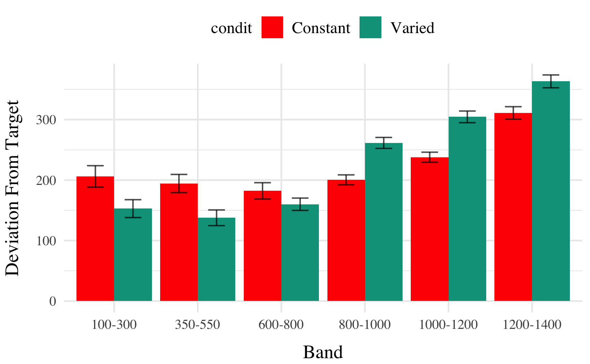

| Term         | Estimate | 95% CrI Lower | 95% CrI Upper |   pd |
|:-------------|---------:|--------------:|--------------:|-----:|
| Intercept    |   151.71 |         90.51 |        215.86 | 1.00 |
| conditVaried |   -70.33 |       -156.87 |         16.66 | 0.94 |
| Band         |     0.10 |          0.02 |          0.18 | 1.00 |
| condit\*Band |     0.12 |          0.02 |          0.23 | 0.99 |

(a) Model fits

| contrast          | Band | value |  lower |  upper |   pd |
|:------------------|-----:|------:|-------:|-------:|-----:|
| Constant - Varied |  100 |  57.6 |  -20.5 | 135.32 | 0.93 |
| Constant - Varied |  350 |  26.6 |  -30.9 |  83.84 | 0.83 |
| Constant - Varied |  600 |  -4.3 |  -46.7 |  38.52 | 0.58 |
| Constant - Varied |  800 | -29.3 |  -69.4 |  11.29 | 0.92 |
| Constant - Varied | 1000 | -54.6 | -101.1 |  -5.32 | 0.98 |
| Constant - Varied | 1200 | -79.6 | -139.5 | -15.45 | 0.99 |

(b) Contrasts

Table 7: Experiment 2. Bayesian Mixed Model predicting absolute deviation as a function of condition (Constant vs. Varied) and Velocity Band

The model predicting absolute deviation showed a modest tendency for the varied training group to have lower deviation compared to the constant training group (β = -70.33, 95% CI \[-156.87, 16.66\]),with 94% of the posterior distribution being less than 0. This suggests a potential benefit of training with variation, though the evidence is not definitive.

#### Discrimination between Velocity Bands

In addition to accuracy/deviation. We also assessed the ability of participants to reliably discriminate between the velocity bands (i.e. responding differently when prompted for band 600-800 than when prompted for band 150-350). <a href="#tbl-e2-test-nf-vx" class="quarto-xref">Table 8</a> shows descriptive statistics of this measure, and Figure 1 visualizes the full distributions of throws for each combination of condition and velocity band. To quantify discrimination, we again fit Bayesian Mixed Models as above, but this time the dependent variable was the raw x velocity generated by participants.

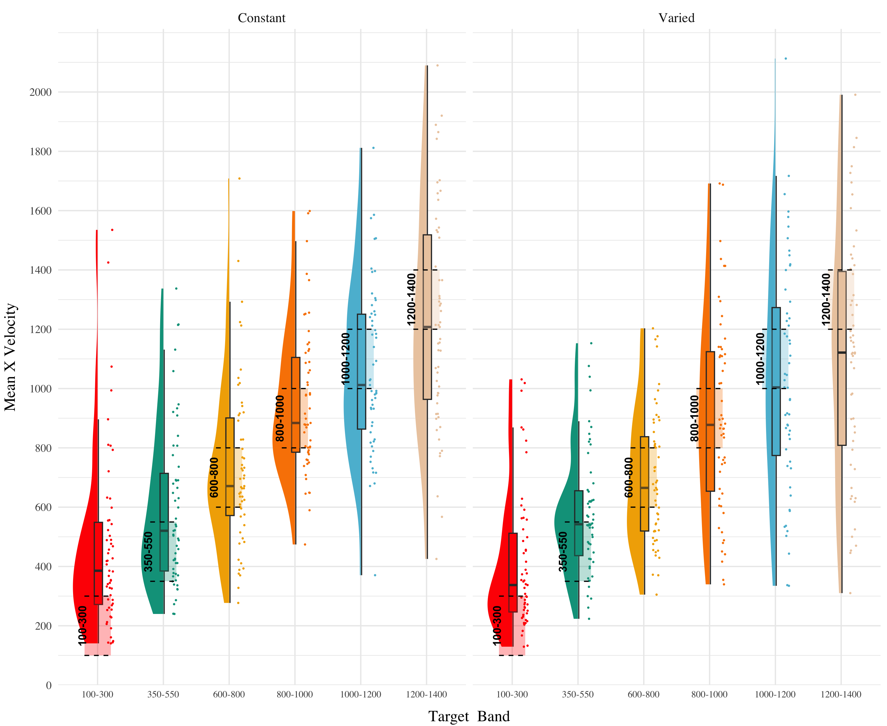

| Band      | Band Type     | Mean | Median |  Sd |
|:----------|:--------------|-----:|-------:|----:|
| 100-300   | Extrapolation |  457 |    346 | 354 |
| 350-550   | Extrapolation |  597 |    485 | 368 |
| 600-800   | Trained       |  728 |    673 | 367 |
| 800-1000  | Extrapolation |  953 |    913 | 375 |
| 1000-1200 | Extrapolation | 1064 |   1012 | 408 |
| 1200-1400 | Extrapolation | 1213 |   1139 | 493 |

(a) Constant Testing - vx

| Band      | Band Type     | Mean | Median |  Sd |
|:----------|:--------------|-----:|-------:|----:|
| 100-300   | Trained       |  410 |    323 | 297 |
| 350-550   | Trained       |  582 |    530 | 303 |
| 600-800   | Trained       |  696 |    641 | 316 |
| 800-1000  | Extrapolation |  910 |    848 | 443 |
| 1000-1200 | Extrapolation | 1028 |    962 | 482 |
| 1200-1400 | Extrapolation | 1095 |   1051 | 510 |

(b) Varied Testing - vx

Table 8: Testing vx - Empirical Summary

| Term         | Estimate | 95% CrI Lower | 95% CrI Upper |   pd |
|:-------------|---------:|--------------:|--------------:|-----:|
| Intercept    |   362.64 |        274.85 |        450.02 | 1.00 |
| conditVaried |    -8.56 |       -133.97 |        113.98 | 0.55 |
| Band         |     0.71 |          0.58 |          0.84 | 1.00 |
| condit\*Band |    -0.06 |         -0.24 |          0.13 | 0.73 |

Table 9: Experiment 2. Bayesian Mixed Model Predicting Vx as a function of condition (Constant vs. Varied) and Velocity Band

See <a href="#tbl-e2-bmm-vx" class="quarto-xref">Table 9</a> for the full model results.

When examining discrimination ability using the model predicting raw x-velocity, the results were less clear than those of the absolute deviation analysis. The slope on Velocity Band (β = 0.71, 95% CrI \[0.58, 0.84\]) indicates that participants showed good discrimination between bands overall. However, the interaction term suggested this effect was not modulated by training condition (β = -0.06, 95% CrI \[-0.24, 0.13\]) Thus, while varied training may provide some advantage for accuracy, both training conditions seem to have similar abilities to discriminate between velocity bands.

# Experiment 3

The major manipulation adjustment of experiment 3 is for participants to receive ordinal feedback during training, in contrast to the continuous feedback of the earlier experiments. Ordinal feedback informs participants whether a throw was too soft, too hard, or fell within the target velocity range. Experiment 3 participants were randomly assigned to both a training condition (Constant vs. Varied) and a Band Order condition (original order used in Experiment 1, or the Reverse order of Experiment 2).

## Results

### Testing Phase - No feedback.

In the first part of the testing phase, participants are tested from each of the velocity bands, and receive no feedback after each throw. Note that these no-feedback testing trials are identical to those of Experiment 1 and 2, as the ordinal feedback only occurs during the training phase, and final testing phase, of Experiment 3.

#### Deviation From Target Band

Descriptive summaries testing deviation data are provided in **?@tbl-e3-test-nf-deviation** and <a href="#fig-e3-test-dev" class="quarto-xref">Figure 12</a>.
To model differences in accuracy between groups, we fit Bayesian mixed effects regression models to the trial level data from the testing phase. The primary model predicted the absolute deviation from the target velocity band (dist) as a function of training condition (condit), target velocity band (band), and their interaction, with random intercepts and slopes for each participant (id).

| Band      | Band Type     | Mean | Median |  Sd |
|:----------|:--------------|-----:|-------:|----:|
| 100-300   | Extrapolation |  396 |    325 | 350 |
| 350-550   | Extrapolation |  278 |    176 | 299 |
| 600-800   | Extrapolation |  173 |    102 | 215 |
| 800-1000  | Trained       |  225 |    126 | 284 |
| 1000-1200 | Extrapolation |  253 |    192 | 271 |
| 1200-1400 | Extrapolation |  277 |    210 | 262 |

| Band      | Band Type     | Mean | Median |  Sd |
|:----------|:--------------|-----:|-------:|----:|
| 100-300   | Extrapolation |  383 |    254 | 385 |
| 350-550   | Extrapolation |  287 |    154 | 318 |
| 600-800   | Extrapolation |  213 |    140 | 244 |
| 800-1000  | Trained       |  199 |    142 | 209 |
| 1000-1200 | Trained       |  222 |    163 | 221 |
| 1200-1400 | Trained       |  281 |    227 | 246 |

| Band      | Band Type     | Mean | Median |  Sd |
|:----------|:--------------|-----:|-------:|----:|
| 100-300   | Extrapolation |  403 |    334 | 383 |
| 350-550   | Extrapolation |  246 |    149 | 287 |
| 600-800   | Trained       |  155 |     82 | 209 |
| 800-1000  | Extrapolation |  207 |    151 | 241 |
| 1000-1200 | Extrapolation |  248 |    220 | 222 |
| 1200-1400 | Extrapolation |  322 |    281 | 264 |

| Band      | Band Type     | Mean | Median |  Sd |
|:----------|:--------------|-----:|-------:|----:|
| 100-300   | Trained       |  153 |      0 | 307 |
| 350-550   | Trained       |  147 |     55 | 258 |
| 600-800   | Trained       |  159 |    107 | 192 |
| 800-1000  | Extrapolation |  221 |    160 | 235 |
| 1000-1200 | Extrapolation |  244 |    185 | 235 |
| 1200-1400 | Extrapolation |  324 |    264 | 291 |

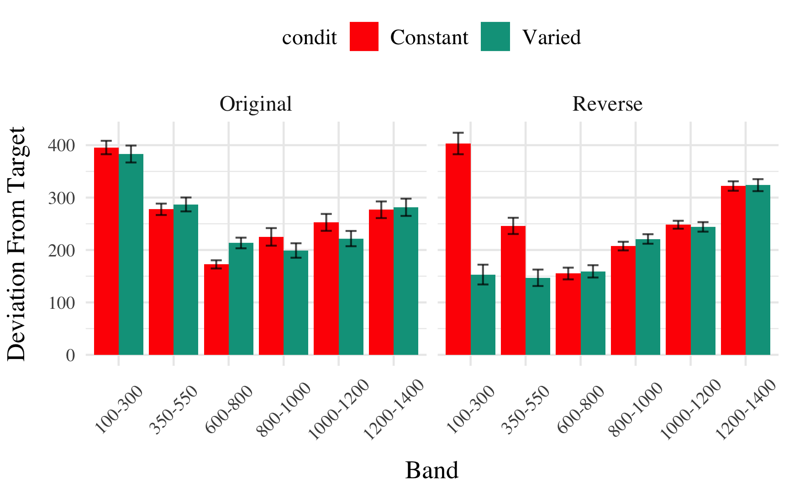

| Term                               | Estimate | 95% CrI Lower | 95% CrI Upper |   pd |
|:-------------------------------|--------:|-------------:|-------------:|-----:|
| Intercept                          |   342.85 |        260.18 |        426.01 | 1.00 |
| conditVaried                       |     7.38 |       -116.96 |        133.20 | 0.54 |
| bandOrderReverse                   |   -64.99 |       -179.19 |         49.75 | 0.86 |
| Band                               |    -0.13 |         -0.22 |         -0.04 | 1.00 |
| conditVaried:bandOrderReverse      |  -185.30 |       -360.16 |         -8.89 | 0.98 |
| condit\*Band                       |     0.00 |         -0.15 |          0.13 | 0.52 |
| bandOrderReverse:Band              |     0.11 |         -0.01 |          0.24 | 0.96 |
| conditVaried:bandOrderReverse:Band |     0.19 |         -0.01 |          0.38 | 0.97 |

The effect of training condition in Experiment 3 showed a similar pattern to Experiment 2, with the varied group tending to have lower deviation than the constant group (β = 7.38, 95% CrI \[-116.96, 133.2\]), with 97% of the posterior distribution falling under 0.

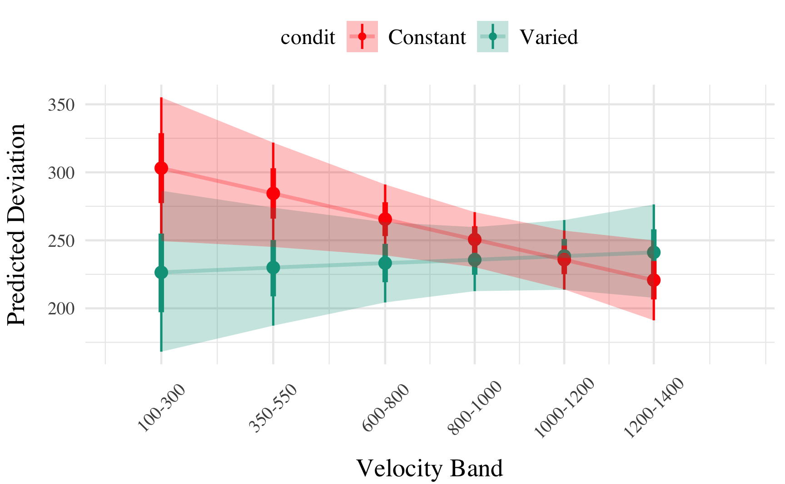

#### Discrimination between Velocity Bands

In addition to accuracy/deviation. We also assessed the ability of participants to reliably discriminate between the velocity bands (i.e. responding differently when prompted for band 600-800 than when prompted for band 150-350). **?@tbl-e3-test-nf-vx** shows descriptive statistics of this measure, and Figure 1 visualizes the full distributions of throws for each combination of condition and velocity band. To quantify discrimination, we again fit Bayesian Mixed Models as above, but this time the dependent variable was the raw x velocity generated by participants.

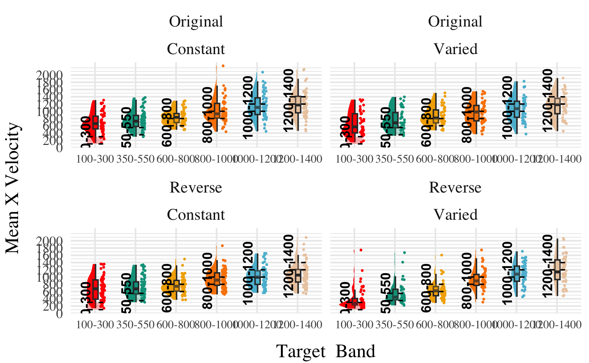

| Band      | Band Type     | Mean | Median |  Sd |
|:----------|:--------------|-----:|-------:|----:|
| 100-300   | Extrapolation |  680 |    625 | 370 |
| 350-550   | Extrapolation |  771 |    716 | 357 |
| 600-800   | Extrapolation |  832 |    786 | 318 |
| 800-1000  | Trained       | 1006 |    916 | 417 |
| 1000-1200 | Extrapolation | 1149 |   1105 | 441 |
| 1200-1400 | Extrapolation | 1180 |   1112 | 443 |

| Band      | Band Type     | Mean | Median |  Sd |
|:----------|:--------------|-----:|-------:|----:|
| 100-300   | Extrapolation |  667 |    554 | 403 |
| 350-550   | Extrapolation |  770 |    688 | 383 |
| 600-800   | Extrapolation |  869 |    814 | 358 |
| 800-1000  | Trained       |  953 |    928 | 359 |
| 1000-1200 | Trained       | 1072 |   1066 | 388 |
| 1200-1400 | Trained       | 1144 |   1093 | 426 |

| Band      | Band Type     | Mean | Median |  Sd |
|:----------|:--------------|-----:|-------:|----:|
| 100-300   | Extrapolation |  684 |    634 | 406 |
| 350-550   | Extrapolation |  729 |    679 | 350 |
| 600-800   | Trained       |  776 |    721 | 318 |
| 800-1000  | Extrapolation |  941 |    883 | 387 |
| 1000-1200 | Extrapolation | 1014 |    956 | 403 |
| 1200-1400 | Extrapolation | 1072 |   1014 | 442 |

| Band      | Band Type     | Mean | Median |  Sd |
|:----------|:--------------|-----:|-------:|----:|
| 100-300   | Trained       |  392 |    270 | 343 |
| 350-550   | Trained       |  540 |    442 | 343 |
| 600-800   | Trained       |  642 |    588 | 315 |
| 800-1000  | Extrapolation |  943 |    899 | 394 |
| 1000-1200 | Extrapolation | 1081 |   1048 | 415 |
| 1200-1400 | Extrapolation | 1185 |   1129 | 500 |

| Term                               | Estimate | 95% CrI Lower | 95% CrI Upper |   pd |
|:-------------------------------|--------:|-------------:|-------------:|-----:|
| Intercept                          |   601.83 |        504.75 |        699.42 | 1.00 |
| conditVaried                       |    12.18 |       -134.94 |        162.78 | 0.56 |
| bandOrderReverse                   |    13.03 |       -123.89 |        144.67 | 0.58 |
| Band                               |     0.49 |          0.36 |          0.62 | 1.00 |
| conditVaried:bandOrderReverse      |  -338.15 |       -541.44 |       -132.58 | 1.00 |
| condit\*Band                       |    -0.04 |         -0.23 |          0.15 | 0.67 |
| bandOrderReverse:Band              |    -0.10 |         -0.27 |          0.08 | 0.86 |
| conditVaried:bandOrderReverse:Band |     0.42 |          0.17 |          0.70 | 1.00 |

See **?@tbl-e3-bmm-vx** for the full model results.

Slope estimates for experiment 3 suggest that participants were capable of distinguishing between velocity bands even when provided only ordinal feedback during training (β = 0.49, 95% CrI \[0.36, 0.62\]). Unlike the previous two experiments, the posterior distribution for the interaction between condition and band was consistently positive, suggestive of superior discrimination for the varied participants
β = -0.04, 95% CrI \[-0.23, 0.15\].

### Computational Modelling

# Modeling Approach

The modeling goal is to implement a full process model capable of both 1) producing novel responses and 2) modeling behavior in both the learning and testing stages of the experiment. For this purpose, we will apply the associative learning model (ALM) and the EXAM model of function learning ([DeLosh et al., 1997](#ref-deloshExtrapolationSineQua1997)). ALM is a simple connectionist learning model which closely resembles Kruschke's ALCOVE model ([Kruschke, 1992](#ref-kruschkeALCOVEExemplarbasedConnectionist1992)), with modifications to allow for the generation of continuous responses.

## ALM & Exam Description

ALM is a localist neural network model ([Page, 2000](#ref-pageConnectionistModellingPsychology2000a)), with each input node corresponding to a particular stimulus, and each output node corresponding to a particular response value. The units in the input layer activate as a function of their Gaussian similarity to the input stimulus. So, for example, an input stimulus of value 55 would induce maximal activation of the input unit tuned to 55. Depending on the value of the generalization parameter, the nearby units (e.g. 54 and 56; 53 and 57) may also activate to some degree. ALM is structured with input and output nodes that correspond to regions of the stimulus space, and response space, respectively. The units in the input layer activate as a function of their similarity to a presented stimulus. As was the case with the exemplar-based models, similarity in ALM is exponentially decaying function of distance. The input layer is fully connected to the output layer, and the activation for any particular output node is simply the weighted sum of the connection weights between that node and the input activations. The network then produces a response by taking the weighted average of the output units (recall that each output unit has a value corresponding to a particular response). During training, the network receives feedback which activates each output unit as a function of its distance from the ideal level of activation necessary to produce the correct response. The connection weights between input and output units are then updated via the standard delta learning rule, where the magnitude of weight changes are controlled by a learning rate parameter. The EXAM model is an extension of ALM, with the same learning rule and representational scheme for input and output units. The primary difference is that EXAM includes a linear extrapolation mechanism for generating novel responses during testing, a modification necessary to account for human extrapolation patterns in past research Brown & Lacroix ([2017](#ref-brownUnderestimationLinearFunction2017)). Although this extrapolation rule departs from a strictly similarity-based generalization mechanism, EXAM is distinct from pure rule-based models in that it remains constrained by the weights learned during training.

See <a href="#tbl-alm-exam" class="quarto-xref">Table 10</a> for a full specification of the equations that define ALM and EXAM.

|                    | **ALM Response Generation**                                        |                                                                                               |
|-------------------|-----------------------------|-------------------------|
| Input Activation   | $a_i(X) = \frac{e^{-c(X-X_i)^2}}{\sum_{k=1}^M e^{-c(X-X_k)^2}}$    | Input nodes activate as a function of Gaussian similarity to stimulus                         |
| Output Activation  | $O_j(X) = \sum_{k=1}^M w_{ji} \cdot a_i(X)$                        | Output unit $O_j$ activation is the weighted sum of input activations and association weights |
| Output Probability | $P[Y_j|X] = \frac{O_j(X)}{\sum_{k=1}^M O_k(X)}$                    | The response, $Y_j$ probabilites computed via Luce's choice rule                              |
| Mean Output        | $m(X) = \sum_{j=1}^L Y_j \cdot \frac{O_j(x)}{\sum_{k=1}^M O_k(X)}$ | Weighted average of probabilities determines response to X                                    |
|                    | **ALM Learning**                                                   |                                                                                               |
| Feedback           | $f_j(Z) = e^{-c(Z-Y_j)^2}$                                         | feedback signal Z computed as similarity between ideal response and observed response         |
| magnitude of error | $\Delta_{ji}=(f_{j}(Z)-o_{j}(X))a_{i}(X)$                          | Delta rule to update weights.                                                                 |
| Update Weights     | $w_{ji}^{new}=w_{ji}+\eta\Delta_{ji}$                              | Updates scaled by learning rate parameter $\eta$.                                             |
|                    | **EXAM Extrapolation**                                             |                                                                                               |
| Instance Retrieval | $P[X_i|X] = \frac{a_i(X)}{\sum_{k=1}^M a_k(X)}$                    | Novel test stimulus $X$ activates input nodes $X_i$                                           |
| Slope Computation  | $S =$ $\frac{m(X_{1})-m(X_{2})}{X_{1}-X_{2}}$                      | Slope value, $S$ computed from nearest training instances                                     |
| Response           | $E[Y|X_i] = m(X_i) + S \cdot [X - X_i]$                            | ALM response $m(X_i)$ adjusted by slope.                                                      |

Table 10: ALM & EXAM Equations

## Model Fitting

To fit ALM and EXAM to our participant data, we employ a similar method to Mcdaniel et al. ([2009](#ref-mcdanielPredictingTransferPerformance2009)), wherein we examine the performance of each model after being fit to various subsets of the data. Each model was fit to the data in with separate procedures: 1) fit to maximize predictions of the testing data, 2) fit to maximize predictions of both the training and testing data, 3) fit to maximize predictions of the just the training data. We refer to this fitting manipulations as "Fit Method" in the tables and figures below. It should be emphasized that for all three fit methods, the ALM and EXAM models behave identically - with weights updating only during the training phase.Models to were fit separately to the data of each individual participant. The free parameters for both models are the generalization ($c$) and learning rate ($lr$) parameters. Parameter estimation was performed using approximate bayesian computation (ABC), which we describe in detail below.

> **None**
>
> ** Approximate Bayesian Computation**
>
> To estimate parameters, we used approximate bayesian computation (ABC), enabling us to obtain an estimate of the posterior distribution of the generalization and learning rate parameters for each individual. ABC belongs to the class of simulation-based inference methods ([Cranmer et al., 2020](#ref-cranmerFrontierSimulationbasedInference2020)), which have begun being used for parameter estimation in cognitive modeling relatively recently ([Kangasrääsiö et al., 2019](#ref-kangasraasioParameterInferenceComputational2019); [Turner et al., 2016](#ref-turnerBayesianAnalysisSimulationbased2016); [Turner & Van Zandt, 2012](#ref-turnerTutorialApproximateBayesian2012)). Although they can be applied to any model from which data can be simulated, ABC methods are most useful for complex models that lack an explicit likelihood function (e.g. many neural network and evidence accumulation models).
>
> The general ABC procedure is to 1) define a prior distribution over model parameters. 2) sample candidate parameter values, $\theta^*$, from the prior. 3) Use $\theta^*$ to generate a simulated dataset, $Data_{sim}$. 4) Compute a measure of discrepancy between the simulated and observed datasets, $discrep$($Data_{sim}$, $Data_{obs}$). 5) Accept $\theta^*$ if the discrepancy is less than the tolerance threshold, $\epsilon$, otherwise reject $\theta^*$. 6) Repeat until desired number of posterior samples are obtained.
>
> Although simple in the abstract, implementations of ABC require researchers to make a number of non-trivial decisions as to i) the discrepancy function between observed and simulated data, ii) whether to compute the discrepancy between trial level data, or a summary statistic of the datasets, iii) the value of the minimum tolerance $\epsilon$ between simulated and observed data. For the present work, we follow the guidelines from previously published ABC tutorials ([Farrell & Lewandowsky, 2018](#ref-farrellComputationalModelingCognition2018); [Turner & Van Zandt, 2012](#ref-turnerTutorialApproximateBayesian2012)). For the test stage, we summarized datasets with mean velocity of each band in the observed dataset as $V_{obs}^{(k)}$ and in the simulated dataset as $V_{sim}^{(k)}$, where $k$ represents each of the six velocity bands. For computing the discrepancy between datasets in the training stage, we aggregated training trials into three equally sized blocks (separately for each velocity band in the case of the varied group). After obtaining the summary statistics of the simulated and observed datasets, the discrepancy was computed as the mean of the absolute difference between simulated and observed datasets (<a href="#eq-discrep-test" class="quarto-xref">Equation 1</a> and <a href="#eq-discrep-train" class="quarto-xref">Equation 2</a>). For the models fit to both training and testing data, discrepancies were computed for both stages, and then averaged together.
>
> $$
> discrep_{Test}(Data_{sim}, Data_{obs}) = \frac{1}{6} \sum_{k=1}^{6} |V_{obs}^{(k)} - V_{sim}^{(k)}|
>  \qquad(1)$$
>
> $$
> \begin{aligned} \\
> discrep_{Train,constant}(Data_{sim}, Data_{obs}) = \frac{1}{N_{blocks}} \sum_{j=1}^{N_{blocks}} |V_{obs,constant}^{(j)} - V_{sim,constant}^{(j)}| \\ \\
> discrep_{Train,varied}(Data_{sim}, Data_{obs}) = \frac{1}{N_{blocks} \times 3} \sum_{j=1}^{N_{blocks}} \sum_{k=1}^{3} |V_{obs,varied}^{(j,k)} - V_{sim,varied}^{(j,k)}|
> \end{aligned}
>  \qquad(2)$$
>
> The final component of our ABC implementation is the determination of an appropriate value of $\epsilon$. The setting of $\epsilon$ exerts strong influence on the approximated posterior distribution. Smaller values of $\epsilon$ increase the rejection rate, and improve the fidelity of the approximated posterior, while larger values result in an ABC sampler that simply reproduces the prior distribution. Because the individual participants in our dataset differed substantially in terms of the noisiness of their data, we employed an adaptive tolerance setting strategy to tailor $\epsilon$ to each individual. The initial value of $\epsilon$ was set to the overall standard deviation of each individuals velocity values. Thus, sampled parameter values that generated simulated data within a standard deviation of the observed data were accepted, while worse performing parameters were rejected. After every 300 samples the tolerance was allowed to increase only if the current acceptance rate of the algorithm was less than 1%. In such cases, the tolerance was shifted towards the average discrepancy of the 5 best samples obtained thus far. To ensure the acceptance rate did not become overly permissive, $\epsilon$ was also allowed to decrease every time a sample was accepted into the posterior.

For each of the 156 participants from Experiment 1, the ABC algorithm was run until 200 samples of parameters were accepted into the posterior distribution. Obtaining this number of posterior samples required an average of 205,000 simulation runs per participant. Fitting each combination of participant, Model (EXAM & ALM), and fitting method (Test only, Train only, Test & Train) required a total of 192 million simulation runs. To facilitate these intensive computational demands, we used the Future Package in R ([Bengtsson, 2021](#ref-bengtssonUnifyingFrameworkParallel2021)), allowing us to parallelize computations across a cluster of ten M1 iMacs, each with 8 cores.

### Modelling Results

#### Group level Patterns

<table class="gt_table" data-quarto-disable-processing="true" data-quarto-bootstrap="false">
  <thead>
    <tr class="gt_col_headings gt_spanner_row">
      <th class="gt_col_heading gt_columns_bottom_border gt_left" rowspan="2" colspan="1" style="border-top-width: 1px; border-top-style: solid; border-top-color: black;" scope="col" id="Task Stage">Task Stage</th>
      <th class="gt_col_heading gt_columns_bottom_border gt_center" rowspan="2" colspan="1" style="border-top-width: 1px; border-top-style: solid; border-top-color: black;" scope="col" id="Fit Method">Fit Method</th>
      <th class="gt_center gt_columns_top_border gt_column_spanner_outer" rowspan="1" colspan="2" scope="colgroup" id="ALM">
        ALM
      </th>
      <th class="gt_center gt_columns_top_border gt_column_spanner_outer" rowspan="1" colspan="2" scope="colgroup" id="EXAM">
        EXAM
      </th>
    </tr>
    <tr class="gt_col_headings">
      <th class="gt_col_heading gt_columns_bottom_border gt_right" rowspan="1" colspan="1" style="border-top-width: 1px; border-top-style: solid; border-top-color: black;" scope="col" id="Constant">Constant</th>
      <th class="gt_col_heading gt_columns_bottom_border gt_right" rowspan="1" colspan="1" style="border-top-width: 1px; border-top-style: solid; border-top-color: black;" scope="col" id="Varied">Varied</th>
      <th class="gt_col_heading gt_columns_bottom_border gt_right" rowspan="1" colspan="1" style="border-top-width: 1px; border-top-style: solid; border-top-color: black;" scope="col" id="Constant">Constant</th>
      <th class="gt_col_heading gt_columns_bottom_border gt_right" rowspan="1" colspan="1" style="border-top-width: 1px; border-top-style: solid; border-top-color: black;" scope="col" id="Varied">Varied</th>
    </tr>
  </thead>
  <tbody class="gt_table_body">
    <tr><td headers="Task Stage" class="gt_row gt_left" style="background-color: #FFFFFF;">Test</td>
<td headers="Fit Method" class="gt_row gt_center" style="background-color: #FFFFFF;">Fit to Test Data</td>
<td headers="ALM_Constant" class="gt_row gt_right" style="background-color: #FFFFFF;">199.93</td>
<td headers="ALM_Varied" class="gt_row gt_right" style="background-color: #FFFFFF;">103.36</td>
<td headers="EXAM_Constant" class="gt_row gt_right" style="background-color: #FFFFFF;">104.01</td>
<td headers="EXAM_Varied" class="gt_row gt_right" style="background-color: #FFFFFF;">85.68</td></tr>
    <tr><td headers="Task Stage" class="gt_row gt_left" style="background-color: #FFFFFF;">Test</td>
<td headers="Fit Method" class="gt_row gt_center" style="background-color: #FFFFFF;">Fit to Test &amp; Training Data</td>
<td headers="ALM_Constant" class="gt_row gt_right" style="background-color: #FFFFFF;">216.97</td>
<td headers="ALM_Varied" class="gt_row gt_right" style="background-color: #FFFFFF;">170.28</td>
<td headers="EXAM_Constant" class="gt_row gt_right" style="background-color: #FFFFFF;">127.94</td>
<td headers="EXAM_Varied" class="gt_row gt_right" style="background-color: #FFFFFF;">144.86</td></tr>
    <tr><td headers="Task Stage" class="gt_row gt_left" style="background-color: #FFFFFF;">Test</td>
<td headers="Fit Method" class="gt_row gt_center" style="background-color: #FFFFFF;">Fit to Training Data</td>
<td headers="ALM_Constant" class="gt_row gt_right" style="background-color: #FFFFFF;">467.73</td>
<td headers="ALM_Varied" class="gt_row gt_right" style="background-color: #FFFFFF;">291.38</td>
<td headers="EXAM_Constant" class="gt_row gt_right" style="background-color: #FFFFFF;">273.30</td>
<td headers="EXAM_Varied" class="gt_row gt_right" style="background-color: #FFFFFF;">297.91</td></tr>
    <tr><td headers="Task Stage" class="gt_row gt_left" style="background-color: #FFFFFF;">Train</td>
<td headers="Fit Method" class="gt_row gt_center" style="background-color: #FFFFFF;">Fit to Test Data</td>
<td headers="ALM_Constant" class="gt_row gt_right" style="background-color: #FFFFFF;">297.82</td>
<td headers="ALM_Varied" class="gt_row gt_right" style="background-color: #FFFFFF;">2,016.01</td>
<td headers="EXAM_Constant" class="gt_row gt_right" style="background-color: #FFFFFF;">53.90</td>
<td headers="EXAM_Varied" class="gt_row gt_right" style="background-color: #FFFFFF;">184.00</td></tr>
    <tr><td headers="Task Stage" class="gt_row gt_left" style="background-color: #FFFFFF;">Train</td>
<td headers="Fit Method" class="gt_row gt_center" style="background-color: #FFFFFF;">Fit to Test &amp; Training Data</td>
<td headers="ALM_Constant" class="gt_row gt_right" style="background-color: #FFFFFF;">57.40</td>
<td headers="ALM_Varied" class="gt_row gt_right" style="background-color: #FFFFFF;">132.32</td>
<td headers="EXAM_Constant" class="gt_row gt_right" style="background-color: #FFFFFF;">42.92</td>
<td headers="EXAM_Varied" class="gt_row gt_right" style="background-color: #FFFFFF;">127.90</td></tr>
    <tr><td headers="Task Stage" class="gt_row gt_left" style="background-color: #FFFFFF;">Train</td>
<td headers="Fit Method" class="gt_row gt_center" style="background-color: #FFFFFF;">Fit to Training Data</td>
<td headers="ALM_Constant" class="gt_row gt_right" style="background-color: #FFFFFF;">51.77</td>
<td headers="ALM_Varied" class="gt_row gt_right" style="background-color: #FFFFFF;">103.48</td>
<td headers="EXAM_Constant" class="gt_row gt_right" style="background-color: #FFFFFF;">51.43</td>
<td headers="EXAM_Varied" class="gt_row gt_right" style="background-color: #FFFFFF;">107.03</td></tr>
  </tbody>
  
  
</table>

Table 11: Models errors predicting empirical data - aggregated over all participants, posterior parameter values, and velocity bands. Note that Fit Method refers to the subset of the data that the model was trained on, while Task Stage refers to the subset of the data that the model was evaluated on.

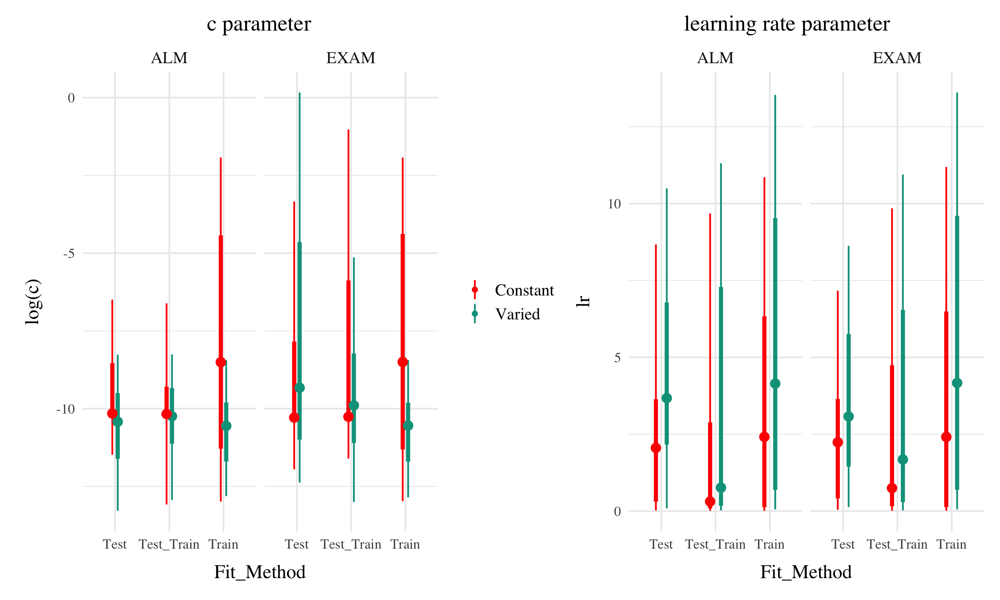

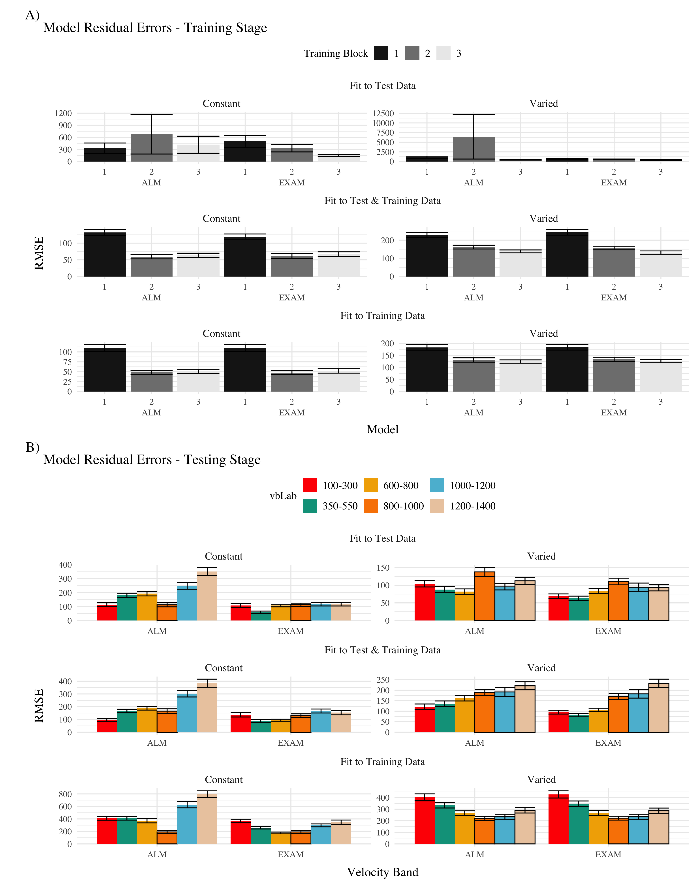

The posterior distributions of the $c$ and $lr$ parameters are shown <a href="#fig-htw-post-dist" class="quarto-xref">Figure 15</a>, and model predictions are shown alongside the empirical data in <a href="#fig-cm-vx-pat" class="quarto-xref">Figure 17</a>. There were substantial individual differences in the posteriors of both parameters, with the within-group individual differences generally swamped any between-group or between-model differences. The magnitude of these individual differences remains even if we consider only the single best parameter set for each subject.

We used the posterior distribution of $c$ and $lr$ parameters to generate a posterior predictive distribution of the observed data for each participant, which then allows us to compare the empirical data to the full range of predictions from each model. Aggregated residuals are displayed in <a href="#fig-htw-resid-pred" class="quarto-xref">Figure 16</a>. The pattern of training stage residual errors are unsurprising across the combinations of models and fitting method . Differences in training performance between ALM and EXAM are generally minor (the two models have identical learning mechanisms). The differences in the magnitude of residuals across the three fitting methods are also straightforward, with massive errors for the 'fit to Test Only' model, and the smallest errors for the 'fit to train only' models. It is also noteworthy that the residual errors are generally larger for the first block of training, which is likely due to the initial values of the ALM weights being unconstrained by whatever initial biases participants tend to bring to the task. Future work may explore the ability of the models to capture more fine grained aspects of the learning trajectories. However for the present purposes, our primary interest is in the ability of ALM and EXAM to account for the testing patterns while being constrained, or not constrained, by the training data. All subsequent analyses and discussion will thus focus on the testing stage.

The residuals of the model predictions for the testing stage (<a href="#fig-htw-resid-pred" class="quarto-xref">Figure 16</a>) also show an unsurprising pattern across fitting methods - with models fit only to the test data showing the best performance, followed by models fit to both training and test data, and with models fit only to the training data showing the worst performance (note that y axes are scaled different between plots). Although EXAM tends to perform better for both Constant and Varied participants (see also <a href="#fig-ee-e1" class="quarto-xref">Figure 18</a>), the relative advantage of EXAM is generally larger for the Constant group - a pattern consistent across all three fitting methods. The primary predictive difference between ALM and EXAM is made clear in <a href="#fig-cm-vx-pat" class="quarto-xref">Figure 17</a>, which directly compares the observed data against the posterior predictive distributions for both models. Regardless of how the models are fit, only EXAM can capture the pattern where participants are able to discriminate all 6 target bands.

-   \*\* does EXAM do better for the Constant group because the constant group performs better? Or does training with a single example encourage an exam sort of strategy?

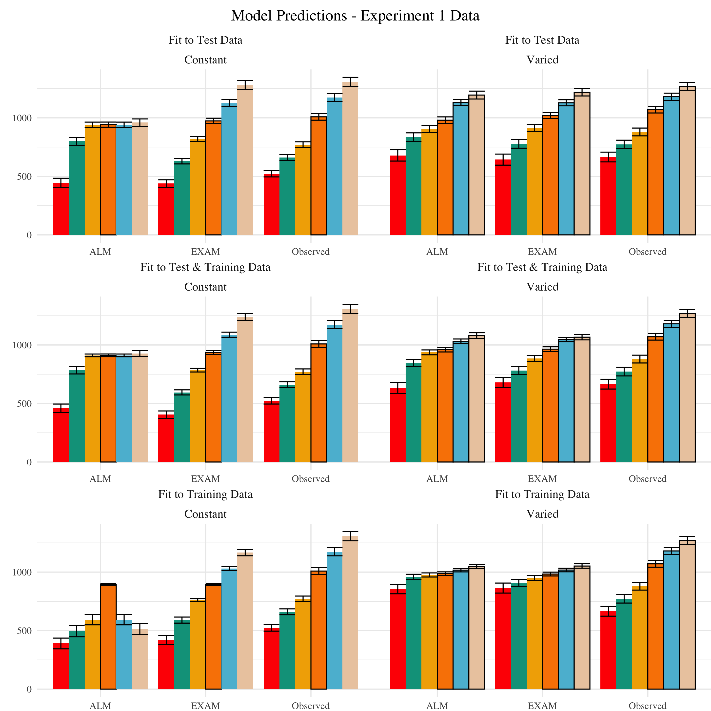

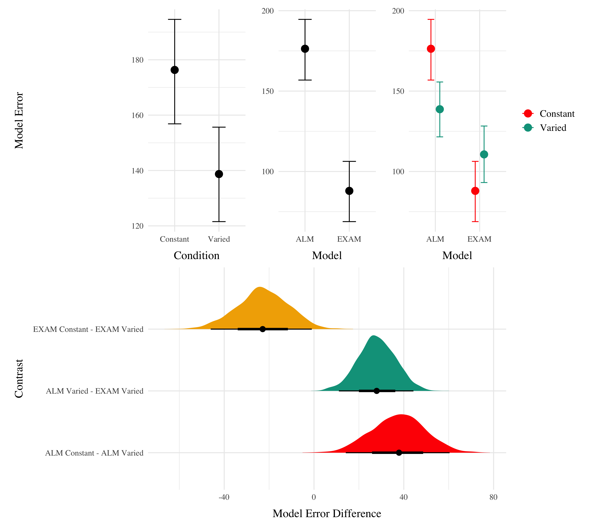

To quantitatively assess whether the differences in performance between models, we fit a bayesian regressions predicting the errors of the posterior predictions of each models as a function of the Model (ALM vs. EXAM) and training condition (Constant vs. Varied).

Model errors were significantly lower for EXAM ($\beta$ = -37.54, 95% CrI \[-60.4, -14.17\], pd = 99.85%) than ALM. There was also a significant interaction between Model and Condition ($\beta$ = 60.42, 95% CrI \[36.17, 83.85\], pd = 100%), indicating that the advantage of EXAM over ALM was significantly greater for the constant group. To assess whether EXAM predicts constant performance significantly better for Constant than for Varied subjects, we calculated the difference in model error between the Constant and Varied conditions specifically for EXAM. The results indicated that the model error for EXAM was significantly lower in the Constant condition compared to the Varied condition, with a mean difference of -22.879 (95% CrI \[-46.016, -0.968\], pd = 0.981).

<table class="gt_table" data-quarto-disable-processing="true" data-quarto-bootstrap="false">
  <thead>
    <tr class="gt_col_headings gt_spanner_row">
      <th class="gt_center gt_columns_top_border gt_column_spanner_outer" rowspan="1" colspan="1" scope="col" id></th>
      <th class="gt_center gt_columns_top_border gt_column_spanner_outer" rowspan="1" colspan="4" scope="colgroup" id="E2">
        E2
      </th>
      <th class="gt_center gt_columns_top_border gt_column_spanner_outer" rowspan="1" colspan="4" scope="colgroup" id="E3">
        E3
      </th>
    </tr>
    <tr class="gt_col_headings gt_spanner_row">
      <th class="gt_col_heading gt_columns_bottom_border gt_left" rowspan="2" colspan="1" scope="col" id="Task Stage">Task Stage</th>
      <th class="gt_center gt_columns_top_border gt_column_spanner_outer" rowspan="1" colspan="2" scope="colgroup" id="ALM">
        ALM
      </th>
      <th class="gt_center gt_columns_top_border gt_column_spanner_outer" rowspan="1" colspan="2" scope="colgroup" id="EXAM">
        EXAM
      </th>
      <th class="gt_center gt_columns_top_border gt_column_spanner_outer" rowspan="1" colspan="2" scope="colgroup" id="ALM">
        ALM
      </th>
      <th class="gt_center gt_columns_top_border gt_column_spanner_outer" rowspan="1" colspan="2" scope="colgroup" id="EXAM">
        EXAM
      </th>
    </tr>
    <tr class="gt_col_headings">
      <th class="gt_col_heading gt_columns_bottom_border gt_right" rowspan="1" colspan="1" scope="col" id="Constant">Constant</th>
      <th class="gt_col_heading gt_columns_bottom_border gt_right" rowspan="1" colspan="1" scope="col" id="Varied">Varied</th>
      <th class="gt_col_heading gt_columns_bottom_border gt_right" rowspan="1" colspan="1" scope="col" id="Constant">Constant</th>
      <th class="gt_col_heading gt_columns_bottom_border gt_right" rowspan="1" colspan="1" scope="col" id="Varied">Varied</th>
      <th class="gt_col_heading gt_columns_bottom_border gt_right" rowspan="1" colspan="1" scope="col" id="Constant">Constant</th>
      <th class="gt_col_heading gt_columns_bottom_border gt_right" rowspan="1" colspan="1" scope="col" id="Varied">Varied</th>
      <th class="gt_col_heading gt_columns_bottom_border gt_right" rowspan="1" colspan="1" scope="col" id="Constant">Constant</th>
      <th class="gt_col_heading gt_columns_bottom_border gt_right" rowspan="1" colspan="1" scope="col" id="Varied">Varied</th>
    </tr>
  </thead>
  <tbody class="gt_table_body">
    <tr class="gt_group_heading_row">
      <th colspan="9" class="gt_group_heading" scope="colgroup" id="Fit to Test Data">Fit to Test Data</th>
    </tr>
    <tr class="gt_row_group_first"><td headers="Fit to Test Data  Task Stage" class="gt_row gt_left" style="background-color: #FFFFFF; border-top-width: 1px; border-top-style: solid; border-top-color: black;">Test</td>
<td headers="Fit to Test Data  E2_ALM_Constant" class="gt_row gt_right" style="background-color: #FFFFFF; border-top-width: 1px; border-top-style: solid; border-top-color: black;">239.7</td>
<td headers="Fit to Test Data  E2_ALM_Varied" class="gt_row gt_right" style="background-color: #FFFFFF; border-top-width: 1px; border-top-style: solid; border-top-color: black;">129.8</td>
<td headers="Fit to Test Data  E2_EXAM_Constant" class="gt_row gt_right" style="background-color: #FFFFFF; border-top-width: 1px; border-top-style: solid; border-top-color: black;">99.7</td>
<td headers="Fit to Test Data  E2_EXAM_Varied" class="gt_row gt_right" style="background-color: #FFFFFF; border-top-width: 1px; border-top-style: solid; border-top-color: black;">88.2</td>
<td headers="Fit to Test Data  E3_ALM_Constant" class="gt_row gt_right" style="background-color: #FFFFFF; border-top-width: 1px; border-top-style: solid; border-top-color: black;">170.1</td>
<td headers="Fit to Test Data  E3_ALM_Varied" class="gt_row gt_right" style="background-color: #FFFFFF; border-top-width: 1px; border-top-style: solid; border-top-color: black;">106.1</td>
<td headers="Fit to Test Data  E3_EXAM_Constant" class="gt_row gt_right" style="background-color: #FFFFFF; border-top-width: 1px; border-top-style: solid; border-top-color: black;">92.3</td>
<td headers="Fit to Test Data  E3_EXAM_Varied" class="gt_row gt_right" style="background-color: #FFFFFF; border-top-width: 1px; border-top-style: solid; border-top-color: black;">72.8</td></tr>
    <tr><td headers="Fit to Test Data  Task Stage" class="gt_row gt_left" style="background-color: #FFFFFF; border-top-width: 1px; border-top-style: solid; border-top-color: black;">Train</td>
<td headers="Fit to Test Data  E2_ALM_Constant" class="gt_row gt_right" style="background-color: #FFFFFF; border-top-width: 1px; border-top-style: solid; border-top-color: black;">53.1</td>
<td headers="Fit to Test Data  E2_ALM_Varied" class="gt_row gt_right" style="background-color: #FFFFFF; border-top-width: 1px; border-top-style: solid; border-top-color: black;">527.1</td>
<td headers="Fit to Test Data  E2_EXAM_Constant" class="gt_row gt_right" style="background-color: #FFFFFF; border-top-width: 1px; border-top-style: solid; border-top-color: black;">108.1</td>
<td headers="Fit to Test Data  E2_EXAM_Varied" class="gt_row gt_right" style="background-color: #FFFFFF; border-top-width: 1px; border-top-style: solid; border-top-color: black;">169.3</td>
<td headers="Fit to Test Data  E3_ALM_Constant" class="gt_row gt_right" style="background-color: #FFFFFF; border-top-width: 1px; border-top-style: solid; border-top-color: black;">70.9</td>
<td headers="Fit to Test Data  E3_ALM_Varied" class="gt_row gt_right" style="background-color: #FFFFFF; border-top-width: 1px; border-top-style: solid; border-top-color: black;">543.5</td>
<td headers="Fit to Test Data  E3_EXAM_Constant" class="gt_row gt_right" style="background-color: #FFFFFF; border-top-width: 1px; border-top-style: solid; border-top-color: black;">157.8</td>
<td headers="Fit to Test Data  E3_EXAM_Varied" class="gt_row gt_right" style="background-color: #FFFFFF; border-top-width: 1px; border-top-style: solid; border-top-color: black;">212.7</td></tr>
    <tr class="gt_group_heading_row">
      <th colspan="9" class="gt_group_heading" scope="colgroup" id="Fit to Test &amp;amp; Training Data">Fit to Test &amp; Training Data</th>
    </tr>
    <tr class="gt_row_group_first"><td headers="Fit to Test & Training Data  Task Stage" class="gt_row gt_left" style="background-color: #FFFFFF; border-top-width: 1px; border-top-style: solid; border-top-color: black;">Test</td>
<td headers="Fit to Test & Training Data  E2_ALM_Constant" class="gt_row gt_right" style="background-color: #FFFFFF; border-top-width: 1px; border-top-style: solid; border-top-color: black;">266.0</td>
<td headers="Fit to Test & Training Data  E2_ALM_Varied" class="gt_row gt_right" style="background-color: #FFFFFF; border-top-width: 1px; border-top-style: solid; border-top-color: black;">208.2</td>
<td headers="Fit to Test & Training Data  E2_EXAM_Constant" class="gt_row gt_right" style="background-color: #FFFFFF; border-top-width: 1px; border-top-style: solid; border-top-color: black;">125.1</td>
<td headers="Fit to Test & Training Data  E2_EXAM_Varied" class="gt_row gt_right" style="background-color: #FFFFFF; border-top-width: 1px; border-top-style: solid; border-top-color: black;">126.4</td>
<td headers="Fit to Test & Training Data  E3_ALM_Constant" class="gt_row gt_right" style="background-color: #FFFFFF; border-top-width: 1px; border-top-style: solid; border-top-color: black;">197.7</td>
<td headers="Fit to Test & Training Data  E3_ALM_Varied" class="gt_row gt_right" style="background-color: #FFFFFF; border-top-width: 1px; border-top-style: solid; border-top-color: black;">189.5</td>
<td headers="Fit to Test & Training Data  E3_EXAM_Constant" class="gt_row gt_right" style="background-color: #FFFFFF; border-top-width: 1px; border-top-style: solid; border-top-color: black;">130.0</td>
<td headers="Fit to Test & Training Data  E3_EXAM_Varied" class="gt_row gt_right" style="background-color: #FFFFFF; border-top-width: 1px; border-top-style: solid; border-top-color: black;">128.5</td></tr>
    <tr><td headers="Fit to Test & Training Data  Task Stage" class="gt_row gt_left" style="background-color: #FFFFFF; border-top-width: 1px; border-top-style: solid; border-top-color: black;">Train</td>
<td headers="Fit to Test & Training Data  E2_ALM_Constant" class="gt_row gt_right" style="background-color: #FFFFFF; border-top-width: 1px; border-top-style: solid; border-top-color: black;">40.0</td>
<td headers="Fit to Test & Training Data  E2_ALM_Varied" class="gt_row gt_right" style="background-color: #FFFFFF; border-top-width: 1px; border-top-style: solid; border-top-color: black;">35.4</td>
<td headers="Fit to Test & Training Data  E2_EXAM_Constant" class="gt_row gt_right" style="background-color: #FFFFFF; border-top-width: 1px; border-top-style: solid; border-top-color: black;">30.4</td>
<td headers="Fit to Test & Training Data  E2_EXAM_Varied" class="gt_row gt_right" style="background-color: #FFFFFF; border-top-width: 1px; border-top-style: solid; border-top-color: black;">23.6</td>
<td headers="Fit to Test & Training Data  E3_ALM_Constant" class="gt_row gt_right" style="background-color: #FFFFFF; border-top-width: 1px; border-top-style: solid; border-top-color: black;">49.1</td>
<td headers="Fit to Test & Training Data  E3_ALM_Varied" class="gt_row gt_right" style="background-color: #FFFFFF; border-top-width: 1px; border-top-style: solid; border-top-color: black;">85.6</td>
<td headers="Fit to Test & Training Data  E3_EXAM_Constant" class="gt_row gt_right" style="background-color: #FFFFFF; border-top-width: 1px; border-top-style: solid; border-top-color: black;">49.2</td>
<td headers="Fit to Test & Training Data  E3_EXAM_Varied" class="gt_row gt_right" style="background-color: #FFFFFF; border-top-width: 1px; border-top-style: solid; border-top-color: black;">78.4</td></tr>
    <tr class="gt_group_heading_row">
      <th colspan="9" class="gt_group_heading" scope="colgroup" id="Fit to Training Data">Fit to Training Data</th>
    </tr>
    <tr class="gt_row_group_first"><td headers="Fit to Training Data  Task Stage" class="gt_row gt_left" style="background-color: #FFFFFF; border-top-width: 1px; border-top-style: solid; border-top-color: black;">Test</td>
<td headers="Fit to Training Data  E2_ALM_Constant" class="gt_row gt_right" style="background-color: #FFFFFF; border-top-width: 1px; border-top-style: solid; border-top-color: black;">357.4</td>
<td headers="Fit to Training Data  E2_ALM_Varied" class="gt_row gt_right" style="background-color: #FFFFFF; border-top-width: 1px; border-top-style: solid; border-top-color: black;">295.9</td>
<td headers="Fit to Training Data  E2_EXAM_Constant" class="gt_row gt_right" style="background-color: #FFFFFF; border-top-width: 1px; border-top-style: solid; border-top-color: black;">305.1</td>
<td headers="Fit to Training Data  E2_EXAM_Varied" class="gt_row gt_right" style="background-color: #FFFFFF; border-top-width: 1px; border-top-style: solid; border-top-color: black;">234.5</td>
<td headers="Fit to Training Data  E3_ALM_Constant" class="gt_row gt_right" style="background-color: #FFFFFF; border-top-width: 1px; border-top-style: solid; border-top-color: black;">415.0</td>
<td headers="Fit to Training Data  E3_ALM_Varied" class="gt_row gt_right" style="background-color: #FFFFFF; border-top-width: 1px; border-top-style: solid; border-top-color: black;">298.8</td>
<td headers="Fit to Training Data  E3_EXAM_Constant" class="gt_row gt_right" style="background-color: #FFFFFF; border-top-width: 1px; border-top-style: solid; border-top-color: black;">295.5</td>
<td headers="Fit to Training Data  E3_EXAM_Varied" class="gt_row gt_right" style="background-color: #FFFFFF; border-top-width: 1px; border-top-style: solid; border-top-color: black;">243.7</td></tr>
    <tr><td headers="Fit to Training Data  Task Stage" class="gt_row gt_left" style="background-color: #FFFFFF; border-top-width: 1px; border-top-style: solid; border-top-color: black;">Train</td>
<td headers="Fit to Training Data  E2_ALM_Constant" class="gt_row gt_right" style="background-color: #FFFFFF; border-top-width: 1px; border-top-style: solid; border-top-color: black;">42.5</td>
<td headers="Fit to Training Data  E2_ALM_Varied" class="gt_row gt_right" style="background-color: #FFFFFF; border-top-width: 1px; border-top-style: solid; border-top-color: black;">23.0</td>
<td headers="Fit to Training Data  E2_EXAM_Constant" class="gt_row gt_right" style="background-color: #FFFFFF; border-top-width: 1px; border-top-style: solid; border-top-color: black;">43.2</td>
<td headers="Fit to Training Data  E2_EXAM_Varied" class="gt_row gt_right" style="background-color: #FFFFFF; border-top-width: 1px; border-top-style: solid; border-top-color: black;">22.6</td>
<td headers="Fit to Training Data  E3_ALM_Constant" class="gt_row gt_right" style="background-color: #FFFFFF; border-top-width: 1px; border-top-style: solid; border-top-color: black;">51.4</td>
<td headers="Fit to Training Data  E3_ALM_Varied" class="gt_row gt_right" style="background-color: #FFFFFF; border-top-width: 1px; border-top-style: solid; border-top-color: black;">63.8</td>
<td headers="Fit to Training Data  E3_EXAM_Constant" class="gt_row gt_right" style="background-color: #FFFFFF; border-top-width: 1px; border-top-style: solid; border-top-color: black;">51.8</td>
<td headers="Fit to Training Data  E3_EXAM_Varied" class="gt_row gt_right" style="background-color: #FFFFFF; border-top-width: 1px; border-top-style: solid; border-top-color: black;">65.3</td></tr>
  </tbody>
  
  
</table>

Table 12: Models errors predicting empirical data - aggregated over all participants, posterior parameter values, and velocity bands. Note that Fit Method refers to the subset of the data that the model was trained on, while Task Stage refers to the subset of the data that the model was evaluated on.

<table class="gt_table" data-quarto-disable-processing="true" data-quarto-bootstrap="false">
  <thead>
    <tr class="gt_col_headings gt_spanner_row">
      <th class="gt_col_heading gt_columns_bottom_border gt_left" rowspan="2" colspan="1" scope="col" id="Experiment">Experiment</th>
      <th class="gt_col_heading gt_columns_bottom_border gt_left" rowspan="2" colspan="1" scope="col" id="Term">Term</th>
      <th class="gt_col_heading gt_columns_bottom_border gt_right" rowspan="2" colspan="1" scope="col" id="Estimate">Estimate</th>
      <th class="gt_center gt_columns_top_border gt_column_spanner_outer" rowspan="1" colspan="2" scope="colgroup" id="Credible Interval">
        Credible Interval
      </th>
      <th class="gt_col_heading gt_columns_bottom_border gt_right" rowspan="2" colspan="1" scope="col" id="pd">pd</th>
    </tr>
    <tr class="gt_col_headings">
      <th class="gt_col_heading gt_columns_bottom_border gt_right" rowspan="1" colspan="1" scope="col" id="95% CrI Lower">95% CrI Lower</th>
      <th class="gt_col_heading gt_columns_bottom_border gt_right" rowspan="1" colspan="1" scope="col" id="95% CrI Upper">95% CrI Upper</th>
    </tr>
  </thead>
  <tbody class="gt_table_body">
    <tr class="gt_group_heading_row">
      <th colspan="6" class="gt_group_heading" scope="colgroup" id="Experiment 1">Experiment 1</th>
    </tr>
    <tr class="gt_row_group_first"><td headers="Experiment 1  exp" class="gt_row gt_left">Exp 1</td>
<td headers="Experiment 1  Term" class="gt_row gt_left">Intercept</td>
<td headers="Experiment 1  Estimate" class="gt_row gt_right">176.30</td>
<td headers="Experiment 1  95% CrI Lower" class="gt_row gt_right">156.86</td>
<td headers="Experiment 1  95% CrI Upper" class="gt_row gt_right">194.59</td>
<td headers="Experiment 1  pd" class="gt_row gt_right">1.00</td></tr>
    <tr><td headers="Experiment 1  exp" class="gt_row gt_left">Exp 1</td>
<td headers="Experiment 1  Term" class="gt_row gt_left">ModelEXAM</td>
<td headers="Experiment 1  Estimate" class="gt_row gt_right">−88.44</td>
<td headers="Experiment 1  95% CrI Lower" class="gt_row gt_right">−104.51</td>
<td headers="Experiment 1  95% CrI Upper" class="gt_row gt_right">−71.81</td>
<td headers="Experiment 1  pd" class="gt_row gt_right">1.00</td></tr>
    <tr><td headers="Experiment 1  exp" class="gt_row gt_left">Exp 1</td>
<td headers="Experiment 1  Term" class="gt_row gt_left">conditVaried</td>
<td headers="Experiment 1  Estimate" class="gt_row gt_right">−37.54</td>
<td headers="Experiment 1  95% CrI Lower" class="gt_row gt_right">−60.40</td>
<td headers="Experiment 1  95% CrI Upper" class="gt_row gt_right">−14.17</td>
<td headers="Experiment 1  pd" class="gt_row gt_right">1.00</td></tr>
    <tr><td headers="Experiment 1  exp" class="gt_row gt_left">Exp 1</td>
<td headers="Experiment 1  Term" class="gt_row gt_left">ModelEXAM:conditVaried</td>
<td headers="Experiment 1  Estimate" class="gt_row gt_right" style="font-weight: bold; background-color: #FFFFFF; border-top-width: 1px; border-top-style: solid; border-top-color: black;">60.42</td>
<td headers="Experiment 1  95% CrI Lower" class="gt_row gt_right">36.17</td>
<td headers="Experiment 1  95% CrI Upper" class="gt_row gt_right">83.85</td>
<td headers="Experiment 1  pd" class="gt_row gt_right" style="font-weight: bold; background-color: #FFFFFF; border-top-width: 1px; border-top-style: solid; border-top-color: black;">1.00</td></tr>
    <tr class="gt_group_heading_row">
      <th colspan="6" class="gt_group_heading" scope="colgroup" id="Experiment 2">Experiment 2</th>
    </tr>
    <tr class="gt_row_group_first"><td headers="Experiment 2  exp" class="gt_row gt_left">Exp 2</td>
<td headers="Experiment 2  Term" class="gt_row gt_left">Intercept</td>
<td headers="Experiment 2  Estimate" class="gt_row gt_right">245.87</td>
<td headers="Experiment 2  95% CrI Lower" class="gt_row gt_right">226.18</td>
<td headers="Experiment 2  95% CrI Upper" class="gt_row gt_right">264.52</td>
<td headers="Experiment 2  pd" class="gt_row gt_right">1.00</td></tr>
    <tr><td headers="Experiment 2  exp" class="gt_row gt_left">Exp 2</td>
<td headers="Experiment 2  Term" class="gt_row gt_left">ModelEXAM</td>
<td headers="Experiment 2  Estimate" class="gt_row gt_right">−137.73</td>
<td headers="Experiment 2  95% CrI Lower" class="gt_row gt_right">−160.20</td>
<td headers="Experiment 2  95% CrI Upper" class="gt_row gt_right">−115.48</td>
<td headers="Experiment 2  pd" class="gt_row gt_right">1.00</td></tr>
    <tr><td headers="Experiment 2  exp" class="gt_row gt_left">Exp 2</td>
<td headers="Experiment 2  Term" class="gt_row gt_left">conditVaried</td>
<td headers="Experiment 2  Estimate" class="gt_row gt_right">−86.39</td>
<td headers="Experiment 2  95% CrI Lower" class="gt_row gt_right">−113.52</td>
<td headers="Experiment 2  95% CrI Upper" class="gt_row gt_right">−59.31</td>
<td headers="Experiment 2  pd" class="gt_row gt_right">1.00</td></tr>
    <tr><td headers="Experiment 2  exp" class="gt_row gt_left">Exp 2</td>
<td headers="Experiment 2  Term" class="gt_row gt_left">ModelEXAM:conditVaried</td>
<td headers="Experiment 2  Estimate" class="gt_row gt_right" style="font-weight: bold; background-color: #FFFFFF; border-top-width: 1px; border-top-style: solid; border-top-color: black;">56.87</td>
<td headers="Experiment 2  95% CrI Lower" class="gt_row gt_right">25.26</td>
<td headers="Experiment 2  95% CrI Upper" class="gt_row gt_right">88.04</td>
<td headers="Experiment 2  pd" class="gt_row gt_right" style="font-weight: bold; background-color: #FFFFFF; border-top-width: 1px; border-top-style: solid; border-top-color: black;">1.00</td></tr>
    <tr class="gt_group_heading_row">
      <th colspan="6" class="gt_group_heading" scope="colgroup" id="Experiment 3">Experiment 3</th>
    </tr>
    <tr class="gt_row_group_first"><td headers="Experiment 3  exp" class="gt_row gt_left">Exp 3</td>
<td headers="Experiment 3  Term" class="gt_row gt_left">Intercept</td>
<td headers="Experiment 3  Estimate" class="gt_row gt_right">164.83</td>
<td headers="Experiment 3  95% CrI Lower" class="gt_row gt_right">140.05</td>
<td headers="Experiment 3  95% CrI Upper" class="gt_row gt_right">189.44</td>
<td headers="Experiment 3  pd" class="gt_row gt_right">1.00</td></tr>
    <tr><td headers="Experiment 3  exp" class="gt_row gt_left">Exp 3</td>
<td headers="Experiment 3  Term" class="gt_row gt_left">ModelEXAM</td>
<td headers="Experiment 3  Estimate" class="gt_row gt_right">−65.66</td>
<td headers="Experiment 3  95% CrI Lower" class="gt_row gt_right">−85.97</td>
<td headers="Experiment 3  95% CrI Upper" class="gt_row gt_right">−46.02</td>
<td headers="Experiment 3  pd" class="gt_row gt_right">1.00</td></tr>
    <tr><td headers="Experiment 3  exp" class="gt_row gt_left">Exp 3</td>
<td headers="Experiment 3  Term" class="gt_row gt_left">conditVaried</td>
<td headers="Experiment 3  Estimate" class="gt_row gt_right">−40.61</td>
<td headers="Experiment 3  95% CrI Lower" class="gt_row gt_right">−75.90</td>
<td headers="Experiment 3  95% CrI Upper" class="gt_row gt_right">−3.02</td>
<td headers="Experiment 3  pd" class="gt_row gt_right">0.98</td></tr>
    <tr><td headers="Experiment 3  exp" class="gt_row gt_left">Exp 3</td>
<td headers="Experiment 3  Term" class="gt_row gt_left">bandOrderReverse</td>
<td headers="Experiment 3  Estimate" class="gt_row gt_right">25.47</td>
<td headers="Experiment 3  95% CrI Lower" class="gt_row gt_right">−9.34</td>
<td headers="Experiment 3  95% CrI Upper" class="gt_row gt_right">58.68</td>
<td headers="Experiment 3  pd" class="gt_row gt_right">0.93</td></tr>
    <tr><td headers="Experiment 3  exp" class="gt_row gt_left">Exp 3</td>
<td headers="Experiment 3  Term" class="gt_row gt_left">ModelEXAM:conditVaried</td>
<td headers="Experiment 3  Estimate" class="gt_row gt_right" style="font-weight: bold; background-color: #FFFFFF; border-top-width: 1px; border-top-style: solid; border-top-color: black;">41.90</td>
<td headers="Experiment 3  95% CrI Lower" class="gt_row gt_right">11.20</td>
<td headers="Experiment 3  95% CrI Upper" class="gt_row gt_right">72.54</td>
<td headers="Experiment 3  pd" class="gt_row gt_right" style="font-weight: bold; background-color: #FFFFFF; border-top-width: 1px; border-top-style: solid; border-top-color: black;">0.99</td></tr>
    <tr><td headers="Experiment 3  exp" class="gt_row gt_left">Exp 3</td>
<td headers="Experiment 3  Term" class="gt_row gt_left">ModelEXAM:bandOrderReverse</td>
<td headers="Experiment 3  Estimate" class="gt_row gt_right">−7.32</td>
<td headers="Experiment 3  95% CrI Lower" class="gt_row gt_right">−34.53</td>
<td headers="Experiment 3  95% CrI Upper" class="gt_row gt_right">21.05</td>
<td headers="Experiment 3  pd" class="gt_row gt_right">0.70</td></tr>
    <tr><td headers="Experiment 3  exp" class="gt_row gt_left">Exp 3</td>
<td headers="Experiment 3  Term" class="gt_row gt_left">conditVaried:bandOrderReverse</td>
<td headers="Experiment 3  Estimate" class="gt_row gt_right">30.82</td>
<td headers="Experiment 3  95% CrI Lower" class="gt_row gt_right">−19.57</td>
<td headers="Experiment 3  95% CrI Upper" class="gt_row gt_right">83.56</td>
<td headers="Experiment 3  pd" class="gt_row gt_right">0.88</td></tr>
    <tr><td headers="Experiment 3  exp" class="gt_row gt_left">Exp 3</td>
<td headers="Experiment 3  Term" class="gt_row gt_left">ModelEXAM:conditVaried:bandOrderReverse</td>
<td headers="Experiment 3  Estimate" class="gt_row gt_right">−60.60</td>
<td headers="Experiment 3  95% CrI Lower" class="gt_row gt_right">−101.80</td>
<td headers="Experiment 3  95% CrI Upper" class="gt_row gt_right">−18.66</td>
<td headers="Experiment 3  pd" class="gt_row gt_right">1.00</td></tr>
  </tbody>
  
  
</table>

Table 13: Results of Bayesian Regression models predicting model error as a function of Model (ALM vs. EXAM), Condition (Constant vs. Varied), and the interaction between Model and Condition. The values represent the estimate coefficient for each term, with 95% credible intervals in brackets. The intercept reflects the baseline of ALM and Constant. The other estimates indicate deviations from the baseline for the EXAM mode and varied condition. Lower values indicate better model fit.

*Model Fits to Experiment 2 and 3.* The model fitting results for Experiments 2 and 3 closely mirrored those observed in Experiment 1. The Bayesian regression models predicting model error as a function of Model (ALM vs. EXAM), Condition (Constant vs. Varied), and their interaction (see <a href="#tbl-htw-ee-e23" class="quarto-xref">Table 13</a>) revealed a consistent main effect of Model across all three experiments. The negative coefficients for the ModelEXAM term (Exp 2: $\beta$ = -86.39, 95% CrI -113.52, -59.31, pd = 100%; Exp 3: $\beta$ = -40.61, 95% CrI -75.9, -3.02, pd = 98.17%) indicate that EXAM outperformed ALM in both experiments. Furthermore, the interaction between Model and Condition was significant in both Experiment 2 ($\beta$ = 56.87, 95% CrI 25.26, 88.04, pd = 99.98%) and Experiment 3 ($\beta$ = 41.9, 95% CrI 11.2, 72.54, pd = 99.35%), suggesting that the superiority of EXAM over ALM was more pronounced for the Constant group compared to the Varied group, as was the case in Experiment 1. One notable difference in Experiment 3 was the inclusion of the bandOrder term and its interactions, which accounted for the effect of the order in which the velocity bands were presented during training and testing. Despite this additional factor, the overall pattern of results remained consistent with the previous experiments, providing strong support for the robustness of EXAM's performance, particularly in the Constant condition, across all three studies.

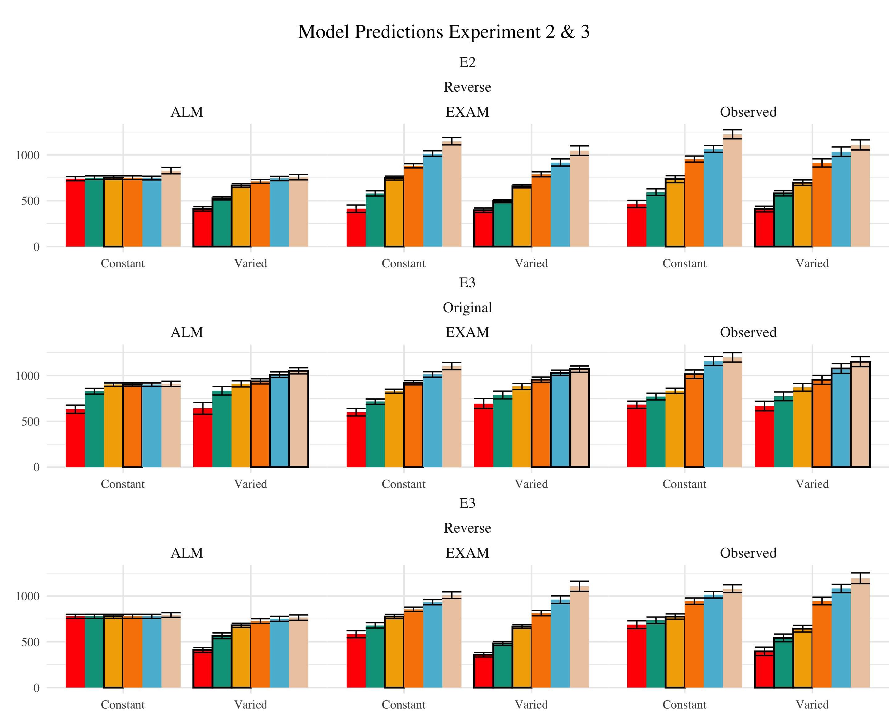

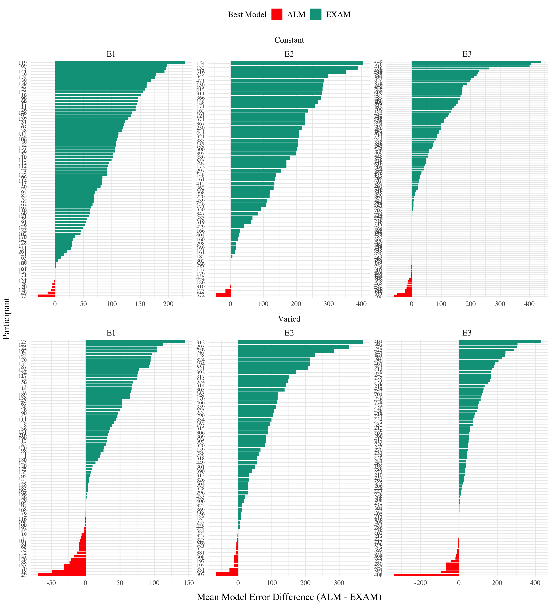

### Accounting for individual patterns

To more accurately assess the relative abilities of ALM and EXAM to capture important empirical patterns - we will now examine the predictions of both models for the subset of individual participants shown in <a href="#fig-htw-indv-pred" class="quarto-xref">Figure 22</a>. Panel A presents three varied and constant participants who demonstrated a reasonable degree of discrimination between the 6 velocity bands during testing.

-   \*\* comment on the different ways ALM can completely fail to mimic discrimination patterns (sbj. 35; sbj. 137),and on how it can sometimes partially succeed (sbj. 11; 14,74)

-   \*\* comment on how EXAM can somtimes mimic non-monotonic spacing between bands due to associative stregth from training (i.e. subject 47)

-   \*\* compare c values to slope parameters from the statistical models earlier in paper

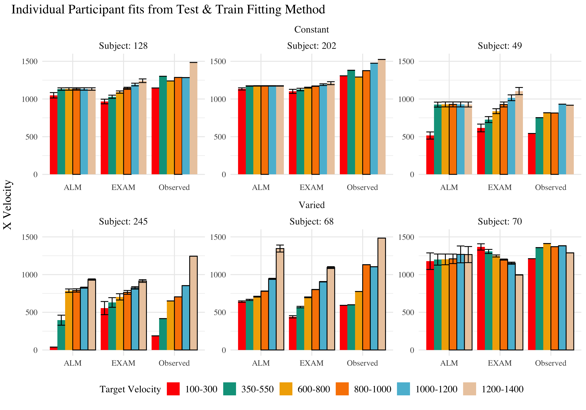

# References

Bengtsson, H. (2021). A Unifying Framework for Parallel and Distributed Processing in R using Futures. *The R Journal*, *13*(2), 208. <https://doi.org/10.32614/RJ-2021-048>

Berniker, M., Mirzaei, H., & Kording, K. P. (2014). The effects of training breadth on motor generalization. *Journal of Neurophysiology*, *112*(11), 2791--2798. <https://doi.org/10.1152/jn.00615.2013>

Bott, L., & Heit, E. (2004). Nonmonotonic Extrapolation in Function Learning. *Journal of Experimental Psychology: Learning, Memory, and Cognition*, *30*(1), 38--50. <https://doi.org/10.1037/0278-7393.30.1.38>

Braithwaite, D. W., & Goldstone, R. L. (2015). Effects of Variation and Prior Knowledge on Abstract Concept Learning. *Cognition and Instruction*, *33*(3), 226--256. <https://doi.org/10.1080/07370008.2015.1067215>

Braun, D. A., Aertsen, A., Wolpert, D. M., & Mehring, C. (2009). Motor Task Variation Induces Structural Learning. *Current Biology*, *19*(4), 352--357. <https://doi.org/10.1016/j.cub.2009.01.036>

Brehmer, B. (1974). Hypotheses about relations between scaled variables in the learning of probabilistic inference tasks. *Organizational Behavior and Human Performance*, *11*(1), 1--27. <https://doi.org/10.1016/0030-5073(74)90002-6>

Brekelmans, G., Lavan, N., Saito, H., Clayards, M., & Wonnacott, E. (2022). Does high variability training improve the learning of non-native phoneme contrasts over low variability training? A replication. *Journal of Memory and Language*, *126*, 104352. <https://doi.org/10.1016/j.jml.2022.104352>

Brown, M. A., & Lacroix, G. (2017). Underestimation in linear function learning: Anchoring to zero or x-y similarity? *Canadian Journal of Experimental Psychology/Revue Canadienne de Psychologie Expérimentale*, *71*(4), 274--282. <https://doi.org/10.1037/cep0000129>

Bürkner, P.-C. (2017). Brms: An R Package for Bayesian Multilevel Models Using Stan. *Journal of Statistical Software*, *80*, 1--28. <https://doi.org/10.18637/jss.v080.i01>

Carroll, J. D. (1963). Functional Learning: The Learning of Continuous Functional Mappings Relating Stimulus and Response Continua. *ETS Research Bulletin Series*, *1963*(2), i--144. <https://doi.org/10.1002/j.2333-8504.1963.tb00958.x>

Catalano, J. F., & Kleiner, B. M. (1984). Distant Transfer in Coincident Timing as a Function of Variability of Practice. *Perceptual and Motor Skills*, *58*(3), 851--856. <https://doi.org/10.2466/pms.1984.58.3.851>

Ciccione, L., & Dehaene, S. (2021). Can humans perform mental regression on a graph? Accuracy and bias in the perception of scatterplots. *Cognitive Psychology*, *128*, 101406. <https://doi.org/10.1016/j.cogpsych.2021.101406>

Cohen, A. L., Nosofsky, R. M., & Zaki, S. R. (2001). Category variability, exemplar similarity, and perceptual classification. *Memory & Cognition*, *29*(8), 1165--1175. <https://doi.org/10.3758/BF03206386>

Courrieu, P. (2012). Quick approximation of bivariate functions. *British Journal of Mathematical and Statistical Psychology*, *65*(1), 89--121. <https://doi.org/10.1111/j.2044-8317.2011.02016.x>

Cranmer, K., Brehmer, J., & Louppe, G. (2020). The frontier of simulation-based inference. *Proceedings of the National Academy of Sciences*, *117*(48), 30055--30062. <https://doi.org/10.1073/pnas.1912789117>

DeLosh, E. L., McDaniel, M. A., & Busemeyer, J. R. (1997). Extrapolation: The Sine Qua Non for Abstraction in Function Learning. *Journal of Experimental Psychology: Learning, Memory, and Cognition*, *23*(4), 19. <https://doi.org/10.1037/0278-7393.23.4.968>

Farrell, S., & Lewandowsky, S. (2018). *Computational Modeling of Cognition and Behavior:* (1st ed.). Cambridge University Press. <https://doi.org/10.1017/CBO9781316272503>

Guo, J.-P., Yang, L.-Y., & Ding, Y. (2014). Effects of example variability and prior knowledge in how students learn to solve equations. *European Journal of Psychology of Education*, *29*(1), 21--42. <https://www.jstor.org/stable/43551124>

Hu, M., & Nosofsky, R. M. (2024). High-variability training does not enhance generalization in the prototype-distortion paradigm. *Memory & Cognition*, 1--16. <https://doi.org/10.3758/s13421-023-01516-1>

Kalish, M. L., Lewandowsky, S., & Kruschke, J. K. (2004). Population of Linear Experts: Knowledge Partitioning and Function Learning. *Psychological Review*, *111*(4), 1072--1099. <https://doi.org/10.1037/0033-295X.111.4.1072>

Kangasrääsiö, A., Jokinen, J. P. P., Oulasvirta, A., Howes, A., & Kaski, S. (2019). Parameter Inference for Computational Cognitive Models with Approximate Bayesian Computation. *Cognitive Science*, *43*(6), e12738. <https://doi.org/10.1111/cogs.12738>

Koh, K., & Meyer, D. E. (1991). Function learning: Induction of continuous stimulus-response relations. *Journal of Experimental Psychology: Learning, Memory, and Cognition*, *17*(5), 811. <https://doi.org/10.1037/0278-7393.17.5.811>

Kruschke, J. K. (1992). ALCOVE: An exemplar-based connectionist model of Category Learning. *Psychological Review*, *99*(1). <https://doi.org/10.1037/0033-295X.99.1.22>

Makowski, D., Ben-Shachar, M. S., & Lüdecke, D. (2019). bayestestR: Describing Effects and their Uncertainty, Existence and Significance within the Bayesian Framework. *Journal of Open Source Software*, *4*(40), 1541. <https://doi.org/10.21105/joss.01541>

Mcdaniel, M. A., Dimperio, E., Griego, J. A., & Busemeyer, J. R. (2009). Predicting transfer performance: A comparison of competing function learning models. *Journal of Experimental Psychology. Learning, Memory, and Cognition*, *35*, 173--195. <https://doi.org/10.1037/a0013982>

McDaniel, M. A., Fadler, C. L., & Pashler, H. (2013). Effects of spaced versus massed training in function learning. *Journal of Experimental Psychology: Learning, Memory, and Cognition*, *39*(5), 1417--1432. <https://doi.org/10.1037/a0032184>

Page, M. (2000). Connectionist modelling in psychology: A localist manifesto. *Behavioral and Brain Sciences*, *23*(4), 443--467. <https://doi.org/10.1017/S0140525X00003356>

Perry, L. K., Samuelson, L. K., Malloy, L. M., & Schiffer, R. N. (2010). Learn Locally, Think Globally: Exemplar Variability Supports Higher-Order Generalization and Word Learning. *Psychological Science*, *21*(12), 1894--1902. <https://doi.org/10.1177/0956797610389189>

Posner, M. I., & Keele, S. W. (1968). On the genesis of abstract ideas. *Journal of Experimental Psychology*, *77*(3), 353--363. <https://doi.org/10.1037/h0025953>

Raviv, L., Lupyan, G., & Green, S. C. (2022). How variability shapes learning and generalization. *Trends in Cognitive Sciences*, S1364661322000651. <https://doi.org/10.1016/j.tics.2022.03.007>

Roller, C. A., Cohen, H. S., Kimball, K. T., & Bloomberg, J. J. (2001). Variable practice with lenses improves visuo-motor plasticity. *Cognitive Brain Research*, *12*(2), 341--352. <https://doi.org/10.1016/S0926-6410(01)00077-5>

Said, N., & Fischer, H. (2021). Extrapolation accuracy underestimates rule learning: Evidence from the function-learning paradigm. *Acta Psychologica*, *218*, 103356. <https://doi.org/10.1016/j.actpsy.2021.103356>

Schmidt, R. A. (1975). A schema theory of discrete motor skill learning. *Psychological Review*, *82*(4), 225--260. <https://doi.org/10.1037/h0076770>

Schulz, E., Quiroga, F., & Gershman, S. J. (2020). Communicating Compositional Patterns. *Open Mind*, *4*, 25--39. <https://doi.org/10.1162/opmi_a_00032>

Team, R. C. (2020). *R: A Language and Environment for Statistical Computing*. R: A Language and Environment for Statistical Computing.

Turner, B. M., Sederberg, P. B., & McClelland, J. L. (2016). Bayesian analysis of simulation-based models. *Journal of Mathematical Psychology*, *72*, 191--199. <https://doi.org/10.1016/j.jmp.2014.10.001>

Turner, B. M., & Van Zandt, T. (2012). A tutorial on approximate Bayesian computation. *Journal of Mathematical Psychology*, *56*(2), 69--85. <https://doi.org/10.1016/j.jmp.2012.02.005>

van Dam, L. C. J., & Ernst, M. O. (2015). Mapping Shape to Visuomotor Mapping: Learning and Generalisation of Sensorimotor Behaviour Based on Contextual Information. *PLOS Computational Biology*, *11*(3), e1004172. <https://doi.org/10.1371/journal.pcbi.1004172>

Van Rossum, J. H. A. (1990). Schmidt's schema theory: The empirical base of the variability of practice hypothesis. *Human Movement Science*, *9*(3-5), 387--435. <https://doi.org/10.1016/0167-9457(90)90010-B>
