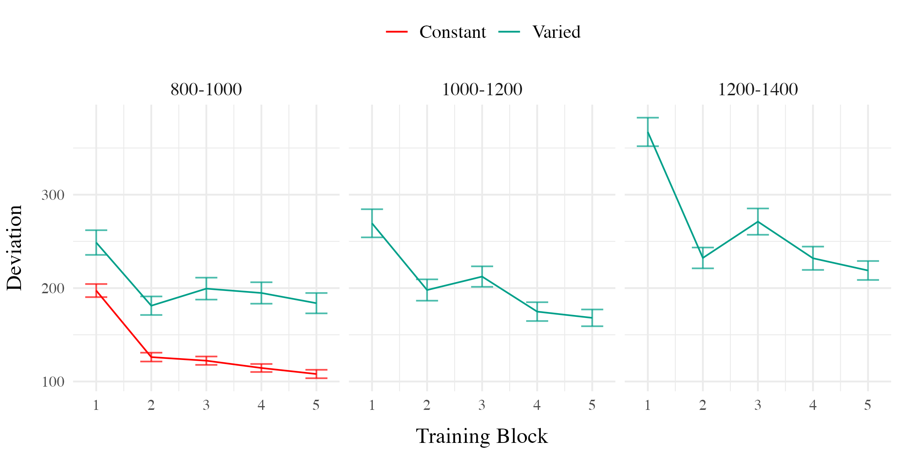
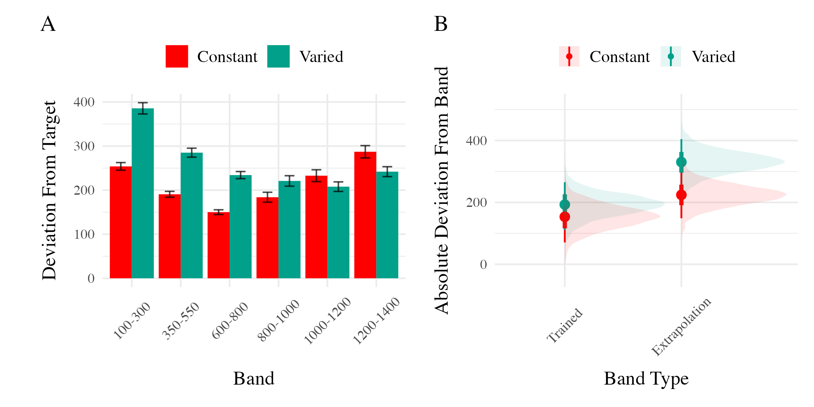
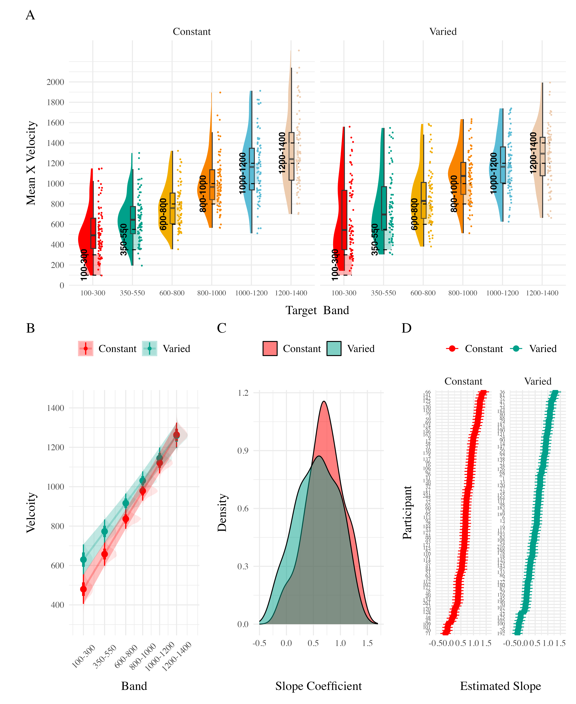

# HTW E1
Thomas Gorman

### Analyses Strategy

All data processing and statistical analyses were performed in R version
4.32 Team (2020). To assess differences between groups, we used Bayesian
Mixed Effects Regression. Model fitting was performed with the brms
package in R Bürkner (2017), and descriptive stats and tables were
extracted with the BayestestR package Makowski et al. (2019). Mixed
effects regression enables us to take advantage of partial pooling,
simultaneously estimating parameters at the individual and group level.
Our use of Bayesian, rather than frequentist methods allows us to
directly quantify the uncertainty in our parameter estimates, as well as
avoiding convergence issues common to the frequentist analogues of our
mixed models.

Each model was set to run with 4 chains, 5000 iterations per chain, with
the first 2500 discarded as warmup chains. Rhat values were within an
acceptable range, with values \<=1.02 (see appendix for diagnostic
plots). We used uninformative priors for the fixed effects of the model
(condition and velocity band), and weakly informative Student T
distributions for for the random effects. For each model, we report 1)
the mean values of the posterior distribution for the parameters of
interest, 2) the lower and upper credible intervals (CrI), and the
probability of direction value (pd).

| Group Comparison         | Code                                                  | Data                 |
|--------------------------|-------------------------------------------------------|----------------------|
| End of Training Accuracy | `brm(dist ~ condit)`                                  | Final Training Block |
| Test Accuracy            | `brm(dist ~ condit * bandType + (1|id) + (1|bandInt)` | All Testing trials   |
| Band Discrimination      | `brm(vx ~ condit * band +(1 + bandInt|id)`            | All Testing Trials   |

  

In each experiment we compare varied and constant conditions in terms
of 1) accuracy in the final training block; 2) testing accuracy as a
function of band type (trained vs. extrapolation bands); 3) extent of
discrimination between all six testing bands. We quantified accuracy as
the absolute deviation between the response velocity and the nearest
boundary of the target band. Thus, when the target band was velocity
600-800, throws of 400, 650, and 900 would result in deviation values of
200, 0, and 100, respectively. The degree of discrimination between
bands was index by fitting a linear model predicting the response
velocity as a function of the target velocity. Participants who reliably
discriminated between velocity bands tended to haves slope values ~1,
while participants who made throws irrespective of the current target
band would have slopes ~0.

### Results

| Term         | Estimate | 95% CrI Lower | 95% CrI Upper |  pd |
|:-------------|---------:|--------------:|--------------:|----:|
| Intercept    |   106.34 |         95.46 |        117.25 |   1 |
| conditVaried |    79.64 |         57.92 |        101.63 |   1 |

  

*Training*. <a href="#fig-e1-train-dev" class="quarto-xref">Figure 1</a>
displays the average deviations across training blocks for the varied
group, which trained on three velocity bands, and the constant group,
which trained on one velocity band. To compare the training conditions
at the end of training, we analyzed performance on the 800-1000 velocity
band, which both groups trained on. The full model results are shown in
Table 1. The varied group had a significantly greater deviation than the
constant group in the final training block, ($B$ = 79.64, 95% CrI
\[57.92, 101.63\]; pd = 100%).

| Term                               | Estimate | 95% CrI Lower | 95% CrI Upper |  pd |
|:-----------------------------------|---------:|--------------:|--------------:|----:|
| Intercept                          |   152.55 |         70.63 |        229.85 | 1.0 |
| conditVaried                       |    39.00 |        -21.10 |        100.81 | 0.9 |
| bandTypeExtrapolation              |    71.51 |         33.24 |        109.60 | 1.0 |
| conditVaried:bandTypeExtrapolation |    66.46 |         32.76 |         99.36 | 1.0 |

*Testing.* To compare accuracy between groups in the testing stage, we
fit a Bayesian mixed effects model predicting deviation from the target
band as a function of training condition (varied vs. constant) and band
type (trained vs. extrapolation), with random intercepts for
participants and bands. The model results are shown in
<a href="#tbl-e1-bmm-dist" class="quarto-xref">Table 2</a>. The main
effect of training condition was not significant ($B$ = 39, 95% CrI
\[-21.1, 100.81\]; pd = 89.93%). The extrapolation testing items had a
significantly greater deviation than the training bands (β = 71.51, 95%
CrI \[33.24, 109.6\]; pd = 99.99%). Most importantly, the interaction
between training condition and band type was significant ($B$ = 66.46,
95% CrI \[32.76, 99.36\]; pd = 99.99%), As shown in
<a href="#fig-e1-test-dev" class="quarto-xref">Figure 2</a>, the varied
group had disproportionately larger deviations compared to the constant
group in the extrapolation bands.

  

| Term         | Estimate | 95% CrI Lower | 95% CrI Upper |   pd |
|:-------------|---------:|--------------:|--------------:|-----:|
| Intercept    |   408.55 |        327.00 |        490.61 | 1.00 |
| conditVaried |   164.05 |         45.50 |        278.85 | 1.00 |
| Band         |     0.71 |          0.62 |          0.80 | 1.00 |
| condit\*Band |    -0.14 |         -0.26 |         -0.01 | 0.98 |

Finally, to assess the ability of both conditions to discriminate
between velocity bands, we fit a model predicting velocity as a function
of training condition and velocity band, with random intercepts and
random slopes for each participant. See
<a href="#tbl-e1-bmm-vx" class="quarto-xref">Table 3</a> for the full
model results. The estimated coefficient for training condition (β =
164.05, 95% CrI \[45.5, 278.85\]) suggests that the varied group tends
to produce harder throws than the constant group, but is not in and of
itself useful for assessing discrimination. Most relevant to the issue
of discrimination is the slope on Velocity Band (β = 0.71, 95% CrI
\[0.62, 0.8\]). Although the median slope does fall underneath the ideal
of value of 1, the fact that the 95% credible interval does not contain
0 provides strong evidence that participants exhibited some
discrimination between bands. The estimate for the interaction between
slope and condition (β = -0.14, 95% CrI \[-0.26, -0.01\]), suggests that
the discrimination was somewhat modulated by training condition, with
the varied participants showing less sensitivity between bands than the
constant condition. This difference is depicted visually in
<a href="#fig-e1-test-vx" class="quarto-xref">Figure 3</a>.





## E1 Discussion

In Experiment 1, we investigated how variability in training influenced
participants’ ability learn and extrapolate in a visuomotor task. Our
findings that training with variable conditions rresulted in lower final
training performance is consistent with much of the prior researchon the
influence of training variability (Raviv et al., 2022; Soderstrom &
Bjork, 2015), and is particularly unsurprising in the present work,
given that the constant group received three times the amount of
training on the velocity band common to the two conditions.

More importantly, the varied training group exhibited significantly
larger deviations from the target velocity bands during the testing
phase, particularly for the extrapolation bands that were not
encountered by either condition during training.

## References

Bürkner, P.-C. (2017). Brms: An R Package for Bayesian Multilevel Models
Using Stan. *Journal of Statistical Software*, *80*, 1–28.
<https://doi.org/10.18637/jss.v080.i01>

Makowski, D., Ben-Shachar, M. S., & Lüdecke, D. (2019).
bayestestR: Describing Effects and their
Uncertainty, Existence and Significance within the Bayesian Framework.
*Journal of Open Source Software*, *4*(40), 1541.
<https://doi.org/10.21105/joss.01541>

Raviv, L., Lupyan, G., & Green, S. C. (2022). How variability shapes
learning and generalization. *Trends in Cognitive Sciences*,
S1364661322000651. <https://doi.org/10.1016/j.tics.2022.03.007>

Soderstrom, N. C., & Bjork, R. A. (2015). Learning versus performance:
An integrative review. *Perspectives on Psychological Science*, *10*(2),
176–199. <https://doi.org/10.1177/1745691615569000>

Team, R. C. (2020). *R: A Language and Environment for Statistical
Computing*. R: A Language and Environment for Statistical Computing.

