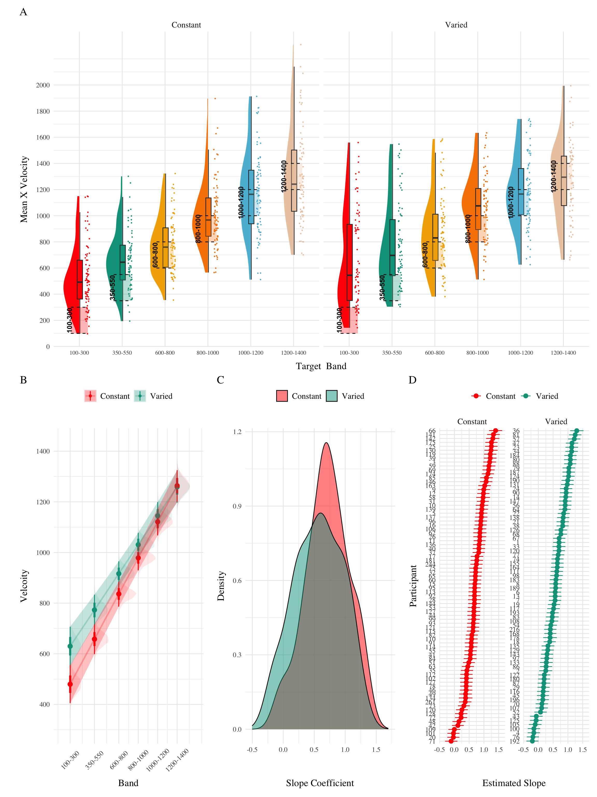

### Analyses Strategy

All data processing and statistical analyses were performed in R version 4.32 Team (2020). To assess differences between groups, we used Bayesian Mixed Effects Regression. Model fitting was performed with the brms package in R Bürkner (2017), and descriptive stats and tables were extracted with the BayestestR package Makowski et al. (2019). Mixed effects regression enables us to take advantage of partial pooling, simultaneously estimating parameters at the individual and group level. Our use of Bayesian, rather than frequentist methods allows us to directly quantify the uncertainty in our parameter estimates, as well as avoiding convergence issues common to the frequentist analogues of our mixed models.

Each model was set to run with 4 chains, 5000 iterations per chain, with the first 2500 discarded as warmup chains. Rhat values were within an acceptable range, with values \<=1.02 (see appendix for diagnostic plots). We used uninformative priors for the fixed effects of the model (condition and velocity band), and weakly informative Student T distributions for for the random effects. For each model, we report 1) the mean values of the posterior distribution for the parameters of interest, 2) the lower and upper credible intervals (CrI), and the probability of direction value (pd).

| Group Comparison         | Code                                                  | Data                 |
|-----------------|----------------------------------------|---------------|
| End of Training Accuracy | `brm(dist ~ condit)`                                  | Final Training Block |
| Test Accuracy            | `brm(dist ~ condit * bandType + (1|id) + (1|bandInt)` | All Testing trials   |
| Band Discrimination      | `brm(vx ~ condit * band +(1 + bandInt|id)`            | All Testing Trials   |

In each experiment we compare varied and constant performance on 1) accuracy in the final training block; 2) testing accuracy as a function of band type (trained vs. extrapolation); 3) degree of discrimination between all six testing bands. We quantified accuracy as the absolute deviation between the response velocity and the nearest boundary of the target band. Thus, when the target band was velocity 600-800, throws of 400, 650, and 900 would result in deviation values of 200, 0, and 100, respectively. The degree of discrimination between bands was index by fitting a linear model predicting the response velocity as a function of the target velocity. Participants who reliably discriminated between velocity bands tended to haves slope values ~1, while participants who made throws irrespective of the current target band would have slopes ~0.

### Results

| Term         | Estimate | 95% CrI Lower | 95% CrI Upper |  pd |
|:-------------|---------:|--------------:|--------------:|----:|
| Intercept    |   106.34 |         95.46 |        117.25 |   1 |
| conditVaried |    79.64 |         57.92 |        101.63 |   1 |

Table 1: **Experiment 1 - End of training performance**. The Intercept represents the average of the baseline (constant condition), and the conditVaried coefficient reflects the difference between the constant and varied groups. A larger positive estimates indicates a greater deviation (lower accuracy) for the varied group.

  

*Training*. <a href="#fig-e1-train-dev" class="quarto-xref">Figure 1</a> displays the average deviations across training blocks (recall that the varied group trains from 3 bands and the constant group from 1). We compared the training conditions from the final training block, on the position for which both groups trained (band 800-1000). Full model results are shown in <a href="#tbl-e1-train-dist" class="quarto-xref">Table 1</a>. The varied group had a significantly greater deviation than the constant group. ($B$ = 79.64, 95% CrI \[57.92, 101.63\]; pd = 100%).

| Term                               | Estimate | 95% CrI Lower | 95% CrI Upper |  pd |
|:-----------------------|-----------:|-----------:|-----------:|-----------:|
| Intercept                          |   152.55 |         70.63 |        229.85 | 1.0 |
| conditVaried                       |    39.00 |        -21.10 |        100.81 | 0.9 |
| bandTypeExtrapolation              |    71.51 |         33.24 |        109.60 | 1.0 |
| conditVaried:bandTypeExtrapolation |    66.46 |         32.76 |         99.36 | 1.0 |

Table 2: **Experiment 1 testing accuracy**. Main effects of condition and band type (training vs. extrapolation), and the interaction between the two factors.

*Testing.* To compare conditions in the testing stage, we first fit a model predicting deviation from the target band as a function of training condition and band type, with random intercepts for participants and bands. The model is shown in <a href="#tbl-e1-bmm-dist" class="quarto-xref">Table 2</a>. The effect of training condition was not reliably different from 0 ($B$ = 39, 95% CrI \[-21.1, 100.81\]; pd = 89.93%). The extrapolation testing items had a significantly greater deviation than the interpolation band (β = 71.51, 95% CrI \[33.24, 109.6\]; pd = 99.99%). The interaction between training condition and band type was significant ($B$ = 66.46, 95% CrI \[32.76, 99.36\]; pd = 99.99%), with the varied group showing a greater deviation than the constant group in the extrapolation bands. See <a href="#fig-e1-test-dev" class="quarto-xref">Figure 2</a>.

  

| Term         | Estimate | 95% CrI Lower | 95% CrI Upper |   pd |
|:-------------|---------:|--------------:|--------------:|-----:|
| Intercept    |   408.55 |        327.00 |        490.61 | 1.00 |
| conditVaried |   164.05 |         45.50 |        278.85 | 1.00 |
| Band         |     0.71 |          0.62 |          0.80 | 1.00 |
| condit\*Band |    -0.14 |         -0.26 |         -0.01 | 0.98 |

Table 3: Experiment 1. Bayesian Mixed Model Predicting Vx as a function of condition (Constant vs. Varied) and Velocity Band

Finally, to assess the ability of both conditions to discriminate between velocity bands, we fit a model predicting velocity as a function of training condition and velocity band, with random intercepts and random slopes for each participant. See <a href="#tbl-e1-bmm-vx" class="quarto-xref">Table 3</a> for the full model results. The estimated coefficient for training condition (β = 164.05, 95% CrI \[45.5, 278.85\]) suggests that the varied group tends to produce harder throws than the constant group, but is not in and of itself useful for assessing discrimination. Most relevant to the issue of discrimination is the slope on Velocity Band (β = 0.71, 95% CrI \[0.62, 0.8\]). Although the median slope does fall underneath the ideal of value of 1, the fact that the 95% credible interval does not contain 0 provides strong evidence that participants exhibited some discrimination between bands. The estimate for the interaction between slope and condition (β = -0.14, 95% CrI \[-0.26, -0.01\]), suggests that the discrimination was somewhat modulated by training condition, with the varied participants showing less sensitivity between bands than the constant condition. This difference is depicted visually in <a href="#fig-e1-test-vx" class="quarto-xref">Figure 4</a>.





  
some text.  

## References

Bürkner, P.-C. (2017). Brms: An R Package for Bayesian Multilevel Models Using Stan. *Journal of Statistical Software*, *80*, 1--28. <https://doi.org/10.18637/jss.v080.i01>

Makowski, D., Ben-Shachar, M. S., & Lüdecke, D. (2019). bayestestR: Describing Effects and their Uncertainty, Existence and Significance within the Bayesian Framework. *Journal of Open Source Software*, *4*(40), 1541. <https://doi.org/10.21105/joss.01541>

Team, R. C. (2020). *R: A Language and Environment for Statistical Computing*. R: A Language and Environment for Statistical Computing.
