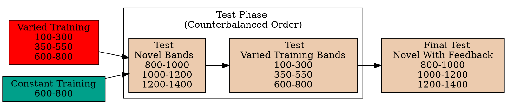

# Experiment 2

<a href="#fig-design-e2" class="quarto-xref">Figure 2</a> illustrates
the design of Experiment 2. The stages of the experiment (i.e. training,
testing no-feedback, test with feedback), are identical to that of
Experiment 1. The only change is that Experiment 2 participants train,
and then test, on bands in the reverse order of Experiment 1
(i.e. training on the softer bands; and testing on the harder bands).

Code

| Term         | Estimate | 95% CrI Lower | 95% CrI Upper |  pd |
|:-------------|---------:|--------------:|--------------:|----:|
| Intercept    |    91.01 |         80.67 |        101.26 |   1 |
| conditVaried |    36.15 |         16.35 |         55.67 |   1 |

  

*Training*. <a href="#fig-e2-train-dev" class="quarto-xref">Figure 3</a>
displays the average deviations across training blocks for both training
groups. To compare the training conditions at the end of training, we
analyzed performance on the 600-800 velocity band, which both groups
trained on. The full model results are shown in Table 1. The varied
group had a significantly greater deviation than the constant group in
the final training block, ($B$ = 36.15, 95% CrI \[16.35, 55.67\]; pd =
99.95%).

| Term                               | Estimate | 95% CrI Lower | 95% CrI Upper |   pd |
|:-----------------------------------|---------:|--------------:|--------------:|-----:|
| Intercept                          |   190.91 |        125.03 |        259.31 | 1.00 |
| conditVaried                       |   -20.58 |        -72.94 |         33.08 | 0.78 |
| bandTypeExtrapolation              |    38.09 |         -6.94 |         83.63 | 0.95 |
| conditVaried:bandTypeExtrapolation |    82.00 |         41.89 |        121.31 | 1.00 |

*Testing.* To compare accuracy between groups in the testing stage, we
fit a Bayesian mixed effects model predicting deviation from the target
band as a function of training condition (varied vs. constant) and band
type (trained vs. extrapolation), with random intercepts for
participants and bands. The model results are shown in
<a href="#tbl-e2-bmm-dist" class="quarto-xref">Table 2</a>. The main
effect of training condition was not significant ($B$ = -20.58, 95% CrI
\[-72.94, 33.08\]; pd = 77.81%). The extrapolation testing items had a
significantly greater deviation than the training bands (β = 38.09, 95%
CrI \[-6.94, 83.63\]; pd = 95.31%). Most importantly, the interaction
between training condition and band type was significant ($B$ = 82, 95%
CrI \[41.89, 121.31\]; pd = 100%), As shown in
<a href="#fig-e2-test-dev" class="quarto-xref">Figure 4</a>, the varied
group had disproportionately larger deviations compared to the constant
group in the extrapolation bands.

### Discimination

| Term         | Estimate | 95% CrI Lower | 95% CrI Upper |   pd |
|:-------------|---------:|--------------:|--------------:|-----:|
| Intercept    |   362.64 |        274.85 |        450.02 | 1.00 |
| conditVaried |    -8.56 |       -133.97 |        113.98 | 0.55 |
| Band         |     0.71 |          0.58 |          0.84 | 1.00 |
| condit\*Band |    -0.06 |         -0.24 |          0.13 | 0.73 |

See <a href="#tbl-e2-bmm-vx" class="quarto-xref">Table 3</a> for the
full model results. The estimated coefficient for training condition (β
= -8.56, 95% CrI \[-133.97, 113.98\]) suggests that the varied group
tends to produce harder throws than the constant group, but is not in
and of itself useful for assessing discrimination. Most relevant to the
issue of discrimination is the slope on Velocity Band (β = 0.71, 95% CrI
\[0.58, 0.84\]). Although the median slope does fall underneath the
ideal of value of 1, the fact that the 95% credible interval does not
contain 0 provides strong evidence that participants exhibited some
discrimination between bands. The estimate for the interaction between
slope and condition (β = -0.06, 95% CrI \[-0.24, 0.13\]), suggests that
the discrimination was somewhat modulated by training condition, with
the varied participants showing less sensitivity between bands than the
constant condition. This difference is depicted visually in
<a href="#fig-e2-test-vx" class="quarto-xref">Figure 5</a>.



## E2 Discussion
