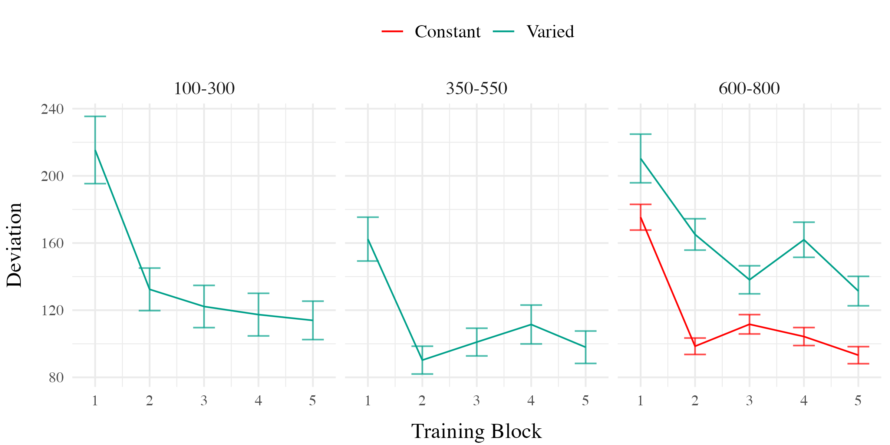
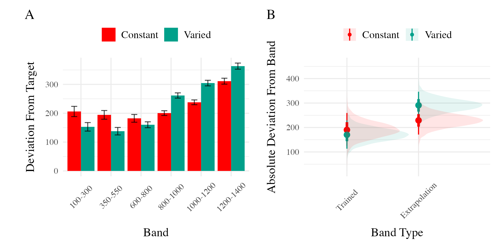
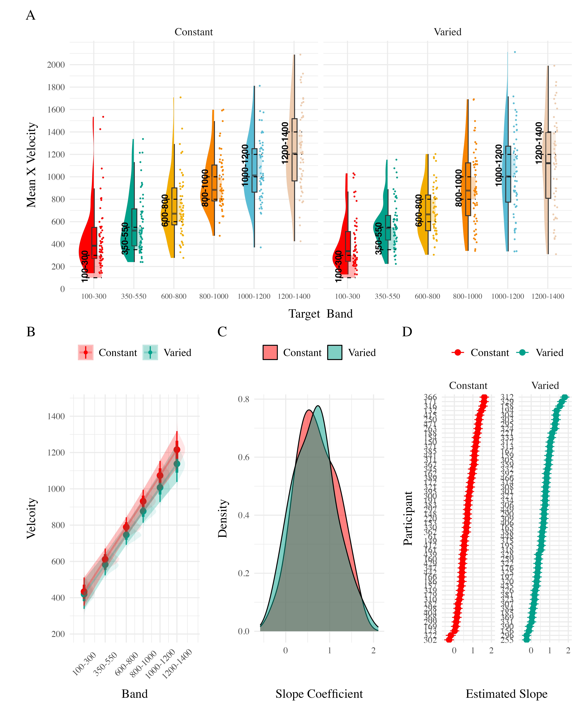

### Methods & Procedure

The task and procedure of Experiment was identical to Experiment 1, with the exception that the training and testing bands were reversed (see <a href="#fig-design-e2" class="quarto-xref">Figure 1</a>). The Varied group trained on bands 100-300, 350-550, 600-800, and the constant group trained on band 600-800. Both groups were tested from all six bands. A total of 110 participants completed the experiment (Varied: 55, Constant: 55).

<svg width="768" height="240" viewbox="0.00 0.00 647.35 174.00" xmlns="http://www.w3.org/2000/svg" xlink="http://www.w3.org/1999/xlink" style="; max-width: none; max-height: none">
<g id="graph0" class="graph" transform="scale(1 1) rotate(0) translate(4 170)">
<polygon fill="white" stroke="transparent" points="-4,4 -4,-170 643.35,-170 643.35,4 -4,4"></polygon>
<g id="clust1" class="cluster">
<title>cluster</title>
<polygon fill="none" stroke="black" points="152.49,-8 152.49,-158 458.5,-158 458.5,-8 152.49,-8"></polygon>
<text text-anchor="middle" x="305.49" y="-141.4" font-family="Times,serif" font-size="14.00">Test Phase </text>
<text text-anchor="middle" x="305.49" y="-124.6" font-family="Times,serif" font-size="14.00">(Counterbalanced Order)</text>
</g>
<!-- data1 -->
<g id="node1" class="node">
<title>data1</title>
<polygon fill="#ff0000" stroke="black" points="118.54,-137.7 5.95,-137.7 5.95,-62.3 118.54,-62.3 118.54,-137.7"></polygon>
<text text-anchor="middle" x="62.24" y="-121" font-family="Times,serif" font-size="14.00"> Varied Training </text>
<text text-anchor="middle" x="62.24" y="-104.2" font-family="Times,serif" font-size="14.00">100-300</text>
<text text-anchor="middle" x="62.24" y="-87.4" font-family="Times,serif" font-size="14.00">350-550</text>
<text text-anchor="middle" x="62.24" y="-70.6" font-family="Times,serif" font-size="14.00">600-800</text>
</g>
<!-- Test1 -->
<g id="node4" class="node">
<title>Test1</title>
<polygon fill="#eccbae" stroke="black" points="256.06,-108 160.63,-108 160.63,-16 256.06,-16 256.06,-108"></polygon>
<text text-anchor="middle" x="208.34" y="-91.4" font-family="Times,serif" font-size="14.00">Test &nbsp;</text>
<text text-anchor="middle" x="208.34" y="-74.6" font-family="Times,serif" font-size="14.00">Novel Bands &nbsp;</text>
<text text-anchor="middle" x="208.34" y="-57.8" font-family="Times,serif" font-size="14.00">800-1000</text>
<text text-anchor="middle" x="208.34" y="-41" font-family="Times,serif" font-size="14.00">1000-1200</text>
<text text-anchor="middle" x="208.34" y="-24.2" font-family="Times,serif" font-size="14.00">1200-1400</text>
</g>
<!-- data1&#45;&gt;Test1 -->
<g id="edge1" class="edge">
<title>data1-&gt;Test1</title>
<path fill="none" stroke="black" d="M118.54,-85.42C129.01,-82.66 139.97,-79.77 150.49,-76.99"></path>
<polygon fill="black" stroke="black" points="151.62,-80.31 160.4,-74.38 149.83,-73.55 151.62,-80.31"></polygon>
</g>
<!-- data2 -->
<g id="node2" class="node">
<title>data2</title>
<polygon fill="#00a08a" stroke="black" points="124.73,-44.6 -0.24,-44.6 -0.24,-3.4 124.73,-3.4 124.73,-44.6"></polygon>
<text text-anchor="middle" x="62.24" y="-28.2" font-family="Times,serif" font-size="14.00"> Constant Training </text>
<text text-anchor="middle" x="62.24" y="-11.4" font-family="Times,serif" font-size="14.00">600-800</text>
</g>
<!-- data2&#45;&gt;Test1 -->
<g id="edge2" class="edge">
<title>data2-&gt;Test1</title>
<path fill="none" stroke="black" d="M124.77,-40.23C133.35,-42.49 142.13,-44.8 150.61,-47.04"></path>
<polygon fill="black" stroke="black" points="149.84,-50.46 160.41,-49.62 151.63,-43.69 149.84,-50.46"></polygon>
</g>
<!-- Test3 -->
<g id="node3" class="node">
<title>Test3</title>
<polygon fill="#eccbae" stroke="black" points="639.27,-108 486.57,-108 486.57,-16 639.27,-16 639.27,-108"></polygon>
<text text-anchor="middle" x="562.92" y="-91.4" font-family="Times,serif" font-size="14.00"> &nbsp;&nbsp;&nbsp;Final Test </text>
<text text-anchor="middle" x="562.92" y="-74.6" font-family="Times,serif" font-size="14.00"> &nbsp;Novel With Feedback &nbsp;</text>
<text text-anchor="middle" x="562.92" y="-57.8" font-family="Times,serif" font-size="14.00">800-1000</text>
<text text-anchor="middle" x="562.92" y="-41" font-family="Times,serif" font-size="14.00">1000-1200</text>
<text text-anchor="middle" x="562.92" y="-24.2" font-family="Times,serif" font-size="14.00">1200-1400</text>
</g>
<!-- Test2 -->
<g id="node5" class="node">
<title>Test2</title>
<polygon fill="#eccbae" stroke="black" points="450.65,-108 292.05,-108 292.05,-16 450.65,-16 450.65,-108"></polygon>
<text text-anchor="middle" x="371.35" y="-91.4" font-family="Times,serif" font-size="14.00"> &nbsp;Test </text>
<text text-anchor="middle" x="371.35" y="-74.6" font-family="Times,serif" font-size="14.00"> &nbsp;Varied Training Bands &nbsp;</text>
<text text-anchor="middle" x="371.35" y="-57.8" font-family="Times,serif" font-size="14.00">100-300</text>
<text text-anchor="middle" x="371.35" y="-41" font-family="Times,serif" font-size="14.00">350-550</text>
<text text-anchor="middle" x="371.35" y="-24.2" font-family="Times,serif" font-size="14.00">600-800</text>
</g>
<!-- Test1&#45;&gt;Test2 -->
<g id="edge3" class="edge">
<title>Test1-&gt;Test2</title>
<path fill="none" stroke="black" d="M256.35,-62C264.51,-62 273.22,-62 282.07,-62"></path>
<polygon fill="black" stroke="black" points="282.09,-65.5 292.09,-62 282.09,-58.5 282.09,-65.5"></polygon>
</g>
<!-- Test2&#45;&gt;Test3 -->
<g id="edge4" class="edge">
<title>Test2-&gt;Test3</title>
<path fill="none" stroke="black" d="M450.55,-62C459.05,-62 467.74,-62 476.33,-62"></path>
<polygon fill="black" stroke="black" points="476.34,-65.5 486.34,-62 476.34,-58.5 476.34,-65.5"></polygon>
</g>
</g>
</svg>

Figure 1: Experiment 2 Design. Constant and Varied participants complete different training conditions. The training and testing bands are the reverse of Experiment 1.

### Results

| Term         | Estimate | 95% CrI Lower | 95% CrI Upper |  pd |
|:-------------|---------:|--------------:|--------------:|----:|
| Intercept    |    91.01 |         80.67 |        101.26 |   1 |
| conditVaried |    36.15 |         16.35 |         55.67 |   1 |

Table 1: **Experiment 2 - End of training performance**. The Intercept represents the average of the baseline (constant condition), and the conditVaried coefficient reflects the difference between the constant and varied groups. A larger positive coefficient indicates a greater deviation (lower accuracy) for the varied group.

  

*Training*. <a href="#fig-e2-train-dev" class="quarto-xref">Figure 2</a> presents the deviations across training blocks for both constant and varied training groups. We again compared training performance on the band common to both groups (600-800). The full model results are shown in Table 1. The varied group had a significantly greater deviation than the constant group in the final training block, ( $\beta$ = 36.15, 95% CrI \[16.35, 55.67\]; pd = 99.95%).

| Term                               | Estimate | 95% CrI Lower | 95% CrI Upper |   pd |
|:-----------------------------|---------:|-------------:|-------------:|-----:|
| Intercept                          |   190.91 |        125.03 |        259.31 | 1.00 |
| conditVaried                       |   -20.58 |        -72.94 |         33.08 | 0.78 |
| bandTypeExtrapolation              |    38.09 |         -6.94 |         83.63 | 0.95 |
| conditVaried:bandTypeExtrapolation |    82.00 |         41.89 |        121.31 | 1.00 |

Table 2: **Experiment 2 testing accuracy**. Main effects of condition and band type (training vs. extrapolation), and the interaction between the two factors. Larger coefficient estimates indicate larger deviations from the baselines (constant & trained bands) - and a positive interaction coefficient indicates disproporionate deviation for the varied condition on the extrapolation bands

   

*Testing Accuracy.* The analysis of testing accuracy examined deviations from the target band as influenced by training condition (Varied vs. Constant) and band type (training vs. extrapolation bands). The results, summarized in <a href="#tbl-e2-bmm-dist" class="quarto-xref">Table 2</a>, reveal no significant main effect of training condition ($\beta$ = -20.58, 95% CrI \[-72.94, 33.08\]; pd = 77.81%). However, the interaction between training condition and band type was significant ($\beta$ = 82, 95% CrI \[41.89, 121.31\]; pd = 100%), with the varied group showing disproportionately larger deviations compared to the constant group on the extrapolation bands (see <a href="#fig-e2-test-dev" class="quarto-xref">Figure 3</a>).

| Term         | Estimate | 95% CrI Lower | 95% CrI Upper |   pd |
|:-------------|---------:|--------------:|--------------:|-----:|
| Intercept    |   362.64 |        274.85 |        450.02 | 1.00 |
| conditVaried |    -8.56 |       -133.97 |        113.98 | 0.55 |
| Band         |     0.71 |          0.58 |          0.84 | 1.00 |
| condit\*Band |    -0.06 |         -0.24 |          0.13 | 0.73 |

Table 3: Experiment 2. Bayesian Mixed Model Predicting Vx as a function of condition (Constant vs. Varied) and Velocity Band

*Testing Discrimination.* Finally, to assess the ability of both conditions to discriminate between velocity bands, we fit a model predicting velocity as a function of training condition and velocity band, with random intercepts and random slopes for each participant. The full model results are shown in <a href="#tbl-e2-bmm-vx" class="quarto-xref">Table 3</a>. The overall slope on target velocity band predictor was significantly positive, ($\beta$ = 0.71, 95% CrI \[0.58, 0.84\]; pd= 100%), indicating that participants exhibited discrimination between bands. The interaction between slope and condition was not significant, ($\beta$ = -0.06, 95% CrI \[-0.24, 0.13\]; pd= 72.67%), suggesting that the two conditions did not differ in their ability to discriminate between bands (see <a href="#fig-e2-test-vx" class="quarto-xref">Figure 4</a>).



## E2 Discussion

Experiment 2 extended the findings of Experiment 1 by examining the effects of training variability on extrapolation performance in a visuomotor function learning task, but with reversed training and testing bands. Similar to Experiment 1, the Varied group exhibited poorer performance during training and testing. However unlike experiment 1, the Varied group did not show a significant difference in discrimination between bands.
