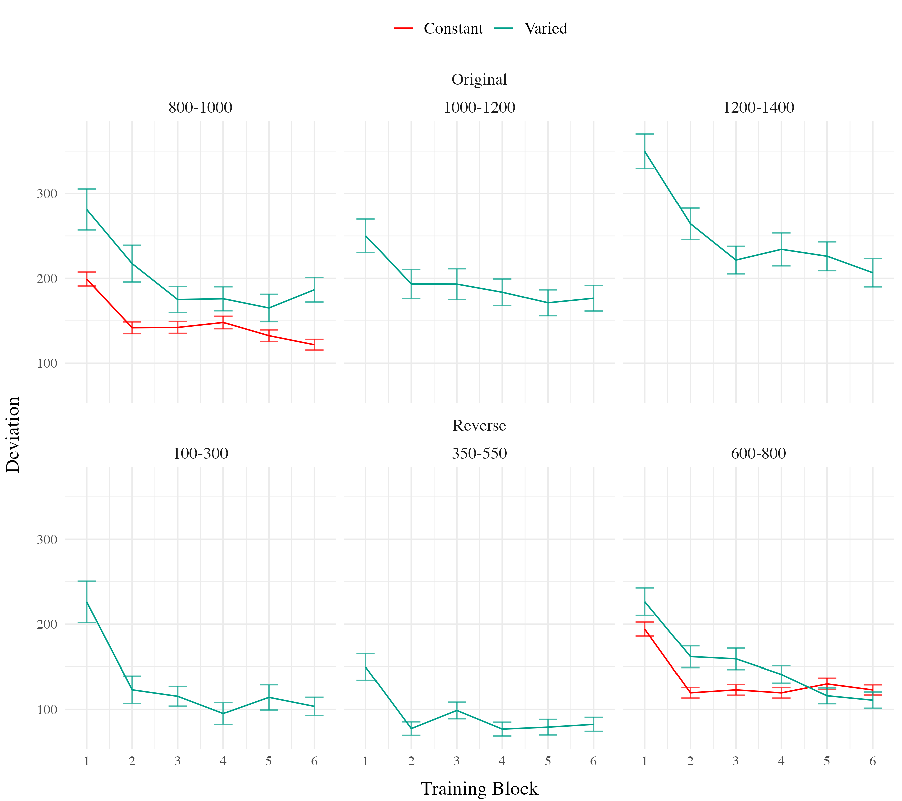
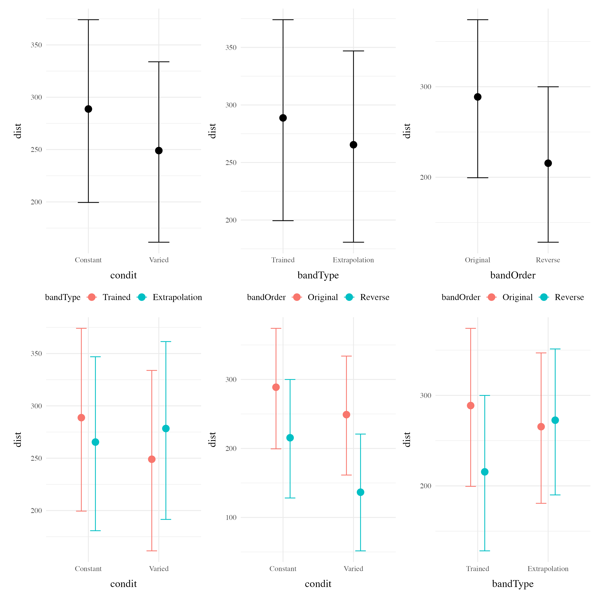
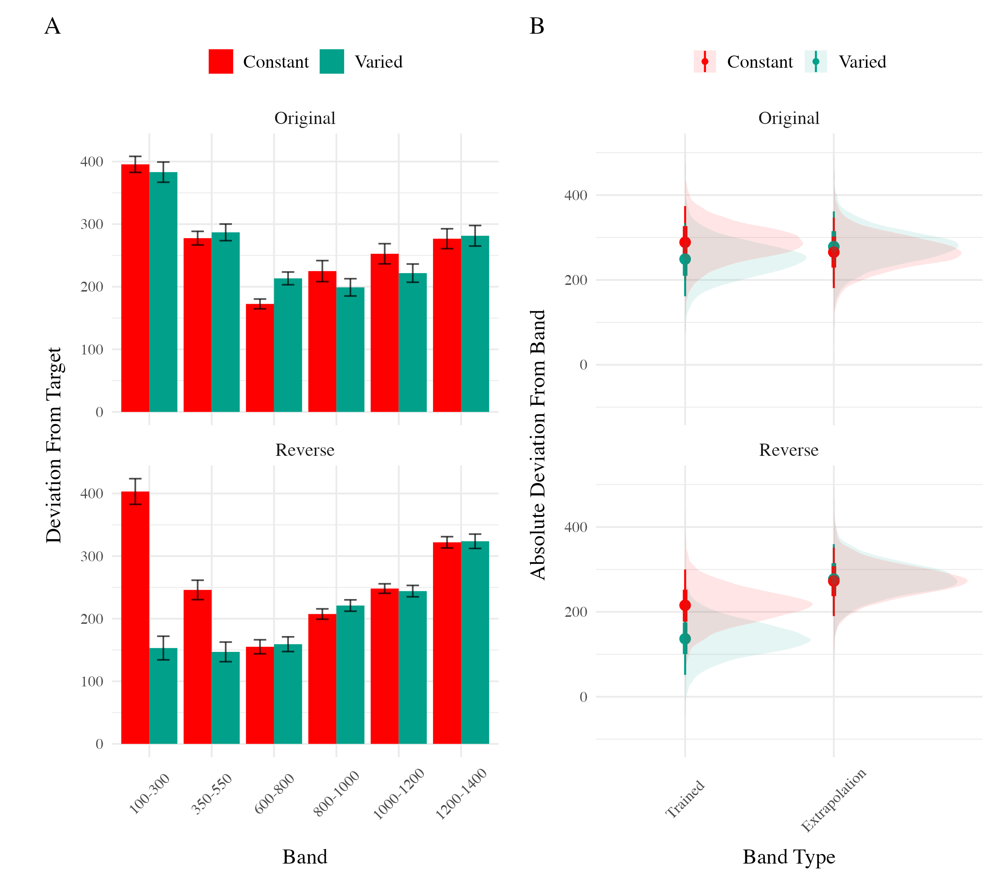

<details class="code-fold">
<summary>Code</summary>

``` r
pacman::p_load(dplyr,purrr,tidyr,tibble,ggplot2,
  brms,tidybayes, rstanarm,emmeans,broom,bayestestR,
  stringr, here,conflicted, patchwork, knitr,kableExtra)
walk(c("brms","dplyr","bayestestR"), conflict_prefer_all, quiet = TRUE)
walk(c("Display_Functions","org_functions"), ~ source(here::here(paste0("Functions/", .x, ".R"))))
e3 <- readRDS(here("data/e3_08-04-23.rds")) |> 
    mutate(trainCon=case_when(
    bandOrder=="Original" ~ "800",
    bandOrder=="Reverse" ~ "600",
    TRUE ~ NA_character_
    ), trainCon=as.numeric(trainCon)) 
e3Sbjs <- e3 |> group_by(id,condit,bandOrder) |> summarise(n=n())
testE3 <- e3 |> filter(expMode2 == "Test")

nbins=5
trainE3 <-  e3 |> filter(expMode2=="Train") |> group_by(id,condit,bandOrder, vb) |> 
    mutate(Trial_Bin = cut( gt.train, breaks = seq(1, max(gt.train),length.out=nbins+1),include.lowest = TRUE, labels=FALSE)) 
# bayesian comparison of condits in training
trainE3_max <- trainE3 |> filter(Trial_Bin == nbins, bandInt==trainCon)
```

</details>

The major manipulation adjustment of experiment 3 is for participants to receive ordinal feedback during training, in contrast to the continuous feedback of the earlier experiments. Ordinal feedback informs participants whether a throw was too soft, too hard, or fell within the target velocity range. Experiment 3 participants were randomly assigned to both a training condition (Constant vs. Varied) and a Band Order condition (original order used in Experiment 1, or the Reverse order of Experiment 2).

<details class="code-fold">
<summary>Code</summary>

``` r
bmm_e3_train <- trainE3_max %>% 
  brm(dist ~ condit*bandOrder, 
      file=here("data/model_cache/e3_train_deviation"),
      data = .,
      iter = 2000,
      chains = 4,
      control = list(adapt_delta = .94, max_treedepth = 13))

# mtr3 <- as.data.frame(describe_posterior(bmm_e3_train, centrality = "Mean"))[, c(1,2,4,5,6)]
# colnames(mtr3) <- c("Term", "Estimate","95% CrI Lower", "95% CrI Upper", "pd")
# mtr3 |> mutate(across(where(is.numeric), \(x) round(x, 2))) |>
#   tibble::remove_rownames() |> 
#   mutate(Term = stringr::str_remove(Term, "b_")) |>
#   kable(escape=F,booktabs=T) 
```

</details>
<div id="tbl-e3-train-dist">

| Term                          | Estimate | 95% CrI Lower | 95% CrI Upper |   pd |
|:---------------------------|---------:|-------------:|-------------:|------:|
| Intercept                     |   121.86 |        109.24 |        134.60 | 1.00 |
| conditVaried                  |    64.93 |         36.99 |         90.80 | 1.00 |
| bandOrderReverse              |     1.11 |        -16.02 |         18.16 | 0.55 |
| conditVaried:bandOrderReverse |   -77.02 |       -114.16 |        -39.61 | 1.00 |

Table 1: **Experiment 3 - End of training performance**. The Intercept represents the average of the baseline (constant condition), and the conditVaried coefficient reflects the difference between the constant and varied groups. A larger positive coefficient indicates a greater deviation (lower accuracy) for the varied group.
</div>
<details class="code-fold">
<summary>Code</summary>

``` r
p1 <- trainE3 |> ggplot(aes(x = Trial_Bin, y = dist, color = condit)) +
    stat_summary(geom = "line", fun = mean) +
    stat_summary(geom = "errorbar", fun.data = mean_se, width = .4, alpha = .7) +
    ggh4x::facet_nested_wrap(~bandOrder*vb,ncol=3)+
    scale_x_continuous(breaks = seq(1, nbins + 1)) +
    theme(legend.title=element_blank()) + 
    labs(y = "Deviation", x="Training Block") 

#ggsave(here("Assets/figs/e3_train_deviation.png"), p1, width = 9, height = 8,bg="white")
```

</details>


<details class="code-fold">
<summary>Code</summary>

``` r
#options(brms.backend="cmdstanr",mc.cores=4)
modelFile <- paste0(here::here("data/model_cache/"), "e3_dist_Cond_Type_RF_2")
bmtd3 <- brm(dist ~ condit * bandType*bandOrder + (1|bandInt) + (1|id), 
    data=testE3, file=modelFile,
    iter=5000,chains=4, control = list(adapt_delta = .94, max_treedepth = 13))
                        
# mted3 <- as.data.frame(describe_posterior(bmtd3, centrality = "Mean"))[, c(1,2,4,5,6)]
# colnames(mted3) <- c("Term", "Estimate","95% CrI Lower", "95% CrI Upper", "pd")
# mted3 |> mutate(across(where(is.numeric), \(x) round(x, 2))) |>
#   tibble::remove_rownames() |> 
#   mutate(Term = stringr::str_remove(Term, "b_")) |>
#   kable(booktabs=TRUE) 

ce_bmtd3 <- plot(conditional_effects(bmtd3),points=FALSE,plot=FALSE)
#wrap_plots(ce_bmtd3)

#ggsave(here::here("Assets/figs", "e3_cond_effects_dist.png"), wrap_plots(ce_bmtd3), width=11, height=11, bg="white")
```

</details>
<div id="tbl-e3-bmm-dist">

| Term                                                | Estimate | 95% CrI Lower | 95% CrI Upper |   pd |
|:------------------------------------|-------:|-----------:|-----------:|-----:|
| Intercept                                           |   288.65 |        199.45 |        374.07 | 1.00 |
| conditVaried                                        |   -40.19 |       -104.68 |         23.13 | 0.89 |
| bandTypeExtrapolation                               |   -23.35 |        -57.28 |         10.35 | 0.92 |
| bandOrderReverse                                    |   -73.72 |       -136.69 |        -11.07 | 0.99 |
| conditVaried:bandTypeExtrapolation                  |    52.66 |         14.16 |         90.23 | 1.00 |
| conditVaried:bandOrderReverse                       |   -37.48 |       -123.28 |         49.37 | 0.80 |
| bandTypeExtrapolation:bandOrderReverse              |    80.69 |         30.01 |        130.93 | 1.00 |
| conditVaried:bandTypeExtrapolation:bandOrderReverse |    30.42 |        -21.00 |         81.65 | 0.87 |

Table 2: **Experiment 3 testing accuracy**. Main effects of condition and band type (training vs. extrapolation), and the interaction between the two factors. Larger coefficient estimates indicate larger deviations from the baselines (constant & trained bands) - and a positive interaction coefficient indicates disproporionate deviation for the varied condition on the extrapolation bands
</div>


<details class="code-fold">
<summary>Code</summary>

``` r
pe3td <- testE3 |>  ggplot(aes(x = vb, y = dist,fill=condit)) +
    stat_summary(geom = "bar", position=position_dodge(), fun = mean) +
    stat_summary(geom = "errorbar", position=position_dodge(.9), fun.data = mean_se, width = .4, alpha = .7) + 
    facet_wrap(~bandOrder,ncol=1) +
  theme(legend.title=element_blank(),axis.text.x = element_text(angle = 45, hjust = 0.5, vjust = 0.5)) +
  labs(x="Band", y="Deviation From Target")

condEffects <- function(m,xvar){
  m |> ggplot(aes(x = {{xvar}}, y = .value, color = condit, fill = condit)) + 
  stat_dist_pointinterval() + 
  stat_halfeye(alpha=.1, height=.5) +
  theme(legend.title=element_blank(),axis.text.x = element_text(angle = 45, hjust = 0.5, vjust = 0.5)) 
  
}
pe3ce <- bmtd3 |> emmeans( ~condit *bandOrder*bandType) |>
  gather_emmeans_draws() |>
 condEffects(bandType) + labs(y="Absolute Deviation From Band", x="Band Type") + 
 facet_wrap(~bandOrder,ncol=1)

p2 <- pe3td + pe3ce + plot_annotation(tag_levels= 'A')
#ggsave(here::here("Assets/figs", "e3_test-dev.png"), p2, width=9, height=8, bg="white")
```

</details>


### Discimination

<div id="tbl-e3-bmm-vx">
<details class="code-fold">
<summary>Code</summary>

``` r
e3_vxBMM <- brm(vx ~ condit * bandOrder * bandInt + (1 + bandInt|id),
                        data=test,file=paste0(here::here("data/model_cache", "e3_testVxBand_RF_5k")),
                        iter=5000,chains=4,silent=0,
                        control=list(adapt_delta=0.94, max_treedepth=13))

# m1 <- as.data.frame(describe_posterior(e3_vxBMM, centrality = "Mean"))
# m2 <- fixef(e3_vxBMM)
# mp3 <- m1[, c(1,2,4,5,6)]
# colnames(mp3) <- c("Term", "Estimate","95% CrI Lower", "95% CrI Upper", "pd")                       
# mp3 |> mutate(across(where(is.numeric), \(x) round(x, 2))) |>
#   tibble::remove_rownames() |> 
#   mutate(Term = stringr::str_replace_all(Term, "b_bandInt", "Band")) |>
#   kable(escape=F,booktabs=T)

cd1 <- get_coef_details(e3_vxBMM, "conditVaried")
sc1 <- get_coef_details(e3_vxBMM, "bandInt")
intCoef1 <- get_coef_details(e3_vxBMM, "conditVaried:bandInt")
```

</details>
Table 3: Experiment 3. Bayesian Mixed Model Predicting Vx as a function of condition (Constant vs. Varied) and Velocity Band
</div>
<div id="tbl-e3-bmm-vx">

| Term                                    | Estimate | 95% CrI Lower | 95% CrI Upper |   pd |
|:--------------------------------|--------:|------------:|------------:|-----:|
| b_Intercept                             |   601.83 |        504.75 |        699.42 | 1.00 |
| b_conditVaried                          |    12.18 |       -134.94 |        162.78 | 0.56 |
| b_bandOrderReverse                      |    13.03 |       -123.89 |        144.67 | 0.58 |
| Band                                    |     0.49 |          0.36 |          0.62 | 1.00 |
| b_conditVaried:bandOrderReverse         |  -338.15 |       -541.44 |       -132.58 | 1.00 |
| b_conditVaried:bandInt                  |    -0.04 |         -0.23 |          0.15 | 0.67 |
| b_bandOrderReverse:bandInt              |    -0.10 |         -0.27 |          0.08 | 0.86 |
| b_conditVaried:bandOrderReverse:bandInt |     0.42 |          0.17 |          0.70 | 1.00 |

Table 4: Experiment 3. Bayesian Mixed Model Predicting Vx as a function of condition (Constant vs. Varied) and Velocity Band
</div>
<details class="code-fold">
<summary>Code</summary>

``` r
pe3tv <- testE3 %>% group_by(id,vb,condit,bandOrder) |> plot_distByCondit() + ggh4x::facet_nested_wrap(bandOrder~condit,scale="free_x")

pe3vce <- e3_vxBMM |> emmeans( ~condit* bandOrder* bandInt, 
                       at = list(bandInt = c(100, 350, 600, 800, 1000, 1200))) |>
  gather_emmeans_draws() |> 
  condEffects(bandInt) +
  facet_wrap(~bandOrder,ncol=1) +
  stat_lineribbon(alpha = .25, size = 1, .width = c(.95)) +
  scale_x_continuous(breaks = c(100, 350, 600, 800, 1000, 1200), 
                     labels = levels(testE3$vb), 
                     limits = c(0, 1400)) + 
scale_y_continuous(expand=expansion(add=100),breaks=round(seq(0,2000,by=200),2)) +
  theme(legend.title=element_blank()) + 
  labs(y="Velcoity", x="Band")

fe <- fixef(e3_vxBMM)[,1]
fixed_effect_bandInt <- fixef(e3_vxBMM)[,1]["bandInt"]
fixed_effect_interaction1 <- fixef(e3_vxBMM)[,1]["conditVaried:bandInt"]
fixed_effect_interaction2 <- fixef(e3_vxBMM)[,1]["bandOrderReverse:bandInt"]
fixed_effect_interaction3 <- fixef(e3_vxBMM)[,1]["conditVaried:bandOrderReverse:bandInt"]

re <- data.frame(ranef(e3_vxBMM, pars = "bandInt")$id[, ,'bandInt']) |> 
  rownames_to_column("id") |> 
  left_join(e3Sbjs,by="id") |>
  mutate(adjust= fixed_effect_bandInt + fixed_effect_interaction1*(condit=="Varied") + 
           fixed_effect_interaction2*(bandOrder=="Reverse") + 
           fixed_effect_interaction3*(condit=="Varied" & bandOrder=="Reverse"),
  slope = Estimate + adjust )

pid_den3 <- ggplot(re, aes(x = slope, fill = condit)) + 
  geom_density(alpha=.5) + 
  xlim(c(min(re$slope)-.3, max(re$slope)+.3))+
   theme(legend.title=element_blank()) + 
  labs(x="Slope Coefficient",y="Density") +
  facet_wrap(~bandOrder,ncol=1)

pid_slopes3 <- re |>  
    mutate(id=reorder(id,slope)) |>
  ggplot(aes(y=id, x=slope,fill=condit,color=condit)) + 
    geom_pointrange(aes(xmin=Q2.5+adjust, xmax=Q97.5+adjust)) + 
    theme(legend.title=element_blank(), 
      axis.text.y = element_text(size=6) ) + 
    labs(x="Estimated Slope", y="Participant")  + 
    ggh4x::facet_nested_wrap(bandOrder~condit,axes="all",scales="free_y")

p3 <- pe3tv / (pe3vce + pid_den3 + pid_slopes3) + plot_annotation(tag_levels= 'A')
#ggsave(here::here("Assets/figs", "e3_test-vx.png"), p3,width=11,height=13, bg="white",dpi=800)
#p3
```

</details>




