# Introduction

A longstanding issue across both science and instruction has been to understand how various aspects of an educational curriculum or training program influence learning acquisition and generalization. One such aspect, which has received a great deal of research attention, is the variability of examples experienced during training ([Raviv et al., 2022](#ref-ravivHowVariabilityShapes2022)). The influence of training variation has been studied in numerous domains, including category learning ([Cohen et al., 2001](#ref-cohenCategoryVariabilityExemplar2001); [Posner & Keele, 1968](#ref-posnerGenesisAbstractIdeas1968)), visuomotor learning ([Berniker et al., 2014](#ref-bernikerEffectsTrainingBreadth2014); [Schmidt, 1975](#ref-schmidtSchemaTheoryDiscrete1975)), language learning ([Perry et al., 2010](#ref-perryLearnLocallyThink2010)), and education ([Braithwaite & Goldstone, 2015](#ref-braithwaiteEffectsVariationPrior2015); [Guo et al., 2014](#ref-guoEffectsExampleVariability2014)). The pattern of results is complex, with numerous studies finding both beneficial ([Braun et al., 2009](#ref-braunMotorTaskVariation2009); [Catalano & Kleiner, 1984](#ref-catalanoDistantTransferCoincident1984a); [Roller et al., 2001](#ref-rollerVariablePracticeLenses2001)), as well as null or negative effects ([Brekelmans et al., 2022](#ref-brekelmansDoesHighVariability2022); [Hu & Nosofsky, 2024](#ref-huHighvariabilityTrainingDoes2024); [Van Rossum, 1990](#ref-vanrossumSchmidtSchemaTheory1990)). The present study seeks to contribute to the large body of existing research by examining the influence of variability in visuomotor function learning - a domain in which it has been relatively under-studied.

## Function Learning and Extrapolation

The study of human function learning investigates how people learn relationships between continuous input and output values. Function learning is studied both in tasks where individuals are exposed to a sequence of input/output pairs ([DeLosh et al., 1997](#ref-deloshExtrapolationSineQua1997); [McDaniel et al., 2013](#ref-mcdanielEffectsSpacedMassed2013)), or situations where observers are presented with an incomplete scatterplot or line graph and make predictions about regions of the plot that don't contain data ([Ciccione & Dehaene, 2021](#ref-ciccioneCanHumansPerform2021); [Courrieu, 2012](#ref-courrieuQuickApproximationBivariate2012); [Said & Fischer, 2021](#ref-saidExtrapolationAccuracyUnderestimates2021); [Schulz et al., 2020](#ref-schulzCommunicatingCompositionalPatterns2020)).

Carroll ([1963](#ref-carrollFunctionalLearningLearning1963)) conducted the earliest work on function learning. Input stimuli and output responses were both lines of varying length. The correct output response was related to the length of the input line by a linear, quadratic, or random function. Participants in the linear and quadratic performed above chance levels during extrapolation testing, with those in the linear condition performing the best overall. Carroll argued that these results were best explained by a ruled based model wherein learners form an abstract representation of the underlying function. Subsequent work by Brehmer ([1974](#ref-brehmerHypothesesRelationsScaled1974)),testing a wider array of functional forms, provided further evidence for superior extrapolation in tasks with linear functions. Brehmer argued that individuals start out with an assumption of a linear function, but given sufficient error will progressively test alternative hypothesis with polynomials of greater degree. Koh & Meyer ([1991](#ref-kohFunctionLearningInduction1991)) employed a visuomotor function learning task, wherein participants were trained on examples from an unknown function relating the length of an input line to the duration of a response (time between keystrokes). In this domain, participants performed best when the relation between line length and response duration was determined by a power, as opposed to linear function. Koh & Meyer developed the log-polynomial adaptive-regression model to account for their results.

The first significant challenge to the rule-based accounts of function learning was put forth by DeLosh et al. ([1997](#ref-deloshExtrapolationSineQua1997)) . In their task, participants learned to associate stimulus magnitudes with response magnitudes that were related via either linear, exponential, or quadratic function. Participants approached ceiling performance by the end of training in each function condition, and were able to correctly respond in interpolation testing trials. All three conditions demonstrated some capacity for extrapolation, however participants in the linear condition tended to underestimate the true function, while exponential and quadratic participants reliably overestimated the true function on extrapolation trials. Extrapolation and interpolation performance are depicted in <a href="#fig-delosh-extrap" class="quarto-xref">Figure 1</a>.

The authors evaluated both of the rule-based models introduced in earlier research (with some modifications enabling trial-by-trial learning). The polynomial hypothesis testing model ([Brehmer, 1974](#ref-brehmerHypothesesRelationsScaled1974); [Carroll, 1963](#ref-carrollFunctionalLearningLearning1963)) tended to mimic the true function closely in extrapolation, and thus offered a poor account of the human data. The log-polynomial adaptive regression model ([Koh & Meyer, 1991](#ref-kohFunctionLearningInduction1991)) was able to mimic some of the systematic deviations produced by human subjects, but also predicted overestimation in cases where underestimation occurred.

The authors also introduced two new function-learning models. The Associative Learning Model (ALM) and the extrapolation-association model (EXAM). ALM is a two layer connectionist model adapted from the ALCOVE model in the category learning literature ([Kruschke, 1992](#ref-kruschkeALCOVEExemplarbasedConnectionist1992)). ALM belongs to the general class of radial-basis function neural networks, and can be considered a similarity-based model in the sense that the nodes in the input layer of the network are activated as a function of distance. The EXAM model retains the same similarity based activation and associative learning mechanisms as ALM, while being augmented with a linear rule response mechanism. When presented with novel stimuli, EXAM will retrieve the most similar input-output examples encountered during training, and from those examples compute a local slope. ALM was able to provide a good account of participant training and interpolation data in all three function conditions, however it was unable to extrapolate. EXAM, on the other hand, was able to reproduce both the extrapolation underestimation, as well as the quadratic and exponential overestimation patterns exhibited by the human participants. Subsequent research identified some limitations in EXAM's ability to account for cases where human participants learn and extrapolate sinusoidal function Bott & Heit ([2004](#ref-bottNonmonotonicExtrapolationFunction2004)) or to scenarios where different functions apply to different regions of the input space Kalish et al. ([2004](#ref-kalishPopulationLinearExperts2004)), though EXAM has been shown to provide a good account of human learning and extrapolation in tasks with bi-linear, V shaped input spaces Mcdaniel et al. ([2009](#ref-mcdanielPredictingTransferPerformance2009)).

### Variability and Function Learning

The influence of variability on function learning tasks has received relatively little attention. The study by DeLosh et al. ([1997](#ref-deloshExtrapolationSineQua1997)) (described in detail above) did include a variability manipulation (referred to as density in their paper), wherein participants were trained with either either 8, 20, or 50 unique input-output pairs, with the total number of training trials held constant. They found a minimal influence of variability on training performance, and no difference between groups in interpolation or extrapolation, with all three variability conditions displaying accurate interpolation, and linearly biased extrapolation that was well accounted for by the EXAM model.

In the domain of visuomotor learning, van Dam & Ernst ([2015](#ref-vandamMappingShapeVisuomotor2015)) employed a task which required participants to learn a linear function between the spikiness of shape stimuli and the correct horizontal position to make a rapid pointing response. The shapes ranged from very spiky to completely circular at the extreme ends of the space. Participants trained with intermediate shapes from a lower variation (2 shapes) or higher variation (5 shapes) condition, with the 2 items of the lower varied condition matching the items used on the extreme ends of the higher variation training space. Learning was significantly slower in the higher variation group. However, the two conditions did not differ when tested with novel shapes, with both groups producing extrapolation responses of comparable magnitudes to the most similar training item, rather than in accordance with the true linear function. The authors accounted for both learning and extrapolation performance with a Bayesian learning model. Similar to ALM, the bayesian model assumes that generalization occurs as a Gaussian function of the distance between stimuli. However unlike ALM, the bayesian learning model utilizes more elaborate probabilistic stimulus representations, with a separate Kalman Filter for each shape stimulus.

``` r
pacman::p_load(dplyr,purrr,tidyr,tibble,ggplot2,
  brms,tidybayes, rstanarm,emmeans,broom,bayestestR,
  data.table, stringr, here,conflicted, gt, ggh4x, patchwork, knitr)
#options(brms.backend="cmdstanr",mc.cores=4)
walk(c("brms","dplyr","bayestestR","here"), conflict_prefer_all, quiet = TRUE)
options(digits=2, scipen=999, dplyr.summarise.inform=FALSE)

walk(c("brms","dplyr","bayestestR","here"), conflict_prefer_all, quiet = TRUE)
walk(c("Display_Functions","deLosh_data","fun_alm","fun_indv_fit","fun_model", "prep_model_data","org_functions"), ~source(here::here(paste0("Functions/", .x, ".R"))))

# walk(c("brms","dplyr","bayestestR"), conflict_prefer_all, quiet = TRUE)
# walk(c("Display_Functions","org_functions"), ~ source(here::here(paste0("Functions/", .x, ".R"))))
# source(here::here("Functions","deLosh_data.R"))
# source(here::here("Functions","Display_Functions.R"))
```


## Overview Of Present Study

The present study investigates the influence of training variability on learning, generalization, and extrapolation in a uni-dimensional visuomotor function learning task. To the best of our knowledge, this research is the first to employ the classic constant vs. varied training manipulation, commonly used in the literature on the benefits of variability, in the context of a uni-dimensional function learning task. Across three experiments, we compare constant and varied training conditions in terms of learning performance, extrapolation accuracy, and the ability to reliably discriminate between stimuli.

To account for the empirical results, we will apply a series of computational models, including the Associative Learning Model (ALM) and the Extrapolation-Association Model (EXAM). Notably, this study is the first to employ approximate Bayesian computation (ABC) to fit these models to individual subject data, enabling us to thoroughly investigate the full range of posterior predictions of each model, and to examine the ability of these influential models of function learning to account for both the group level and individual level data.

## Experiment 1

### Methods

*Participants* A total of 156 participants were recruited from the Indiana University Introductory Psychology Course. Participants were randomly assigned to one of two training conditions: varied training or constant training.

*Task.* The "Hit The Wall" (HTW) visuomotor extrapolation task task was programmed in Javascript, making heavy use of the [phaser.io](https://phaser.io/) game library. The HTW task involved launching a projectile such that it would strike the "wall" at target speed indicated at the top of the screen (see <a href="#fig-htw-task" class="quarto-xref">Figure 2</a>). The target velocities were given as a range, or band, of acceptable velocity values (e.g. band 800-1000). During the training stage, participants received feedback indicating whether they had hit the wall within the target velocity band, or how many units their throw was above or below from the target band. Participants were instructed that only the x velocity component of the ball was relevant to the task. The y velocity, or the location at which the ball struck the wall, had no influence on the task feedback.

  


*Procedure.* All participants completed the task online. Participants were provided with a description of the experiment and indicated informed consent. **?@fig-design-e1** illustrates the general procedure. Participants completed a total of 90 trials during the training stage. In the varied training condition, participants encountered three velocity bands (800-1000, 1000-1200, and 1200-1400). Participants in the constant training condition trained on only one velocity band (800-1000) - the closest band to what would be the novel extrapolation bands in the testing stage.

Following the training stage, participants proceeded immediately to the testing stage. Participants were tested from all six velocity bands, in two separate stages. In the novel extrapolation testing stage, participants completed "no-feedback" testing from three novel extrapolation bands (100-300, 350-550, and 600-800), with each band consisting of 15 trials. Participants were also tested from the three velocity bands that were trained by the varied condition (800-1000, 1000-1200, and 1200-1400). In the constant training condition, two of these bands were novel, while in the varied training condition, all three bands were encountered during training. The order in which participants completed the novel-extrapolation and testing-from-3-varied bands was counterbalanced across participants.
A final training stage presented participants with "feedback" testing for each of the three extrapolation bands (100-300, 350-550, and 600-800).

``` r
# pacman::p_load(dplyr,purrr,tidyr,tibble,ggplot2,
#   brms,tidybayes, rstanarm,emmeans,broom,bayestestR,
#   stringr, here,conflicted, patchwork, knitr)
# #options(brms.backend="cmdstanr",mc.cores=4)
# options(digits=2, scipen=999, dplyr.summarise.inform=FALSE)
# walk(c("brms","dplyr","bayestestR"), conflict_prefer_all, quiet = TRUE)
# walk(c("Display_Functions","org_functions"), ~ source(here::here(paste0("Functions/", .x, ".R"))))
e1 <- readRDS(here("data/e1_08-21-23.rds")) 
e1Sbjs <- e1 |> group_by(id,condit) |> summarise(n=n())
testE1 <- e1 |> filter(expMode2 == "Test")
nbins=5
trainE1 <-  e1 |> filter(expMode2=="Train") |> group_by(id,condit, vb) |> 
    mutate(Trial_Bin = cut( gt.train, breaks = seq(1, max(gt.train),length.out=nbins+1),include.lowest = TRUE, labels=FALSE)) 
trainE1_max <- trainE1 |> filter(Trial_Bin == nbins, bandInt==800)
trainE1_avg <- trainE1_max |> group_by(id,condit) |> summarise(avg = mean(dist))
```

### Analyses Strategy

All data processing and statistical analyses were performed in R version 4.32 ([Team, 2020](#ref-rcoreteamLanguageEnvironmentStatistical2020)). To assess differences between groups, we used Bayesian Mixed Effects Regression. Model fitting was performed with the brms package in R ([Bürkner, 2017](#ref-burknerBrmsPackageBayesian2017)), and descriptive stats and tables were extracted with the BayestestR package ([Makowski et al., 2019](#ref-makowskiBayestestRDescribingEffects2019)). Mixed effects regression enables us to take advantage of partial pooling, simultaneously estimating parameters at the individual and group level. Our use of Bayesian, rather than frequentist methods allows us to directly quantify the uncertainty in our parameter estimates, as well as avoiding convergence issues common to the frequentist analogues of our mixed models.

Each model was set to run with 4 chains, 5000 iterations per chain, with the first 2500 discarded as warmup chains. Rhat values were within an acceptable range, with values \<=1.02 (see appendix for diagnostic plots). We used uninformative priors for the fixed effects of the model (condition and velocity band), and weakly informative Student T distributions for for the random effects. For each model, we report 1) the mean values of the posterior distribution for the parameters of interest, 2) the lower and upper credible intervals (CrI), and the probability of direction value (pd).

| Group Comparison | Code | Data |
|-----------------|----------------------------------------|---------------|
| End of Training Accuracy | `brm(Abs. Deviation ~ condit)` | Final Training Block |
| Test Accuracy | `brm(Abs. Deviation ~ condit * bandType + (1|id) + (1|bandInt)` | All Testing trials |
| Band Discrimination | `brm(vx ~ condit * band +(1 + bandInt|id)` | All Testing Trials |

  

In each experiment we compare varied and constant conditions in terms of 1) accuracy in the final training block; 2) testing accuracy as a function of band type (trained vs. extrapolation bands); 3) extent of discrimination between all six testing bands. We quantified accuracy as the absolute deviation between the response velocity and the nearest boundary of the target band. Thus, when the target band was velocity 600-800, throws of 400, 650, and 900 would result in deviation values of 200, 0, and 100, respectively. The degree of discrimination between bands was index by fitting a linear model predicting the response velocity as a function of the target velocity. Participants who reliably discriminated between velocity bands tended to haves slope values ~1, while participants who made throws irrespective of the current target band would have slopes ~0.

### Results

``` r
p1 <- trainE1 |> ggplot(aes(x = Trial_Bin, y = dist, color = condit)) +
    stat_summary(geom = "line", fun = mean) +
    stat_summary(geom = "errorbar", fun.data = mean_se, width = .4, alpha = .7) +
    facet_wrap(~vb)+
    scale_x_continuous(breaks = seq(1, nbins + 1)) +
    theme(legend.title=element_blank()) + 
    labs(y = "Deviation", x="Training Block") 
#ggsave(here("Assets/figs/e1_train_deviation.png"), p1, width = 8, height = 4,bg="white")
p1
```

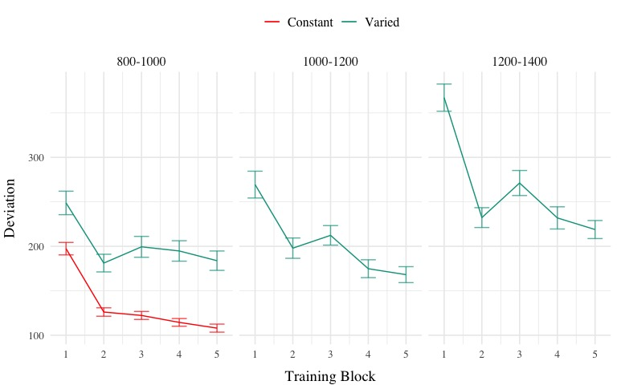

``` r
##| label: tbl-e1-train-dist
##| tbl-cap: "Experiment 1 - Learning curves. "
##| output: asis

bmm_e1_train<- trainE1_max %>% 
  brm(dist ~ condit, 
      file=here("data/model_cache/e1_train_deviation"),
      data = .,
      iter = 2000,
      chains = 4,
      control = list(adapt_delta = .94, max_treedepth = 13))
mtr1 <- as.data.frame(describe_posterior(bmm_e1_train, centrality = "Mean"))[, c(1,2,4,5,6)]
colnames(mtr1) <- c("Term", "Estimate","95% CrI Lower", "95% CrI Upper", "pd")

# mtr1 |> mutate(across(where(is.numeric), \(x) round(x, 2))) |>
#   tibble::remove_rownames() |> 
#   mutate(Term = stringr::str_remove(Term, "b_")) |>
#    kable(booktabs = TRUE)

cdtr1 <- get_coef_details(bmm_e1_train, "conditVaried")
```

| Term         | Estimate | 95% CrI Lower | 95% CrI Upper |  pd |
|:-------------|---------:|--------------:|--------------:|----:|
| Intercept    |   106.34 |         95.46 |        117.25 |   1 |
| conditVaried |    79.64 |         57.92 |        101.63 |   1 |

  

*Training*. <a href="#fig-e1-train-dev" class="quarto-xref">Figure 3</a> displays the average deviations across training blocks for the varied group, which trained on three velocity bands, and the constant group, which trained on one velocity band. To compare the training conditions at the end of training, we analyzed performance on the 800-1000 velocity band, which both groups trained on. The full model results are shown in Table 1. The varied group had a significantly greater deviation than the constant group in the final training block, ($\beta$ = 79.64, 95% CrI \[57.92, 101.63\]; pd = 100%).

``` r
##| label: tbl-e1-bmm-dist
##| tbl-cap: "E1. Training vs. Extrapolation"
#| 
modelFile <- paste0(here::here("data/model_cache/"), "e1_dist_Cond_Type_RF_2")
bmtd <- brm(dist ~ condit * bandType + (1|bandInt) + (1|id), 
    data=testE1, file=modelFile,
    iter=5000,chains=4, control = list(adapt_delta = .94, max_treedepth = 13))
                        
# mted1 <- as.data.frame(describe_posterior(bmtd, centrality = "Mean"))[, c(1,2,4,5,6)]
# colnames(mted1) <- c("Term", "Estimate","95% CrI Lower", "95% CrI Upper", "pd")

# r_bandInt_params <- get_variables(bmtd)[grepl("r_bandInt", get_variables(bmtd))]
# posterior_summary(bmtd,variable=r_bandInt_params)
# 
# r_bandInt_params <- get_variables(bmtd)[grepl("r_id:bandInt", get_variables(bmtd))]
# posterior_summary(bmtd,variable=r_bandInt_params)

# mted1 |> mutate(across(where(is.numeric), \(x) round(x, 2))) |>
#   tibble::remove_rownames() |> 
#   mutate(Term = stringr::str_remove(Term, "b_")) |> kable(booktabs = TRUE)
cdted1 <- get_coef_details(bmtd, "conditVaried")
cdted2 <-get_coef_details(bmtd, "bandTypeExtrapolation")
cdted3 <-get_coef_details(bmtd, "conditVaried:bandTypeExtrapolation")
```

| Term                               | Estimate | 95% CrI Lower | 95% CrI Upper |  pd |
|:-----------------------|-----------:|-----------:|-----------:|-----------:|
| Intercept                          |   152.55 |         70.63 |        229.85 | 1.0 |
| conditVaried                       |    39.00 |        -21.10 |        100.81 | 0.9 |
| bandTypeExtrapolation              |    71.51 |         33.24 |        109.60 | 1.0 |
| conditVaried:bandTypeExtrapolation |    66.46 |         32.76 |         99.36 | 1.0 |

*Testing.* To compare accuracy between groups in the testing stage, we fit a Bayesian mixed effects model predicting deviation from the target band as a function of training condition (varied vs. constant) and band type (trained vs. extrapolation), with random intercepts for participants and bands. The model results are shown in <a href="#tbl-e1-bmm-dist" class="quarto-xref">Table 3</a>. The main effect of training condition was not significant ($\beta$ = 39, 95% CrI \[-21.1, 100.81\]; pd = 89.93%). The extrapolation testing items had a significantly greater deviation than the training bands ($\beta$ = 71.51, 95% CrI \[33.24, 109.6\]; pd = 99.99%). Most importantly, the interaction between training condition and band type was significant ($\beta$ = 66.46, 95% CrI \[32.76, 99.36\]; pd = 99.99%), As shown in <a href="#fig-e1-test-dev" class="quarto-xref">Figure 4</a>, the varied group had disproportionately larger deviations compared to the constant group in the extrapolation bands.

``` r
pe1td <- testE1 |>  ggplot(aes(x = vb, y = dist,fill=condit)) +
    stat_summary(geom = "bar", position=position_dodge(), fun = mean) +
    stat_summary(geom = "errorbar", position=position_dodge(.9), fun.data = mean_se, width = .4, alpha = .7) + 
  theme(legend.title=element_blank(),axis.text.x = element_text(angle = 45, hjust = 0.5, vjust = 0.5)) +
  labs(x="Band", y="Deviation From Target Band")

condEffects <- function(m,xvar){
  m |> ggplot(aes(x = {{xvar}}, y = .value, color = condit, fill = condit)) + 
  stat_dist_pointinterval() + 
  stat_halfeye(alpha=.1, height=.5) +
  theme(legend.title=element_blank(),axis.text.x = element_text(angle = 45, hjust = 0.5, vjust = 0.5)) 
  
}

pe1ce <- bmtd |> emmeans( ~condit + bandType) |>
  gather_emmeans_draws() |>
 condEffects(bandType) + labs(y="Absolute Deviation From Target Band", x="Band Type")

p2 <- (pe1td + pe1ce) + plot_annotation(tag_levels= 'A')
#ggsave(here::here("Assets/figs", "e1_test-dev.png"), p2, width=8, height=4, bg="white")
p2
```

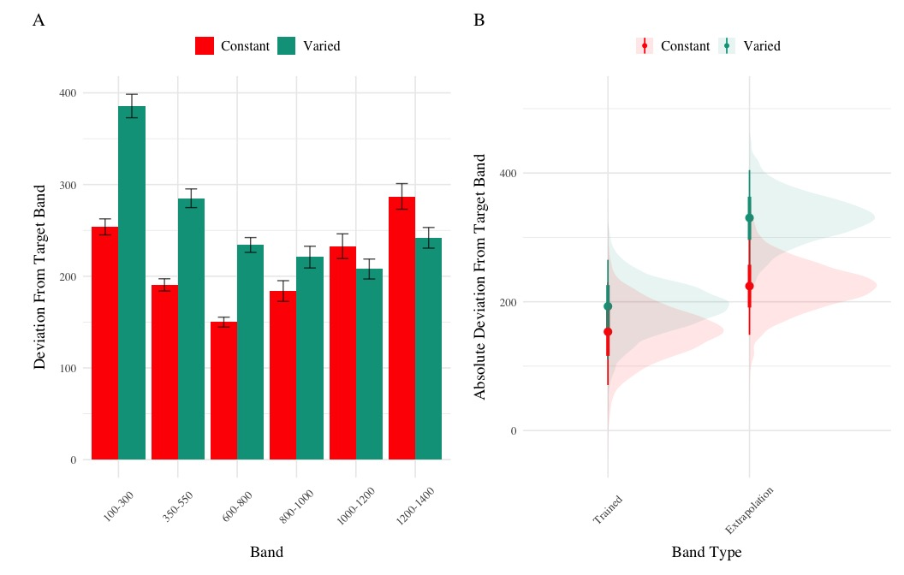

``` r
##| label: tbl-e1-bmm-vx
##| tbl-cap: "Experiment 1. Bayesian Mixed Model Predicting Vx as a function of condition (Constant vs. Varied) and Velocity Band"
e1_vxBMM <- brm(vx ~ condit * bandInt + (1 + bandInt|id),
                        data=test,file=paste0(here::here("data/model_cache", "e1_testVxBand_RF_5k")),
                        iter=5000,chains=4,silent=0,
                        control=list(adapt_delta=0.94, max_treedepth=13))

#GetModelStats(e1_vxBMM) |> kable(booktabs = TRUE)

cd1 <- get_coef_details(e1_vxBMM, "conditVaried")
sc1 <- get_coef_details(e1_vxBMM, "bandInt")
intCoef1 <- get_coef_details(e1_vxBMM, "conditVaried:bandInt")
```

  

| Term         | Estimate | 95% CrI Lower | 95% CrI Upper |   pd |
|:-------------|---------:|--------------:|--------------:|-----:|
| Intercept    |   408.55 |        327.00 |        490.61 | 1.00 |
| conditVaried |   164.05 |         45.50 |        278.85 | 1.00 |
| Band         |     0.71 |          0.62 |          0.80 | 1.00 |
| condit\*Band |    -0.14 |         -0.26 |         -0.01 | 0.98 |

Finally, to assess the ability of both conditions to discriminate between velocity bands, we fit a model predicting velocity as a function of training condition and velocity band, with random intercepts and random slopes for each participant. See <a href="#tbl-e1-bmm-vx" class="quarto-xref">Table 4</a> for the full model results. The estimated coefficient for training condition ($\beta$ = 164.05, 95% CrI \[45.5, 278.85\], pd = 99.61%) suggests that the varied group tends to produce harder throws than the constant group, though is not in and of itself useful for assessing discrimination. Most relevant to the issue of discrimination is the coefficient on the Band predictor ($\beta$ = 0.71 95% CrI \[0.62, 0.8\], pd = 100%). Although the median slope does fall underneath the ideal of value of 1, the fact that the 95% credible interval does not contain 0 provides strong evidence that participants exhibited some discrimination between bands. The significant negative estimate for the interaction between slope and condition ($\beta$ = -0.14, 95% CrI \[-0.26, -0.01\], pd = 98.39%), suggests that the discrimination was modulated by training condition, with the varied participants showing less sensitivity between bands than the constant condition (see <a href="#fig-e1-test-vx" class="quarto-xref">Figure 5</a> and <a href="#fig-e1-bmm-vx" class="quarto-xref">Figure 6</a>).

``` r
testE1 %>% group_by(id,vb,condit) |> plot_distByCondit()
```

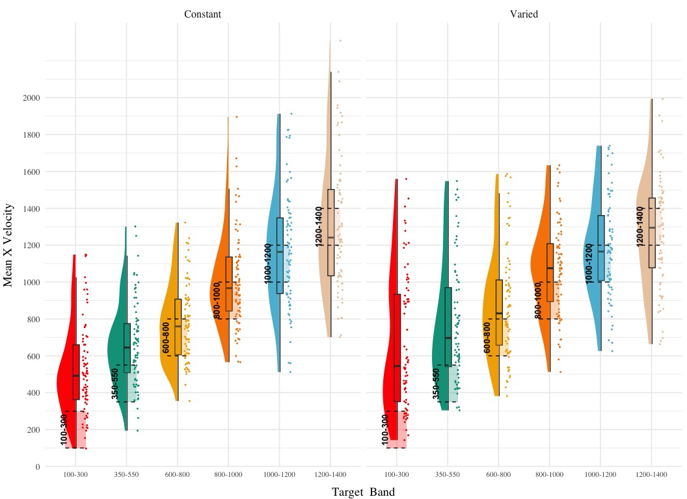

``` r
pe1vce <- e1_vxBMM |> emmeans( ~condit + bandInt,re_formula=NA, 
                       at = list(bandInt = c(100, 350, 600, 800, 1000, 1200))) |>
  gather_emmeans_draws() |> 
  condEffects(bandInt) +
  stat_lineribbon(alpha = .25, size = 1, .width = c(.95)) +
  scale_x_continuous(breaks = c(100, 350, 600, 800, 1000, 1200), 
                     labels = levels(testE1$vb), 
                     limits = c(0, 1400)) + 
  scale_y_continuous(expand=expansion(add=100),breaks=round(seq(0,2000,by=200),2)) +
  theme(legend.title=element_blank()) + 
  labs(y="Velcoity", x="Band")

fe <- fixef(e1_vxBMM)[,1]
fixed_effect_bandInt <- fixef(e1_vxBMM)[,1]["bandInt"]
fixed_effect_interaction <- fixef(e1_vxBMM)[,1]["conditVaried:bandInt"]

re <- data.frame(ranef(e1_vxBMM, pars = "bandInt")$id[, ,'bandInt']) |> 
  rownames_to_column("id") |> 
  left_join(e1Sbjs,by="id") |>
  mutate(adjust= fixed_effect_bandInt + fixed_effect_interaction*(condit=="Varied"),slope = Estimate + adjust )


pid_den1 <- ggplot(re, aes(x = slope, fill = condit)) + 
  geom_density(alpha=.5) + 
  geom_vline(xintercept = 1, linetype="dashed",alpha=.5) +
  xlim(c(min(re$slope)-.3, max(re$slope)+.3))+
   theme(legend.title=element_blank()) + 
  labs(x="Slope Coefficient",y="Density")

pid_slopes1 <- re |>  mutate(id=reorder(id,slope)) |>
  ggplot(aes(y=id, x=slope,fill=condit,color=condit)) + 
    geom_pointrange(aes(xmin=Q2.5+adjust, xmax=Q97.5+adjust)) + 
  geom_vline(xintercept = 1, linetype="dashed",alpha=.5) +
     theme(legend.title=element_blank(), 
           axis.text.y = element_text(size=6) ) + 
    labs(x="Estimated Slope", y="Participant")  + 
    ggh4x::facet_wrap2(~condit,axes="all",scales="free_y")


p3 <- (pe1vce + pid_den1 + pid_slopes1) + plot_annotation(tag_levels= 'A')
#ggsave(here::here("Assets/figs", "e1_test-vx.png"), p3,width=9,height=11, bg="white",dpi=600)
p3
```

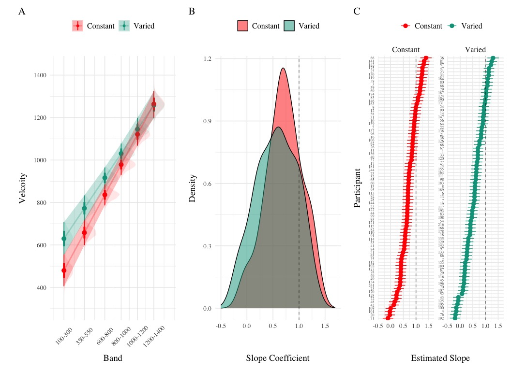

## E1 Summary

In Experiment 1, we investigated how variability in training influenced participants' ability learn and extrapolate in a visuomotor task. Our findings that training with variable conditions resulted in lower final training performance are consistent with much of the prior research on the influence of training variability ([Raviv et al., 2022](#ref-ravivHowVariabilityShapes2022); [Soderstrom & Bjork, 2015](#ref-soderstromLearningPerformanceIntegrative2015)), and is particularly unsurprising in the present work, given that the constant group received three times the amount of training on the velocity band common to the two conditions.

More importantly, the varied training group exhibited significantly larger deviations from the target velocity bands during the testing phase, particularly for the extrapolation bands that were not encountered by either condition during training.

## Experiment 2

``` r
# walk(c("brms","dplyr","bayestestR"), conflict_prefer_all, quiet = TRUE)
# walk(c("Display_Functions","org_functions"), ~ source(here::here(paste0("Functions/", .x, ".R"))))
e2 <- readRDS(here("data/e2_08-04-23.rds")) 
e2Sbjs <- e2 |> group_by(id,condit) |> summarise(n=n())
testE2 <- e2 |> filter(expMode2 == "Test")
nbins=5
trainE2 <-  e2 |> filter(expMode2=="Train") |> group_by(id,condit, vb) |> 
    mutate(Trial_Bin = cut( gt.train, breaks = seq(1, max(gt.train),length.out=nbins+1),include.lowest = TRUE, labels=FALSE)) 
trainE2_max <- trainE2 |> filter(Trial_Bin == nbins, bandInt==600)

# e2 |> group_by(condit, bandOrder) |> summarise(n_distinct(id))
```

### Methods & Procedure

The task and procedure of Experiment 2 was identical to Experiment 1, with the exception that the training and testing bands were reversed (see **?@fig-design-e2**). The Varied group trained on bands 100-300, 350-550, 600-800, and the constant group trained on band 600-800. Both groups were tested from all six bands. A total of 110 participants completed the experiment (Varied: 55, Constant: 55).

### Results

``` r
p1 <- trainE2 |> ggplot(aes(x = Trial_Bin, y = dist, color = condit)) +
    stat_summary(geom = "line", fun = mean) +
    stat_summary(geom = "errorbar", fun.data = mean_se, width = .4, alpha = .7) +
    facet_wrap(~vb)+
    scale_x_continuous(breaks = seq(1, nbins + 1)) +
    theme(legend.title=element_blank()) + 
    labs(y = "Deviation", x="Training Block") 
#ggsave(here("Assets/figs/e2_train_deviation.png"), p1, width = 8, height = 4,bg="white")
p1
```

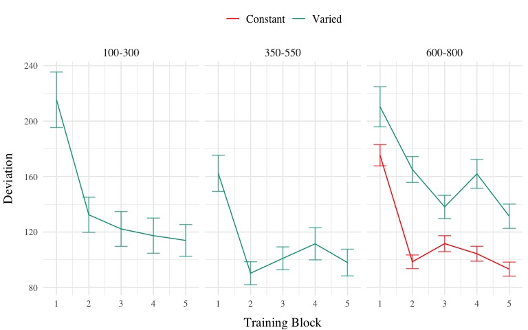

``` r
bmm_e2_train <- trainE2_max %>% 
  brm(dist ~ condit, 
      file=here("data/model_cache/e2_train_deviation"),
      data = .,
      iter = 2000,
      chains = 4,
      control = list(adapt_delta = .94, max_treedepth = 13))

mtr2 <- as.data.frame(describe_posterior(bmm_e2_train, centrality = "Mean"))[, c(1,2,4,5,6)]
colnames(mtr2) <- c("Term", "Estimate","95% CrI Lower", "95% CrI Upper", "pd")

cdtr2 <- get_coef_details(bmm_e2_train, "conditVaried")
# mtr2 |> mutate(across(where(is.numeric), \(x) round(x, 2))) |>
#   tibble::remove_rownames() |> 
#   mutate(Term = stringr::str_remove(Term, "b_")) |>
#   kable(escape=F,booktabs=T) 
```

| Term         | Estimate | 95% CrI Lower | 95% CrI Upper |  pd |
|:-------------|---------:|--------------:|--------------:|----:|
| Intercept    |    91.01 |         80.67 |        101.26 |   1 |
| conditVaried |    36.15 |         16.35 |         55.67 |   1 |

  

*Training*. <a href="#fig-e2-train-dev" class="quarto-xref">Figure 7</a> presents the deviations across training blocks for both constant and varied training groups. We again compared training performance on the band common to both groups (600-800). The full model results are shown in Table 1. The varied group had a significantly greater deviation than the constant group in the final training block, ( $\beta$ = 36.15, 95% CrI \[16.35, 55.67\]; pd = 99.95%).

``` r
modelFile <- paste0(here::here("data/model_cache/"), "e2_dist_Cond_Type_RF_2")
bmtd2 <- brm(dist ~ condit * bandType + (1|bandInt) + (1|id), 
    data=testE2, file=modelFile,
    iter=5000,chains=4, control = list(adapt_delta = .94, max_treedepth = 13))
                        
# mted2 <- as.data.frame(describe_posterior(bmtd2, centrality = "Mean"))[, c(1,2,4,5,6)]
# colnames(mted2) <- c("Term", "Estimate","95% CrI Lower", "95% CrI Upper", "pd")
# mted2 |> mutate(across(where(is.numeric), \(x) round(x, 2))) |>
#   tibble::remove_rownames() |> 
#   mutate(Term = stringr::str_remove(Term, "b_")) |>
#   kable(booktabs=TRUE) 

cd2ted1 <- get_coef_details(bmtd2, "conditVaried")
cd2ted2 <-get_coef_details(bmtd2, "bandTypeExtrapolation")
cd2ted3 <-get_coef_details(bmtd2, "conditVaried:bandTypeExtrapolation")
```

| Term                               | Estimate | 95% CrI Lower | 95% CrI Upper |   pd |
|:-----------------------------|---------:|-------------:|-------------:|-----:|
| Intercept                          |   190.91 |        125.03 |        259.31 | 1.00 |
| conditVaried                       |   -20.58 |        -72.94 |         33.08 | 0.78 |
| bandTypeExtrapolation              |    38.09 |         -6.94 |         83.63 | 0.95 |
| conditVaried:bandTypeExtrapolation |    82.00 |         41.89 |        121.31 | 1.00 |

   

*Testing Accuracy.* The analysis of testing accuracy examined deviations from the target band as influenced by training condition (Varied vs. Constant) and band type (training vs. extrapolation bands). The results, summarized in <a href="#tbl-e2-bmm-dist" class="quarto-xref">Table 6</a>, reveal no significant main effect of training condition ($\beta$ = -20.58, 95% CrI \[-72.94, 33.08\]; pd = 77.81%). However, the interaction between training condition and band type was significant ($\beta$ = 82, 95% CrI \[41.89, 121.31\]; pd = 100%), with the varied group showing disproportionately larger deviations compared to the constant group on the extrapolation bands (see <a href="#fig-e2-test-dev" class="quarto-xref">Figure 8</a>).

``` r
condEffects <- function(m,xvar){
  m |> ggplot(aes(x = {{xvar}}, y = .value, color = condit, fill = condit)) + 
  stat_dist_pointinterval() + 
  stat_halfeye(alpha=.1, height=.5) +
  theme(legend.title=element_blank(),axis.text.x = element_text(angle = 45, hjust = 0.5, vjust = 0.5)) 
  
}
pe2td <- testE2 |>  ggplot(aes(x = vb, y = dist,fill=condit)) +
    stat_summary(geom = "bar", position=position_dodge(), fun = mean) +
    stat_summary(geom = "errorbar", position=position_dodge(.9), fun.data = mean_se, width = .4, alpha = .7) + 
  theme(legend.title=element_blank(),axis.text.x = element_text(angle = 45, hjust = 0.5, vjust = 0.5)) +
  labs(x="Band", y="Deviation From Target")


pe2ce <- bmtd2 |> emmeans( ~condit + bandType) |>
  gather_emmeans_draws() |>
 condEffects(bandType) + labs(y="Absolute Deviation From Band", x="Band Type")

p2 <- (pe2td + pe2ce) + plot_annotation(tag_levels= 'A')
#ggsave(here::here("Assets/figs", "e2_test-dev.png"), p2, width=8, height=4, bg="white")
p2
```

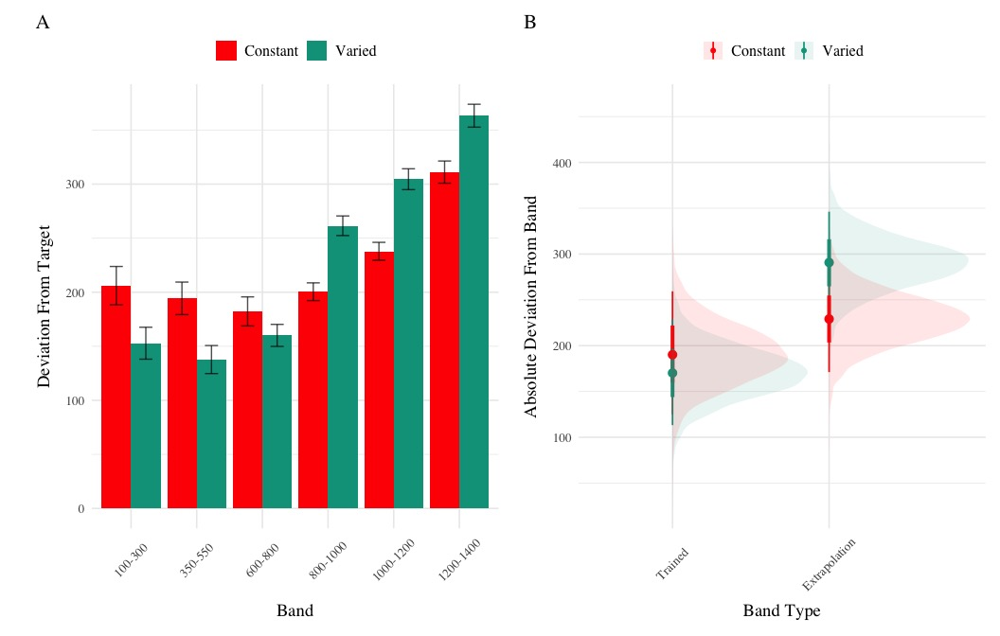

``` r
##| label: tbl-e2-bmm-vx
##| tbl-cap: "Experiment 2. Bayesian Mixed Model Predicting Vx as a function of condition (Constant vs. Varied) and Velocity Band"

e2_vxBMM <- brm(vx ~ condit * bandInt + (1 + bandInt|id),
                        data=test,file=paste0(here::here("data/model_cache", "e2_testVxBand_RF_5k")),
                        iter=5000,chains=4,silent=0,
                        control=list(adapt_delta=0.94, max_treedepth=13))

#GetModelStats(e2_vxBMM ) |> kable(escape=F,booktabs=T, caption="Fit to all 6 bands")

cd2 <- get_coef_details(e2_vxBMM, "conditVaried")
sc2 <- get_coef_details(e2_vxBMM, "bandInt")
intCoef2 <- get_coef_details(e2_vxBMM, "conditVaried:bandInt")
```

| Term         | Estimate | 95% CrI Lower | 95% CrI Upper |   pd |
|:-------------|---------:|--------------:|--------------:|-----:|
| Intercept    |   362.64 |        274.85 |        450.02 | 1.00 |
| conditVaried |    -8.56 |       -133.97 |        113.98 | 0.55 |
| Band         |     0.71 |          0.58 |          0.84 | 1.00 |
| condit\*Band |    -0.06 |         -0.24 |          0.13 | 0.73 |

*Testing Discrimination.* Finally, to assess the ability of both conditions to discriminate between velocity bands, we fit a model predicting velocity as a function of training condition and velocity band, with random intercepts and random slopes for each participant. The full model results are shown in <a href="#tbl-e2-bmm-vx" class="quarto-xref">Table 7</a>. The overall slope on target velocity band predictor was significantly positive, ($\beta$ = 0.71, 95% CrI \[0.58, 0.84\]; pd= 100%), indicating that participants exhibited discrimination between bands. The interaction between slope and condition was not significant, ($\beta$ = -0.06, 95% CrI \[-0.24, 0.13\]; pd= 72.67%), suggesting that the two conditions did not differ in their ability to discriminate between bands (see <a href="#fig-e2-test-vx" class="quarto-xref">Figure 9</a> and <a href="#fig-e2-bmm-vx" class="quarto-xref">Figure 10</a>).

``` r
testE2 %>% group_by(id,vb,condit) |> plot_distByCondit()
```


``` r
condEffects <- function(m,xvar){
  m |> ggplot(aes(x = {{xvar}}, y = .value, color = condit, fill = condit)) + 
  stat_dist_pointinterval() + 
  stat_halfeye(alpha=.1, height=.5) +
  theme(legend.title=element_blank(),axis.text.x = element_text(angle = 45, hjust = 0.5, vjust = 0.5)) 
}

pe2vce <- e2_vxBMM |> emmeans( ~condit + bandInt,re_formula=NA, 
                       at = list(bandInt = c(100, 350, 600, 800, 1000, 1200))) |>
  gather_emmeans_draws() |> 
  condEffects(bandInt) +
  stat_lineribbon(alpha = .25, size = 1, .width = c(.95)) +
  scale_x_continuous(breaks = c(100, 350, 600, 800, 1000, 1200), 
                     labels = levels(testE2$vb), 
                     limits = c(0, 1400)) + 
scale_y_continuous(expand=expansion(add=100),breaks=round(seq(0,2000,by=200),2)) +
  theme(legend.title=element_blank()) + 
  labs(y="Velcoity", x="Band")

fe <- fixef(e2_vxBMM)[,1]
fixed_effect_bandInt <- fixef(e2_vxBMM)[,1]["bandInt"]
fixed_effect_interaction <- fixef(e2_vxBMM)[,1]["conditVaried:bandInt"]

re <- data.frame(ranef(e2_vxBMM, pars = "bandInt")$id[, ,'bandInt']) |> 
  rownames_to_column("id") |> 
  left_join(e2Sbjs,by="id") |>
  mutate(adjust= fixed_effect_bandInt + fixed_effect_interaction*(condit=="Varied"),slope = Estimate + adjust )

pid_den2 <- ggplot(re, aes(x = slope, fill = condit)) + 
  geom_density(alpha=.5) + 
  geom_vline(xintercept = 1, linetype="dashed",alpha=.5) +
  xlim(c(min(re$slope)-.3, max(re$slope)+.3))+
   theme(legend.title=element_blank()) + 
  labs(x="Slope Coefficient",y="Density")

pid_slopes2 <- re |>  mutate(id=reorder(id,slope)) |>
  ggplot(aes(y=id, x=slope,fill=condit,color=condit)) + 
    geom_pointrange(aes(xmin=Q2.5+adjust, xmax=Q97.5+adjust)) + 
  geom_vline(xintercept = 1, linetype="dashed",alpha=.5) +
      theme(legend.title=element_blank(), 
        axis.text.y = element_text(size=6) ) + 
    labs(x="Estimated Slope", y="Participant")  + 
    ggh4x::facet_wrap2(~condit,axes="all",scales="free_y")

p3 <- (pe2vce + pid_den2 + pid_slopes2) + plot_annotation(tag_levels= 'A')
#ggsave(here::here("Assets/figs", "e2_test-vx.png"), p3,width=9,height=11, bg="white",dpi=600)
p3
```

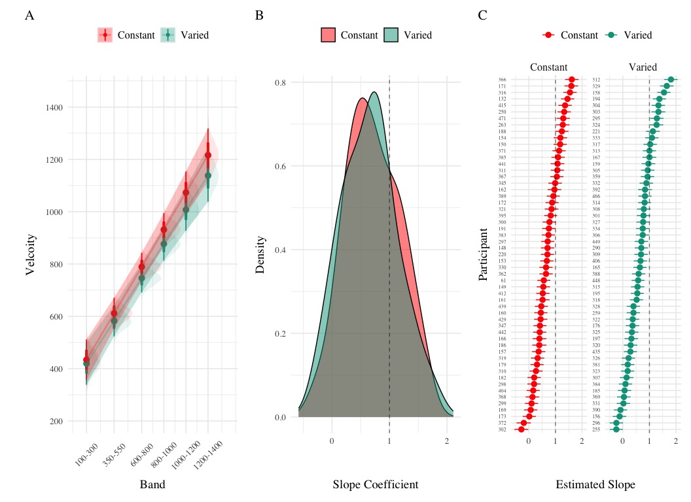

### Experiment 2 Summary

Experiment 2 extended the findings of Experiment 1 by examining the effects of training variability on extrapolation performance in a visuomotor function learning task, but with reversed training and testing bands. Similar to Experiment 1, the Varied group exhibited poorer performance during training and testing. However unlike experiment 1, the Varied group did not show a significant difference in discrimination between bands.

## Experiment 3

``` r
e3 <- readRDS(here("data/e3_08-04-23.rds")) |> 
    mutate(trainCon=case_when(
    bandOrder=="Original" ~ "800",
    bandOrder=="Reverse" ~ "600",
    TRUE ~ NA_character_
    ), trainCon=as.numeric(trainCon)) 
e3Sbjs <- e3 |> group_by(id,condit,bandOrder) |> summarise(n=n())
testE3 <- e3 |> filter(expMode2 == "Test")
nbins=5
trainE3 <-  e3 |> filter(expMode2=="Train") |> group_by(id,condit,bandOrder, vb) |> 
    mutate(Trial_Bin = cut( gt.train, breaks = seq(1, max(gt.train),length.out=nbins+1),include.lowest = TRUE, labels=FALSE)) 
trainE3_max <- trainE3 |> filter(Trial_Bin == nbins, bandInt==trainCon)
```

### Methods & Procedure

The major adjustment of Experiment 3 is for participants to receive ordinal feedback during training, in contrast to the continuous feedback of the prior experiments. After each training throw, participants are informed whether a throw was too soft, too hard, or correct (i.e. within the target velocity range). All other aspects of the task and design are identical to Experiments 1 and 2. We utilized the order of training and testing bands from both of the prior experiments, thus assigning participants to both an order condition (Original or Reverse) and a training condition (Constant or Varied). Participants were once again recruited from the online Indiana University Introductory Psychology Course pool. Following exclusions, 195 participants were included in the final analysis, n=51 in the Constant-Original condition, n=59 in the Constant-Reverse condition, n=39 in the Varied-Original condition, and n=46 in the Varied-Reverse condition.

### Results

``` r
bmm_e3_train <- trainE3_max %>% 
  brm(dist ~ condit*bandOrder, 
      file=here("data/model_cache/e3_train_deviation"),
      data = .,
      iter = 2000,
      chains = 4,
      control = list(adapt_delta = .94, max_treedepth = 13))

# mtr3 <- as.data.frame(describe_posterior(bmm_e3_train, centrality = "Mean"))[, c(1,2,4,5,6)]
# colnames(mtr3) <- c("Term", "Estimate","95% CrI Lower", "95% CrI Upper", "pd")
# mtr3 |> mutate(across(where(is.numeric), \(x) round(x, 2))) |>
#   tibble::remove_rownames() |> 
#   mutate(Term = stringr::str_remove(Term, "b_")) |>
#   kable(escape=F,booktabs=T) 

cd3tr1 <- get_coef_details(bmm_e3_train, "conditVaried")
cd3tr2 <-get_coef_details(bmm_e3_train, "bandOrderReverse")
cd3tr3 <-get_coef_details(bmm_e3_train, "conditVaried:bandOrderReverse")
```

| Term                          | Estimate | 95% CrI Lower | 95% CrI Upper |   pd |
|:---------------------------|---------:|-------------:|-------------:|------:|
| Intercept                     |   121.86 |        109.24 |        134.60 | 1.00 |
| conditVaried                  |    64.93 |         36.99 |         90.80 | 1.00 |
| bandOrderReverse              |     1.11 |        -16.02 |         18.16 | 0.55 |
| conditVaried:bandOrderReverse |   -77.02 |       -114.16 |        -39.61 | 1.00 |

*Training*. <a href="#fig-e3-train-dev" class="quarto-xref">Figure 11</a> displays the average deviations from the target band across training blocks, and <a href="#tbl-e3-train-dist" class="quarto-xref">Table 8</a> shows the results of the Bayesian regression model predicting the deviation from the common band at the end of training (600-800 for reversed order, and 800-1000 for original order conditions). The main effect of training condition is significant, with the varied condition showing larger deviations ( $\beta$ = 64.93, 95% CrI \[36.99, 90.8\]; pd = 100%). The main effect of band order is not significant $\beta$ = 1.11, 95% CrI \[-16.02, 18.16\]; pd = 55.4%, however the interaction between training condition and band order is significant, with the varied condition showing greater accuracy in the reverse order condition ( $\beta$ = -77.02, 95% CrI \[-114.16, -39.61\]; pd = 100%).

``` r
p1 <- trainE3 |> ggplot(aes(x = Trial_Bin, y = dist, color = condit)) +
    stat_summary(geom = "line", fun = mean) +
    stat_summary(geom = "errorbar", fun.data = mean_se, width = .4, alpha = .7) +
    ggh4x::facet_nested_wrap(~bandOrder*vb,ncol=3)+
    scale_x_continuous(breaks = seq(1, nbins + 1)) +
    theme(legend.title=element_blank()) + 
    labs(y = "Absolute Deviation", x="Training Block") 
#ggsave(here("Assets/figs/e3_train_deviation.png"), p1, width = 9, height = 8,bg="white")
p1
```


``` r
#options(brms.backend="cmdstanr",mc.cores=4)
modelFile <- paste0(here::here("data/model_cache/"), "e3_dist_Cond_Type_RF_2")
bmtd3 <- brm(dist ~ condit * bandType*bandOrder + (1|bandInt) + (1|id), 
    data=testE3, file=modelFile,
    iter=5000,chains=4, control = list(adapt_delta = .94, max_treedepth = 13))
                        
# mted3 <- as.data.frame(describe_posterior(bmtd3, centrality = "Mean"))[, c(1,2,4,5,6)]
# colnames(mted3) <- c("Term", "Estimate","95% CrI Lower", "95% CrI Upper", "pd")
# mted3 |> mutate(across(where(is.numeric), \(x) round(x, 2))) |>
#   tibble::remove_rownames() |> 
#   mutate(Term = stringr::str_remove(Term, "b_")) |>
#   kable(booktabs=TRUE) 

#ce_bmtd3 <- plot(conditional_effects(bmtd3),points=FALSE,plot=FALSE)
#wrap_plots(ce_bmtd3)

#ggsave(here::here("Assets/figs", "e3_cond_effects_dist.png"), wrap_plots(ce_bmtd3), width=11, height=11, bg="white")

cd3ted1 <- get_coef_details(bmtd3, "conditVaried")
cd3ted2 <-get_coef_details(bmtd3, "bandTypeExtrapolation")
cd3ted3 <-get_coef_details(bmtd3, "conditVaried:bandTypeExtrapolation")
cd3ted4 <-get_coef_details(bmtd3, "bandOrderReverse")
cd3ted5 <-get_coef_details(bmtd3, "conditVaried:bandOrderReverse")
cd3ted6 <-get_coef_details(bmtd3, "bandTypeExtrapolation:bandOrderReverse")
cd3ted7 <-get_coef_details(bmtd3, "conditVaried:bandTypeExtrapolation:bandOrderReverse")
```

| Term | Estimate | 95% CrI Lower | 95% CrI Upper | pd |
|:------------------------------------|-------:|-----------:|-----------:|-----:|
| Intercept | 288.65 | 199.45 | 374.07 | 1.00 |
| conditVaried | -40.19 | -104.68 | 23.13 | 0.89 |
| bandTypeExtrapolation | -23.35 | -57.28 | 10.35 | 0.92 |
| bandOrderReverse | -73.72 | -136.69 | -11.07 | 0.99 |
| **conditVaried:bandTypeExtrapolation** | 52.66 | 14.16 | 90.23 | 1.00 |
| conditVaried:bandOrderReverse | -37.48 | -123.28 | 49.37 | 0.80 |
| bandTypeExtrapolation:bandOrderReverse | 80.69 | 30.01 | 130.93 | 1.00 |
| conditVaried:bandTypeExtrapolation:bandOrder | 30.42 | -21.00 | 81.65 | 0.87 |

*Testing Accuracy.* <a href="#tbl-e3-bmm-dist" class="quarto-xref">Table 9</a> presents the results of the Bayesian mixed efects model predicting absolute deviation from the target band during the testing stage. There was no significant main effect of training condition,$\beta$ = -40.19, 95% CrI \[-104.68, 23.13\]; pd = 89.31%, or band type,$\beta$ = -23.35, 95% CrI \[-57.28, 10.35\]; pd = 91.52%. However the effect of band order was significant, with the reverse order condition showing lower deviations, $\beta$ = -73.72, 95% CrI \[-136.69, -11.07\]; pd = 98.89%. The interaction between training condition and band type was also significant $\beta$ = 52.66, 95% CrI \[14.16, 90.23\]; pd = 99.59%, with the varied condition showing disproprionately large deviations on the extrapolation bands compared to the constant group. There was also a significant interaction between band type and band order, $\beta$ = 80.69, 95% CrI \[30.01, 130.93\]; pd = 99.89%, such that the reverse order condition showed larger deviations on the extrapolation bands. No other interactions were significant.

<!-- ::: {#fig-e3-test-condEffect}


E3. A) Deviations from target band during testing without feedback stage. B) Estimated marginal means for the interaction between training condition and band type. Error bars represent 95% confidence intervals.
::: -->

``` r
condEffects <- function(m,xvar){
  m |> ggplot(aes(x = {{xvar}}, y = .value, color = condit, fill = condit)) + 
  stat_dist_pointinterval() + 
  stat_halfeye(alpha=.1, height=.5) +
  theme(legend.title=element_blank(),axis.text.x = element_text(angle = 45, hjust = 0.5, vjust = 0.5)) 
  
}

pe3td <- testE3 |>  ggplot(aes(x = vb, y = dist,fill=condit)) +
    stat_summary(geom = "bar", position=position_dodge(), fun = mean) +
    stat_summary(geom = "errorbar", position=position_dodge(.9), fun.data = mean_se, width = .4, alpha = .7) + 
    facet_wrap(~bandOrder,ncol=1) +
  theme(legend.title=element_blank(),axis.text.x = element_text(angle = 45, hjust = 0.5, vjust = 0.5)) +
  labs(x="Band", y="Deviation From Target")


pe3ce <- bmtd3 |> emmeans( ~condit *bandOrder*bandType) |>
  gather_emmeans_draws() |>
 condEffects(bandType) + labs(y="Absolute Deviation From Band", x="Band Type") + 
 facet_wrap(~bandOrder,ncol=1)

p2 <- pe3td + pe3ce + plot_annotation(tag_levels= 'A')
#ggsave(here::here("Assets/figs", "e3_test-dev.png"), p2, width=9, height=8, bg="white")
p2
```

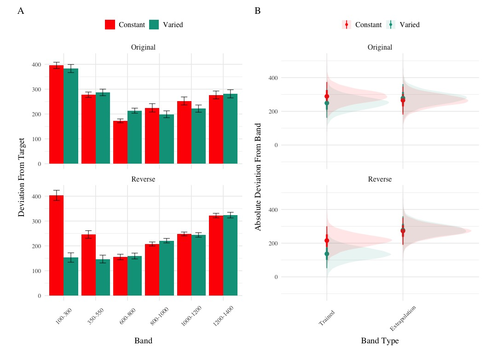

``` r
##| label: tbl-e3-bmm-vx
##| tbl-cap: "Experiment 3. Bayesian Mixed Model Predicting Vx as a function of condition (Constant vs. Varied) and Velocity Band"

e3_vxBMM <- brm(vx ~ condit * bandOrder * bandInt + (1 + bandInt|id),
                        data=test,file=paste0(here::here("data/model_cache", "e3_testVxBand_RF_5k")),
                        iter=5000,chains=4,silent=0,
                        control=list(adapt_delta=0.94, max_treedepth=13))

# m1 <- as.data.frame(describe_posterior(e3_vxBMM, centrality = "Mean"))
# m2 <- fixef(e3_vxBMM)
# mp3 <- m1[, c(1,2,4,5,6)]
# colnames(mp3) <- c("Term", "Estimate","95% CrI Lower", "95% CrI Upper", "pd")                       
# mp3 |> mutate(across(where(is.numeric), \(x) round(x, 2))) |>
#   tibble::remove_rownames() |> 
#   mutate(Term = stringr::str_replace_all(Term, "b_bandInt", "Band")) |>
#   mutate(Term = stringr::str_remove(Term, "b_")) |>
#   kable(escape=F,booktabs=T)

#wrap_plots(plot(conditional_effects(e3_vxBMM),points=FALSE,plot=FALSE))

cd1 <- get_coef_details(e3_vxBMM, "conditVaried")
sc1 <- get_coef_details(e3_vxBMM, "bandInt")
intCoef1 <- get_coef_details(e3_vxBMM, "conditVaried:bandInt")
intCoef2 <- get_coef_details(e3_vxBMM, "bandOrderReverse:bandInt")
coef3 <- get_coef_details(e3_vxBMM,"conditVaried:bandOrderReverse:bandInt")
```

| Term | Estimate | 95% CrI Lower | 95% CrI Upper | pd |
|:--------------------------------|--------:|------------:|------------:|-----:|
| Intercept | 601.83 | 504.75 | 699.42 | 1.00 |
| conditVaried | 12.18 | -134.94 | 162.78 | 0.56 |
| bandOrderReverse | 13.03 | -123.89 | 144.67 | 0.58 |
| **Band** | 0.49 | 0.36 | 0.62 | 1.00 |
| **conditVaried:bandOrderReverse** | -338.15 | -541.44 | -132.58 | 1.00 |
| conditVaried:Band | -0.04 | -0.23 | 0.15 | 0.67 |
| bandOrderReverse:band | -0.10 | -0.27 | 0.08 | 0.86 |
| **conditVaried:bandOrderReverse:band** | 0.42 | 0.17 | 0.70 | 1.00 |

*Testing Discrimination.* The full results of the discrimination model are presented in <a href="#tbl-e3-bmm-dist" class="quarto-xref">Table 9</a>. For the purposes of assessing group differences in discrimination, only the coefficients including the band variable are of interest. The baseline effect of band represents the slope cofficient for the constant training - original order condition, this effect was significant $\beta$ = 0.49, 95% CrI \[0.36, 0.62\]; pd = 100%. Neither of the two way interactions reached significance, $\beta$ = -0.04, 95% CrI \[-0.23, 0.15\]; pd = 66.63%, $\beta$ = -0.1, 95% CrI \[-0.27, 0.08\]; pd = 86.35%. However, the three way interaction between training condition, band order, and target band was significant, $\beta$ = 0.42, 95% CrI \[0.17, 0.7\]; pd = 99.96% - indicating a greater slope for the varied condition trained with reverse order bands. This interaction is shown in <a href="#fig-e3-test-vx" class="quarto-xref">Figure 13</a>, where the steepness of the best fitting line for the varied-reversed condition is noticably steeper than the other conditions.

``` r
##| column: screen-inset-right
# testE3 |> filter(bandOrder=="Original")|> group_by(id,vb,condit) |> plot_distByCondit()
# testE3 |> filter(bandOrder=="Reverse")|> group_by(id,vb,condit) |> plot_distByCondit() +ggtitle("test")

testE3 |> group_by(id,vb,condit,bandOrder) |> plot_distByCondit() + 
   ggh4x::facet_nested_wrap(bandOrder~condit,scale="free_x")
```

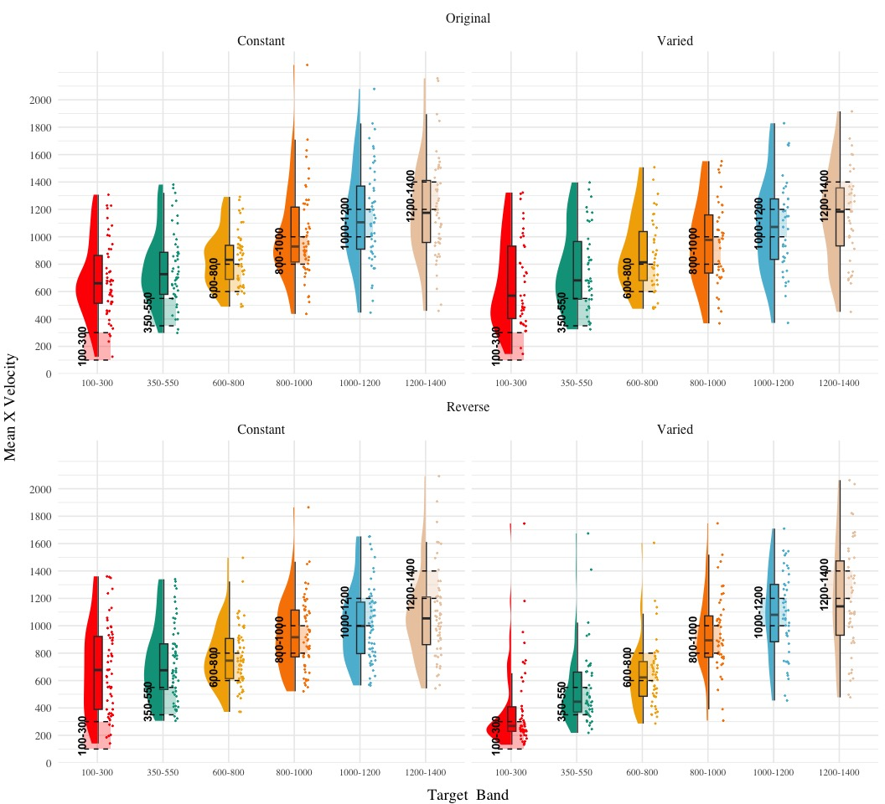



``` r
# pe3tv <- testE3 %>% group_by(id,vb,condit,bandOrder) |> plot_distByCondit() + ggh4x::facet_nested_wrap(bandOrder~condit,scale="free_x")


condEffects <- function(m,xvar){
  m |> ggplot(aes(x = {{xvar}}, y = .value, color = condit, fill = condit)) + 
  stat_dist_pointinterval() + 
  stat_halfeye(alpha=.1, height=.5) +
  theme(legend.title=element_blank(),axis.text.x = element_text(angle = 45, hjust = 0.5, vjust = 0.5)) 
  
}

pe3vce <- e3_vxBMM |> emmeans( ~condit* bandOrder* bandInt, 
                       at = list(bandInt = c(100, 350, 600, 800, 1000, 1200))) |>
  gather_emmeans_draws() |> 
  condEffects(bandInt) +
  facet_wrap(~bandOrder,ncol=1) +
  stat_lineribbon(alpha = .25, size = 1, .width = c(.95)) +
  scale_x_continuous(breaks = c(100, 350, 600, 800, 1000, 1200), 
                     labels = levels(testE3$vb), 
                     limits = c(0, 1400)) + 
scale_y_continuous(expand=expansion(add=100),breaks=round(seq(0,2000,by=200),2)) +
  theme(legend.title=element_blank()) + 
  labs(y="Velcoity", x="Band")

fe <- fixef(e3_vxBMM)[,1]
fixed_effect_bandInt <- fixef(e3_vxBMM)[,1]["bandInt"]
fixed_effect_interaction1 <- fixef(e3_vxBMM)[,1]["conditVaried:bandInt"]
fixed_effect_interaction2 <- fixef(e3_vxBMM)[,1]["bandOrderReverse:bandInt"]
fixed_effect_interaction3 <- fixef(e3_vxBMM)[,1]["conditVaried:bandOrderReverse:bandInt"]

re <- data.frame(ranef(e3_vxBMM, pars = "bandInt")$id[, ,'bandInt']) |> 
  rownames_to_column("id") |> 
  left_join(e3Sbjs,by="id") |>
  mutate(adjust= fixed_effect_bandInt + fixed_effect_interaction1*(condit=="Varied") + 
           fixed_effect_interaction2*(bandOrder=="Reverse") + 
           fixed_effect_interaction3*(condit=="Varied" & bandOrder=="Reverse"),
  slope = Estimate + adjust )

pid_den3 <- ggplot(re, aes(x = slope, fill = condit)) + 
  geom_density(alpha=.5) + 
  xlim(c(min(re$slope)-.3, max(re$slope)+.3))+
  geom_vline(xintercept = 1, linetype="dashed",alpha=.5) +
   theme(legend.title=element_blank()) + 
  labs(x="Slope Coefficient",y="Density") +
  facet_wrap(~bandOrder,ncol=1)

pid_slopes3 <- re |>  
    mutate(id=reorder(id,slope)) |>
  ggplot(aes(y=id, x=slope,fill=condit,color=condit)) + 
    geom_pointrange(aes(xmin=Q2.5+adjust, xmax=Q97.5+adjust)) + 
    geom_vline(xintercept = 1, linetype="dashed",alpha=.5) +
    theme(legend.title=element_blank(), 
      axis.text.y = element_text(size=6) ) + 
    labs(x="Estimated Slope", y="Participant")  + 
    ggh4x::facet_nested_wrap(bandOrder~condit,axes="all",scales="free_y")

p3 <- (pe3vce + pid_den3 + pid_slopes3) + plot_annotation(tag_levels= 'A')

#ggsave(here::here("Assets/figs", "e3_test-vx.png"), p3,width=11,height=13, bg="white",dpi=800)
p3
```


### Experiment 3 Summary

In Experiment 3, we investigated the effects of training condition (constant vs. varied) and band type (training vs. extrapolation) on participants' accuracy and discrimination during the testing phase. Unlike the previous experiments, participants received ordinal feedback during the training phase. Additionally, Experiment 3 included both the original order condition from Experiment 1 and the reverse order condition from Experiment 2. The results revealed no significant main effects of training condition on testing accuracy, nor was there a significant difference between groups in band discrimination. However, we observed a significant three-way interaction for the discrimination analysis, indicating that the varied condition showed a steeper slope coefficient on the reverse order bands compared to the constant condition. This result suggests that varied training enhanced participants' ability to discriminate between velocity bands, but only when the band order was reversed during testing.

## Computational Model

``` r
###| cache: true
invisible(list2env(load_sbj_data(), envir = .GlobalEnv))
invisible(list2env(load_e1(), envir = .GlobalEnv))
e1Sbjs <- e1 |> group_by(id,condit) |> summarise(n=n())
e2_model <- load_e2()
e3_model <- load_e3()
#options(contrasts = initial_contrasts)
```

``` r
alm_plot()
```

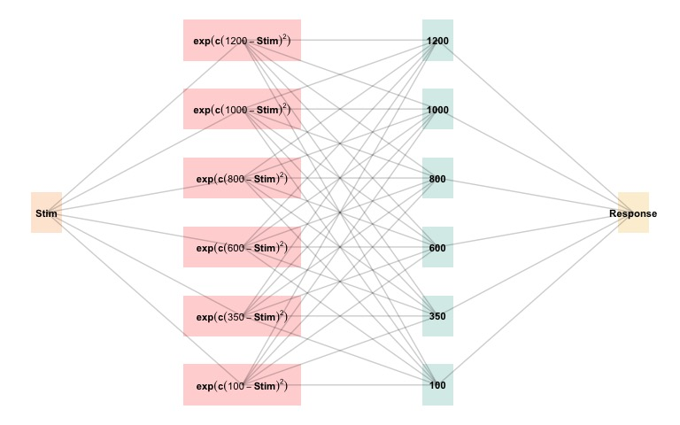

The modeling goal is to implement a full process model capable of both 1) producing novel responses and 2) modeling behavior in both the learning and testing stages of the experiment. For this purpose, we will apply the associative learning model (ALM) and the EXAM model of function learning ([DeLosh et al., 1997](#ref-deloshExtrapolationSineQua1997)). ALM is a simple connectionist learning model which closely resembles Kruschke's ALCOVE model ([Kruschke, 1992](#ref-kruschkeALCOVEExemplarbasedConnectionist1992)), with modifications to allow for the generation of continuous responses.

### ALM & Exam

ALM is a localist neural network model ([Page, 2000](#ref-pageConnectionistModellingPsychology2000a)), with each input node corresponding to a particular stimulus, and each output node corresponding to a particular response value. The units in the input layer activate as a function of their Gaussian similarity to the input stimulus ( a_i(X) = exp(-c(X - X_i)^2) ). So, for example, an input stimulus of value 55 would induce maximal activation of the input unit tuned to 55. Depending on the value of the generalization parameter, the nearby units (e.g., 54 and 56; 53 and 57) may also activate to some degree. The units in the input layer activate as a function of their similarity to a presented stimulus. The input layer is fully connected to the output layer, and the activation for any particular output node is simply the weighted sum of the connection weights between that node and the input activations. The network then produces a response by taking the weighted average of the output units (recall that each output unit has a value corresponding to a particular response). During training, the network receives feedback which activates each output unit as a function of its distance from the ideal level of activation necessary to produce the correct response. The connection weights between input and output units are then updated via the standard delta learning rule, where the magnitude of weight changes are controlled by a learning rate parameter.

The EXAM model is an extension of ALM, with the same learning rule and representational scheme for input and output units. EXAM differs from ALM only in its response rule, as it includes a linear extrapolation mechanism for generating novel responses. When a novel test stimulus, $X$, is presented, EXAM first identifies the two nearest training stimuli, $X_1$ and $X_2$, that bracket $X$. This is done based on the Gaussian activation of input nodes, similar to ALM, but focuses on identifying the closest known points for extrapolation.

**Slope Calculation**: EXAM calculates a local slope, $S$, using the responses associated with $X_1$ and $X_2$. This is computed as:

$$
   S = \frac{m(X_{1}) - m(X_{2})}{X_{1} - X_{2}}
   $$

where $m(X_1)$ and $m(X_2)$ are the output values from ALM corresponding to the $X_1$ and $X_2$ inputs.

**Response Generation**: The response for the novel stimulus $X$ is then extrapolated using the slope $S$:

$$
   E[Y|X] = m(X_1) + S \cdot |X - X_1|
   $$

Here, $m(X_1)$ is the ALM response value from the training data for the stimulus closest to $X$, and $(X - X_1)$ represents the distance between the novel stimulus and the nearest training stimulus.

Although this extrapolation rule departs from a strictly similarity-based generalization mechanism, EXAM is distinct from pure rule-based models in that it remains constrained by the weights learned during training. EXAM retrieves the two nearest training inputs, and the ALM responses associated with those inputs, and computes the slope between these two points. The slope is then used to extrapolate the response to the novel test stimulus. Because EXAM requires at least two input-output pairs to generate a response, additional assumptions were required in order for it to generate resposnes for the constant group. We assumed that participants come to the task with prior knowledge of the origin point (0,0), which can serve as a reference point necessary for the model to generate responses for the constant group. This assumption is motivated by previous function learning research ([Brown & Lacroix, 2017](#ref-brownUnderestimationLinearFunction2017)), which through a series of manipulations of the y intercept of the underlying function, found that participants consistently demonstrated knowledge of, or a bias towards, the origin point (see Kwantes & Neal ([2006](#ref-kwantesWhyPeopleUnderestimate2006)) for additional evidence of such a bias in function learning tasks).

See <a href="#tbl-alm-exam" class="quarto-xref">Table 11</a> for a full specification of the equations that define ALM and EXAM, and <a href="#fig-alm-diagram" class="quarto-xref">Figure 15</a> for a visual representation of the ALM model.

|  | **ALM Response Generation** |  |
|-------------------|-----------------------------|-------------------------|
| Input Activation | $a_i(X) = \frac{e^{-c(X-X_i)^2}}{\sum_{k=1}^M e^{-c(X-X_k)^2}}$ | Input nodes activate as a function of Gaussian similarity to stimulus |
| Output Activation | $O_j(X) = \sum_{k=1}^M w_{ji} \cdot a_i(X)$ | Output unit $O_j$ activation is the weighted sum of input activations and association weights |
| Output Probability | $P[Y_j|X] = \frac{O_j(X)}{\sum_{k=1}^M O_k(X)}$ | The response, $Y_j$ probabilites computed via Luce's choice rule |
| Mean Output | $m(X) = \sum_{j=1}^L Y_j \cdot \frac{O_j(x)}{\sum_{k=1}^M O_k(X)}$ | Weighted average of probabilities determines response to X |
|  | **ALM Learning** |  |
| Feedback | $f_j(Z) = e^{-c(Z-Y_j)^2}$ | feedback signal Z computed as similarity between ideal response and observed response |
| magnitude of error | $\Delta_{ji}=(f_{j}(Z)-o_{j}(X))a_{i}(X)$ | Delta rule to update weights. |
| Update Weights | $w_{ji}^{new}=w_{ji}+\eta\Delta_{ji}$ | Updates scaled by learning rate parameter $\eta$. |
|  | **EXAM Extrapolation** |  |
| Instance Retrieval | $P[X_i|X] = \frac{a_i(X)}{\sum_{k=1}^M a_k(X)}$ | Novel test stimulus $X$ activates input nodes $X_i$ |
| Slope Computation | $S =$ $\frac{m(X_{1})-m(X_{2})}{X_{1}-X_{2}}$ | Slope value, $S$ computed from nearest training instances |
| Response | $E[Y|X_i] = m(X_i) + S \cdot [X - X_i]$ | Final EXAM response is the ALM response for the nearest training stimulus, $m(X_i)$, adjusted by local slope $S$. |

### Model Fitting

To fit ALM and EXAM to our participant data, we employ a similar method to Mcdaniel et al. ([2009](#ref-mcdanielPredictingTransferPerformance2009)), wherein we examine the performance of each model after being fit to various subsets of the data. Each model was fit to the data with three separate procedures: 1) fit to maximize predictions of the testing data, 2) fit to maximize predictions of both the training and testing data, 3) fit to maximize predictions of the just the training data. We refer to this fitting manipulations as "Fit Method" in the tables and figures below. It should be emphasized that for all three fit methods, the ALM and EXAM models behave identically - with weights updating only during the training phase. Models were fit separately to the data of each individual participant. The free parameters for both models are the generalization ($c$) and learning rate ($lr$) parameters. Parameter estimation was performed using approximate bayesian computation (ABC), which we describe in detail below.

> **None**
>
> ** Approximate Bayesian Computation**
>
> To estimate the parameters of ALM and EXAM, we used approximate bayesian computation (ABC), enabling us to obtain an estimate of the posterior distribution of the generalization and learning rate parameters for each individual. ABC belongs to the class of simulation-based inference methods ([Cranmer et al., 2020](#ref-cranmerFrontierSimulationbasedInference2020)), which have begun being used for parameter estimation in cognitive modeling relatively recently ([Kangasrääsiö et al., 2019](#ref-kangasraasioParameterInferenceComputational2019); [Turner et al., 2016](#ref-turnerBayesianAnalysisSimulationbased2016); [Turner & Van Zandt, 2012](#ref-turnerTutorialApproximateBayesian2012)). Although they can be applied to any model from which data can be simulated, ABC methods are most useful for complex models that lack an explicit likelihood function (e.g., many neural network models).
>
> The general ABC procedure is to 1) define a prior distribution over model parameters. 2) sample candidate parameter values, $\theta^*$, from the prior. 3) Use $\theta^*$ to generate a simulated dataset, $Data_{sim}$. 4) Compute a measure of discrepancy between the simulated and observed datasets, $discrep$($Data_{sim}$, $Data_{obs}$). 5) Accept $\theta^*$ if the discrepancy is less than the tolerance threshold, $\epsilon$, otherwise reject $\theta^*$. 6) Repeat until desired number of posterior samples are obtained.
>
> Although simple in the abstract, implementations of ABC require researchers to make a number of non-trivial decisions as to i) the discrepancy function between observed and simulated data, ii) whether to compute the discrepancy between trial level data, or a summary statistic of the datasets, iii) the value of the minimum tolerance $\epsilon$ between simulated and observed data. For the present work, we follow the guidelines from previously published ABC tutorials ([Farrell & Lewandowsky, 2018](#ref-farrellComputationalModelingCognition2018); [Turner & Van Zandt, 2012](#ref-turnerTutorialApproximateBayesian2012)). For the test stage, we summarized datasets with mean velocity of each band in the observed dataset as $V_{obs}^{(k)}$ and in the simulated dataset as $V_{sim}^{(k)}$, where $k$ represents each of the six velocity bands. For computing the discrepancy between datasets in the training stage, we aggregated training trials into three equally sized blocks (separately for each velocity band in the case of the varied group). After obtaining the summary statistics of the simulated and observed datasets, the discrepancy was computed as the mean of the absolute difference between simulated and observed datasets (<a href="#eq-discrep-test" class="quarto-xref">Equation 1</a> and <a href="#eq-discrep-train" class="quarto-xref">Equation 2</a>). For the models fit to both training and testing data, discrepancies were computed for both stages, and then averaged together.
>
> <span id="eq-discrep-test">$$
> discrep_{Test}(Data_{sim}, Data_{obs}) = \frac{1}{6} \sum_{k=1}^{6} |V_{obs}^{(k)} - V_{sim}^{(k)}|
>  \qquad(1)$$</span>
>
> <span id="eq-discrep-train">$$
> \begin{aligned} \\
> discrep_{Train,constant}(Data_{sim}, Data_{obs}) = \frac{1}{N_{blocks}} \sum_{j=1}^{N_{blocks}} |V_{obs,constant}^{(j)} - V_{sim,constant}^{(j)}| \\ \\
> discrep_{Train,varied}(Data_{sim}, Data_{obs}) = \frac{1}{N_{blocks} \times 3} \sum_{j=1}^{N_{blocks}} \sum_{k=1}^{3} |V_{obs,varied}^{(j,k)} - V_{sim,varied}^{(j,k)}|
> \end{aligned}
>  \qquad(2)$$</span>
>
> The final component of our ABC implementation is the determination of an appropriate value of $\epsilon$. The setting of $\epsilon$ exerts strong influence on the approximated posterior distribution. Smaller values of $\epsilon$ increase the rejection rate, and improve the fidelity of the approximated posterior, while larger values result in an ABC sampler that simply reproduces the prior distribution. Because the individual participants in our dataset differed substantially in terms of the noisiness of their data, we employed an adaptive tolerance setting strategy to tailor $\epsilon$ to each individual. The initial value of $\epsilon$ was set to the overall standard deviation of each individuals velocity values. Thus, sampled parameter values that generated simulated data within a standard deviation of the observed data were accepted, while worse performing parameters were rejected. After every 300 samples the tolerance was allowed to increase only if the current acceptance rate of the algorithm was less than 1%. In such cases, the tolerance was shifted towards the average discrepancy of the 5 best samples obtained thus far. To ensure the acceptance rate did not become overly permissive, $\epsilon$ was also allowed to decrease every time a sample was accepted into the posterior.

For each of the 156 participants from Experiment 1, the ABC algorithm was run until 200 samples of parameters were accepted into the posterior distribution. Obtaining this number of posterior samples required an average of 205,000 simulation runs per participant. Fitting each combination of participant, Model (EXAM & ALM), and fitting method (Test only, Train only, Test & Train) required a total of 192 million simulation runs. To facilitate these intensive computational demands, we used the Future Package in R ([Bengtsson, 2021](#ref-bengtssonUnifyingFrameworkParallel2021)), allowing us to parallelize computations across a cluster of ten M1 iMacs, each with 8 cores.

### Modelling Results

``` r
post_tabs <- abc_tables(post_dat,post_dat_l)
train_tab <- abc_train_tables(pd_train,pd_train_l)


out_type <- knitr::opts_knit$get("rmarkdown.pandoc.to")
primary=out_type == "html" || out_type == "pdf" || out_type =="latex" || out_type == "docx"


e1_tab <- rbind(post_tabs$agg_pred_full |> mutate("Task Stage"="Test"), train_tab$agg_pred_full |> mutate("Task Stage"="Train")) |> mutate(Fit_Method=rename_fm(Fit_Method)) 

if (primary) {
e1_tab %>%
  group_by(`Task Stage`, Fit_Method, Model, condit) %>%
  summarize(ME = mean(mean_error), .groups = "drop") %>%
  pivot_wider(
    names_from = c(Model, condit),
    values_from = ME,
    names_sep = "_"  # Add this line to specify the separator for column names
  ) %>%
  rename("Fit Method" = Fit_Method) %>%
  gt() %>%
  cols_move_to_start(columns = c(`Task Stage`)) %>%
  cols_label(
    `Task Stage` = "Task Stage"
  ) %>%
  fmt_number(
    columns = starts_with("ALM") | starts_with("EXAM"),
    decimals = 2
  ) %>%
  tab_spanner_delim(delim = "_") %>%
  tab_style(
    style = cell_fill(color = "white"),
     locations = cells_body(columns = everything(), rows = everything())
  ) %>%
  tab_style(
    style = cell_borders(sides = "top", color = "black", weight = px(1)),
    locations = cells_column_labels()
  ) %>%
  tab_options(
    table.font.size = 12,
    heading.title.font.size = 14,
    heading.subtitle.font.size = 12,
    quarto.disable_processing = TRUE,
    column_labels.padding = 2,
    data_row.padding = 2
  )
} else {

  e1_tab %>%
  group_by(`Task Stage`, Fit_Method, Model, condit) %>%
  summarize(ME = mean(mean_error), .groups = "drop") %>%
  pivot_wider(
    names_from = c(Model, condit),
    values_from = ME,
    names_sep = "_"  # Add this line to specify the separator for column names
  ) %>%
  rename("Fit Method" = Fit_Method) %>% kable(escape=F,booktabs=T)

  }
```

| Task Stage | Fit Method | ALM_Constant | ALM_Varied | EXAM_Constant | EXAM_Varied |
|:---------|:---------------------|----------:|---------:|-----------:|---------:|
| Test | Fit to Test Data | 200 | 103 | 104 | 86 |
| Test | Fit to Test & Training Data | 217 | 170 | 128 | 145 |
| Test | Fit to Training Data | 468 | 291 | 273 | 298 |
| Train | Fit to Test Data | 298 | 2016 | 54 | 184 |
| Train | Fit to Test & Training Data | 57 | 132 | 43 | 128 |
| Train | Fit to Training Data | 52 | 103 | 51 | 107 |

``` r
c_post <- post_dat_avg %>%
    group_by(id, condit, Model, Fit_Method, rank) %>%
    slice_head(n = 1) |>
    ggplot(aes(y=log(c), x = Fit_Method,col=condit)) + stat_pointinterval(position=position_dodge(.2)) +
    ggh4x::facet_nested_wrap(~Model) + labs(title="c parameter") +
  theme(legend.title = element_blank(), legend.position="right",plot.title=element_text(hjust=.4))

lr_post <- post_dat_avg %>%
    group_by(id, condit, Model, Fit_Method, rank) %>%
    slice_head(n = 1) |>
    ggplot(aes(y=lr, x = Fit_Method,col=condit)) + stat_pointinterval(position=position_dodge(.4)) +
    ggh4x::facet_nested_wrap(~Model) + labs(title="learning rate parameter") +
  theme(legend.title = element_blank(), legend.position = "none",plot.title=element_text(hjust=.5))
c_post + lr_post
```

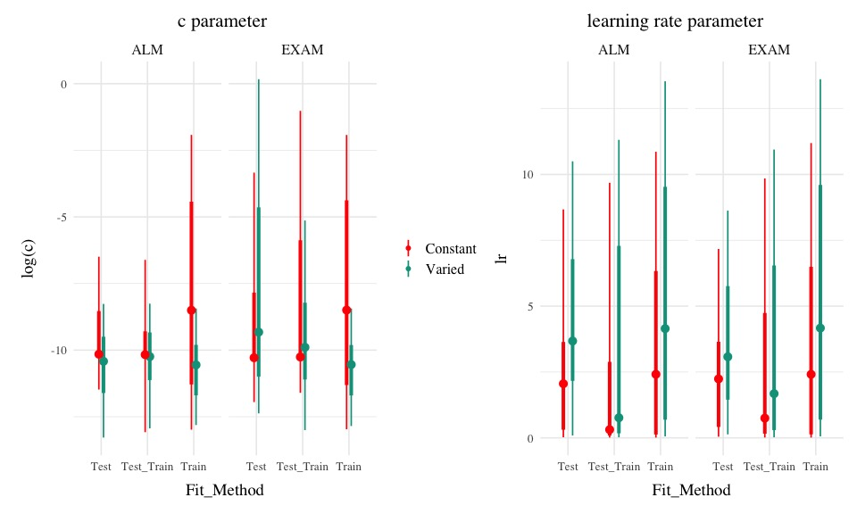

``` r
train_resid <- pd_train |> group_by(id,condit,Model,Fit_Method, Block,x) |> 
  summarise(y=mean(y), pred=mean(pred), mean_error=abs(y-pred)) |>
  group_by(id,condit,Model,Fit_Method,Block) |>
  summarise(mean_error=mean(mean_error)) |>
  ggplot(aes(x=interaction(Block,Model), y = mean_error, fill=factor(Block))) + 
  stat_bar + 
  ggh4x::facet_nested_wrap(rename_fm(Fit_Method)~condit, scales="free",ncol=2) +
   scale_x_discrete(guide = "axis_nested") +
  scale_fill_manual(values=c("gray10","gray50","gray92"))+
  labs(title="Model Residual Errors - Training Stage", y="RMSE", x= "Model",fill="Training Block") +
  theme(legend.position="top")

test_resid <-  post_dat |> 
   group_by(id,condit,x,Model,Fit_Method,bandType) |>
    summarise(y=mean(y), pred=mean(pred), error=abs(y-pred)) |> 
  mutate(vbLab = factor(paste0(x,"-",x+200))) |>
  ggplot(aes(x = Model, y = abs(error), fill=vbLab,col=ifelse(bandType=="Trained","black",NA),size=ifelse(bandType=="Trained","black",NA))) + 
  stat_bar + 
  #scale_fill_manual(values=wes_palette("AsteroidCity2"))+
  scale_color_manual(values = c("black" = "black"), guide = "none") +
  scale_size_manual(values = c("black" = .5), guide = "none") +
  ggh4x::facet_nested_wrap(rename_fm(Fit_Method)~condit, axes = "all",ncol=2,scale="free") +
  labs(title="Model Residual Errors - Testing Stage",y="RMSE", x="Velocity Band") 

(train_resid / test_resid) +
  #plot_layout(heights=c(1,1.5)) & 
  plot_annotation(tag_levels = list(c('A','B')),tag_suffix = ') ') 
```

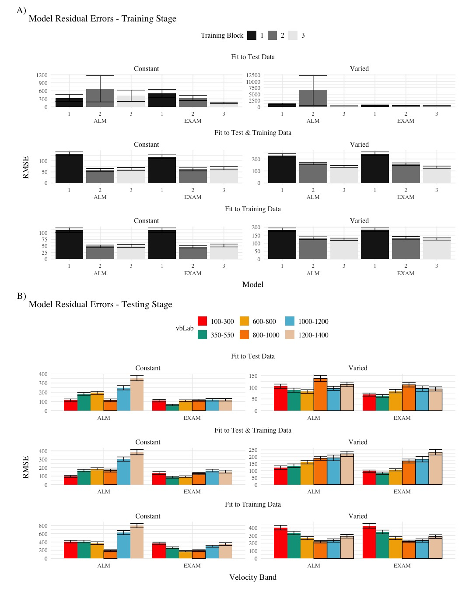

The posterior distributions of the $c$ and $lr$ parameters are shown <a href="#fig-htw-post-dist" class="quarto-xref">Figure 16</a>, and model predictions are shown alongside the empirical data in <a href="#fig-cm-vx-pat" class="quarto-xref">Figure 18</a>. There were substantial individual differences in the posteriors of both parameters, with the within-group individual differences generally swamped any between-group or between-model differences. The magnitude of these individual differences remains even if we consider only the single best parameter set for each subject.

We used the posterior distribution of $c$ and $lr$ parameters to generate a posterior predictive distribution of the observed data for each participant, which then allows us to compare the empirical data to the full range of predictions from each model. Aggregated residuals are displayed in <a href="#fig-htw-resid-pred" class="quarto-xref">Figure 17</a>. The pattern of training stage residual errors are unsurprising across the combinations of models and fitting method . Differences in training performance between ALM and EXAM are generally minor (the two models have identical learning mechanisms). The differences in the magnitude of residuals across the three fitting methods are also straightforward, with massive errors for the 'fit to Test Only' model, and the smallest errors for the 'fit to train only' models. It is also noteworthy that the residual errors are generally larger for the first block of training, which is likely due to the initial values of the ALM weights being unconstrained by whatever initial biases participants tend to bring to the task. Future work may explore the ability of the models to capture more fine grained aspects of the learning trajectories. However for the present purposes, our primary interest is in the ability of ALM and EXAM to account for the testing patterns while being constrained, or not constrained, by the training data. All subsequent analyses and discussion will thus focus on the testing stage.

The residuals of the model predictions for the testing stage (<a href="#fig-htw-resid-pred" class="quarto-xref">Figure 17</a>) also show an unsurprising pattern across fitting methods - with models fit only to the test data showing the best performance, followed by models fit to both training and test data, and with models fit only to the training data showing the worst performance (note that y axes are scaled different between plots). Although EXAM tends to perform better for both Constant and Varied participants (see also <a href="#fig-ee-e1" class="quarto-xref">Figure 19</a>), the relative advantage of EXAM is generally larger for the Constant group - a pattern consistent across all three fitting methods. The primary predictive difference between ALM and EXAM is made clear in <a href="#fig-cm-vx-pat" class="quarto-xref">Figure 18</a>, which directly compares the observed data against the posterior predictive distributions for both models. Regardless of how the models are fit, only EXAM can capture the pattern where participants are able to discriminate all 6 target bands.

``` r
post_dat_l |> 
  group_by(id,condit, Fit_Method,Resp,bandType,x,vb) |> 
 summarize(vx=median(val)) |> 
 #left_join(testAvgE1, by=join_by(id,condit,x==bandInt)) |>
 ggplot(aes(x=Resp,y=vx, fill=vb,col=ifelse(bandType=="Trained","black",NA),size=ifelse(bandType=="Trained","black",NA))) + 
  stat_bar + 
    facet_wrap(~rename_fm(Fit_Method)+condit, ncol=2,strip.position = "top", scales = "free_x") +
        scale_color_manual(values = c("black" = "black"), guide = "none") +
  scale_size_manual(values = c("black" = .5), guide = "none") +
    theme(panel.spacing = unit(0, "lines"), 
         strip.background = element_blank(),
         strip.placement = "outside",
         legend.position = "none",plot.title = element_text(hjust=.50),
         axis.title.x = element_blank(),
         plot.margin = unit(c(10,0,0,0), "pt")) + 
         labs(title="Model Predictions - Experiment 1 Data", y="Vx")
```

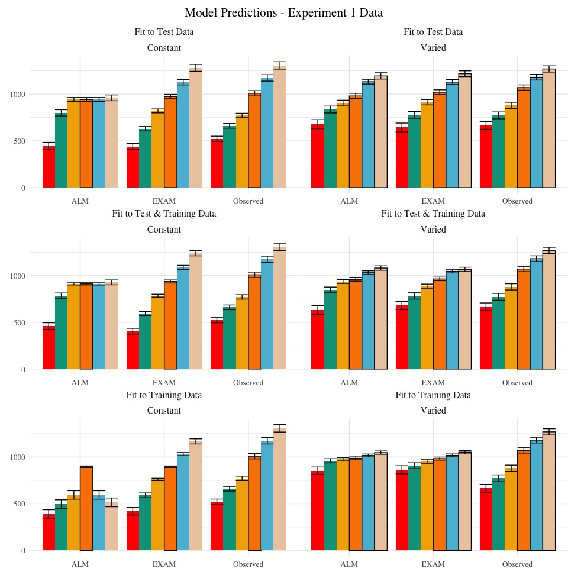

``` r
###| eval: false

pacman::p_load(dplyr,purrr,tidyr,ggplot2, data.table, here, patchwork, conflicted, 
               stringr,future,furrr, knitr, reactable,ggstance, htmltools,
               ggdist,ggh4x,brms,tidybayes,emmeans,bayestestR, gt)

pdl <- post_dat_l |> rename("bandInt"=x) |> left_join(testAvgE1,by=c("id","condit","bandInt")) |> 
  filter(rank<=1,Fit_Method=="Test_Train", !(Resp=="Observed")) |> mutate(aerror = abs(error))

# aerror is model error, which is predicted by Model(ALM vs. EXAM) & condit (Constant vs. Varied)
e1_ee_brm_ae <- brm(data=pdl,
  aerror ~  Model * condit + (1+bandInt|id), 
  file = paste0(here("data/model_cache/e1_ae_modelCond_RFint.rds")),
  chains=4,silent=1, iter=2000, control=list(adapt_delta=0.92, max_treedepth=11))

bct_e1 <- as.data.frame(bayestestR::describe_posterior(e1_ee_brm_ae, centrality = "Mean")) %>%
  select(1,2,4,5,6) %>%
  setNames(c("Term", "Estimate","95% CrI Lower", "95% CrI Upper", "pd")) %>%
  mutate(across(where(is.numeric), \(x) round(x, 2))) %>%
  tibble::remove_rownames() %>%
  mutate(Term = stringr::str_remove(Term, "b_")) #%>% kable(booktabs = TRUE)

#wrap_plots(plot(conditional_effects(e1_ee_brm_ae),points=FALSE,plot=FALSE))

p1 <- plot(conditional_effects(e1_ee_brm_ae, effects="condit"),points=FALSE, plot=FALSE)$condit + 
  ggplot2::xlab("Condition") +ylab("Model Error")
p2 <- plot(conditional_effects(e1_ee_brm_ae, effects="Model"),points=FALSE, plot=FALSE)$Model + 
  labs(x="Model",y=NULL)
p3 <- plot(conditional_effects(e1_ee_brm_ae, effects="Model:condit"),points=FALSE, plot=FALSE)$`Model:condit` + 
  scale_color_manual(values=wes_palette("Darjeeling1")) +
  labs(x="Model",y=NULL,fill=NULL,col=NULL) + theme(legend.position="right") 
  
#p_ce_1 <- (p1 + p2+ p3) + plot_annotation(tag_levels = c('A'), tag_suffix=".")


# plot_custom_effects <- function(model) {
#   # Extract posterior samples for fixed effects
#   post_samples <- posterior_samples(model, pars = c("b_Intercept", "b_ModelEXAM", "b_conditVaried", "b_ModelEXAM:conditVaried"))
  
#   # Calculate conditional effects
#   post_samples <- post_samples %>%
#     mutate(
#       ALM_Constant = b_Intercept,
#       EXAM_Constant = b_Intercept + b_ModelEXAM,
#       ALM_Varied = b_Intercept + b_conditVaried,
#       EXAM_Varied = b_Intercept + b_ModelEXAM + b_conditVaried + `b_ModelEXAM:conditVaried`
#     )
  
#   # Reshape data for plotting
#   plot_data <- post_samples %>%
#     select(ALM_Constant, EXAM_Constant, ALM_Varied, EXAM_Varied) %>%
#     pivot_longer(everything(), names_to = "Condition", values_to = "Estimate") %>%
#     separate(Condition, into = c("Model", "Condit"), sep = "_")
  
#   # Plot conditional effects
#   ggplot(plot_data, aes(x = Model, y = Estimate, color = Condit)) +
#     geom_boxplot() +
#     theme_minimal() +
#     labs(x = "Model", y = "Estimate", color = "Condition")
# }
# p_ce_1 <- plot_custom_effects(e1_ee_brm_ae)


bm1 <- get_coef_details(e1_ee_brm_ae, "conditVaried")
bm2 <- get_coef_details(e1_ee_brm_ae, "ModelEXAM")
bm3 <- get_coef_details(e1_ee_brm_ae, "ModelEXAM:conditVaried")

posterior_estimates <- as.data.frame(e1_ee_brm_ae) %>%
  select(starts_with("b_")) %>%
  setNames(c("Intercept", "ModelEXAM", "conditVaried", "ModelEXAM_conditVaried"))

constant_EXAM <- posterior_estimates$Intercept + posterior_estimates$ModelEXAM
varied_EXAM <- posterior_estimates$Intercept + posterior_estimates$ModelEXAM + posterior_estimates$conditVaried + posterior_estimates$ModelEXAM_conditVaried
comparison_EXAM <- constant_EXAM - varied_EXAM
summary_EXAM <- bayestestR::describe_posterior(comparison_EXAM, centrality = "Mean")

# e1_ee_brm_ae |> emmeans(pairwise ~ Model * condit, re_formula=NULL)
# e1_ee_brm_ae |> emmeans(pairwise ~ Model * condit, re_formula=NA)

# full set of Model x condit contrasts
# ALM - EXAM
# btw_model <- e1_ee_brm_ae |> emmeans(pairwise~ Model | condit, re_formula=NULL)  |> 
#   pluck("contrasts") |> 
#   gather_emmeans_draws() |> 
#   group_by(contrast,.draw,condit) |> summarise(value=mean(.value), n=n()) 

# btw_model |> ggplot(aes(x=value,y=contrast,fill=condit)) +stat_halfeye()

# Constant - Varied
# emm_condit <- e1_ee_brm_ae |> emmeans(~ condit | Model, re_formula = NULL)
# btw_con <- emm_condit |>  pairs() |> gather_emmeans_draws() |> 
#   group_by(contrast,.draw, Model) |> summarise(value=mean(.value), n=n()) 
# # btw_con |> ggplot(aes(x=value,y=Model,fill=Model)) +stat_halfeye()                              

p_em_1 <- e1_ee_brm_ae |> emmeans(pairwise~ Model*condit, re_formula=NA)  |> 
  pluck("contrasts") |>
  gather_emmeans_draws() |> 
  group_by(contrast,.draw) |> summarise(value=mean(.value), n=n()) |> 
  filter(!(contrast %in% c("ALM Constant - EXAM Constant","ALM Constant - EXAM Varied","ALM Varied - EXAM Varied ", "EXAM Constant - ALM Varied" ))) |> 
  ggplot(aes(x=value,y=contrast,fill=contrast)) +stat_halfeye() + labs(x="Model Error Difference",y="Contrast") + theme(legend.position="none") 

#p_ce_1 / p_em_1

(p1 + p2+ p3) /p_em_1 + plot_annotation(tag_levels = c('A'), tag_suffix=".")
```

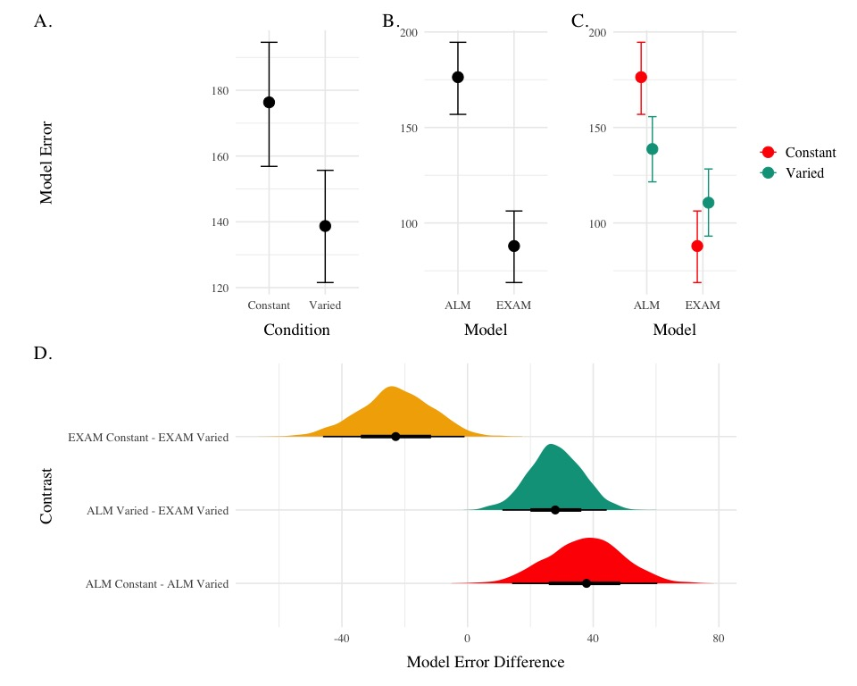

To quantitatively assess whether the differences in performance between models, we fit a Bayesian regression predicting the errors of the posterior predictions of each models as a function of the Model (ALM vs. EXAM) and training condition (Constant vs. Varied).

Model errors were significantly lower for EXAM ($\beta$ = -37.54, 95% CrI \[-60.4, -14.17\], pd = 99.85%) than ALM. There was also a significant interaction between Model and Condition ($\beta$ = 60.42, 95% CrI \[36.17, 83.85\], pd = 100%), indicating that the advantage of EXAM over ALM was significantly greater for the constant group. To assess whether EXAM predicts constant performance significantly better for Constant than for Varied subjects, we calculated the difference in model error between the Constant and Varied conditions specifically for EXAM. The results indicated that the model error for EXAM was significantly lower in the Constant condition compared to the Varied condition, with a mean difference of -22.88 (95% CrI \[-46.02, -0.97\], pd = 0.98).

``` r
out_type <- knitr::opts_knit$get("rmarkdown.pandoc.to")
primary=out_type == "html" || out_type == "pdf" || out_type =="latex" || out_type == "docx"


post_tabs2 <- abc_tables(e2_model$post_dat,e2_model$post_dat_l)
train_tab2 <- abc_train_tables(e2_model$pd_train,e2_model$pd_train_l)

pdl2 <- e2_model$post_dat_l |> rename("bandInt"=x) |> filter(rank<=1,Fit_Method=="Test_Train", !(Resp=="Observed")) |> mutate(aerror = abs(error))

e2_tab <- rbind(post_tabs2$agg_pred_full |>
 mutate("Task Stage"="Test"), train_tab2$agg_pred_full |> 
 mutate("Task Stage"="Train")) |> 
  mutate(Fit_Method=rename_fm(Fit_Method)) 

post_tabs3 <- abc_tables(e3_model$post_dat,e3_model$post_dat_l)
train_tab3 <- abc_train_tables(e3_model$pd_train,e3_model$pd_train_l)

pdl3 <- e3_model$post_dat_l |> rename("bandInt"=x) |> filter(rank<=1,Fit_Method=="Test_Train", !(Resp=="Observed")) |> mutate(aerror = abs(error))

e3_tab <- rbind(post_tabs3$agg_pred_full |> 
  mutate("Task Stage"="Test"), train_tab3$agg_pred_full |> mutate("Task Stage"="Train")) |> 
  mutate(Fit_Method=rename_fm(Fit_Method)) 

e23_tab <- rbind(e2_tab |> mutate(Exp="E2"), e3_tab |> mutate(Exp="E3")) 

if (primary) {
gt_table <- e23_tab %>%
  pivot_wider(
    names_from = c(Exp, Model, condit),
    values_from = mean_error,
    names_glue = "{Exp}_{Model}_{condit}"
  ) %>%
  arrange(Fit_Method, `Task Stage`) %>%
  gt() %>%
  cols_move_to_start(columns = `Task Stage`) %>%
  cols_label(`Task Stage` = "Task Stage") %>%
  fmt_number(columns = matches("E2|E3"), decimals = 1) %>%
  tab_spanner_delim(delim = "_") %>%
  tab_style(
    style = list(
      cell_fill(color = "white"),
      cell_borders(sides = "top", color = "black", weight = px(1))
    ),
    locations = cells_body(columns = everything(), rows = everything())
  ) %>%
  tab_options(
    table.font.size = 12,
    heading.title.font.size = 14,
    heading.subtitle.font.size = 12,
    quarto.disable_processing = TRUE,
    column_labels.padding = 2,
    data_row.padding = 2
  )
gt_table
} else {
  e23_tab %>%
  pivot_wider(
    names_from = c(Exp, Model, condit),
    values_from = mean_error,
    names_glue = "{Exp}_{Model}_{condit}"
  ) %>%
  arrange(Fit_Method, `Task Stage`) %>%
  kable(escape=F,booktabs=T)
}
```

| Fit_Method | Task Stage | E2_ALM_Constant | E2_ALM_Varied | E2_EXAM_Constant | E2_EXAM_Varied | E3_ALM_Constant | E3_ALM_Varied | E3_EXAM_Constant | E3_EXAM_Varied |
|:-----------|:-----|------:|------:|-------:|------:|------:|------:|-------:|------:|
| Fit to Test Data | Test | 240 | 130 | 100 | 88 | 170 | 106 | 92 | 73 |
| Fit to Test Data | Train | 53 | 527 | 108 | 169 | 71 | 544 | 158 | 213 |
| Fit to Test & Training Data | Test | 266 | 208 | 125 | 126 | 198 | 190 | 130 | 128 |
| Fit to Test & Training Data | Train | 40 | 35 | 30 | 24 | 49 | 86 | 49 | 78 |
| Fit to Training Data | Test | 357 | 296 | 305 | 235 | 415 | 299 | 295 | 244 |
| Fit to Training Data | Train | 43 | 23 | 43 | 23 | 51 | 64 | 52 | 65 |

   

``` r
rbind(e2_model$post_dat_l |> filter( Fit_Method=="Test_Train") |> 
  group_by(id,condit, Fit_Method,Resp,bandType,x,vb) |> 
 summarize(vx=median(val)) |> mutate(Exp="E2",bandOrder="Reverse"), 
 e3_model$post_dat_l |> filter( Fit_Method=="Test_Train") |> 
  group_by(id,condit, Fit_Method,Resp,bandType,x,vb,bandOrder) |>
  summarize(vx=median(val)) |> mutate(Exp="E3")) |>
  ggplot( aes(x=condit,y=vx, fill=vb,col=ifelse(bandType=="Trained","black",NA),size=ifelse(bandType=="Trained","black",NA))) +
  stat_bar + 
    facet_nested_wrap(~Exp+bandOrder+Resp, strip.position = "top", scales = "free_x") +
    scale_color_manual(values = c("black" = "black"), guide = "none") +
  scale_size_manual(values = c("black" = .7), guide = "none") +
    theme(panel.spacing = unit(0, "lines"), 
        #  strip.background = element_blank(),
        #  strip.placement = "outside",
         legend.position = "none",plot.title = element_text(hjust=.50),
         axis.title.x = element_blank(),
         plot.margin = unit(c(20,0,0,0), "pt")) + 
         labs(title="Model Predictions Experiment 2 & 3", y="vx")
```

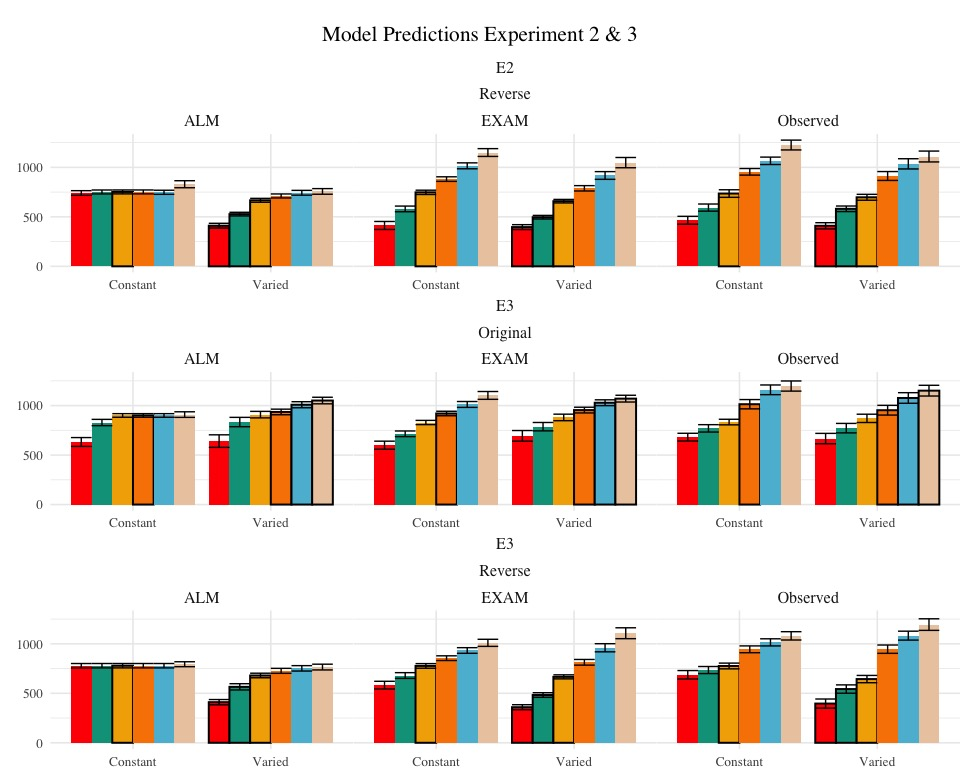



``` r
e2_ee_brm_ae <- brm(data=pdl2,
  aerror ~  Model * condit + (1+bandInt|id), 
  file = paste0(here("data/model_cache/e2_ae_modelCond_RFint.rds")),
  chains=4,silent=1, iter=2000, control=list(adapt_delta=0.92, max_treedepth=11))

bm1_e2 <- get_coef_details(e2_ee_brm_ae, "conditVaried")
bm2_e2 <- get_coef_details(e2_ee_brm_ae, "ModelEXAM")
bm3_e2 <- get_coef_details(e2_ee_brm_ae, "ModelEXAM:conditVaried")

bct_e2 <- as.data.frame(bayestestR::describe_posterior(e2_ee_brm_ae, centrality = "Mean")) %>%
  select(1,2,4,5,6) %>%
  setNames(c("Term", "Estimate","95% CrI Lower", "95% CrI Upper", "pd")) %>%
  mutate(across(where(is.numeric), \(x) round(x, 2))) %>%
  tibble::remove_rownames() %>%
  mutate(Term = stringr::str_remove(Term, "b_")) # %>% kable(booktabs = TRUE)

e3_ee_brm_ae <- brm(data=pdl3,
  aerror ~  Model * condit*bandOrder + (1+bandInt|id), 
  file = paste0(here("data/model_cache/e3_ae_modelCondBo_RFint2.rds")),
  chains=4,silent=1, iter=2000, control=list(adapt_delta=0.92, max_treedepth=11))

bm1_e3 <- get_coef_details(e3_ee_brm_ae, "conditVaried")
bm2_e3  <- get_coef_details(e3_ee_brm_ae, "ModelEXAM")
bm3_e3  <- get_coef_details(e3_ee_brm_ae, "ModelEXAM:conditVaried")
bm4_e3  <- get_coef_details(e3_ee_brm_ae, "ModelEXAM:conditVaried:bandOrderReverse")


bct_e3  <- as.data.frame(bayestestR::describe_posterior(e3_ee_brm_ae, centrality = "Mean")) %>%
  select(1,2,4,5,6) %>%
  setNames(c("Term", "Estimate","95% CrI Lower", "95% CrI Upper", "pd")) %>%
  mutate(across(where(is.numeric), \(x) round(x, 2))) %>%
  tibble::remove_rownames() %>%
  mutate(Term = stringr::str_remove(Term, "b_")) #%>% kable(booktabs = TRUE)

bct <- rbind(bct_e1 |> mutate(exp="Exp 1"),bct_e2 |> 
               mutate(exp= "Exp 2"),bct_e3 |> mutate(exp="Exp 3")) |> 
  relocate(exp, .before=Term)


out_type <- knitr::opts_knit$get("rmarkdown.pandoc.to")
primary=out_type == "html" || out_type == "pdf" || out_type =="latex" || out_type == "docx"

if (primary) {
bct_table <- bct %>%
  mutate(
    across(c(Estimate, `95% CrI Lower`, `95% CrI Upper`), ~ round(., 2)),
    pd = round(pd, 2)
  ) %>%
  gt() %>%
  # tab_header(
  #   title = "Bayesian Model Results",
  #   subtitle = "Estimates and Credible Intervals for Each Term Across Experiments"
  # ) %>%
  cols_label(
    exp = "Experiment",
    Term = "Term",
    Estimate = "Estimate",
    `95% CrI Lower` = "95% CrI Lower",
    `95% CrI Upper` = "95% CrI Upper",
    pd = "pd"
  ) %>%
  fmt_number(
    columns = c(Estimate, `95% CrI Lower`, `95% CrI Upper`),
    decimals = 1
  ) %>%
  fmt_number(
    columns = pd,
    decimals = 2
  ) %>%
  tab_spanner(
    label = "Credible Interval",
    columns = c(`95% CrI Lower`, `95% CrI Upper`)
  ) %>%
  tab_style(
    style = list(
      #cell_fill(color = "lightgray"),
      cell_text(weight = "bold"), 
      cell_fill(color = "white"),
      cell_borders(sides = "top", color = "black", weight = px(1))
    ),
    locations = cells_body(
      columns = c(Estimate, pd),
      rows = Term=="ModelEXAM:conditVaried"
    )
  ) %>%
   tab_row_group(
    label = "Experiment 3",
    rows = exp == "Exp 3"
  ) %>%
  tab_row_group(
    label = "Experiment 2",
    rows = exp == "Exp 2"
  ) %>%
  tab_row_group(
    label = "Experiment 1",
    rows = exp == "Exp 1"
  ) %>%
  tab_options(
    table.font.size = 12,
    heading.title.font.size = 14,
    heading.subtitle.font.size = 12,
    quarto.disable_processing = TRUE,
    column_labels.padding = 2,
    data_row.padding = 2
    #row_group.background.color = "gray95"
  )
bct_table
} else {
  bct %>%
  mutate(
    across(c(Estimate, `95% CrI Lower`, `95% CrI Upper`), ~ round(., 2)),
    pd = round(pd, 2)
  ) %>% kable(booktabs = TRUE)

}
```

| exp | Term | Estimate | 95% CrI Lower | 95% CrI Upper | pd |
|:-----|:------------------------------|-------:|-----------:|-----------:|----:|
| Exp 1 | Intercept | 176.3 | 156.9 | 195 | 1.00 |
| Exp 1 | ModelEXAM | -88.4 | -104.5 | -72 | 1.00 |
| Exp 1 | conditVaried | -37.5 | -60.4 | -14 | 1.00 |
| Exp 1 | ModelEXAM:conditVaried | 60.4 | 36.2 | 84 | 1.00 |
| Exp 2 | Intercept | 245.9 | 226.2 | 265 | 1.00 |
| Exp 2 | ModelEXAM | -137.7 | -160.2 | -115 | 1.00 |
| Exp 2 | conditVaried | -86.4 | -113.5 | -59 | 1.00 |
| Exp 2 | ModelEXAM:conditVaried | 56.9 | 25.3 | 88 | 1.00 |
| Exp 3 | Intercept | 164.8 | 140.1 | 189 | 1.00 |
| Exp 3 | ModelEXAM | -65.7 | -86.0 | -46 | 1.00 |
| Exp 3 | conditVaried | -40.6 | -75.9 | -3 | 0.98 |
| Exp 3 | bandOrderReverse | 25.5 | -9.3 | 59 | 0.93 |
| Exp 3 | ModelEXAM:conditVaried | 41.9 | 11.2 | 73 | 0.99 |
| Exp 3 | ModelEXAM:bandOrderReverse | -7.3 | -34.5 | 21 | 0.70 |
| Exp 3 | conditVaried:bandOrderReverse | 30.8 | -19.6 | 84 | 0.88 |
| Exp 3 | ModelEXAM:conditVaried:bandOrderReverse | -60.6 | -101.8 | -19 | 1.00 |

*Model Fits to Experiment 2 and 3.* Data from Experiments 2 and 3 were fit to ALM and EXAM in the same manner as Experiment1 . For brevity, we only plot and discuss the results of the "fit to training and testing data" models - results from the other fitting methods can be found in the appendix. The model fitting results for Experiments 2 and 3 closely mirrored those observed in Experiment 1. The Bayesian regression models predicting model error as a function of Model (ALM vs. EXAM), Condition (Constant vs. Varied), and their interaction (see <a href="#tbl-htw-ee-e23" class="quarto-xref">Table 14</a>) revealed a consistent main effect of Model across all three experiments. The negative coefficients for the ModelEXAM term (Exp 2: $\beta$ = -86.39, 95% CrI -113.52, -59.31, pd = 100%; Exp 3: $\beta$ = -40.61, 95% CrI -75.9, -3.02, pd = 98.17%) indicate that EXAM outperformed ALM in both experiments. Furthermore, the interaction between Model and Condition was significant in both Experiment 2 ($\beta$ = 56.87, 95% CrI 25.26, 88.04, pd = 99.98%) and Experiment 3 ($\beta$ = 41.9, 95% CrI 11.2, 72.54, pd = 99.35%), suggesting that the superiority of EXAM over ALM was more pronounced for the Constant group compared to the Varied group, as was the case in Experiment 1. Recall that Experiment 3 included participants in both the original and reverse order conditions - and that this manipulation interacted with the effect of training condition. We thus also controlled for band order in our Bayesian Regression assessing the relative performance of EXAM and ALM in Experiment 3. There was a significant three way interaction between Model, Training Condition, and Band Order ($\beta$ = -60.6, 95% CrI -101.8, -18.66, pd = 99.83%), indicating that the relative advantage of EXAM over ALM was only more pronounced in the original order condition, and not the reverse order condition (see <a href="#fig-e2_e3_ae" class="quarto-xref">Figure 21</a>).

``` r
#wrap_plots(plot(conditional_effects(e1_ee_brm_ae),points=FALSE,plot=FALSE))
p1 <- plot(conditional_effects(e2_ee_brm_ae, effects="condit"),points=FALSE, plot=FALSE)$condit + 
  ggplot2::xlab("Condition") +ylab("Model Error") + labs(title="E2. Model Error")
p2 <- plot(conditional_effects(e2_ee_brm_ae, effects="Model"),points=FALSE, plot=FALSE)$Model + 
  labs(x="Model",y=NULL)
p3 <- plot(conditional_effects(e2_ee_brm_ae, effects="Model:condit"),points=FALSE, plot=FALSE)$`Model:condit` + 
  scale_color_manual(values=wes_palette("Darjeeling1")) +
  labs(x="Model",y=NULL,fill=NULL,col=NULL) + theme(legend.position="right") 
  
  p_e2 <- (p1 + p2+ p3) 
# #wrap_plots(plot(conditional_effects(e3_ee_brm_ae),points=FALSE,plot=FALSE))

p_e3 <- plot(conditional_effects(e3_ee_brm_ae, 
                         effects = "Model:condit", 
                         conditions=make_conditions(e3_ee_brm_ae,vars=c("bandOrder"))),
     points=FALSE,plot=FALSE)$`Model:condit` + 
     labs(x="Model",y="Model Error", title="E3. Model Error", fill=NULL, col=NULL) + 
     theme(legend.position="right") + 
     scale_color_manual(values=wes_palette("Darjeeling1")) 

p1 <- plot(conditional_effects(e3_ee_brm_ae, effects="condit"),points=FALSE, plot=FALSE)$condit + 
  ggplot2::xlab("Condition") +ylab("Model Error")
p2 <- plot(conditional_effects(e3_ee_brm_ae, effects="Model"),points=FALSE, plot=FALSE)$Model + 
  labs(x="Model",y=NULL)
p3 <- plot(conditional_effects(e3_ee_brm_ae, effects="Model:condit"),points=FALSE, plot=FALSE)$`Model:condit` + 
  scale_color_manual(values=wes_palette("Darjeeling1")) +
  labs(x="Model",y=NULL,fill=NULL,col=NULL) + theme(legend.position="right") 
  
 p2 <- (p1 + p2+ p3)
 (p_e2 / p_e3) + plot_annotation(tag_levels = c('A'), tag_suffix=".")
```

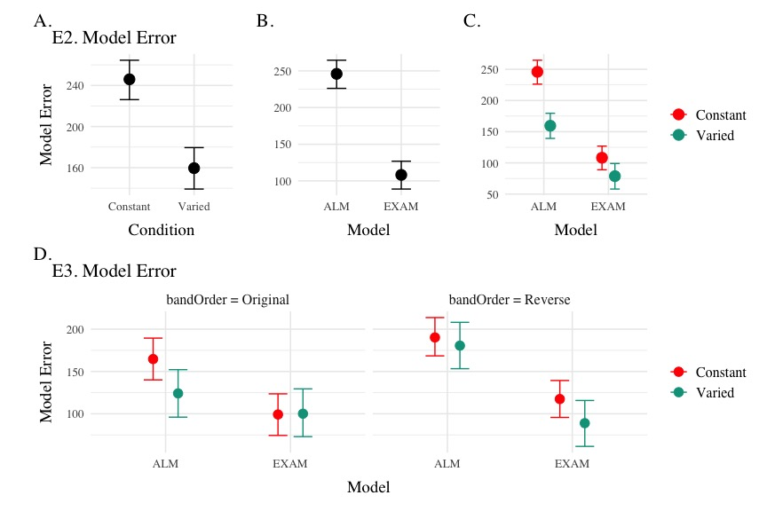

*Computational Model Summary*. Across all three experiments, the model fits consistently favored the Extrapolation-Association Model (EXAM) over the Associative Learning Model (ALM). This preference for EXAM was particularly pronounced for participants in the constant training conditions (note the positive coefficients on ModelEXAM:conditVaried interaction terms <a href="#tbl-htw-ee-e23" class="quarto-xref">Table 14</a>). This pattern is clearly illustrated in <a href="#fig-htw-best-model" class="quarto-xref">Figure 22</a>, which plots the difference in model errors between ALM and EXAM for each individual participant. Both varied and constant conditions have a greater proportion of subjects better fit by EXAM (positive error differences), with the magnitude of EXAM's advantage visibly larger for the constant group.

The superior performance of EXAM, especially for the constant training groups, may initially seem counterintuitive. One might assume that exposure to multiple, varied examples would be necessary to extract an abstract rule. However, EXAM is not a conventional rule-based model; it does not require the explicit abstraction of a rule. Instead, rule-based responses emerge during the retrieval process. The constant groups' formation of a single, accurate input-output association, combined with the usefulness of the zero point, may have been sufficient for EXAM to capture their performance. A potential concern is that the assumption of participants utilizing the zero point essentially transforms the extrapolation problem into an interpolation problem. However, this concern is mitigated by the consistency of the results across both the original and reversed order conditions (the testing extrapolation bands fall in between the constant training band and the 0 point in experiment 1, but not in experiment 2).

The fits to the individual participants also reveal a number of interesting cases where the models struggle to capture the data (<a href="#fig-htw-indv-pred" class="quarto-xref">Figure 23</a>). For example participant 68 exhibits a strong a strong non-monotonicity in the highest velocity band, a pattern which ALM can mimic, but which EXAM cannot capture, given it's to enforce a simple linear relationship between target velocity and response. Participant 70 (lower right corner of <a href="#fig-htw-indv-pred" class="quarto-xref">Figure 23</a>) had a roughly parabolic response pattern in their observed data, a pattern which neither model can properly reproduce, but which causes EXAM to perform particularly poorly.

*Modeling Limitations.* The present work compared models based on their ability to predict the observed data, without employing conventional model fit indices such as the Akaike Information Criterion (AIC) or the Bayesian Information Criterion (BIC). These indices, which penalize models based on their number of free parameters, would have been of limited utility in this case, as both ALM and EXAM have two free parameters. However, despite having the same number of free parameters, EXAM could still be considered the more complex model, as it incorporates all the components of ALM plus an additional mechanism for rule-based responding. A more comprehensive model comparison approach might involve performing cross-validation with a held-out subset of the data ([Mezzadri et al., 2022](#ref-mezzadriHoldoutStrategySelecting2022)) or penalizing models based on the range of patterns they can produce ([Dome & Wills, 2023](#ref-domeGdistanceComparisonModel2023)).



``` r
tid1 <- post_dat  |> mutate(Exp="E1",bandOrder="Original") |> select(-pred_dist, -dist) |>
  rbind(e2_model$post_dat |> mutate(Exp="E2",bandOrder="Reverse")) |>
  rbind(e3_model$post_dat |> mutate(Exp="E3")) |>
  filter(Fit_Method=="Test_Train") |>
  group_by(id,condit,Model,Fit_Method,x, Exp) |> 
    mutate(e2=abs(y-pred)) |> 
    summarise(y1=median(y), pred1=median(pred),mean_error=abs(y1-pred1)) |>
    group_by(id,condit,Model,Fit_Method,Exp) |> 
    summarise(mean_error=mean(mean_error)) |> 
    arrange(id,condit,Fit_Method) |>
    round_tibble(1) 

best_id <- tid1 |> 
  group_by(id,condit,Fit_Method) |> 
  mutate(best=ifelse(mean_error==min(mean_error),1,0)) 

lowest_error_model <- best_id %>%
  group_by(id, condit,Fit_Method, Exp) %>%
  summarise(Best_Model = Model[which.min(mean_error)],
            Lowest_error = min(mean_error),
            differential = min(mean_error) - max(mean_error)) %>%
  ungroup()

error_difference<- best_id %>%
  select(id, condit, Model,Fit_Method, mean_error) %>%
  pivot_wider(names_from = Model, values_from = c(mean_error)) %>%
  mutate(Error_difference = (ALM - EXAM))

full_comparison <- lowest_error_model |> 
  left_join(error_difference, by=c("id","condit","Fit_Method"))  |> 
  group_by(condit,Fit_Method,Best_Model) |> 
  mutate(nGrp=n(), model_rank = nGrp - rank(Error_difference) ) |> 
  arrange(Fit_Method,-Error_difference)

full_comparison |> 
  filter(Fit_Method=="Test_Train") |> 
  ungroup() |>
  mutate(id = reorder(id, Error_difference)) %>%
  ggplot(aes(y=id,x=Error_difference,fill=Best_Model))+
  geom_col() +
  #ggh4x::facet_grid2(~condit,axes="all",scales="free_y", independent = "y")+
  ggh4x::facet_nested_wrap(~condit+Exp,scales="free") + 
  theme(axis.text.y = element_text(size=8)) +
  labs(fill="Best Model",
  x="Mean Model Error Difference (ALM - EXAM)",
  y="Participant")
```

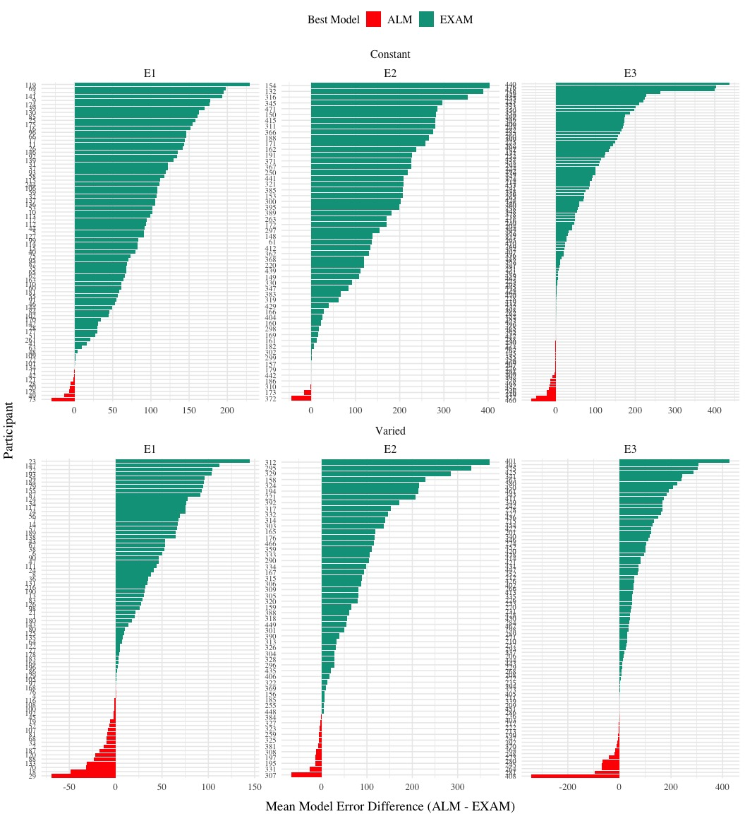

``` r
cId_tr <- c(137, 181, 11)
vId_tr <- c(14, 193, 47)
cId_tt <- c(11, 93, 35)
vId_tt <- c(1,14,74)
cId_new <- c(175, 68, 93, 74)
# filter(id %in% (filter(bestTestEXAM,group_rank<=9, Fit_Method=="Test")

e1_sbjs <- c(49,68,155, 175,74)
e3_sbjs <-  c(245, 280, 249)
e2_sbjs <- c(197, 157, 312, 334)
cFinal <- c(49, 128,202 )
vFinal <- c(68,70,245)


indv_post_l <- post_dat_l  |> mutate(Exp="E1",bandOrder="Original") |> select(-signed_dist) |>
  rbind(e2_model$post_dat_l |> mutate(Exp="E2",bandOrder="Reverse")) |>
  rbind(e3_model$post_dat_l |> mutate(Exp="E3") |> select(-fb)) |>
  filter(Fit_Method=="Test_Train", id %in% c(cFinal,vFinal))

testIndv <- indv_post_l |> 
#filter(id %in% c(cId_tt,vId_tt,cId_new), Fit_Method=="Test_Train") |> 
   mutate(x=as.factor(x), Resp=as.factor(Resp)) |>
  group_by(id,condit,Fit_Method,Model,Resp) |>
   mutate(flab=paste0("Subject: ",id)) |>
  ggplot(aes(x = Resp, y = val, fill=vb, col=ifelse(bandType=="Trained","black",NA),size=ifelse(bandType=="Trained","black",NA))) + 
  stat_bar_sd + 
  ggh4x::facet_nested_wrap(condit~flab, axes = "all",ncol=3) +
  scale_color_manual(values = c("black" = "black"), guide = FALSE) +
  scale_size_manual(values = c("black" = .5), guide = FALSE) + 
  labs(title="Individual Participant fits from Test & Train Fitting Method",
       y="X Velocity",fill="Target Velocity") +
   guides(fill = guide_legend(nrow = 1)) + 
  theme(legend.position = "bottom",axis.title.x = element_blank())

testIndv 
```

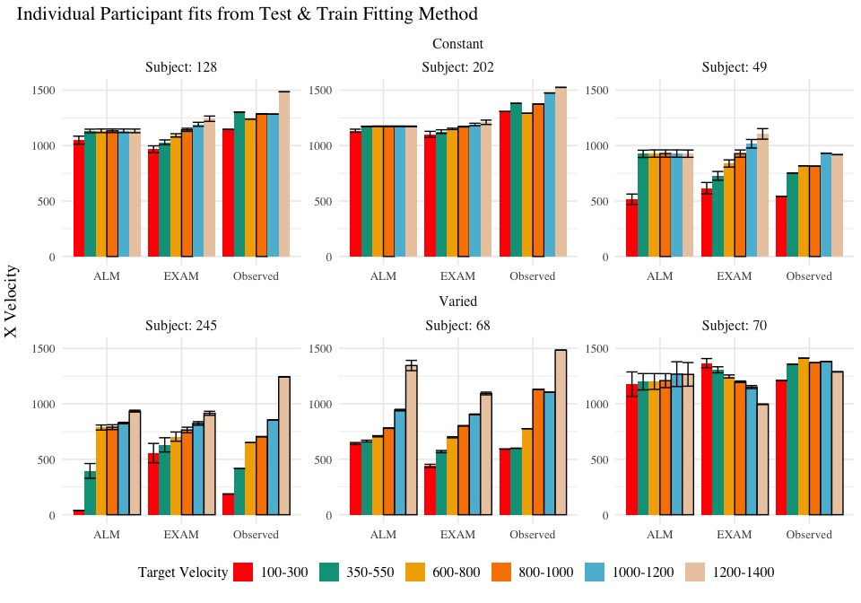

# General Discussion

Across three experiments, we investigated the impact of training variability on learning and extrapolation in a visuomotor function learning task.

In Experiment 1, participants in the varied training condition, who experienced a wider range of velocity bands during training, showed lower accuracy at the end of training compared to those in the constant training condition. Crucially, during the testing phase, the varied group exhibited significantly larger deviations from the target velocity bands, particularly for the extrapolation bands that were not encountered during training. The varied group also showed less discrimination between velocity bands, as evidenced by shallower slopes when predicting response velocity from target velocity band.

Experiment 2 extended these findings by reversing the order of the training and testing bands. Similar to Experiment 1, the varied group demonstrated poorer performance during both training and testing phases. However, unlike Experiment 1, the varied group did not show a significant difference in discrimination between bands compared to the constant group.

In Experiment 3, we provided only ordinal feedback during training, in contrast to the continuous feedback provided in the previous experiments. Participants were assigned to both an order condition (original or reverse) and a training condition (constant or varied). The varied condition showed larger deviations at the end of training, consistent with the previous experiments. Interestingly, there was a significant interaction between training condition and band order, with the varied condition showing greater accuracy in the reverse order condition. During testing, the varied group once again exhibited larger deviations, particularly for the extrapolation bands. The reverse order conditions showed smaller deviations compared to the original order conditions. Discrimination between velocity bands was poorer for the varied group in the original order condition, but not in the reverse order condition.

All three of our experiments yielded evidence that varied training conditions produced less learning by the end of training, a pattern consistent with much of the previous research on the influence of training variability ([Catalano & Kleiner, 1984](#ref-catalanoDistantTransferCoincident1984a); [Soderstrom & Bjork, 2015](#ref-soderstromLearningPerformanceIntegrative2015); [Wrisberg et al., 1987](#ref-wrisbergVariabilityPracticeHypothesis1987)). The sole exception to this pattern was the reverse order condition in Experiment 3, where the varied group was not significantly worse than the constant group. Neither the varied condition trained with the same reverse-order items in Experiment 2, nor the original-order varied condition trained with ordinal feedback in Experiment 3 were able to match the performance of their complementary constant groups by the end of training, suggesting that the relative success of the ordinal-reverse ordered varied group cannot be attributed to item or feedback effects alone.

Our findings also diverge from the two previous studies to cleanly manipulate the variability of training items in a function learning task ([DeLosh et al., 1997](#ref-deloshExtrapolationSineQua1997); [van Dam & Ernst, 2015](#ref-vandamMappingShapeVisuomotor2015)), although the varied training condition of van Dam & Ernst ([2015](#ref-vandamMappingShapeVisuomotor2015)) also exhibited less learning, neither of these previous studies observed any difference between training conditions in extrapolation to novel items. Like DeLosh et al. ([1997](#ref-deloshExtrapolationSineQua1997)) , our participants exhibited above chance extrapolation/discrimination of novel items, however they observed no difference between any of their three training conditions. A noteworthy difference difference between our studies is that DeLosh et al. ([1997](#ref-deloshExtrapolationSineQua1997)) trained participants with either 8, 20, or 50 unique items (all receiving the same total number of training trials). These larger sets of unique items, combined with the fact that participants achieved near ceiling level performance by the end of training - may have made it more difficult to observe any between-group differences of training variation in their study. van Dam & Ernst ([2015](#ref-vandamMappingShapeVisuomotor2015)) 's variability manipulation was more similar to our own, as they trained participants with either 2 or 5 unique items. However, although the mapping between their input stimuli and motor responses was technically linear, the input dimension was more complex than our own, as it was defined by the degree of "spikiness" of the input shape. This entirely arbitrary mapping also would have preculded any sense of a "0" point, which may partially explain why neither of their training conditions were able to extrapolate linearly in the manner observed in the current study or in DeLosh et al. ([1997](#ref-deloshExtrapolationSineQua1997)).

*Limitations*

While the present study provides valuable insights into the influence of training variability on visuomotor function learning and extrapolation, there are several limitations that should be flagged.
First, although the constant training group never had experience from a velocity band closer to the extrapolation bands than the varied group, they always had a three times more trials with the nearest velocity band. Such a difference may be an unavoidable consequence of varied vs. constant design which match the total number of training trials between the two groups. However in order to more carefully tease apart the influence of variability from the influence of frequency/repetition effects, future research could explore alternative designs that maintain the variability manipulation while equating the amount of training on the nearest examples across conditions, such as by increasing the total number of trials for the varied group.
Another limitation is that the testing stage did not include any interpolation items, i.e. the participants tested only from the training bands they experienced during training, or from extrapolation bands. The absence of interpolation testing makes it more difficult to distinguish between the effects of training variability on extrapolation specifically, as opposed to generalization more broadly. Of course, the nature of the constant training condition makes interpolation testing impossible to implement, however future studies might compare a training regimes that each include at least 2 distinct items, but still differ in total amount of variability experienced, which would then allow groups to be compared in terms of both interpolation and extrapolation testing.
Finally, the task employed in the present study consisted of only a linear, positive function. Previous work in human function learning has repeatedly shown that such functions are among the easiest to learn, but that humans are nonetheless capable of learning negative, non-linear, or discontinuous functions ([Busemeyer et al., 1997](#ref-busemeyerLearningFunctionalRelations1997); [DeLosh et al., 1997](#ref-deloshExtrapolationSineQua1997); [Kalish, 2013](#ref-kalishLearningExtrapolatingPeriodic2013); [Mcdaniel et al., 2009](#ref-mcdanielPredictingTransferPerformance2009)). It thus remains an open question as to whether the influence of training variability might interact with various components of the to-be-learned function.

# Supplementary

[Apppendix](https://tegorman13.github.io/htw/Analysis/e1_Analysis.html) available at https://tegorman13.github.io/htw/Analysis/e1_Analysis.html

# References

Bengtsson, H. (2021). A Unifying Framework for Parallel and Distributed Processing in R using Futures. *The R Journal*, *13*(2), 208. <https://doi.org/10.32614/RJ-2021-048>

Berniker, M., Mirzaei, H., & Kording, K. P. (2014). The effects of training breadth on motor generalization. *Journal of Neurophysiology*, *112*(11), 2791--2798. <https://doi.org/10.1152/jn.00615.2013>

Bott, L., & Heit, E. (2004). Nonmonotonic Extrapolation in Function Learning. *Journal of Experimental Psychology: Learning, Memory, and Cognition*, *30*(1), 38--50. <https://doi.org/10.1037/0278-7393.30.1.38>

Braithwaite, D. W., & Goldstone, R. L. (2015). Effects of Variation and Prior Knowledge on Abstract Concept Learning. *Cognition and Instruction*, *33*(3), 226--256. <https://doi.org/10.1080/07370008.2015.1067215>

Braun, D. A., Aertsen, A., Wolpert, D. M., & Mehring, C. (2009). Motor Task Variation Induces Structural Learning. *Current Biology*, *19*(4), 352--357. <https://doi.org/10.1016/j.cub.2009.01.036>

Brehmer, B. (1974). Hypotheses about relations between scaled variables in the learning of probabilistic inference tasks. *Organizational Behavior and Human Performance*, *11*(1), 1--27. <https://doi.org/10.1016/0030-5073(74)90002-6>

Brekelmans, G., Lavan, N., Saito, H., Clayards, M., & Wonnacott, E. (2022). Does high variability training improve the learning of non-native phoneme contrasts over low variability training? A replication. *Journal of Memory and Language*, *126*, 104352. <https://doi.org/10.1016/j.jml.2022.104352>

Brown, M. A., & Lacroix, G. (2017). Underestimation in linear function learning: Anchoring to zero or x-y similarity? *Canadian Journal of Experimental Psychology/Revue Canadienne de Psychologie Expérimentale*, *71*(4), 274--282. <https://doi.org/10.1037/cep0000129>

Bürkner, P.-C. (2017). Brms: An R Package for Bayesian Multilevel Models Using Stan. *Journal of Statistical Software*, *80*, 1--28. <https://doi.org/10.18637/jss.v080.i01>

Busemeyer, J. R., Byun, E., DeLosh, E. L., & McDaniel, M. A. (1997). Learning Functional Relations Based on Experience with <span class="nocase">Input-output Pairs</span> by Humans and Artificial Neural Networks. In *Knowledge Concepts and Categories* (pp. 405--437). Psychology Press.

Carroll, J. D. (1963). Functional Learning: The Learning of Continuous Functional Mappings Relating Stimulus and Response Continua. *ETS Research Bulletin Series*, *1963*(2), i--144. <https://doi.org/10.1002/j.2333-8504.1963.tb00958.x>

Catalano, J. F., & Kleiner, B. M. (1984). Distant Transfer in Coincident Timing as a Function of Variability of Practice. *Perceptual and Motor Skills*, *58*(3), 851--856. <https://doi.org/10.2466/pms.1984.58.3.851>

Ciccione, L., & Dehaene, S. (2021). Can humans perform mental regression on a graph? Accuracy and bias in the perception of scatterplots. *Cognitive Psychology*, *128*, 101406. <https://doi.org/10.1016/j.cogpsych.2021.101406>

Cohen, A. L., Nosofsky, R. M., & Zaki, S. R. (2001). Category variability, exemplar similarity, and perceptual classification. *Memory & Cognition*, *29*(8), 1165--1175. <https://doi.org/10.3758/BF03206386>

Courrieu, P. (2012). Quick approximation of bivariate functions. *British Journal of Mathematical and Statistical Psychology*, *65*(1), 89--121. <https://doi.org/10.1111/j.2044-8317.2011.02016.x>

Cranmer, K., Brehmer, J., & Louppe, G. (2020). The frontier of simulation-based inference. *Proceedings of the National Academy of Sciences*, *117*(48), 30055--30062. <https://doi.org/10.1073/pnas.1912789117>

DeLosh, E. L., McDaniel, M. A., & Busemeyer, J. R. (1997). Extrapolation: The Sine Qua Non for Abstraction in Function Learning. *Journal of Experimental Psychology: Learning, Memory, and Cognition*, *23*(4), 19. <https://doi.org/10.1037/0278-7393.23.4.968>

Dome, L., & Wills, A. (2023). *G-distance: On the comparison of model and human heterogeneity* \[Preprint\]. PsyArXiv. <https://doi.org/10.31234/osf.io/ygmcj>

Farrell, S., & Lewandowsky, S. (2018). *Computational Modeling of Cognition and Behavior:* (1st ed.). Cambridge University Press. <https://doi.org/10.1017/CBO9781316272503>

Guo, J.-P., Yang, L.-Y., & Ding, Y. (2014). Effects of example variability and prior knowledge in how students learn to solve equations. *European Journal of Psychology of Education*, *29*(1), 21--42. <https://www.jstor.org/stable/43551124>

Hu, M., & Nosofsky, R. M. (2024). High-variability training does not enhance generalization in the prototype-distortion paradigm. *Memory & Cognition*, 1--16. <https://doi.org/10.3758/s13421-023-01516-1>

Kalish, M. L. (2013). Learning and extrapolating a periodic function. *Memory & Cognition*, *41*(6), 886--896. <https://doi.org/10.3758/s13421-013-0306-9>

Kalish, M. L., Lewandowsky, S., & Kruschke, J. K. (2004). Population of Linear Experts: Knowledge Partitioning and Function Learning. *Psychological Review*, *111*(4), 1072--1099. <https://doi.org/10.1037/0033-295X.111.4.1072>

Kangasrääsiö, A., Jokinen, J. P. P., Oulasvirta, A., Howes, A., & Kaski, S. (2019). Parameter Inference for Computational Cognitive Models with Approximate Bayesian Computation. *Cognitive Science*, *43*(6), e12738. <https://doi.org/10.1111/cogs.12738>

Koh, K., & Meyer, D. E. (1991). Function learning: Induction of continuous stimulus-response relations. *Journal of Experimental Psychology: Learning, Memory, and Cognition*, *17*(5), 811. <https://doi.org/10.1037/0278-7393.17.5.811>

Kruschke, J. K. (1992). ALCOVE: An exemplar-based connectionist model of Category Learning. *Psychological Review*, *99*(1). <https://doi.org/10.1037/0033-295X.99.1.22>

Kwantes, P. J., & Neal, A. (2006). Why people underestimate y when extrapolating in linear functions. *Journal of Experimental Psychology: Learning, Memory, and Cognition*, *32*(5), 1019--1030. <https://doi.org/10.1037/0278-7393.32.5.1019>

Makowski, D., Ben-Shachar, M. S., & Lüdecke, D. (2019). <span class="nocase">bayestestR</span>: Describing Effects and their Uncertainty, Existence and Significance within the Bayesian Framework. *Journal of Open Source Software*, *4*(40), 1541. <https://doi.org/10.21105/joss.01541>

Mcdaniel, M. A., Dimperio, E., Griego, J. A., & Busemeyer, J. R. (2009). Predicting transfer performance: A comparison of competing function learning models. *Journal of Experimental Psychology. Learning, Memory, and Cognition*, *35*, 173--195. <https://doi.org/10.1037/a0013982>

McDaniel, M. A., Fadler, C. L., & Pashler, H. (2013). Effects of spaced versus massed training in function learning. *Journal of Experimental Psychology: Learning, Memory, and Cognition*, *39*(5), 1417--1432. <https://doi.org/10.1037/a0032184>

Mezzadri, G., Laloë, T., Mathy, F., & Reynaud-Bouret, P. (2022). Hold-out strategy for selecting learning models: Application to categorization subjected to presentation orders. *Journal of Mathematical Psychology*, *109*, 102691. <https://doi.org/10.1016/j.jmp.2022.102691>

Page, M. (2000). Connectionist modelling in psychology: A localist manifesto. *Behavioral and Brain Sciences*, *23*(4), 443--467. <https://doi.org/10.1017/S0140525X00003356>

Perry, L. K., Samuelson, L. K., Malloy, L. M., & Schiffer, R. N. (2010). Learn Locally, Think Globally: Exemplar Variability Supports Higher-Order Generalization and Word Learning. *Psychological Science*, *21*(12), 1894--1902. <https://doi.org/10.1177/0956797610389189>

Posner, M. I., & Keele, S. W. (1968). On the genesis of abstract ideas. *Journal of Experimental Psychology*, *77*(3), 353--363. <https://doi.org/10.1037/h0025953>

Raviv, L., Lupyan, G., & Green, S. C. (2022). How variability shapes learning and generalization. *Trends in Cognitive Sciences*, S1364661322000651. <https://doi.org/10.1016/j.tics.2022.03.007>

Roller, C. A., Cohen, H. S., Kimball, K. T., & Bloomberg, J. J. (2001). Variable practice with lenses improves visuo-motor plasticity. *Cognitive Brain Research*, *12*(2), 341--352. <https://doi.org/10.1016/S0926-6410(01)00077-5>

Said, N., & Fischer, H. (2021). Extrapolation accuracy underestimates rule learning: Evidence from the function-learning paradigm. *Acta Psychologica*, *218*, 103356. <https://doi.org/10.1016/j.actpsy.2021.103356>

Schmidt, R. A. (1975). A schema theory of discrete motor skill learning. *Psychological Review*, *82*(4), 225--260. <https://doi.org/10.1037/h0076770>

Schulz, E., Quiroga, F., & Gershman, S. J. (2020). Communicating Compositional Patterns. *Open Mind*, *4*, 25--39. <https://doi.org/10.1162/opmi_a_00032>

Soderstrom, N. C., & Bjork, R. A. (2015). Learning versus performance: An integrative review. *Perspectives on Psychological Science*, *10*(2), 176--199. <https://doi.org/10.1177/1745691615569000>

Team, R. C. (2020). *R: A Language and Environment for Statistical Computing*. R: A Language and Environment for Statistical Computing.

Turner, B. M., Sederberg, P. B., & McClelland, J. L. (2016). Bayesian analysis of simulation-based models. *Journal of Mathematical Psychology*, *72*, 191--199. <https://doi.org/10.1016/j.jmp.2014.10.001>

Turner, B. M., & Van Zandt, T. (2012). A tutorial on approximate Bayesian computation. *Journal of Mathematical Psychology*, *56*(2), 69--85. <https://doi.org/10.1016/j.jmp.2012.02.005>

van Dam, L. C. J., & Ernst, M. O. (2015). Mapping Shape to Visuomotor Mapping: Learning and Generalisation of Sensorimotor Behaviour Based on Contextual Information. *PLOS Computational Biology*, *11*(3), e1004172. <https://doi.org/10.1371/journal.pcbi.1004172>

Van Rossum, J. H. A. (1990). Schmidt's schema theory: The empirical base of the variability of practice hypothesis. *Human Movement Science*, *9*(3-5), 387--435. <https://doi.org/10.1016/0167-9457(90)90010-B>

Wrisberg, C. A., Winter, T. P., & Kuhlman, J. S. (1987). The Variability of Practice Hypothesis: Further Tests and Methodological Discussion. *Research Quarterly for Exercise and Sport*, *58*(4), 369--374. <https://doi.org/10.1080/02701367.1987.10608114>
