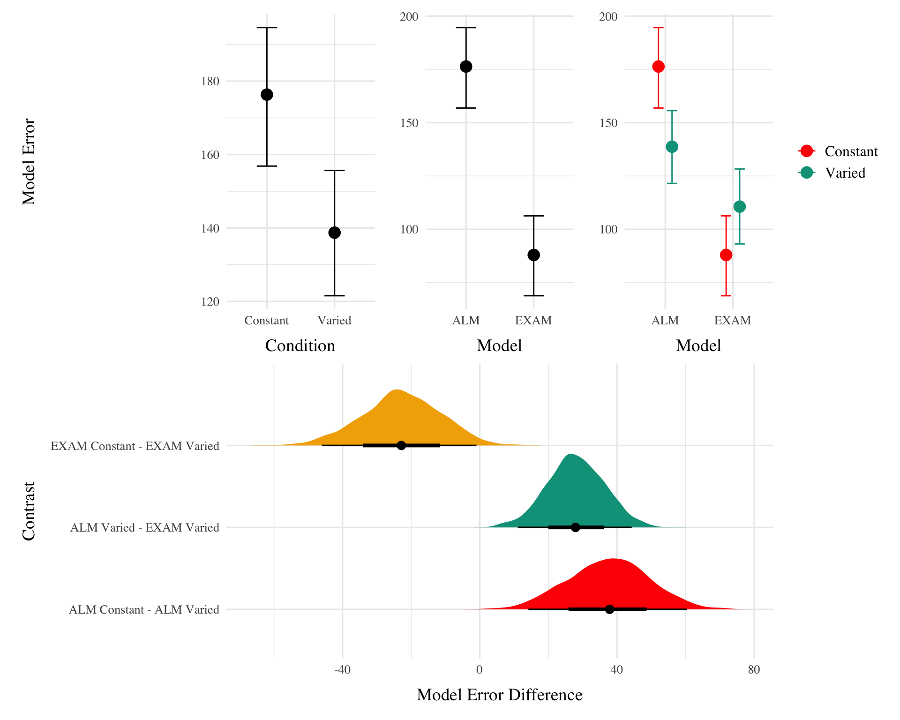
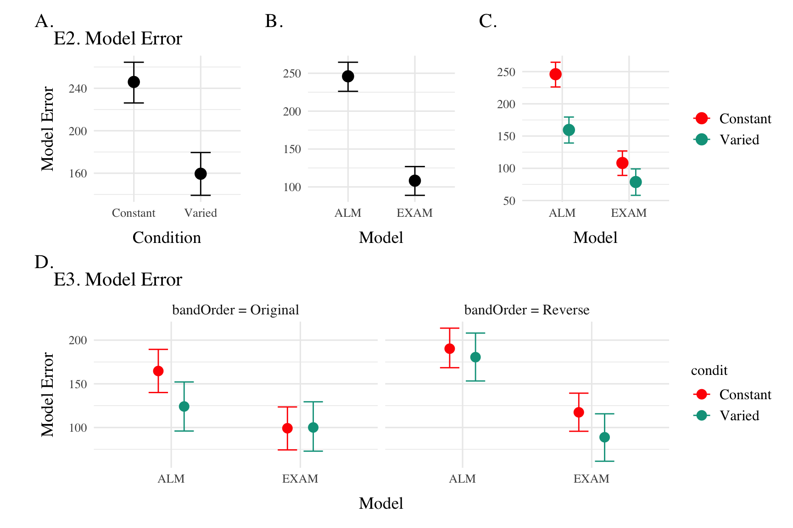

# Modeling Approach

The modeling goal is to implement a full process model capable of both 1) producing novel responses and 2) modeling behavior in both the learning and testing stages of the experiment. For this purpose, we will apply the associative learning model (ALM) and the EXAM model of function learning (DeLosh et al., 1997). ALM is a simple connectionist learning model which closely resembles Kruschke's ALCOVE model (Kruschke, 1992), with modifications to allow for the generation of continuous responses.

## ALM & Exam Description

ALM is a localist neural network model (Page, 2000), with each input node corresponding to a particular stimulus, and each output node corresponding to a particular response value. The units in the input layer activate as a function of their Gaussian similarity to the input stimulus. So, for example, an input stimulus of value 55 would induce maximal activation of the input unit tuned to 55. Depending on the value of the generalization parameter, the nearby units (e.g. 54 and 56; 53 and 57) may also activate to some degree. ALM is structured with input and output nodes that correspond to regions of the stimulus space, and response space, respectively. The units in the input layer activate as a function of their similarity to a presented stimulus. As was the case with the exemplar-based models, similarity in ALM is exponentially decaying function of distance. The input layer is fully connected to the output layer, and the activation for any particular output node is simply the weighted sum of the connection weights between that node and the input activations. The network then produces a response by taking the weighted average of the output units (recall that each output unit has a value corresponding to a particular response). During training, the network receives feedback which activates each output unit as a function of its distance from the ideal level of activation necessary to produce the correct response. The connection weights between input and output units are then updated via the standard delta learning rule, where the magnitude of weight changes are controlled by a learning rate parameter. The EXAM model is an extension of ALM, with the same learning rule and representational scheme for input and output units. The primary difference is that EXAM includes a linear extrapolation mechanism for generating novel responses during testing, a modification necessary to account for human extrapolation patterns in past research Brown & Lacroix (2017). Although this extrapolation rule departs from a strictly similarity-based generalization mechanism, EXAM is distinct from pure rule-based models in that it remains constrained by the weights learned during training.

See <a href="#tbl-alm-exam" class="quarto-xref">Table 1</a> for a full specification of the equations that define ALM and EXAM.

|                    | **ALM Response Generation**                                        |                                                                                               |
|-------------------|-----------------------------|-------------------------|
| Input Activation   | $a_i(X) = \frac{e^{-c(X-X_i)^2}}{\sum_{k=1}^M e^{-c(X-X_k)^2}}$    | Input nodes activate as a function of Gaussian similarity to stimulus                         |
| Output Activation  | $O_j(X) = \sum_{k=1}^M w_{ji} \cdot a_i(X)$                        | Output unit $O_j$ activation is the weighted sum of input activations and association weights |
| Output Probability | $P[Y_j|X] = \frac{O_j(X)}{\sum_{k=1}^M O_k(X)}$                    | The response, $Y_j$ probabilites computed via Luce's choice rule                              |
| Mean Output        | $m(X) = \sum_{j=1}^L Y_j \cdot \frac{O_j(x)}{\sum_{k=1}^M O_k(X)}$ | Weighted average of probabilities determines response to X                                    |
|                    | **ALM Learning**                                                   |                                                                                               |
| Feedback           | $f_j(Z) = e^{-c(Z-Y_j)^2}$                                         | feedback signal Z computed as similarity between ideal response and observed response         |
| magnitude of error | $\Delta_{ji}=(f_{j}(Z)-o_{j}(X))a_{i}(X)$                          | Delta rule to update weights.                                                                 |
| Update Weights     | $w_{ji}^{new}=w_{ji}+\eta\Delta_{ji}$                              | Updates scaled by learning rate parameter $\eta$.                                             |
|                    | **EXAM Extrapolation**                                             |                                                                                               |
| Instance Retrieval | $P[X_i|X] = \frac{a_i(X)}{\sum_{k=1}^M a_k(X)}$                    | Novel test stimulus $X$ activates input nodes $X_i$                                           |
| Slope Computation  | $S =$ $\frac{m(X_{1})-m(X_{2})}{X_{1}-X_{2}}$                      | Slope value, $S$ computed from nearest training instances                                     |
| Response           | $E[Y|X_i] = m(X_i) + S \cdot [X - X_i]$                            | ALM response $m(X_i)$ adjusted by slope.                                                      |

Table 1: ALM & EXAM Equations

## Model Fitting

To fit ALM and EXAM to our participant data, we employ a similar method to Mcdaniel et al. (2009), wherein we examine the performance of each model after being fit to various subsets of the data. Each model was fit to the data in with separate procedures: 1) fit to maximize predictions of the testing data, 2) fit to maximize predictions of both the training and testing data, 3) fit to maximize predictions of the just the training data. We refer to this fitting manipulations as "Fit Method" in the tables and figures below. It should be emphasized that for all three fit methods, the ALM and EXAM models behave identically - with weights updating only during the training phase.Models to were fit separately to the data of each individual participant. The free parameters for both models are the generalization ($c$) and learning rate ($lr$) parameters. Parameter estimation was performed using approximate bayesian computation (ABC), which we describe in detail below.

> **None**
>
> ** Approximate Bayesian Computation**
>
> To estimate parameters, we used approximate bayesian computation (ABC), enabling us to obtain an estimate of the posterior distribution of the generalization and learning rate parameters for each individual. ABC belongs to the class of simulation-based inference methods (Cranmer et al., 2020), which have begun being used for parameter estimation in cognitive modeling relatively recently (Kangasrääsiö et al., 2019; Turner et al., 2016; Turner & Van Zandt, 2012). Although they can be applied to any model from which data can be simulated, ABC methods are most useful for complex models that lack an explicit likelihood function (e.g. many neural network and evidence accumulation models).
>
> The general ABC procedure is to 1) define a prior distribution over model parameters. 2) sample candidate parameter values, $\theta^*$, from the prior. 3) Use $\theta^*$ to generate a simulated dataset, $Data_{sim}$. 4) Compute a measure of discrepancy between the simulated and observed datasets, $discrep$($Data_{sim}$, $Data_{obs}$). 5) Accept $\theta^*$ if the discrepancy is less than the tolerance threshold, $\epsilon$, otherwise reject $\theta^*$. 6) Repeat until desired number of posterior samples are obtained.
>
> Although simple in the abstract, implementations of ABC require researchers to make a number of non-trivial decisions as to i) the discrepancy function between observed and simulated data, ii) whether to compute the discrepancy between trial level data, or a summary statistic of the datasets, iii) the value of the minimum tolerance $\epsilon$ between simulated and observed data. For the present work, we follow the guidelines from previously published ABC tutorials (Farrell & Lewandowsky, 2018; Turner & Van Zandt, 2012). For the test stage, we summarized datasets with mean velocity of each band in the observed dataset as $V_{obs}^{(k)}$ and in the simulated dataset as $V_{sim}^{(k)}$, where $k$ represents each of the six velocity bands. For computing the discrepancy between datasets in the training stage, we aggregated training trials into three equally sized blocks (separately for each velocity band in the case of the varied group). After obtaining the summary statistics of the simulated and observed datasets, the discrepancy was computed as the mean of the absolute difference between simulated and observed datasets (<a href="#eq-discrep-test" class="quarto-xref">Equation 1</a> and <a href="#eq-discrep-train" class="quarto-xref">Equation 2</a>). For the models fit to both training and testing data, discrepancies were computed for both stages, and then averaged together.
>
> $$
> discrep_{Test}(Data_{sim}, Data_{obs}) = \frac{1}{6} \sum_{k=1}^{6} |V_{obs}^{(k)} - V_{sim}^{(k)}|
>  \qquad(1)$$
>
> $$
> \begin{aligned} \\
> discrep_{Train,constant}(Data_{sim}, Data_{obs}) = \frac{1}{N_{blocks}} \sum_{j=1}^{N_{blocks}} |V_{obs,constant}^{(j)} - V_{sim,constant}^{(j)}| \\ \\
> discrep_{Train,varied}(Data_{sim}, Data_{obs}) = \frac{1}{N_{blocks} \times 3} \sum_{j=1}^{N_{blocks}} \sum_{k=1}^{3} |V_{obs,varied}^{(j,k)} - V_{sim,varied}^{(j,k)}|
> \end{aligned}
>  \qquad(2)$$
>
> The final component of our ABC implementation is the determination of an appropriate value of $\epsilon$. The setting of $\epsilon$ exerts strong influence on the approximated posterior distribution. Smaller values of $\epsilon$ increase the rejection rate, and improve the fidelity of the approximated posterior, while larger values result in an ABC sampler that simply reproduces the prior distribution. Because the individual participants in our dataset differed substantially in terms of the noisiness of their data, we employed an adaptive tolerance setting strategy to tailor $\epsilon$ to each individual. The initial value of $\epsilon$ was set to the overall standard deviation of each individuals velocity values. Thus, sampled parameter values that generated simulated data within a standard deviation of the observed data were accepted, while worse performing parameters were rejected. After every 300 samples the tolerance was allowed to increase only if the current acceptance rate of the algorithm was less than 1%. In such cases, the tolerance was shifted towards the average discrepancy of the 5 best samples obtained thus far. To ensure the acceptance rate did not become overly permissive, $\epsilon$ was also allowed to decrease every time a sample was accepted into the posterior.

For each of the 156 participants from Experiment 1, the ABC algorithm was run until 200 samples of parameters were accepted into the posterior distribution. Obtaining this number of posterior samples required an average of 205,000 simulation runs per participant. Fitting each combination of participant, Model (EXAM & ALM), and fitting method (Test only, Train only, Test & Train) required a total of 192 million simulation runs. To facilitate these intensive computational demands, we used the Future Package in R (Bengtsson, 2021), allowing us to parallelize computations across a cluster of ten M1 iMacs, each with 8 cores.

### Modelling Results

#### Group level Patterns

<table class="gt_table" data-quarto-disable-processing="true" data-quarto-bootstrap="false">
  <thead>
    <tr class="gt_col_headings gt_spanner_row">
      <th class="gt_col_heading gt_columns_bottom_border gt_left" rowspan="2" colspan="1" style="border-top-width: 1px; border-top-style: solid; border-top-color: black;" scope="col" id="Task Stage">Task Stage</th>
      <th class="gt_col_heading gt_columns_bottom_border gt_center" rowspan="2" colspan="1" style="border-top-width: 1px; border-top-style: solid; border-top-color: black;" scope="col" id="Fit Method">Fit Method</th>
      <th class="gt_center gt_columns_top_border gt_column_spanner_outer" rowspan="1" colspan="2" scope="colgroup" id="ALM">
        ALM
      </th>
      <th class="gt_center gt_columns_top_border gt_column_spanner_outer" rowspan="1" colspan="2" scope="colgroup" id="EXAM">
        EXAM
      </th>
    </tr>
    <tr class="gt_col_headings">
      <th class="gt_col_heading gt_columns_bottom_border gt_right" rowspan="1" colspan="1" style="border-top-width: 1px; border-top-style: solid; border-top-color: black;" scope="col" id="Constant">Constant</th>
      <th class="gt_col_heading gt_columns_bottom_border gt_right" rowspan="1" colspan="1" style="border-top-width: 1px; border-top-style: solid; border-top-color: black;" scope="col" id="Varied">Varied</th>
      <th class="gt_col_heading gt_columns_bottom_border gt_right" rowspan="1" colspan="1" style="border-top-width: 1px; border-top-style: solid; border-top-color: black;" scope="col" id="Constant">Constant</th>
      <th class="gt_col_heading gt_columns_bottom_border gt_right" rowspan="1" colspan="1" style="border-top-width: 1px; border-top-style: solid; border-top-color: black;" scope="col" id="Varied">Varied</th>
    </tr>
  </thead>
  <tbody class="gt_table_body">
    <tr><td headers="Task Stage" class="gt_row gt_left" style="background-color: #FFFFFF;">Test</td>
<td headers="Fit Method" class="gt_row gt_center" style="background-color: #FFFFFF;">Fit to Test Data</td>
<td headers="ALM_Constant" class="gt_row gt_right" style="background-color: #FFFFFF;">199.93</td>
<td headers="ALM_Varied" class="gt_row gt_right" style="background-color: #FFFFFF;">103.36</td>
<td headers="EXAM_Constant" class="gt_row gt_right" style="background-color: #FFFFFF;">104.01</td>
<td headers="EXAM_Varied" class="gt_row gt_right" style="background-color: #FFFFFF;">85.68</td></tr>
    <tr><td headers="Task Stage" class="gt_row gt_left" style="background-color: #FFFFFF;">Test</td>
<td headers="Fit Method" class="gt_row gt_center" style="background-color: #FFFFFF;">Fit to Test &amp; Training Data</td>
<td headers="ALM_Constant" class="gt_row gt_right" style="background-color: #FFFFFF;">216.97</td>
<td headers="ALM_Varied" class="gt_row gt_right" style="background-color: #FFFFFF;">170.28</td>
<td headers="EXAM_Constant" class="gt_row gt_right" style="background-color: #FFFFFF;">127.94</td>
<td headers="EXAM_Varied" class="gt_row gt_right" style="background-color: #FFFFFF;">144.86</td></tr>
    <tr><td headers="Task Stage" class="gt_row gt_left" style="background-color: #FFFFFF;">Test</td>
<td headers="Fit Method" class="gt_row gt_center" style="background-color: #FFFFFF;">Fit to Training Data</td>
<td headers="ALM_Constant" class="gt_row gt_right" style="background-color: #FFFFFF;">467.73</td>
<td headers="ALM_Varied" class="gt_row gt_right" style="background-color: #FFFFFF;">291.38</td>
<td headers="EXAM_Constant" class="gt_row gt_right" style="background-color: #FFFFFF;">273.30</td>
<td headers="EXAM_Varied" class="gt_row gt_right" style="background-color: #FFFFFF;">297.91</td></tr>
    <tr><td headers="Task Stage" class="gt_row gt_left" style="background-color: #FFFFFF;">Train</td>
<td headers="Fit Method" class="gt_row gt_center" style="background-color: #FFFFFF;">Fit to Test Data</td>
<td headers="ALM_Constant" class="gt_row gt_right" style="background-color: #FFFFFF;">297.82</td>
<td headers="ALM_Varied" class="gt_row gt_right" style="background-color: #FFFFFF;">2,016.01</td>
<td headers="EXAM_Constant" class="gt_row gt_right" style="background-color: #FFFFFF;">53.90</td>
<td headers="EXAM_Varied" class="gt_row gt_right" style="background-color: #FFFFFF;">184.00</td></tr>
    <tr><td headers="Task Stage" class="gt_row gt_left" style="background-color: #FFFFFF;">Train</td>
<td headers="Fit Method" class="gt_row gt_center" style="background-color: #FFFFFF;">Fit to Test &amp; Training Data</td>
<td headers="ALM_Constant" class="gt_row gt_right" style="background-color: #FFFFFF;">57.40</td>
<td headers="ALM_Varied" class="gt_row gt_right" style="background-color: #FFFFFF;">132.32</td>
<td headers="EXAM_Constant" class="gt_row gt_right" style="background-color: #FFFFFF;">42.92</td>
<td headers="EXAM_Varied" class="gt_row gt_right" style="background-color: #FFFFFF;">127.90</td></tr>
    <tr><td headers="Task Stage" class="gt_row gt_left" style="background-color: #FFFFFF;">Train</td>
<td headers="Fit Method" class="gt_row gt_center" style="background-color: #FFFFFF;">Fit to Training Data</td>
<td headers="ALM_Constant" class="gt_row gt_right" style="background-color: #FFFFFF;">51.77</td>
<td headers="ALM_Varied" class="gt_row gt_right" style="background-color: #FFFFFF;">103.48</td>
<td headers="EXAM_Constant" class="gt_row gt_right" style="background-color: #FFFFFF;">51.43</td>
<td headers="EXAM_Varied" class="gt_row gt_right" style="background-color: #FFFFFF;">107.03</td></tr>
  </tbody>
  
  
</table>

Table 2: Models errors predicting empirical data - aggregated over all participants, posterior parameter values, and velocity bands. Note that Fit Method refers to the subset of the data that the model was trained on, while Task Stage refers to the subset of the data that the model was evaluated on.

The posterior distributions of the $c$ and $lr$ parameters are shown <a href="#fig-htw-post-dist" class="quarto-xref">Figure 1</a>, and model predictions are shown alongside the empirical data in <a href="#fig-cm-vx-pat" class="quarto-xref">Figure 3</a>. There were substantial individual differences in the posteriors of both parameters, with the within-group individual differences generally swamped any between-group or between-model differences. The magnitude of these individual differences remains even if we consider only the single best parameter set for each subject.

We used the posterior distribution of $c$ and $lr$ parameters to generate a posterior predictive distribution of the observed data for each participant, which then allows us to compare the empirical data to the full range of predictions from each model. Aggregated residuals are displayed in <a href="#fig-htw-resid-pred" class="quarto-xref">Figure 2</a>. The pattern of training stage residual errors are unsurprising across the combinations of models and fitting method . Differences in training performance between ALM and EXAM are generally minor (the two models have identical learning mechanisms). The differences in the magnitude of residuals across the three fitting methods are also straightforward, with massive errors for the 'fit to Test Only' model, and the smallest errors for the 'fit to train only' models. It is also noteworthy that the residual errors are generally larger for the first block of training, which is likely due to the initial values of the ALM weights being unconstrained by whatever initial biases participants tend to bring to the task. Future work may explore the ability of the models to capture more fine grained aspects of the learning trajectories. However for the present purposes, our primary interest is in the ability of ALM and EXAM to account for the testing patterns while being constrained, or not constrained, by the training data. All subsequent analyses and discussion will thus focus on the testing stage.

The residuals of the model predictions for the testing stage (<a href="#fig-htw-resid-pred" class="quarto-xref">Figure 2</a>) also show an unsurprising pattern across fitting methods - with models fit only to the test data showing the best performance, followed by models fit to both training and test data, and with models fit only to the training data showing the worst performance (note that y axes are scaled different between plots). Although EXAM tends to perform better for both Constant and Varied participants (see also <a href="#fig-ee-e1" class="quarto-xref">Figure 4</a>), the relative advantage of EXAM is generally larger for the Constant group - a pattern consistent across all three fitting methods. The primary predictive difference between ALM and EXAM is made clear in <a href="#fig-cm-vx-pat" class="quarto-xref">Figure 3</a>, which directly compares the observed data against the posterior predictive distributions for both models. Regardless of how the models are fit, only EXAM can capture the pattern where participants are able to discriminate all 6 target bands.

-   \*\* does EXAM do better for the Constant group because the constant group performs better? Or does training with a single example encourage an exam sort of strategy?

To quantitatively assess whether the differences in performance between models, we fit a bayesian regressions predicting the errors of the posterior predictions of each models as a function of the Model (ALM vs. EXAM) and training condition (Constant vs. Varied).

Model errors were significantly lower for EXAM ($\beta$ = -37.54, 95% CrI \[-60.4, -14.17\], pd = 99.85%) than ALM. There was also a significant interaction between Model and Condition ($\beta$ = 60.42, 95% CrI \[36.17, 83.85\], pd = 100%), indicating that the advantage of EXAM over ALM was significantly greater for the constant group. To assess whether EXAM predicts constant performance significantly better for Constant than for Varied subjects, we calculated the difference in model error between the Constant and Varied conditions specifically for EXAM. The results indicated that the model error for EXAM was significantly lower in the Constant condition compared to the Varied condition, with a mean difference of -22.879 (95% CrI \[-46.016, -0.968\], pd = 0.981).

<table class="gt_table" data-quarto-disable-processing="true" data-quarto-bootstrap="false">
  <thead>
    <tr class="gt_col_headings gt_spanner_row">
      <th class="gt_center gt_columns_top_border gt_column_spanner_outer" rowspan="1" colspan="1" scope="col" id></th>
      <th class="gt_center gt_columns_top_border gt_column_spanner_outer" rowspan="1" colspan="4" scope="colgroup" id="E2">
        E2
      </th>
      <th class="gt_center gt_columns_top_border gt_column_spanner_outer" rowspan="1" colspan="4" scope="colgroup" id="E3">
        E3
      </th>
    </tr>
    <tr class="gt_col_headings gt_spanner_row">
      <th class="gt_col_heading gt_columns_bottom_border gt_left" rowspan="2" colspan="1" scope="col" id="Task Stage">Task Stage</th>
      <th class="gt_center gt_columns_top_border gt_column_spanner_outer" rowspan="1" colspan="2" scope="colgroup" id="ALM">
        ALM
      </th>
      <th class="gt_center gt_columns_top_border gt_column_spanner_outer" rowspan="1" colspan="2" scope="colgroup" id="EXAM">
        EXAM
      </th>
      <th class="gt_center gt_columns_top_border gt_column_spanner_outer" rowspan="1" colspan="2" scope="colgroup" id="ALM">
        ALM
      </th>
      <th class="gt_center gt_columns_top_border gt_column_spanner_outer" rowspan="1" colspan="2" scope="colgroup" id="EXAM">
        EXAM
      </th>
    </tr>
    <tr class="gt_col_headings">
      <th class="gt_col_heading gt_columns_bottom_border gt_right" rowspan="1" colspan="1" scope="col" id="Constant">Constant</th>
      <th class="gt_col_heading gt_columns_bottom_border gt_right" rowspan="1" colspan="1" scope="col" id="Varied">Varied</th>
      <th class="gt_col_heading gt_columns_bottom_border gt_right" rowspan="1" colspan="1" scope="col" id="Constant">Constant</th>
      <th class="gt_col_heading gt_columns_bottom_border gt_right" rowspan="1" colspan="1" scope="col" id="Varied">Varied</th>
      <th class="gt_col_heading gt_columns_bottom_border gt_right" rowspan="1" colspan="1" scope="col" id="Constant">Constant</th>
      <th class="gt_col_heading gt_columns_bottom_border gt_right" rowspan="1" colspan="1" scope="col" id="Varied">Varied</th>
      <th class="gt_col_heading gt_columns_bottom_border gt_right" rowspan="1" colspan="1" scope="col" id="Constant">Constant</th>
      <th class="gt_col_heading gt_columns_bottom_border gt_right" rowspan="1" colspan="1" scope="col" id="Varied">Varied</th>
    </tr>
  </thead>
  <tbody class="gt_table_body">
    <tr class="gt_group_heading_row">
      <th colspan="9" class="gt_group_heading" scope="colgroup" id="Fit to Test Data">Fit to Test Data</th>
    </tr>
    <tr class="gt_row_group_first"><td headers="Fit to Test Data  Task Stage" class="gt_row gt_left" style="background-color: #FFFFFF; border-top-width: 1px; border-top-style: solid; border-top-color: black;">Test</td>
<td headers="Fit to Test Data  E2_ALM_Constant" class="gt_row gt_right" style="background-color: #FFFFFF; border-top-width: 1px; border-top-style: solid; border-top-color: black;">239.7</td>
<td headers="Fit to Test Data  E2_ALM_Varied" class="gt_row gt_right" style="background-color: #FFFFFF; border-top-width: 1px; border-top-style: solid; border-top-color: black;">129.8</td>
<td headers="Fit to Test Data  E2_EXAM_Constant" class="gt_row gt_right" style="background-color: #FFFFFF; border-top-width: 1px; border-top-style: solid; border-top-color: black;">99.7</td>
<td headers="Fit to Test Data  E2_EXAM_Varied" class="gt_row gt_right" style="background-color: #FFFFFF; border-top-width: 1px; border-top-style: solid; border-top-color: black;">88.2</td>
<td headers="Fit to Test Data  E3_ALM_Constant" class="gt_row gt_right" style="background-color: #FFFFFF; border-top-width: 1px; border-top-style: solid; border-top-color: black;">170.1</td>
<td headers="Fit to Test Data  E3_ALM_Varied" class="gt_row gt_right" style="background-color: #FFFFFF; border-top-width: 1px; border-top-style: solid; border-top-color: black;">106.1</td>
<td headers="Fit to Test Data  E3_EXAM_Constant" class="gt_row gt_right" style="background-color: #FFFFFF; border-top-width: 1px; border-top-style: solid; border-top-color: black;">92.3</td>
<td headers="Fit to Test Data  E3_EXAM_Varied" class="gt_row gt_right" style="background-color: #FFFFFF; border-top-width: 1px; border-top-style: solid; border-top-color: black;">72.8</td></tr>
    <tr><td headers="Fit to Test Data  Task Stage" class="gt_row gt_left" style="background-color: #FFFFFF; border-top-width: 1px; border-top-style: solid; border-top-color: black;">Train</td>
<td headers="Fit to Test Data  E2_ALM_Constant" class="gt_row gt_right" style="background-color: #FFFFFF; border-top-width: 1px; border-top-style: solid; border-top-color: black;">53.1</td>
<td headers="Fit to Test Data  E2_ALM_Varied" class="gt_row gt_right" style="background-color: #FFFFFF; border-top-width: 1px; border-top-style: solid; border-top-color: black;">527.1</td>
<td headers="Fit to Test Data  E2_EXAM_Constant" class="gt_row gt_right" style="background-color: #FFFFFF; border-top-width: 1px; border-top-style: solid; border-top-color: black;">108.1</td>
<td headers="Fit to Test Data  E2_EXAM_Varied" class="gt_row gt_right" style="background-color: #FFFFFF; border-top-width: 1px; border-top-style: solid; border-top-color: black;">169.3</td>
<td headers="Fit to Test Data  E3_ALM_Constant" class="gt_row gt_right" style="background-color: #FFFFFF; border-top-width: 1px; border-top-style: solid; border-top-color: black;">70.9</td>
<td headers="Fit to Test Data  E3_ALM_Varied" class="gt_row gt_right" style="background-color: #FFFFFF; border-top-width: 1px; border-top-style: solid; border-top-color: black;">543.5</td>
<td headers="Fit to Test Data  E3_EXAM_Constant" class="gt_row gt_right" style="background-color: #FFFFFF; border-top-width: 1px; border-top-style: solid; border-top-color: black;">157.8</td>
<td headers="Fit to Test Data  E3_EXAM_Varied" class="gt_row gt_right" style="background-color: #FFFFFF; border-top-width: 1px; border-top-style: solid; border-top-color: black;">212.7</td></tr>
    <tr class="gt_group_heading_row">
      <th colspan="9" class="gt_group_heading" scope="colgroup" id="Fit to Test &amp;amp; Training Data">Fit to Test &amp; Training Data</th>
    </tr>
    <tr class="gt_row_group_first"><td headers="Fit to Test & Training Data  Task Stage" class="gt_row gt_left" style="background-color: #FFFFFF; border-top-width: 1px; border-top-style: solid; border-top-color: black;">Test</td>
<td headers="Fit to Test & Training Data  E2_ALM_Constant" class="gt_row gt_right" style="background-color: #FFFFFF; border-top-width: 1px; border-top-style: solid; border-top-color: black;">266.0</td>
<td headers="Fit to Test & Training Data  E2_ALM_Varied" class="gt_row gt_right" style="background-color: #FFFFFF; border-top-width: 1px; border-top-style: solid; border-top-color: black;">208.2</td>
<td headers="Fit to Test & Training Data  E2_EXAM_Constant" class="gt_row gt_right" style="background-color: #FFFFFF; border-top-width: 1px; border-top-style: solid; border-top-color: black;">125.1</td>
<td headers="Fit to Test & Training Data  E2_EXAM_Varied" class="gt_row gt_right" style="background-color: #FFFFFF; border-top-width: 1px; border-top-style: solid; border-top-color: black;">126.4</td>
<td headers="Fit to Test & Training Data  E3_ALM_Constant" class="gt_row gt_right" style="background-color: #FFFFFF; border-top-width: 1px; border-top-style: solid; border-top-color: black;">197.7</td>
<td headers="Fit to Test & Training Data  E3_ALM_Varied" class="gt_row gt_right" style="background-color: #FFFFFF; border-top-width: 1px; border-top-style: solid; border-top-color: black;">189.5</td>
<td headers="Fit to Test & Training Data  E3_EXAM_Constant" class="gt_row gt_right" style="background-color: #FFFFFF; border-top-width: 1px; border-top-style: solid; border-top-color: black;">130.0</td>
<td headers="Fit to Test & Training Data  E3_EXAM_Varied" class="gt_row gt_right" style="background-color: #FFFFFF; border-top-width: 1px; border-top-style: solid; border-top-color: black;">128.5</td></tr>
    <tr><td headers="Fit to Test & Training Data  Task Stage" class="gt_row gt_left" style="background-color: #FFFFFF; border-top-width: 1px; border-top-style: solid; border-top-color: black;">Train</td>
<td headers="Fit to Test & Training Data  E2_ALM_Constant" class="gt_row gt_right" style="background-color: #FFFFFF; border-top-width: 1px; border-top-style: solid; border-top-color: black;">40.0</td>
<td headers="Fit to Test & Training Data  E2_ALM_Varied" class="gt_row gt_right" style="background-color: #FFFFFF; border-top-width: 1px; border-top-style: solid; border-top-color: black;">35.4</td>
<td headers="Fit to Test & Training Data  E2_EXAM_Constant" class="gt_row gt_right" style="background-color: #FFFFFF; border-top-width: 1px; border-top-style: solid; border-top-color: black;">30.4</td>
<td headers="Fit to Test & Training Data  E2_EXAM_Varied" class="gt_row gt_right" style="background-color: #FFFFFF; border-top-width: 1px; border-top-style: solid; border-top-color: black;">23.6</td>
<td headers="Fit to Test & Training Data  E3_ALM_Constant" class="gt_row gt_right" style="background-color: #FFFFFF; border-top-width: 1px; border-top-style: solid; border-top-color: black;">49.1</td>
<td headers="Fit to Test & Training Data  E3_ALM_Varied" class="gt_row gt_right" style="background-color: #FFFFFF; border-top-width: 1px; border-top-style: solid; border-top-color: black;">85.6</td>
<td headers="Fit to Test & Training Data  E3_EXAM_Constant" class="gt_row gt_right" style="background-color: #FFFFFF; border-top-width: 1px; border-top-style: solid; border-top-color: black;">49.2</td>
<td headers="Fit to Test & Training Data  E3_EXAM_Varied" class="gt_row gt_right" style="background-color: #FFFFFF; border-top-width: 1px; border-top-style: solid; border-top-color: black;">78.4</td></tr>
    <tr class="gt_group_heading_row">
      <th colspan="9" class="gt_group_heading" scope="colgroup" id="Fit to Training Data">Fit to Training Data</th>
    </tr>
    <tr class="gt_row_group_first"><td headers="Fit to Training Data  Task Stage" class="gt_row gt_left" style="background-color: #FFFFFF; border-top-width: 1px; border-top-style: solid; border-top-color: black;">Test</td>
<td headers="Fit to Training Data  E2_ALM_Constant" class="gt_row gt_right" style="background-color: #FFFFFF; border-top-width: 1px; border-top-style: solid; border-top-color: black;">357.4</td>
<td headers="Fit to Training Data  E2_ALM_Varied" class="gt_row gt_right" style="background-color: #FFFFFF; border-top-width: 1px; border-top-style: solid; border-top-color: black;">295.9</td>
<td headers="Fit to Training Data  E2_EXAM_Constant" class="gt_row gt_right" style="background-color: #FFFFFF; border-top-width: 1px; border-top-style: solid; border-top-color: black;">305.1</td>
<td headers="Fit to Training Data  E2_EXAM_Varied" class="gt_row gt_right" style="background-color: #FFFFFF; border-top-width: 1px; border-top-style: solid; border-top-color: black;">234.5</td>
<td headers="Fit to Training Data  E3_ALM_Constant" class="gt_row gt_right" style="background-color: #FFFFFF; border-top-width: 1px; border-top-style: solid; border-top-color: black;">415.0</td>
<td headers="Fit to Training Data  E3_ALM_Varied" class="gt_row gt_right" style="background-color: #FFFFFF; border-top-width: 1px; border-top-style: solid; border-top-color: black;">298.8</td>
<td headers="Fit to Training Data  E3_EXAM_Constant" class="gt_row gt_right" style="background-color: #FFFFFF; border-top-width: 1px; border-top-style: solid; border-top-color: black;">295.5</td>
<td headers="Fit to Training Data  E3_EXAM_Varied" class="gt_row gt_right" style="background-color: #FFFFFF; border-top-width: 1px; border-top-style: solid; border-top-color: black;">243.7</td></tr>
    <tr><td headers="Fit to Training Data  Task Stage" class="gt_row gt_left" style="background-color: #FFFFFF; border-top-width: 1px; border-top-style: solid; border-top-color: black;">Train</td>
<td headers="Fit to Training Data  E2_ALM_Constant" class="gt_row gt_right" style="background-color: #FFFFFF; border-top-width: 1px; border-top-style: solid; border-top-color: black;">42.5</td>
<td headers="Fit to Training Data  E2_ALM_Varied" class="gt_row gt_right" style="background-color: #FFFFFF; border-top-width: 1px; border-top-style: solid; border-top-color: black;">23.0</td>
<td headers="Fit to Training Data  E2_EXAM_Constant" class="gt_row gt_right" style="background-color: #FFFFFF; border-top-width: 1px; border-top-style: solid; border-top-color: black;">43.2</td>
<td headers="Fit to Training Data  E2_EXAM_Varied" class="gt_row gt_right" style="background-color: #FFFFFF; border-top-width: 1px; border-top-style: solid; border-top-color: black;">22.6</td>
<td headers="Fit to Training Data  E3_ALM_Constant" class="gt_row gt_right" style="background-color: #FFFFFF; border-top-width: 1px; border-top-style: solid; border-top-color: black;">51.4</td>
<td headers="Fit to Training Data  E3_ALM_Varied" class="gt_row gt_right" style="background-color: #FFFFFF; border-top-width: 1px; border-top-style: solid; border-top-color: black;">63.8</td>
<td headers="Fit to Training Data  E3_EXAM_Constant" class="gt_row gt_right" style="background-color: #FFFFFF; border-top-width: 1px; border-top-style: solid; border-top-color: black;">51.8</td>
<td headers="Fit to Training Data  E3_EXAM_Varied" class="gt_row gt_right" style="background-color: #FFFFFF; border-top-width: 1px; border-top-style: solid; border-top-color: black;">65.3</td></tr>
  </tbody>
  
  
</table>

Table 3: Models errors predicting empirical data - aggregated over all participants, posterior parameter values, and velocity bands. Note that Fit Method refers to the subset of the data that the model was trained on, while Task Stage refers to the subset of the data that the model was evaluated on.

<table class="gt_table" data-quarto-disable-processing="true" data-quarto-bootstrap="false">
  <thead>
    <tr class="gt_col_headings gt_spanner_row">
      <th class="gt_col_heading gt_columns_bottom_border gt_left" rowspan="2" colspan="1" scope="col" id="Experiment">Experiment</th>
      <th class="gt_col_heading gt_columns_bottom_border gt_left" rowspan="2" colspan="1" scope="col" id="Term">Term</th>
      <th class="gt_col_heading gt_columns_bottom_border gt_right" rowspan="2" colspan="1" scope="col" id="Estimate">Estimate</th>
      <th class="gt_center gt_columns_top_border gt_column_spanner_outer" rowspan="1" colspan="2" scope="colgroup" id="Credible Interval">
        Credible Interval
      </th>
      <th class="gt_col_heading gt_columns_bottom_border gt_right" rowspan="2" colspan="1" scope="col" id="pd">pd</th>
    </tr>
    <tr class="gt_col_headings">
      <th class="gt_col_heading gt_columns_bottom_border gt_right" rowspan="1" colspan="1" scope="col" id="95% CrI Lower">95% CrI Lower</th>
      <th class="gt_col_heading gt_columns_bottom_border gt_right" rowspan="1" colspan="1" scope="col" id="95% CrI Upper">95% CrI Upper</th>
    </tr>
  </thead>
  <tbody class="gt_table_body">
    <tr class="gt_group_heading_row">
      <th colspan="6" class="gt_group_heading" scope="colgroup" id="Experiment 1">Experiment 1</th>
    </tr>
    <tr class="gt_row_group_first"><td headers="Experiment 1  exp" class="gt_row gt_left">Exp 1</td>
<td headers="Experiment 1  Term" class="gt_row gt_left">Intercept</td>
<td headers="Experiment 1  Estimate" class="gt_row gt_right">176.30</td>
<td headers="Experiment 1  95% CrI Lower" class="gt_row gt_right">156.86</td>
<td headers="Experiment 1  95% CrI Upper" class="gt_row gt_right">194.59</td>
<td headers="Experiment 1  pd" class="gt_row gt_right">1.00</td></tr>
    <tr><td headers="Experiment 1  exp" class="gt_row gt_left">Exp 1</td>
<td headers="Experiment 1  Term" class="gt_row gt_left">ModelEXAM</td>
<td headers="Experiment 1  Estimate" class="gt_row gt_right">−88.44</td>
<td headers="Experiment 1  95% CrI Lower" class="gt_row gt_right">−104.51</td>
<td headers="Experiment 1  95% CrI Upper" class="gt_row gt_right">−71.81</td>
<td headers="Experiment 1  pd" class="gt_row gt_right">1.00</td></tr>
    <tr><td headers="Experiment 1  exp" class="gt_row gt_left">Exp 1</td>
<td headers="Experiment 1  Term" class="gt_row gt_left">conditVaried</td>
<td headers="Experiment 1  Estimate" class="gt_row gt_right">−37.54</td>
<td headers="Experiment 1  95% CrI Lower" class="gt_row gt_right">−60.40</td>
<td headers="Experiment 1  95% CrI Upper" class="gt_row gt_right">−14.17</td>
<td headers="Experiment 1  pd" class="gt_row gt_right">1.00</td></tr>
    <tr><td headers="Experiment 1  exp" class="gt_row gt_left">Exp 1</td>
<td headers="Experiment 1  Term" class="gt_row gt_left">ModelEXAM:conditVaried</td>
<td headers="Experiment 1  Estimate" class="gt_row gt_right" style="font-weight: bold; background-color: #FFFFFF; border-top-width: 1px; border-top-style: solid; border-top-color: black;">60.42</td>
<td headers="Experiment 1  95% CrI Lower" class="gt_row gt_right">36.17</td>
<td headers="Experiment 1  95% CrI Upper" class="gt_row gt_right">83.85</td>
<td headers="Experiment 1  pd" class="gt_row gt_right" style="font-weight: bold; background-color: #FFFFFF; border-top-width: 1px; border-top-style: solid; border-top-color: black;">1.00</td></tr>
    <tr class="gt_group_heading_row">
      <th colspan="6" class="gt_group_heading" scope="colgroup" id="Experiment 2">Experiment 2</th>
    </tr>
    <tr class="gt_row_group_first"><td headers="Experiment 2  exp" class="gt_row gt_left">Exp 2</td>
<td headers="Experiment 2  Term" class="gt_row gt_left">Intercept</td>
<td headers="Experiment 2  Estimate" class="gt_row gt_right">245.87</td>
<td headers="Experiment 2  95% CrI Lower" class="gt_row gt_right">226.18</td>
<td headers="Experiment 2  95% CrI Upper" class="gt_row gt_right">264.52</td>
<td headers="Experiment 2  pd" class="gt_row gt_right">1.00</td></tr>
    <tr><td headers="Experiment 2  exp" class="gt_row gt_left">Exp 2</td>
<td headers="Experiment 2  Term" class="gt_row gt_left">ModelEXAM</td>
<td headers="Experiment 2  Estimate" class="gt_row gt_right">−137.73</td>
<td headers="Experiment 2  95% CrI Lower" class="gt_row gt_right">−160.20</td>
<td headers="Experiment 2  95% CrI Upper" class="gt_row gt_right">−115.48</td>
<td headers="Experiment 2  pd" class="gt_row gt_right">1.00</td></tr>
    <tr><td headers="Experiment 2  exp" class="gt_row gt_left">Exp 2</td>
<td headers="Experiment 2  Term" class="gt_row gt_left">conditVaried</td>
<td headers="Experiment 2  Estimate" class="gt_row gt_right">−86.39</td>
<td headers="Experiment 2  95% CrI Lower" class="gt_row gt_right">−113.52</td>
<td headers="Experiment 2  95% CrI Upper" class="gt_row gt_right">−59.31</td>
<td headers="Experiment 2  pd" class="gt_row gt_right">1.00</td></tr>
    <tr><td headers="Experiment 2  exp" class="gt_row gt_left">Exp 2</td>
<td headers="Experiment 2  Term" class="gt_row gt_left">ModelEXAM:conditVaried</td>
<td headers="Experiment 2  Estimate" class="gt_row gt_right" style="font-weight: bold; background-color: #FFFFFF; border-top-width: 1px; border-top-style: solid; border-top-color: black;">56.87</td>
<td headers="Experiment 2  95% CrI Lower" class="gt_row gt_right">25.26</td>
<td headers="Experiment 2  95% CrI Upper" class="gt_row gt_right">88.04</td>
<td headers="Experiment 2  pd" class="gt_row gt_right" style="font-weight: bold; background-color: #FFFFFF; border-top-width: 1px; border-top-style: solid; border-top-color: black;">1.00</td></tr>
    <tr class="gt_group_heading_row">
      <th colspan="6" class="gt_group_heading" scope="colgroup" id="Experiment 3">Experiment 3</th>
    </tr>
    <tr class="gt_row_group_first"><td headers="Experiment 3  exp" class="gt_row gt_left">Exp 3</td>
<td headers="Experiment 3  Term" class="gt_row gt_left">Intercept</td>
<td headers="Experiment 3  Estimate" class="gt_row gt_right">164.83</td>
<td headers="Experiment 3  95% CrI Lower" class="gt_row gt_right">140.05</td>
<td headers="Experiment 3  95% CrI Upper" class="gt_row gt_right">189.44</td>
<td headers="Experiment 3  pd" class="gt_row gt_right">1.00</td></tr>
    <tr><td headers="Experiment 3  exp" class="gt_row gt_left">Exp 3</td>
<td headers="Experiment 3  Term" class="gt_row gt_left">ModelEXAM</td>
<td headers="Experiment 3  Estimate" class="gt_row gt_right">−65.66</td>
<td headers="Experiment 3  95% CrI Lower" class="gt_row gt_right">−85.97</td>
<td headers="Experiment 3  95% CrI Upper" class="gt_row gt_right">−46.02</td>
<td headers="Experiment 3  pd" class="gt_row gt_right">1.00</td></tr>
    <tr><td headers="Experiment 3  exp" class="gt_row gt_left">Exp 3</td>
<td headers="Experiment 3  Term" class="gt_row gt_left">conditVaried</td>
<td headers="Experiment 3  Estimate" class="gt_row gt_right">−40.61</td>
<td headers="Experiment 3  95% CrI Lower" class="gt_row gt_right">−75.90</td>
<td headers="Experiment 3  95% CrI Upper" class="gt_row gt_right">−3.02</td>
<td headers="Experiment 3  pd" class="gt_row gt_right">0.98</td></tr>
    <tr><td headers="Experiment 3  exp" class="gt_row gt_left">Exp 3</td>
<td headers="Experiment 3  Term" class="gt_row gt_left">bandOrderReverse</td>
<td headers="Experiment 3  Estimate" class="gt_row gt_right">25.47</td>
<td headers="Experiment 3  95% CrI Lower" class="gt_row gt_right">−9.34</td>
<td headers="Experiment 3  95% CrI Upper" class="gt_row gt_right">58.68</td>
<td headers="Experiment 3  pd" class="gt_row gt_right">0.93</td></tr>
    <tr><td headers="Experiment 3  exp" class="gt_row gt_left">Exp 3</td>
<td headers="Experiment 3  Term" class="gt_row gt_left">ModelEXAM:conditVaried</td>
<td headers="Experiment 3  Estimate" class="gt_row gt_right" style="font-weight: bold; background-color: #FFFFFF; border-top-width: 1px; border-top-style: solid; border-top-color: black;">41.90</td>
<td headers="Experiment 3  95% CrI Lower" class="gt_row gt_right">11.20</td>
<td headers="Experiment 3  95% CrI Upper" class="gt_row gt_right">72.54</td>
<td headers="Experiment 3  pd" class="gt_row gt_right" style="font-weight: bold; background-color: #FFFFFF; border-top-width: 1px; border-top-style: solid; border-top-color: black;">0.99</td></tr>
    <tr><td headers="Experiment 3  exp" class="gt_row gt_left">Exp 3</td>
<td headers="Experiment 3  Term" class="gt_row gt_left">ModelEXAM:bandOrderReverse</td>
<td headers="Experiment 3  Estimate" class="gt_row gt_right">−7.32</td>
<td headers="Experiment 3  95% CrI Lower" class="gt_row gt_right">−34.53</td>
<td headers="Experiment 3  95% CrI Upper" class="gt_row gt_right">21.05</td>
<td headers="Experiment 3  pd" class="gt_row gt_right">0.70</td></tr>
    <tr><td headers="Experiment 3  exp" class="gt_row gt_left">Exp 3</td>
<td headers="Experiment 3  Term" class="gt_row gt_left">conditVaried:bandOrderReverse</td>
<td headers="Experiment 3  Estimate" class="gt_row gt_right">30.82</td>
<td headers="Experiment 3  95% CrI Lower" class="gt_row gt_right">−19.57</td>
<td headers="Experiment 3  95% CrI Upper" class="gt_row gt_right">83.56</td>
<td headers="Experiment 3  pd" class="gt_row gt_right">0.88</td></tr>
    <tr><td headers="Experiment 3  exp" class="gt_row gt_left">Exp 3</td>
<td headers="Experiment 3  Term" class="gt_row gt_left">ModelEXAM:conditVaried:bandOrderReverse</td>
<td headers="Experiment 3  Estimate" class="gt_row gt_right">−60.60</td>
<td headers="Experiment 3  95% CrI Lower" class="gt_row gt_right">−101.80</td>
<td headers="Experiment 3  95% CrI Upper" class="gt_row gt_right">−18.66</td>
<td headers="Experiment 3  pd" class="gt_row gt_right">1.00</td></tr>
  </tbody>
  
  
</table>

Table 4: Results of Bayesian Regression models predicting model error as a function of Model (ALM vs. EXAM), Condition (Constant vs. Varied), and the interaction between Model and Condition. The values represent the estimate coefficient for each term, with 95% credible intervals in brackets. The intercept reflects the baseline of ALM and Constant. The other estimates indicate deviations from the baseline for the EXAM mode and varied condition. Lower values indicate better model fit.

*Model Fits to Experiment 2 and 3.* The model fitting results for Experiments 2 and 3 closely mirrored those observed in Experiment 1. The Bayesian regression models predicting model error as a function of Model (ALM vs. EXAM), Condition (Constant vs. Varied), and their interaction (see <a href="#tbl-htw-ee-e23" class="quarto-xref">Table 4</a>) revealed a consistent main effect of Model across all three experiments. The negative coefficients for the ModelEXAM term (Exp 2: $\beta$ = -86.39, 95% CrI -113.52, -59.31, pd = 100%; Exp 3: $\beta$ = -40.61, 95% CrI -75.9, -3.02, pd = 98.17%) indicate that EXAM outperformed ALM in both experiments. Furthermore, the interaction between Model and Condition was significant in both Experiment 2 ($\beta$ = 56.87, 95% CrI 25.26, 88.04, pd = 99.98%) and Experiment 3 ($\beta$ = 41.9, 95% CrI 11.2, 72.54, pd = 99.35%), suggesting that the superiority of EXAM over ALM was more pronounced for the Constant group compared to the Varied group, as was the case in Experiment 1. One notable difference in Experiment 3 was the inclusion of the bandOrder term and its interactions, which accounted for the effect of the order in which the velocity bands were presented during training and testing. Despite this additional factor, the overall pattern of results remained consistent with the previous experiments, providing strong support for the robustness of EXAM's performance, particularly in the Constant condition, across all three studies.

### Accounting for individual patterns

To more accurately assess the relative abilities of ALM and EXAM to capture important empirical patterns - we will now examine the predictions of both models for the subset of individual participants shown in <a href="#fig-htw-indv-pred" class="quarto-xref">Figure 8</a>. Panel A presents three varied and constant participants who demonstrated a reasonable degree of discrimination between the 6 velocity bands during testing.

-   \*\* comment on the different ways ALM can completely fail to mimic discrimination patterns (sbj. 35; sbj. 137),and on how it can sometimes partially succeed (sbj. 11; 14,74)

-   \*\* comment on how EXAM can somtimes mimic non-monotonic spacing between bands due to associative stregth from training (i.e. subject 47)

-   \*\* compare c values to slope parameters from the statistical models earlier in paper

Bengtsson, H. (2021). A Unifying Framework for Parallel and Distributed Processing in R using Futures. *The R Journal*, *13*(2), 208. <https://doi.org/10.32614/RJ-2021-048>

Brown, M. A., & Lacroix, G. (2017). Underestimation in linear function learning: Anchoring to zero or x-y similarity? *Canadian Journal of Experimental Psychology/Revue Canadienne de Psychologie Expérimentale*, *71*(4), 274--282. <https://doi.org/10.1037/cep0000129>

Cranmer, K., Brehmer, J., & Louppe, G. (2020). The frontier of simulation-based inference. *Proceedings of the National Academy of Sciences*, *117*(48), 30055--30062. <https://doi.org/10.1073/pnas.1912789117>

DeLosh, E. L., McDaniel, M. A., & Busemeyer, J. R. (1997). Extrapolation: The Sine Qua Non for Abstraction in Function Learning. *Journal of Experimental Psychology: Learning, Memory, and Cognition*, *23*(4), 19. <https://doi.org/10.1037/0278-7393.23.4.968>

Farrell, S., & Lewandowsky, S. (2018). *Computational Modeling of Cognition and Behavior:* (1st ed.). Cambridge University Press. <https://doi.org/10.1017/CBO9781316272503>

Kangasrääsiö, A., Jokinen, J. P. P., Oulasvirta, A., Howes, A., & Kaski, S. (2019). Parameter Inference for Computational Cognitive Models with Approximate Bayesian Computation. *Cognitive Science*, *43*(6), e12738. <https://doi.org/10.1111/cogs.12738>

Kruschke, J. K. (1992). ALCOVE: An exemplar-based connectionist model of Category Learning. *Psychological Review*, *99*(1). <https://doi.org/10.1037/0033-295X.99.1.22>

Mcdaniel, M. A., Dimperio, E., Griego, J. A., & Busemeyer, J. R. (2009). Predicting transfer performance: A comparison of competing function learning models. *Journal of Experimental Psychology. Learning, Memory, and Cognition*, *35*, 173--195. <https://doi.org/10.1037/a0013982>

Page, M. (2000). Connectionist modelling in psychology: A localist manifesto. *Behavioral and Brain Sciences*, *23*(4), 443--467. <https://doi.org/10.1017/S0140525X00003356>

Turner, B. M., Sederberg, P. B., & McClelland, J. L. (2016). Bayesian analysis of simulation-based models. *Journal of Mathematical Psychology*, *72*, 191--199. <https://doi.org/10.1016/j.jmp.2014.10.001>

Turner, B. M., & Van Zandt, T. (2012). A tutorial on approximate Bayesian computation. *Journal of Mathematical Psychology*, *56*(2), 69--85. <https://doi.org/10.1016/j.jmp.2012.02.005>
