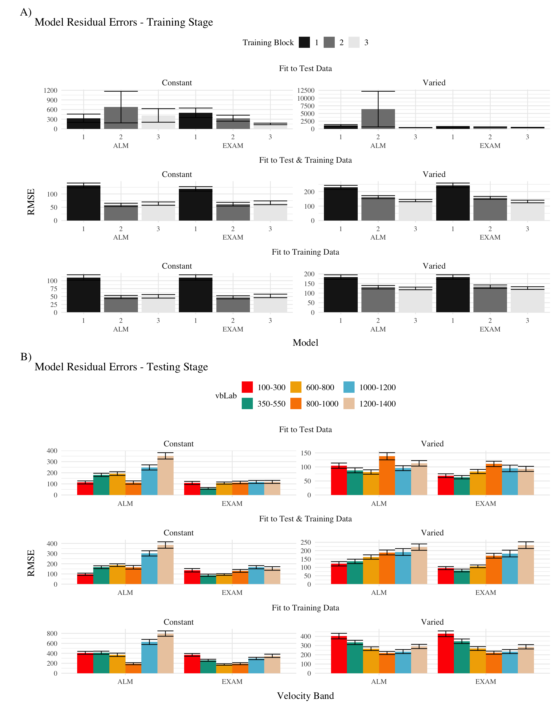
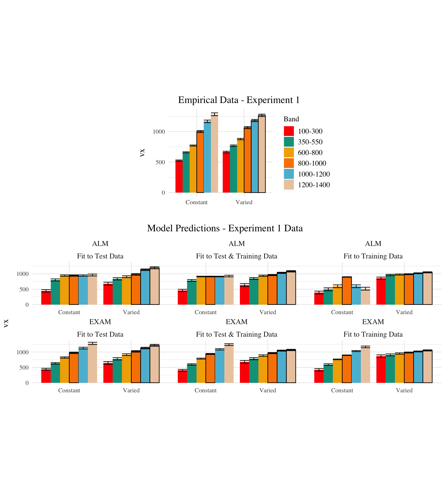

export const quartoRawHtml =
[`<script src="../site_libs/tabwid-1.1.3/tabwid.js"></script>`,`<div class="tabwid"><style>.cl-ae5a818c{}.cl-ae56bb92{font-family:'Helvetica';font-size:11pt;font-weight:normal;font-style:normal;text-decoration:none;color:rgba(0, 0, 0, 1.00);background-color:transparent;}.cl-ae585920{margin:0;text-align:left;border-bottom: 0 solid rgba(0, 0, 0, 1.00);border-top: 0 solid rgba(0, 0, 0, 1.00);border-left: 0 solid rgba(0, 0, 0, 1.00);border-right: 0 solid rgba(0, 0, 0, 1.00);padding-bottom:5pt;padding-top:5pt;padding-left:5pt;padding-right:5pt;line-height: 1;background-color:transparent;}.cl-ae58592a{margin:0;text-align:left;border-bottom: 0 solid rgba(0, 0, 0, 1.00);border-top: 0 solid rgba(0, 0, 0, 1.00);border-left: 0 solid rgba(0, 0, 0, 1.00);border-right: 0 solid rgba(0, 0, 0, 1.00);padding-bottom:0;padding-top:0;padding-left:0;padding-right:0;line-height: 1;background-color:transparent;}.cl-ae585934{margin:0;text-align:center;border-bottom: 0 solid rgba(0, 0, 0, 1.00);border-top: 0 solid rgba(0, 0, 0, 1.00);border-left: 0 solid rgba(0, 0, 0, 1.00);border-right: 0 solid rgba(0, 0, 0, 1.00);padding-bottom:5pt;padding-top:5pt;padding-left:5pt;padding-right:5pt;line-height: 1;background-color:transparent;}.cl-ae58593e{margin:0;text-align:left;border-bottom: 0 solid rgba(0, 0, 0, 1.00);border-top: 0 solid rgba(0, 0, 0, 1.00);border-left: 0 solid rgba(0, 0, 0, 1.00);border-right: 0 solid rgba(0, 0, 0, 1.00);padding-bottom:5pt;padding-top:5pt;padding-left:5pt;padding-right:5pt;line-height: 1;background-color:transparent;}.cl-ae58593f{margin:0;text-align:left;border-bottom: 0 solid rgba(0, 0, 0, 1.00);border-top: 0 solid rgba(0, 0, 0, 1.00);border-left: 0 solid rgba(0, 0, 0, 1.00);border-right: 0 solid rgba(0, 0, 0, 1.00);padding-bottom:0;padding-top:0;padding-left:0;padding-right:0;line-height: 1;background-color:transparent;}.cl-ae585940{margin:0;text-align:center;border-bottom: 0 solid rgba(0, 0, 0, 1.00);border-top: 0 solid rgba(0, 0, 0, 1.00);border-left: 0 solid rgba(0, 0, 0, 1.00);border-right: 0 solid rgba(0, 0, 0, 1.00);padding-bottom:5pt;padding-top:5pt;padding-left:5pt;padding-right:5pt;line-height: 1;background-color:transparent;}.cl-ae586492{width:0.638in;background-color:transparent;vertical-align: bottom;border-bottom: 1.5pt solid rgba(102, 102, 102, 1.00);border-top: 1.5pt solid rgba(102, 102, 102, 1.00);border-left: 0 solid rgba(0, 0, 0, 1.00);border-right: 0 solid rgba(0, 0, 0, 1.00);margin-bottom:0;margin-top:0;margin-left:0;margin-right:0;}.cl-ae58649c{width:2.047in;background-color:transparent;vertical-align: bottom;border-bottom: 1.5pt solid rgba(102, 102, 102, 1.00);border-top: 1.5pt solid rgba(102, 102, 102, 1.00);border-left: 0 solid rgba(0, 0, 0, 1.00);border-right: 0 solid rgba(0, 0, 0, 1.00);margin-bottom:0;margin-top:0;margin-left:0;margin-right:0;}.cl-ae58649d{width:0.697in;background-color:transparent;vertical-align: bottom;border-bottom: 1.5pt solid rgba(102, 102, 102, 1.00);border-top: 1.5pt solid rgba(102, 102, 102, 1.00);border-left: 0 solid rgba(0, 0, 0, 1.00);border-right: 0 solid rgba(0, 0, 0, 1.00);margin-bottom:0;margin-top:0;margin-left:0;margin-right:0;}.cl-ae5864a6{width:0.079in;background-color:transparent;vertical-align: middle;border-bottom: 0 solid rgba(102, 102, 102, 1.00);border-top: 0 solid rgba(102, 102, 102, 1.00);border-left: 0 solid rgba(0, 0, 0, 1.00);border-right: 0 solid rgba(0, 0, 0, 1.00);margin-bottom:0;margin-top:0;margin-left:0;margin-right:0;}.cl-ae5864a7{width:0.875in;background-color:transparent;vertical-align: middle;border-bottom: 1.5pt solid rgba(102, 102, 102, 1.00);border-top: 1.5pt solid rgba(102, 102, 102, 1.00);border-left: 0 solid rgba(0, 0, 0, 1.00);border-right: 0 solid rgba(0, 0, 0, 1.00);margin-bottom:0;margin-top:0;margin-left:0;margin-right:0;}.cl-ae5864b0{width:0.774in;background-color:transparent;vertical-align: middle;border-bottom: 1.5pt solid rgba(102, 102, 102, 1.00);border-top: 1.5pt solid rgba(102, 102, 102, 1.00);border-left: 0 solid rgba(0, 0, 0, 1.00);border-right: 0 solid rgba(0, 0, 0, 1.00);margin-bottom:0;margin-top:0;margin-left:0;margin-right:0;}.cl-ae5864ba{width:0.638in;background-color:transparent;vertical-align: top;border-bottom: 0 solid rgba(0, 0, 0, 1.00);border-top: 0 solid rgba(0, 0, 0, 1.00);border-left: 0 solid rgba(0, 0, 0, 1.00);border-right: 0 solid rgba(0, 0, 0, 1.00);margin-bottom:0;margin-top:0;margin-left:0;margin-right:0;}.cl-ae5864bb{width:2.047in;background-color:transparent;vertical-align: top;border-bottom: 0 solid rgba(0, 0, 0, 1.00);border-top: 0 solid rgba(0, 0, 0, 1.00);border-left: 0 solid rgba(0, 0, 0, 1.00);border-right: 0 solid rgba(0, 0, 0, 1.00);margin-bottom:0;margin-top:0;margin-left:0;margin-right:0;}.cl-ae5864c4{width:0.697in;background-color:transparent;vertical-align: top;border-bottom: 0 solid rgba(0, 0, 0, 1.00);border-top: 0 solid rgba(0, 0, 0, 1.00);border-left: 0 solid rgba(0, 0, 0, 1.00);border-right: 0 solid rgba(0, 0, 0, 1.00);margin-bottom:0;margin-top:0;margin-left:0;margin-right:0;}.cl-ae5864ce{width:0.079in;background-color:transparent;vertical-align: top;border-bottom: 0 solid rgba(102, 102, 102, 1.00);border-top: 0 solid rgba(102, 102, 102, 1.00);border-left: 0 solid rgba(0, 0, 0, 1.00);border-right: 0 solid rgba(0, 0, 0, 1.00);margin-bottom:0;margin-top:0;margin-left:0;margin-right:0;}.cl-ae5864cf{width:0.875in;background-color:transparent;vertical-align: top;border-bottom: 0 solid rgba(0, 0, 0, 1.00);border-top: 0 solid rgba(0, 0, 0, 1.00);border-left: 0 solid rgba(0, 0, 0, 1.00);border-right: 0 solid rgba(0, 0, 0, 1.00);margin-bottom:0;margin-top:0;margin-left:0;margin-right:0;}.cl-ae5864d8{width:0.774in;background-color:transparent;vertical-align: top;border-bottom: 0 solid rgba(0, 0, 0, 1.00);border-top: 0 solid rgba(0, 0, 0, 1.00);border-left: 0 solid rgba(0, 0, 0, 1.00);border-right: 0 solid rgba(0, 0, 0, 1.00);margin-bottom:0;margin-top:0;margin-left:0;margin-right:0;}.cl-ae5864d9{width:0.638in;background-color:transparent;vertical-align: top;border-bottom: 0 solid rgba(0, 0, 0, 1.00);border-top: 0 solid rgba(0, 0, 0, 1.00);border-left: 0 solid rgba(0, 0, 0, 1.00);border-right: 0 solid rgba(0, 0, 0, 1.00);margin-bottom:0;margin-top:0;margin-left:0;margin-right:0;}.cl-ae5864e2{width:2.047in;background-color:transparent;vertical-align: top;border-bottom: 0 solid rgba(0, 0, 0, 1.00);border-top: 0 solid rgba(0, 0, 0, 1.00);border-left: 0 solid rgba(0, 0, 0, 1.00);border-right: 0 solid rgba(0, 0, 0, 1.00);margin-bottom:0;margin-top:0;margin-left:0;margin-right:0;}.cl-ae5864e3{width:0.697in;background-color:transparent;vertical-align: top;border-bottom: 0 solid rgba(0, 0, 0, 1.00);border-top: 0 solid rgba(0, 0, 0, 1.00);border-left: 0 solid rgba(0, 0, 0, 1.00);border-right: 0 solid rgba(0, 0, 0, 1.00);margin-bottom:0;margin-top:0;margin-left:0;margin-right:0;}.cl-ae5864ec{width:0.079in;background-color:transparent;vertical-align: top;border-bottom: 0 solid rgba(102, 102, 102, 1.00);border-top: 0 solid rgba(102, 102, 102, 1.00);border-left: 0 solid rgba(0, 0, 0, 1.00);border-right: 0 solid rgba(0, 0, 0, 1.00);margin-bottom:0;margin-top:0;margin-left:0;margin-right:0;}.cl-ae5864ed{width:0.875in;background-color:transparent;vertical-align: top;border-bottom: 0 solid rgba(0, 0, 0, 1.00);border-top: 0 solid rgba(0, 0, 0, 1.00);border-left: 0 solid rgba(0, 0, 0, 1.00);border-right: 0 solid rgba(0, 0, 0, 1.00);margin-bottom:0;margin-top:0;margin-left:0;margin-right:0;}.cl-ae5864ee{width:0.774in;background-color:transparent;vertical-align: top;border-bottom: 0 solid rgba(0, 0, 0, 1.00);border-top: 0 solid rgba(0, 0, 0, 1.00);border-left: 0 solid rgba(0, 0, 0, 1.00);border-right: 0 solid rgba(0, 0, 0, 1.00);margin-bottom:0;margin-top:0;margin-left:0;margin-right:0;}.cl-ae5864f6{width:0.638in;background-color:transparent;vertical-align: top;border-bottom: 1.5pt solid rgba(102, 102, 102, 1.00);border-top: 0 solid rgba(0, 0, 0, 1.00);border-left: 0 solid rgba(0, 0, 0, 1.00);border-right: 0 solid rgba(0, 0, 0, 1.00);margin-bottom:0;margin-top:0;margin-left:0;margin-right:0;}.cl-ae5864f7{width:2.047in;background-color:transparent;vertical-align: top;border-bottom: 0 solid rgba(0, 0, 0, 1.00);border-top: 0 solid rgba(0, 0, 0, 1.00);border-left: 0 solid rgba(0, 0, 0, 1.00);border-right: 0 solid rgba(0, 0, 0, 1.00);margin-bottom:0;margin-top:0;margin-left:0;margin-right:0;}.cl-ae5864f8{width:0.697in;background-color:transparent;vertical-align: top;border-bottom: 0 solid rgba(0, 0, 0, 1.00);border-top: 0 solid rgba(0, 0, 0, 1.00);border-left: 0 solid rgba(0, 0, 0, 1.00);border-right: 0 solid rgba(0, 0, 0, 1.00);margin-bottom:0;margin-top:0;margin-left:0;margin-right:0;}.cl-ae586500{width:0.079in;background-color:transparent;vertical-align: top;border-bottom: 0 solid rgba(102, 102, 102, 1.00);border-top: 0 solid rgba(102, 102, 102, 1.00);border-left: 0 solid rgba(0, 0, 0, 1.00);border-right: 0 solid rgba(0, 0, 0, 1.00);margin-bottom:0;margin-top:0;margin-left:0;margin-right:0;}.cl-ae586501{width:0.875in;background-color:transparent;vertical-align: top;border-bottom: 0 solid rgba(0, 0, 0, 1.00);border-top: 0 solid rgba(0, 0, 0, 1.00);border-left: 0 solid rgba(0, 0, 0, 1.00);border-right: 0 solid rgba(0, 0, 0, 1.00);margin-bottom:0;margin-top:0;margin-left:0;margin-right:0;}.cl-ae58650a{width:0.774in;background-color:transparent;vertical-align: top;border-bottom: 0 solid rgba(0, 0, 0, 1.00);border-top: 0 solid rgba(0, 0, 0, 1.00);border-left: 0 solid rgba(0, 0, 0, 1.00);border-right: 0 solid rgba(0, 0, 0, 1.00);margin-bottom:0;margin-top:0;margin-left:0;margin-right:0;}.cl-ae58650b{width:2.047in;background-color:transparent;vertical-align: top;border-bottom: 1.5pt solid rgba(102, 102, 102, 1.00);border-top: 0 solid rgba(0, 0, 0, 1.00);border-left: 0 solid rgba(0, 0, 0, 1.00);border-right: 0 solid rgba(0, 0, 0, 1.00);margin-bottom:0;margin-top:0;margin-left:0;margin-right:0;}.cl-ae586514{width:0.638in;background-color:transparent;vertical-align: top;border-bottom: 1.5pt solid rgba(102, 102, 102, 1.00);border-top: 0 solid rgba(0, 0, 0, 1.00);border-left: 0 solid rgba(0, 0, 0, 1.00);border-right: 0 solid rgba(0, 0, 0, 1.00);margin-bottom:0;margin-top:0;margin-left:0;margin-right:0;}.cl-ae586515{width:0.697in;background-color:transparent;vertical-align: top;border-bottom: 1.5pt solid rgba(102, 102, 102, 1.00);border-top: 0 solid rgba(0, 0, 0, 1.00);border-left: 0 solid rgba(0, 0, 0, 1.00);border-right: 0 solid rgba(0, 0, 0, 1.00);margin-bottom:0;margin-top:0;margin-left:0;margin-right:0;}.cl-ae58651e{width:0.875in;background-color:transparent;vertical-align: top;border-bottom: 1.5pt solid rgba(102, 102, 102, 1.00);border-top: 0 solid rgba(0, 0, 0, 1.00);border-left: 0 solid rgba(0, 0, 0, 1.00);border-right: 0 solid rgba(0, 0, 0, 1.00);margin-bottom:0;margin-top:0;margin-left:0;margin-right:0;}.cl-ae58651f{width:0.774in;background-color:transparent;vertical-align: top;border-bottom: 1.5pt solid rgba(102, 102, 102, 1.00);border-top: 0 solid rgba(0, 0, 0, 1.00);border-left: 0 solid rgba(0, 0, 0, 1.00);border-right: 0 solid rgba(0, 0, 0, 1.00);margin-bottom:0;margin-top:0;margin-left:0;margin-right:0;}</style><table data-quarto-disable-processing='true' class='cl-ae5a818c'><thead><tr style="overflow-wrap:break-word;"><th class="cl-ae586492"><p class="cl-ae585920"><span class="cl-ae56bb92">stage</span></p></th><th class="cl-ae58649c"><p class="cl-ae585920"><span class="cl-ae56bb92">Fit_Method</span></p></th><th class="cl-ae58649d"><p class="cl-ae585920"><span class="cl-ae56bb92">Model</span></p></th><th class="cl-ae5864a6"><p class="cl-ae58592a"><span class="cl-ae56bb92"></span></p></th><th class="cl-ae5864a7"><p class="cl-ae585934"><span class="cl-ae56bb92">Constant</span></p></th><th class="cl-ae5864a6"><p class="cl-ae58592a"><span class="cl-ae56bb92"></span></p></th><th class="cl-ae5864b0"><p class="cl-ae585934"><span class="cl-ae56bb92">Varied</span></p></th></tr></thead><tbody><tr style="overflow-wrap:break-word;"><td  rowspan="6"class="cl-ae5864ba"><p class="cl-ae58593e"><span class="cl-ae56bb92">Test</span></p></td><td  rowspan="2"class="cl-ae5864bb"><p class="cl-ae58593e"><span class="cl-ae56bb92">Fit to Test Data</span></p></td><td class="cl-ae5864c4"><p class="cl-ae58593e"><span class="cl-ae56bb92">ALM</span></p></td><td class="cl-ae5864ce"><p class="cl-ae58593f"><span class="cl-ae56bb92"></span></p></td><td class="cl-ae5864cf"><p class="cl-ae585940"><span class="cl-ae56bb92">199.9</span></p></td><td class="cl-ae5864ce"><p class="cl-ae58593f"><span class="cl-ae56bb92"></span></p></td><td class="cl-ae5864d8"><p class="cl-ae585940"><span class="cl-ae56bb92">103.4</span></p></td></tr><tr style="overflow-wrap:break-word;"><td class="cl-ae5864c4"><p class="cl-ae58593e"><span class="cl-ae56bb92">EXAM</span></p></td><td class="cl-ae5864ce"><p class="cl-ae58593f"><span class="cl-ae56bb92"></span></p></td><td class="cl-ae5864cf"><p class="cl-ae585940"><span class="cl-ae56bb92">104.0</span></p></td><td class="cl-ae5864ce"><p class="cl-ae58593f"><span class="cl-ae56bb92"></span></p></td><td class="cl-ae5864d8"><p class="cl-ae585940"><span class="cl-ae56bb92">85.7</span></p></td></tr><tr style="overflow-wrap:break-word;"><td  rowspan="2"class="cl-ae5864e2"><p class="cl-ae58593e"><span class="cl-ae56bb92">Fit to Test &amp; Training Data</span></p></td><td class="cl-ae5864e3"><p class="cl-ae58593e"><span class="cl-ae56bb92">ALM</span></p></td><td class="cl-ae5864ec"><p class="cl-ae58593f"><span class="cl-ae56bb92"></span></p></td><td class="cl-ae5864ed"><p class="cl-ae585940"><span class="cl-ae56bb92">217.0</span></p></td><td class="cl-ae5864ec"><p class="cl-ae58593f"><span class="cl-ae56bb92"></span></p></td><td class="cl-ae5864ee"><p class="cl-ae585940"><span class="cl-ae56bb92">170.3</span></p></td></tr><tr style="overflow-wrap:break-word;"><td class="cl-ae5864e3"><p class="cl-ae58593e"><span class="cl-ae56bb92">EXAM</span></p></td><td class="cl-ae5864ec"><p class="cl-ae58593f"><span class="cl-ae56bb92"></span></p></td><td class="cl-ae5864ed"><p class="cl-ae585940"><span class="cl-ae56bb92">127.9</span></p></td><td class="cl-ae5864ec"><p class="cl-ae58593f"><span class="cl-ae56bb92"></span></p></td><td class="cl-ae5864ee"><p class="cl-ae585940"><span class="cl-ae56bb92">144.9</span></p></td></tr><tr style="overflow-wrap:break-word;"><td  rowspan="2"class="cl-ae5864e2"><p class="cl-ae58593e"><span class="cl-ae56bb92">Fit to Training Data</span></p></td><td class="cl-ae5864e3"><p class="cl-ae58593e"><span class="cl-ae56bb92">ALM</span></p></td><td class="cl-ae5864ec"><p class="cl-ae58593f"><span class="cl-ae56bb92"></span></p></td><td class="cl-ae5864ed"><p class="cl-ae585940"><span class="cl-ae56bb92">467.7</span></p></td><td class="cl-ae5864ec"><p class="cl-ae58593f"><span class="cl-ae56bb92"></span></p></td><td class="cl-ae5864ee"><p class="cl-ae585940"><span class="cl-ae56bb92">291.4</span></p></td></tr><tr style="overflow-wrap:break-word;"><td class="cl-ae5864e3"><p class="cl-ae58593e"><span class="cl-ae56bb92">EXAM</span></p></td><td class="cl-ae5864ec"><p class="cl-ae58593f"><span class="cl-ae56bb92"></span></p></td><td class="cl-ae5864ed"><p class="cl-ae585940"><span class="cl-ae56bb92">273.3</span></p></td><td class="cl-ae5864ec"><p class="cl-ae58593f"><span class="cl-ae56bb92"></span></p></td><td class="cl-ae5864ee"><p class="cl-ae585940"><span class="cl-ae56bb92">297.9</span></p></td></tr><tr style="overflow-wrap:break-word;"><td  rowspan="6"class="cl-ae5864f6"><p class="cl-ae58593e"><span class="cl-ae56bb92">Train</span></p></td><td  rowspan="2"class="cl-ae5864f7"><p class="cl-ae58593e"><span class="cl-ae56bb92">Fit to Test Data</span></p></td><td class="cl-ae5864f8"><p class="cl-ae58593e"><span class="cl-ae56bb92">ALM</span></p></td><td class="cl-ae586500"><p class="cl-ae58593f"><span class="cl-ae56bb92"></span></p></td><td class="cl-ae586501"><p class="cl-ae585940"><span class="cl-ae56bb92">297.8</span></p></td><td class="cl-ae586500"><p class="cl-ae58593f"><span class="cl-ae56bb92"></span></p></td><td class="cl-ae58650a"><p class="cl-ae585940"><span class="cl-ae56bb92">2,016.0</span></p></td></tr><tr style="overflow-wrap:break-word;"><td class="cl-ae5864c4"><p class="cl-ae58593e"><span class="cl-ae56bb92">EXAM</span></p></td><td class="cl-ae5864ce"><p class="cl-ae58593f"><span class="cl-ae56bb92"></span></p></td><td class="cl-ae5864cf"><p class="cl-ae585940"><span class="cl-ae56bb92">53.9</span></p></td><td class="cl-ae5864ce"><p class="cl-ae58593f"><span class="cl-ae56bb92"></span></p></td><td class="cl-ae5864d8"><p class="cl-ae585940"><span class="cl-ae56bb92">184.0</span></p></td></tr><tr style="overflow-wrap:break-word;"><td  rowspan="2"class="cl-ae5864e2"><p class="cl-ae58593e"><span class="cl-ae56bb92">Fit to Test &amp; Training Data</span></p></td><td class="cl-ae5864e3"><p class="cl-ae58593e"><span class="cl-ae56bb92">ALM</span></p></td><td class="cl-ae5864ec"><p class="cl-ae58593f"><span class="cl-ae56bb92"></span></p></td><td class="cl-ae5864ed"><p class="cl-ae585940"><span class="cl-ae56bb92">57.4</span></p></td><td class="cl-ae5864ec"><p class="cl-ae58593f"><span class="cl-ae56bb92"></span></p></td><td class="cl-ae5864ee"><p class="cl-ae585940"><span class="cl-ae56bb92">132.3</span></p></td></tr><tr style="overflow-wrap:break-word;"><td class="cl-ae5864e3"><p class="cl-ae58593e"><span class="cl-ae56bb92">EXAM</span></p></td><td class="cl-ae5864ec"><p class="cl-ae58593f"><span class="cl-ae56bb92"></span></p></td><td class="cl-ae5864ed"><p class="cl-ae585940"><span class="cl-ae56bb92">42.9</span></p></td><td class="cl-ae5864ec"><p class="cl-ae58593f"><span class="cl-ae56bb92"></span></p></td><td class="cl-ae5864ee"><p class="cl-ae585940"><span class="cl-ae56bb92">127.9</span></p></td></tr><tr style="overflow-wrap:break-word;"><td  rowspan="2"class="cl-ae58650b"><p class="cl-ae58593e"><span class="cl-ae56bb92">Fit to Training Data</span></p></td><td class="cl-ae5864e3"><p class="cl-ae58593e"><span class="cl-ae56bb92">ALM</span></p></td><td class="cl-ae5864ec"><p class="cl-ae58593f"><span class="cl-ae56bb92"></span></p></td><td class="cl-ae5864ed"><p class="cl-ae585940"><span class="cl-ae56bb92">51.8</span></p></td><td class="cl-ae5864ec"><p class="cl-ae58593f"><span class="cl-ae56bb92"></span></p></td><td class="cl-ae5864ee"><p class="cl-ae585940"><span class="cl-ae56bb92">103.5</span></p></td></tr><tr style="overflow-wrap:break-word;"><td class="cl-ae586515"><p class="cl-ae58593e"><span class="cl-ae56bb92">EXAM</span></p></td><td class="cl-ae5864ec"><p class="cl-ae58593f"><span class="cl-ae56bb92"></span></p></td><td class="cl-ae58651e"><p class="cl-ae585940"><span class="cl-ae56bb92">51.4</span></p></td><td class="cl-ae5864ec"><p class="cl-ae58593f"><span class="cl-ae56bb92"></span></p></td><td class="cl-ae58651f"><p class="cl-ae585940"><span class="cl-ae56bb92">107.0</span></p></td></tr></tbody></table></div>`];

<link href="../site_libs/tabwid-1.1.3/tabwid.css" rel="stylesheet" />
<div dangerouslySetInnerHTML={{ __html: quartoRawHtml[0] }} />

<details class="code-fold">
<summary>Code</summary>

```r
pacman::p_load(dplyr,purrr,tidyr,ggplot2, data.table, here, patchwork, conflicted, 
               stringr,future,furrr, knitr, reactable, flextable,ggstance, htmltools,ggdist,ggh4x)
#conflict_prefer_all("dplyr", quiet = TRUE)
walk(c("flextable","dplyr"), conflict_prefer_all, quiet = TRUE)
#options(brms.backend="cmdstanr",mc.cores=4)
options(digits=2, scipen=999, dplyr.summarise.inform=FALSE)
walk(c("Display_Functions","fun_alm","fun_indv_fit","fun_model", "prep_model_data"), ~source(here::here(paste0("Functions/", .x, ".R"))))
```

</details>

<details class="code-fold">
<summary>Code</summary>

```r
invisible(list2env(load_sbj_data(), envir = .GlobalEnv))
invisible(list2env(load_e1(), envir = .GlobalEnv))
e1Sbjs <- e1 |> group_by(id,condit) |> summarise(n=n())
```

</details>

# Modeling Approach

In project 1, I applied model-based techniques to quantify and control
for the similarity between training and testing experience, which in
turn enabled us to account for the difference between varied and
constant training via an extended version of a similarity based
generalization model. In project 2, I will go a step further,
implementing a full process model capable of both 1) producing novel
responses and 2) modeling behavior in both the learning and testing
stages of the experiment. For this purpose, we will apply the
associative learning model (ALM) and the EXAM model of function learning
(DeLosh et al., 1997). ALM is a simple connectionist learning model
which closely resembles Kruschke’s ALCOVE model (Kruschke, 1992), with
modifications to allow for the generation of continuous responses.

## ALM & Exam Description {#alm-exam-description}

ALM is a localist neural network model (Page, 2000), with each input
node corresponding to a particular stimulus, and each output node
corresponding to a particular response value. The units in the input
layer activate as a function of their Gaussian similarity to the input
stimulus. So, for example, an input stimulus of value 55 would induce
maximal activation of the input unit tuned to 55. Depending on the value
of the generalization parameter, the nearby units (e.g. 54 and 56; 53
and 57) may also activate to some degree. ALM is structured with input
and output nodes that correspond to regions of the stimulus space, and
response space, respectively. The units in the input layer activate as a
function of their similarity to a presented stimulus. As was the case
with the exemplar-based models, similarity in ALM is exponentially
decaying function of distance. The input layer is fully connected to the
output layer, and the activation for any particular output node is
simply the weighted sum of the connection weights between that node and
the input activations. The network then produces a response by taking
the weighted average of the output units (recall that each output unit
has a value corresponding to a particular response). During training,
the network receives feedback which activates each output unit as a
function of its distance from the ideal level of activation necessary to
produce the correct response. The connection weights between input and
output units are then updated via the standard delta learning rule,
where the magnitude of weight changes are controlled by a learning rate
parameter. The EXAM model is an extension of ALM, with the same learning
rule and representational scheme for input and output units. The primary
difference is that EXAM includes a linear extrapolation mechanism for
generating novel responses during testing, a modification necessary to
account for human extrapolation patterns in past research Brown &
Lacroix (2017). Although this extrapolation rule departs from a strictly
similarity-based generalization mechanism, EXAM is distinct from pure
rule-based models in that it remains constrained by the weights learned
during training.

See <a href="#tbl-alm-exam" class="quarto-xref">Table 1</a> for a full
specification of the equations that define ALM and EXAM.

<div id="tbl-alm-exam">

Table 1: ALM & EXAM Equations

|                    | **ALM Response Generation**                                        |                                                                                               |
|-------------------|-----------------------------|-------------------------|
| Input Activation   | $a_i(X) = \frac{e^{-c(X-X_i)^2}}{\sum_{k=1}^M e^{-c(X-X_k)^2}}$    | Input nodes activate as a function of Gaussian similarity to stimulus                         |
| Output Activation  | $O_j(X) = \sum_{k=1}^M w_{ji} \cdot a_i(X)$                        | Output unit $O_j$ activation is the weighted sum of input activations and association weights |
| Output Probability | $P[Y_j|X] = \frac{O_j(X)}{\sum_{k=1}^M O_k(X)}$                    | The response, $Y_j$ probabilites computed via Luce’s choice rule                              |
| Mean Output        | $m(X) = \sum_{j=1}^L Y_j \cdot \frac{O_j(x)}{\sum_{k=1}^M O_k(X)}$ | Weighted average of probabilities determines response to X                                    |
|                    | **ALM Learning**                                                   |                                                                                               |
| Feedback           | $f_j(Z) = e^{-c(Z-Y_j)^2}$                                         | feedback signal Z computed as similarity between ideal response and observed response         |
| magnitude of error | $\Delta_{ji}=(f_{j}(Z)-o_{j}(X))a_{i}(X)$                          | Delta rule to update weights.                                                                 |
| Update Weights     | $w_{ji}^{new}=w_{ji}+\eta\Delta_{ji}$                              | Updates scaled by learning rate parameter $\eta$.                                             |
|                    | **EXAM Extrapolation**                                             |                                                                                               |
| Instance Retrieval | $P[X_i|X] = \frac{a_i(X)}{\sum_{k=1}^M a_k(X)}$                    | Novel test stimulus $X$ activates input nodes $X_i$                                           |
| Slope Computation  | $S =$ $\frac{m(X_{1})-m(X_{2})}{X_{1}-X_{2}}$                      | Slope value, $S$ computed from nearest training instances                                     |
| Response           | $E[Y|X_i] = m(X_i) + S \cdot [X - X_i]$                            | ALM response $m(X_i)$ adjusted by slope.                                                      |

</div>

## Model Fitting Strategy

To fit ALM and EXAM to our participant data, we employ a similar method
to Mcdaniel et al. (2009), wherein we examine the performance of each
model after being fit to various subsets of the data. Each model was fit
to the data in with separate procedures: 1) fit to maximize predictions
of the testing data, 2) fit to maximize predictions of both the training
and testing data, 3) fit to maximize predictions of the just the
training data. We refer to this fitting manipulations as “Fit Method” in
the tables and figures below. It should be emphasized that for all three
fit methods, the ALM and EXAM models behave identically - with weights
updating only during the training phase.Models to were fit separately to
the data of each individual participant. The free parameters for both
models are the generalization ($c$) and learning rate ($lr$) parameters.
Parameter estimation was performed using approximate bayesian
computation (ABC), which we describe in detail below.

:::none

** Approximate Bayesian Computation**

To estimate parameters, we used approximate bayesian computation (ABC),
enabling us to obtain an estimate of the posterior distribution of the
generalization and learning rate parameters for each individual. ABC
belongs to the class of simulation-based inference methods (Cranmer et
al., 2020), which have begun being used for parameter estimation in
cognitive modeling relatively recently (Kangasrääsiö et al., 2019;
Turner et al., 2016; Turner & Van Zandt, 2012). Although they can be
applied to any model from which data can be simulated, ABC methods are
most useful for complex models that lack an explicit likelihood function
(e.g. many neural network and evidence accumulation models).

The general ABC procedure is to 1) define a prior distribution over
model parameters. 2) sample candidate parameter values, $\theta^*$, from
the prior. 3) Use $\theta^*$ to generate a simulated dataset,
$Data_{sim}$. 4) Compute a measure of discrepancy between the simulated
and observed datasets, $discrep$($Data_{sim}$, $Data_{obs}$). 5) Accept
$\theta^*$ if the discrepancy is less than the tolerance threshold,
$\epsilon$, otherwise reject $\theta^*$. 6) Repeat until desired number
of posterior samples are obtained.

Although simple in the abstract, implementations of ABC require
researchers to make a number of non-trivial decisions as to i) the
discrepancy function between observed and simulated data, ii) whether to
compute the discrepancy between trial level data, or a summary statistic
of the datasets, iii) the value of the minimum tolerance $\epsilon$
between simulated and observed data. For the present work, we follow the
guidelines from previously published ABC tutorials (Farrell &
Lewandowsky, 2018; Turner & Van Zandt, 2012). For the test stage, we
summarized datasets with mean velocity of each band in the observed
dataset as $V_{obs}^{(k)}$ and in the simulated dataset as
$V_{sim}^{(k)}$, where $k$ represents each of the six velocity bands.
For computing the discrepancy between datasets in the training stage, we
aggregated training trials into three equally sized blocks (separately
for each velocity band in the case of the varied group). After obtaining
the summary statistics of the simulated and observed datasets, the
discrepancy was computed as the mean of the absolute difference between
simulated and observed datasets
(<a href="#eq-discrep-test" class="quarto-xref">Equation 1</a> and
<a href="#eq-discrep-train" class="quarto-xref">Equation 2</a>). For the
models fit to both training and testing data, discrepancies were
computed for both stages, and then averaged together.

<span id="eq-discrep-test">$$
discrep_{Test}(Data_{sim}, Data_{obs}) = \frac{1}{6} \sum_{k=1}^{6} |V_{obs}^{(k)} - V_{sim}^{(k)}|
 \qquad(1)$$</span>

<span id="eq-discrep-train">$$
\begin{aligned} \\
discrep_{Train,constant}(Data_{sim}, Data_{obs}) = \frac{1}{N_{blocks}} \sum_{j=1}^{N_{blocks}} |V_{obs,constant}^{(j)} - V_{sim,constant}^{(j)}| \\ \\
discrep_{Train,varied}(Data_{sim}, Data_{obs}) = \frac{1}{N_{blocks} \times 3} \sum_{j=1}^{N_{blocks}} \sum_{k=1}^{3} |V_{obs,varied}^{(j,k)} - V_{sim,varied}^{(j,k)}|
\end{aligned}
 \qquad(2)$$</span>

The final component of our ABC implementation is the determination of an
appropriate value of $\epsilon$. The setting of $\epsilon$ exerts strong
influence on the approximated posterior distribution. Smaller values of
$\epsilon$ increase the rejection rate, and improve the fidelity of the
approximated posterior, while larger values result in an ABC sampler
that simply reproduces the prior distribution. Because the individual
participants in our dataset differed substantially in terms of the
noisiness of their data, we employed an adaptive tolerance setting
strategy to tailor $\epsilon$ to each individual. The initial value of
$\epsilon$ was set to the overall standard deviation of each individuals
velocity values. Thus, sampled parameter values that generated simulated
data within a standard deviation of the observed data were accepted,
while worse performing parameters were rejected. After every 300 samples
the tolerance was allowed to increase only if the current acceptance
rate of the algorithm was less than 1%. In such cases, the tolerance was
shifted towards the average discrepancy of the 5 best samples obtained
thus far. To ensure the acceptance rate did not become overly
permissive, $\epsilon$ was also allowed to decrease every time a sample
was accepted into the posterior.

:::

For each of the 156 participants from Experiment 1, the ABC algorithm
was run until 200 samples of parameters were accepted into the posterior
distribution. Obtaining this number of posterior samples required an
average of 205,000 simulation runs per participant. Fitting each
combination of participant, Model (EXAM & ALM), and fitting method (Test
only, Train only, Test & Train) required a total of 192 million
simulation runs. To facilitate these intensive computational demands, we
used the Future Package in R (Bengtsson, 2021), allowing us to
parallelize computations across a cluster of ten M1 iMacs, each with 8
cores.

### Modelling Results

#### Group level Patterns

<details class="code-fold">
<summary>Code</summary>

```r
post_tabs <- abc_tables(post_dat,post_dat_l)
train_tab <- abc_train_tables(pd_train,pd_train_l)


rbind(post_tabs$agg_pred_full |> mutate(stage="Test"), train_tab$agg_pred_full |> mutate(stage="Train")) |> 
  mutate(Fit_Method=rename_fm(Fit_Method)) |>
  flextable::tabulator(rows=c("stage","Fit_Method","Model"), columns=c("condit"),
                       `ME` = as_paragraph(mean_error)) |> as_flextable()
 # post_dat  |> group_by(condit,Model,Fit_Method,x) |> 
 #    mutate(e2=abs(dist-pred_dist)) |> 
 #    summarise(dist=mean(dist), pred=mean(pred_dist), mean_error=mean(e2)) |>
 #    group_by(condit,Model,Fit_Method) |> 
 #    summarise(mean_error=mean(mean_error)) |> 
 #    round_tibble(1) |> 
 #  mutate(Fit_Method=rename_fm(Fit_Method)) |>
 #  flextable::tabulator(rows=c("Fit_Method","Model"), columns=c("condit"),
 #                       `ME` = as_paragraph(mean_error)) |> as_flextable()
```

</details>
<div id="tbl-htw-modelError">

Table 2: Mean model errors predicting empirical data from the testing
and training stage, aggregated over all participants and velocity bands.
Note that Fit Method refers to the subset of the data that the model was
trained on

<div dangerouslySetInnerHTML={{ __html: quartoRawHtml[1] }} />

</div>
<details class="code-fold">
<summary>Code</summary>

```r
c_post <- post_dat_avg %>%
    group_by(id, condit, Model, Fit_Method, rank) %>%
    slice_head(n = 1) |>
    ggplot(aes(y=log(c), x = Fit_Method,col=condit)) + stat_pointinterval(position=position_dodge(.2)) +
    ggh4x::facet_nested_wrap(~Model) + labs(title="c parameter") +
  theme(legend.title = element_blank(), legend.position="right",plot.title=element_text(hjust=.4))

lr_post <- post_dat_avg %>%
    group_by(id, condit, Model, Fit_Method, rank) %>%
    slice_head(n = 1) |>
    ggplot(aes(y=lr, x = Fit_Method,col=condit)) + stat_pointinterval(position=position_dodge(.4)) +
    ggh4x::facet_nested_wrap(~Model) + labs(title="learning rate parameter") +
  theme(legend.title = element_blank(), legend.position = "none",plot.title=element_text(hjust=.5))
c_post + lr_post
```

</details>
<div id="fig-htw-post-dist">


Figure 1: Posterior Distributions of $c$ and $lr$ parameters. Points
represent median values, thicker intervals represent 66% credible
intervals and thin intervals represent 95% credible intervals around the
median. Note that the y axes of the plots for the c parameter are scaled
logarithmically.

</div>
<details class="code-fold">
<summary>Code</summary>

```r
##| layout: [[45,-5, 45], [100]]
##| fig-subcap: ["Model Residuals - training data", "Model Residuals - testing data","Full posterior predictive distributions vs. observed data from participants."]
train_resid <- pd_train |> group_by(id,condit,Model,Fit_Method, Block,x) |> 
  summarise(y=mean(y), pred=mean(pred), mean_error=abs(y-pred)) |>
  group_by(id,condit,Model,Fit_Method,Block) |>
  summarise(mean_error=mean(mean_error)) |>
  ggplot(aes(x=interaction(Block,Model), y = mean_error, fill=factor(Block))) + 
  stat_bar + 
  ggh4x::facet_nested_wrap(rename_fm(Fit_Method)~condit, scales="free",ncol=2) +
   scale_x_discrete(guide = "axis_nested") +
  scale_fill_manual(values=c("gray10","gray50","gray92"))+
  labs(title="Model Residual Errors - Training Stage", y="RMSE", x= "Model",fill="Training Block") +
  theme(legend.position="top")

test_resid <-  post_dat |> 
   group_by(id,condit,x,Model,Fit_Method) |>
    summarise(y=mean(y), pred=mean(pred), error=abs(y-pred)) |> 
  mutate(vbLab = factor(paste0(x,"-",x+200))) |>
  ggplot(aes(x = Model, y = abs(error), fill=vbLab)) + 
  stat_bar + 
  #scale_fill_manual(values=wes_palette("AsteroidCity2"))+
  ggh4x::facet_nested_wrap(rename_fm(Fit_Method)~condit, axes = "all",ncol=2,scale="free") +
  labs(title="Model Residual Errors - Testing Stage",y="RMSE", x="Velocity Band") 


(train_resid / test_resid) +
  #plot_layout(heights=c(1,1.5)) & 
  plot_annotation(tag_levels = list(c('A','B')),tag_suffix = ') ') 
```

</details>
<div id="fig-htw-resid-pred">



Figure 2: Model residuals for each combination of training condition,
fit method, and model. Residuals reflect the difference between observed
and predicted values. Lower values indicate better model fit. Note that
y axes are scaled differently between facets.

</div>

The posterior distributions of the $c$ and $lr$ parameters are shown
<a href="#fig-htw-post-dist" class="quarto-xref">Figure 1</a>, and model
predictions are shown alongside the empirical data in
<a href="#fig-cm-vx-pat" class="quarto-xref">Figure 3</a> and
<a href="#fig-cm-dev-pat" class="quarto-xref">Figure 4</a> (i.e. these
plots combine all the posterior samples from all of the subjects). There
were substantial individual differences in the posteriors of both
parameters, with the within-group individual differences generally
swamped any between-group or between-model differences. The magnitude of
these individual differences remains even if we consider only the single
best parameter set for each subject.

We used the posterior distribution of $c$ and $lr$ parameters to
generate a posterior predictive distribution of the observed data for
each participant, which then allows us to compare the empirical data to
the full range of predictions from each model. Aggregated residuals are
displayed in
<a href="#tbl-htw-modelError" class="quarto-xref">Table 2</a>. The
pattern of training stage residual errors are unsurprising across the
combinations of models and fitting method . Differences in training
performance between ALM and EXAM are generally minor (the two models
have identical learning mechanisms). The differences in the magnitude of
residuals across the three fitting methods are also straightforward,
with massive errors for the ‘fit to Test Only’ model, and the smallest
errors for the ‘fit to train only’ models. It is also noteworthy that
the residual errors are generally larger for the first block of
training, which is likely due to the initial values of the ALM weights
being unconstrained by whatever initial biases participants tend to
bring to the task. Future work may explore the ability of the models to
capture more fine grained aspects of the learning trajectories. However
for the present purposes, our primary interest is in the ability of ALM
and EXAM to account for the testing patterns while being constrained, or
not constrained, by the training data. All subsequent analyses and
discussion will thus focus on the testing stage.

The residuals of the model predictions for the testing stage
(<a href="#fig-htw-resid-pred" class="quarto-xref">Figure 2</a>) also
show an unsurprising pattern across fitting methods - with models fit
only to the test data showing the best performance, followed by models
fit to both training and test data, and with models fit only to the
training data showing the worst performance (note that y axes are scaled
different between plots). Unsurprisingly, the advantage of EXAM is
strongest for extrapolation positions (the three smallest bands for both
groups - as well as the two highest bands for the Constant group).
Although EXAM tends to perform better for both Constant and Varied
participants (see also
<a href="#tbl-htw-modelError" class="quarto-xref">Table 2</a>), the
relative advantage of EXAM is generally larger for the Constant group -
a pattern consistent across all three fitting methods.

Panel B of
<a href="#fig-htw-resid-pred" class="quarto-xref">Figure 2</a> directly
compares the aggregated observed data to the posterior predictive
distributions for the testing stage. Of interest are a) the extent to
which the median estimates of the ALM and EXAM posteriors deviate from
the observed medians for each velocity band; b) the ability of ALM and
EXAM to discriminate between velocity bands; c) the relative performance
of models that are constrained by the training data (i.e. the ‘fit to
train only’ and ‘fit to both’ models) compared to the ‘fit to test only’
models;

Considering first the models fit to only the testing data, which reflect
the best possible performance of ALM and EXAM at capturing the
group-aggregated testing patterns. For the varied group, both ALM and
EXAM are able to capture the median values of the observed data within
the 66% credible intervals, and the spread of model predictions
generally matches that of the observed data. For the constant group,
only EXAM is able to capture the median range of values across the
velocity bands, with ALM generally underestimating human velocoties in
the upper bands, and overestimating in the lower bands. In the case of
band 100, the median ALM prediction appears to match that of our
participants - however this is due to a large subset of participants
have ALM predictions near 0 for band 100, a pattern we will explore
further in our considertation of individual patterns below. Models fit
to both training and testing data show a similar pattern to only the
testing data display the same basic pattern as those fit to only the
testing data, albeit with slightly larger residuals. However models fit
to only the training data display markedly worse performance at
accounting for the key testing patterns.

-   \*\* explain how the constant group ALM predictions for band 100
    look deceptively good due to aggregation of a large subset of
    subjects having ALM predictions of 0 for vb100, and a large subset
    with ALM predictions close to their position 800 value. This is
    relected by much greater variance of the ALM esimates in the
    posterior predictive plot

-   \*\* comment on how much constrained by the training data has a
    worse impact on the EXAM predictions for varied than for constant -
    perhaps due to the varied training data being much noisier than the
    constant training data.

-   \*\* comment on EXAM doing a better job mimicing the
    within-condition variance of the observed data

-   \*\* comment on the % of Constant subjects being best accounted for
    by EXAM being higher.

-   \*\* does EXAM do better for the Constant group because the constant
    group performs better? Or does training with a single example
    encourage an exam sort of strategy?

<details class="code-fold">
<summary>Code</summary>

```r
#post_dat_l |> group_by(id,condit,x) |> filter(Resp=="Observed") |> slice_head(n=1)

pemp1 <- e1 |> filter(expMode2=="Test") |> mutate(Resp="Observed") |> 
  ggplot(aes(x=condit,y=vx, fill=vb, col=ifelse(bandType=="Trained","black",NA),size=ifelse(bandType=="Trained","black",NA))) + 
  stat_bar+ 
  scale_color_manual(values = c("black" = "black"), guide = FALSE) +
  scale_size_manual(values = c("black" = .5), guide = FALSE) + 
  theme(legend.position="right", axis.title.x = element_blank(), plot.title = element_text(hjust=.50)) +
  labs(title="Empirical Data - Experiment 1",y="vx", x="Condition",fill="Band") 

layout <- "
#A#
CCC
"

# pmod1 <- post_dat_l |> filter(!(Resp=="Observed")) |> 
#   group_by(id,condit, Fit_Method,Resp,x) |> 
#  summarize(vx=mean(val)) |> 
#  left_join(testAvgE1, by=join_by(id,condit,x==bandInt)) |>
#   ggplot(aes(x=condit,y=vx, fill=vb, col=ifelse(bandType=="Trained","black",NA),size=ifelse(bandType=="Trained","black",NA))) + 
#   stat_bar + 
#     scale_color_manual(values = c("black" = "black"), guide = FALSE) +
#   scale_size_manual(values = c("black" = .5), guide = FALSE) +
#     ggh4x::facet_nested_wrap(~Resp+rename_fm(Fit_Method), axes = "all",ncol=3,scale="free") + 
#   theme(legend.position = "none",plot.title = element_text(hjust=.55) ) + labs(title="Model Predictions", y="vx", x="Condition")

pmod1 <- post_dat_l |> filter(!(Resp=="Observed")) |> 
  group_by(id,condit, Fit_Method,Resp,x) |> 
 summarize(vx=median(val)) |> 
 left_join(testAvgE1, by=join_by(id,condit,x==bandInt)) |>
 ggplot( aes(x=condit,y=vx, fill=vb,col=ifelse(bandType=="Trained","black",NA),size=ifelse(bandType=="Trained","black",NA))) + 
  stat_bar + 
    facet_wrap(~Resp+rename_fm(Fit_Method), strip.position = "top", scales = "free_x") +
        scale_color_manual(values = c("black" = "black"), guide = FALSE) +
  scale_size_manual(values = c("black" = .5), guide = FALSE) +
    theme(panel.spacing = unit(0, "lines"), 
         strip.background = element_blank(),
         strip.placement = "outside",
         legend.position = "none",plot.title = element_text(hjust=.50),
         axis.title.x = element_blank(),
         plot.margin = unit(c(20,0,0,0), "pt")) + 
         labs(title="Model Predictions - Experiment 1 Data", y="vx")

(pemp1)  / pmod1 + 
  plot_layout(design = layout) #heights = unit(c(5,-5, 8), c('cm','null'))
```

</details>
<div id="fig-cm-vx-pat">



Figure 3

</div>
<details class="code-fold">
<summary>Code</summary>

```r
pemp1 <- e1 |> filter(expMode2=="Test") |> 
  group_by(id,condit,vb,bandType) |> 
  ggplot(aes(x=condit,y=dist, fill=vb, col=ifelse(bandType=="Trained","black",NA),size=ifelse(bandType=="Trained","black",NA))) + 
  stat_summary(fun=mean, geom="bar", position=position_dodge()) + 
  stat_summary(fun.data=mean_se, geom="errorbar", color="black", position=position_dodge(), size=.5) + 
  scale_color_manual(values = c("black" = "black"), guide = FALSE) +
  scale_size_manual(values = c("black" = .5), guide = FALSE) + 
  scale_y_continuous( breaks=seq(0,600,by=200),labels=as.character(seq(0,600,by=200))) +
  expand_limits(y=600) +
  theme(legend.position="right", axis.title.x = element_blank(),plot.title = element_text(hjust=.40)) +
  labs(title="Empirical Data", y="Deviation from target band", fill="Band") 

# layout <- "#A#
# #B#
# CCC"

layout <- "#A#
CCC"

# pmod1 <- post_dat_l |> filter(!(Resp=="Observed")) |> 
#   left_join(testAvgE1, by=join_by(id,condit,x==bandInt)) |>
#   group_by(id,condit, Fit_Method,Resp,x,bandType) |> 
#   mutate(x=as.factor(x)) |>
#  summarize(dist=median(dist)) |> 
#   mutate(oc = ifelse(bandType == "Trained", "black", NA)) |> 
#   ggplot(aes(x=condit,y=dist, fill=x,col=oc,size=oc)) + 
#   stat_bar +
#   ggh4x::facet_nested_wrap(~Resp+rename_fm(Fit_Method), axes = "all",ncol=3) + 
#    scale_color_manual(values = c("black" = "black"), guide = FALSE) +
#    scale_size_manual(values = c("black" = .3), guide = FALSE) + 
#   theme(legend.position = "none",plot.title = element_text(hjust=.55) ) + 
#   labs(title="Model Predictions", y="Deviation from target band", x="Condition")

pmod1 <- post_dat_l |> filter(!(Resp=="Observed")) |> 
  left_join(testAvgE1, by=join_by(id,condit,x==bandInt)) |>
  group_by(id,condit, Fit_Method,Resp,vb,bandType) |> 
 summarize(dist=median(dist)) |> 
 ggplot( aes(x=condit,y=dist, fill=vb,col=ifelse(bandType=="Trained","black",NA),size=ifelse(bandType=="Trained","black",NA))) + 
  stat_bar + 
    facet_wrap(~Resp+rename_fm(Fit_Method), strip.position = "top", scales = "free_x") +
        scale_color_manual(values = c("black" = "black"), guide = FALSE) +
  scale_size_manual(values = c("black" = .5), guide = FALSE) +
    theme(panel.spacing = unit(0, "lines"), 
         strip.background = element_blank(),
         strip.placement = "outside",
         legend.position = "none",
         plot.title = element_text(hjust=.50),
         plot.margin = unit(c(20,0,0,0), "pt"),
         axis.title.x = element_blank()) + 
         labs(title="Model Predictions - Experiment 1 Data", y="Deviation from target band")


(pemp1) / pmod1 + plot_layout(design = layout) #heights = unit(c(5,-5, 8), c('cm','null'))
```

</details>
<div id="fig-cm-dev-pat">


Figure 4: Empirical data and Model predictions for absolute deviation
from target (accuracy). Observed data is shown on top, and predictions
from each combination of model and fitting method are shown below.

</div>
<details class="code-fold">
<summary>Code</summary>

```r
testAvgE1 |> ggplot( aes(x=(interaction(vb,bandType,sep="!")),y=vxAvg, fill=vb)) + 
    stat_summary(fun=mean, geom="bar", position="dodge", alpha=.75)+
    facet_wrap(~condit, scales = "free_x") +
    theme( ggh4x.axis.nestline  = element_line(colour = "black"),
           strip.background = element_blank(),
           strip.placement = "outside",
            axis.text.x = element_text(angle = 45, hjust = 0.5, vjust = 0.5),) +   
    scale_x_discrete(guide = guide_axis_nested(delim = "!"), name = "Condit")
```

</details>


<details class="code-fold">
<summary>Code</summary>

```r
# stat_bar <- list(stat_summary(fun=mean, geom="bar", position=position_dodge(), alpha=.75),
#   stat_summary(fun.data=mean_se, geom="errorbar", position=position_dodge()))
# 
#   scale_x_discrete(limits = c(levels(df_plot$Top_contributor)[1:4],
#                               "ABC",
#                               levels(df_plot$Top_contributor)[5:8],
#                               "DEF",
#                               levels(df_plot$Top_contributor)[9:12]),
#                    labels = c("ABC" = "",
#                               "DEF" = ""))
```

</details>

### Accounting for individual patterns

To more accurately assess the relative abilities of ALM and EXAM to
capture important empirical patterns - we will now examine the
predictions of both models for the subset of individual participants
shown in **?@fig-htw-indv-pred**. Panel A presents three varied and
constant participants who demonstrated a reasonable degree of
discrimination between the 6 velocity bands during testing.

-   \*\* comment on the different ways ALM can completely fail to mimic
    discrimination patterns (sbj. 35; sbj. 137),and on how it can
    sometimes partially succeed (sbj. 11; 14,74)

-   \*\* comment on how EXAM can somtimes mimic non-monotonic spacing
    between bands due to associative stregth from training (i.e. subject
    47)

-   \*\* compare c values to slope parameters from the statistical
    models earlier in paper

<details class="code-fold">
<summary>Code</summary>

```r
# 175, 185, 134, 155, 68, 93, 74
```

</details>

<details class="code-fold">
<summary>Code</summary>

```r
e2_model <- load_e2()


e3_model <- load_e3()
```

</details>

Bengtsson, H. (2021). A Unifying Framework for Parallel and Distributed
Processing in R using Futures. *The R Journal*, *13*(2), 208.
[https://doi.org/10.32614/RJ-2021-048](https://doi.org/10.32614/RJ-2021-048)

Brown, M. A., & Lacroix, G. (2017). Underestimation in linear function
learning: Anchoring to zero or x-y similarity? *Canadian Journal of
Experimental Psychology/Revue Canadienne de Psychologie Expérimentale*,
*71*(4), 274–282.
[https://doi.org/10.1037/cep0000129](https://doi.org/10.1037/cep0000129)

Cranmer, K., Brehmer, J., & Louppe, G. (2020). The frontier of
simulation-based inference. *Proceedings of the National Academy of
Sciences*, *117*(48), 30055–30062.
[https://doi.org/10.1073/pnas.1912789117](https://doi.org/10.1073/pnas.1912789117)

DeLosh, E. L., McDaniel, M. A., & Busemeyer, J. R. (1997).
Extrapolation: The Sine Qua Non for Abstraction in Function Learning.
*Journal of Experimental Psychology: Learning, Memory, and Cognition*,
*23*(4), 19.
[https://doi.org/10.1037/0278-7393.23.4.968](https://doi.org/10.1037/0278-7393.23.4.968)

Farrell, S., & Lewandowsky, S. (2018). *Computational Modeling of
Cognition and Behavior:* (1st ed.). Cambridge University Press.
[https://doi.org/10.1017/CBO9781316272503](https://doi.org/10.1017/CBO9781316272503)

Kangasrääsiö, A., Jokinen, J. P. P., Oulasvirta, A., Howes, A., & Kaski,
S. (2019). Parameter Inference for Computational Cognitive Models with
Approximate Bayesian Computation. *Cognitive Science*, *43*(6), e12738.
[https://doi.org/10.1111/cogs.12738](https://doi.org/10.1111/cogs.12738)

Kruschke, J. K. (1992). ALCOVE: An exemplar-based connectionist model of
Category Learning. *Psychological Review*, *99*(1).
[https://doi.org/10.1037/0033-295X.99.1.22](https://doi.org/10.1037/0033-295X.99.1.22)

Mcdaniel, M. A., Dimperio, E., Griego, J. A., & Busemeyer, J. R. (2009).
Predicting transfer performance: A comparison of competing function
learning models. *Journal of Experimental Psychology. Learning, Memory,
and Cognition*, *35*, 173–195.
[https://doi.org/10.1037/a0013982](https://doi.org/10.1037/a0013982)

Page, M. (2000). Connectionist modelling in psychology: A localist
manifesto. *Behavioral and Brain Sciences*, *23*(4), 443–467.
[https://doi.org/10.1017/S0140525X00003356](https://doi.org/10.1017/S0140525X00003356)

Turner, B. M., Sederberg, P. B., & McClelland, J. L. (2016). Bayesian
analysis of simulation-based models. *Journal of Mathematical
Psychology*, *72*, 191–199.
[https://doi.org/10.1016/j.jmp.2014.10.001](https://doi.org/10.1016/j.jmp.2014.10.001)

Turner, B. M., & Van Zandt, T. (2012). A tutorial on approximate
Bayesian computation. *Journal of Mathematical Psychology*, *56*(2),
69–85.
[https://doi.org/10.1016/j.jmp.2012.02.005](https://doi.org/10.1016/j.jmp.2012.02.005)
