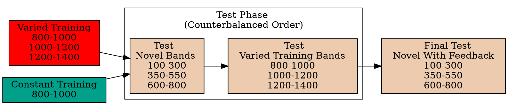
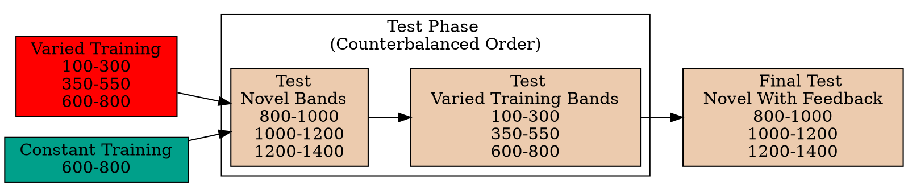
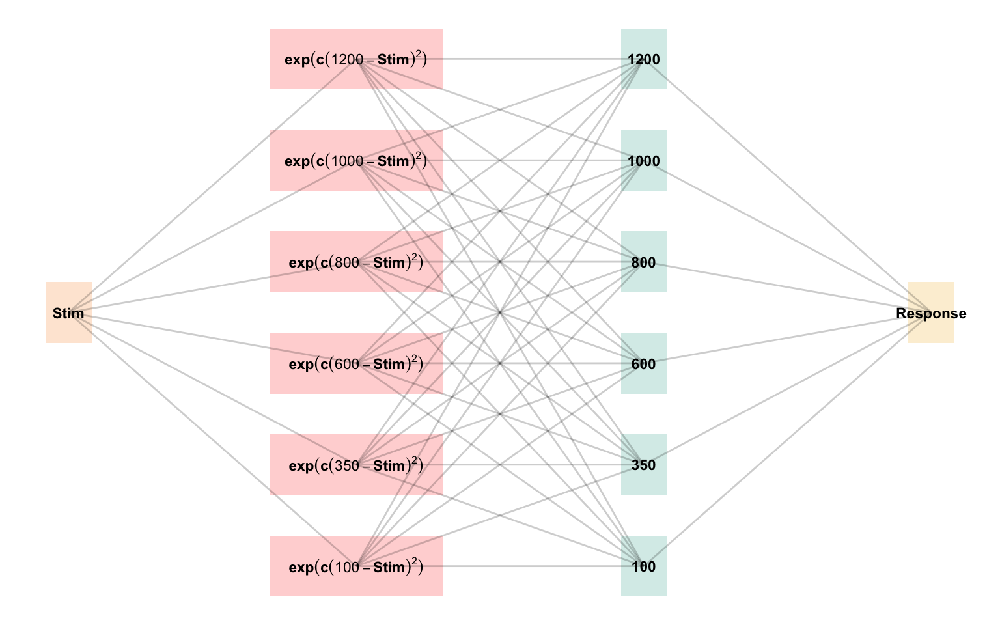
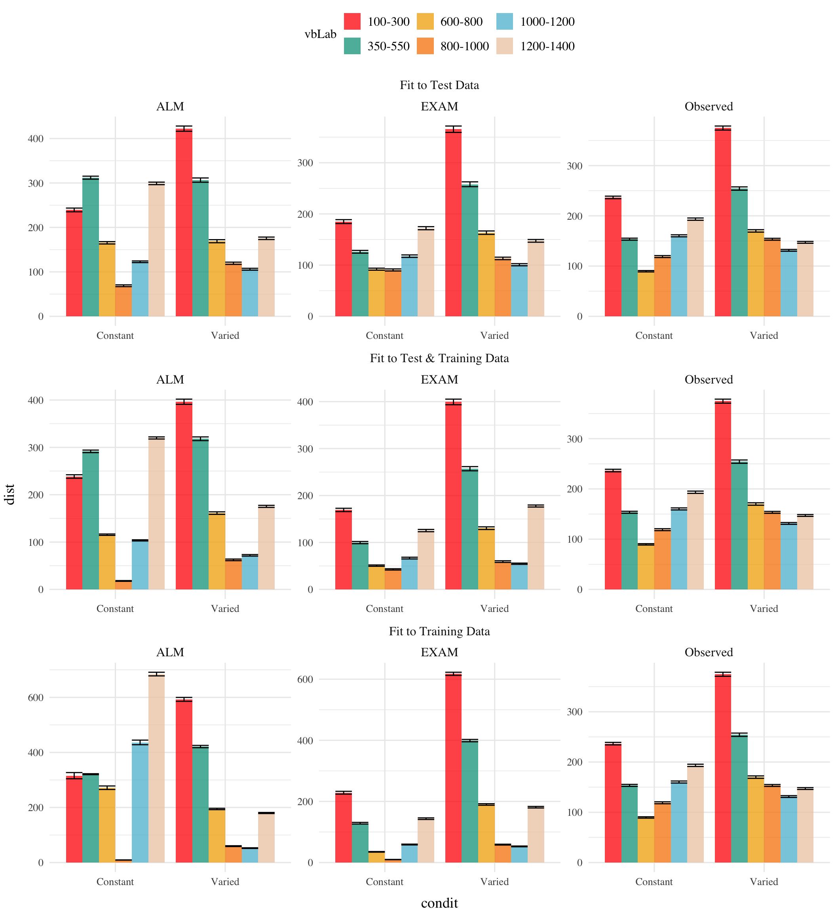
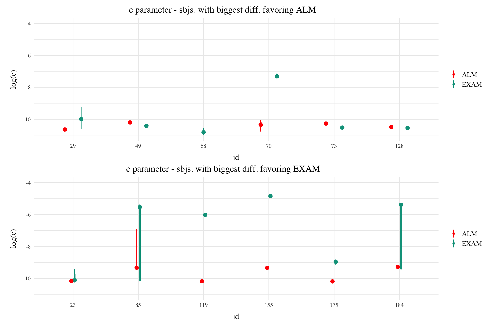
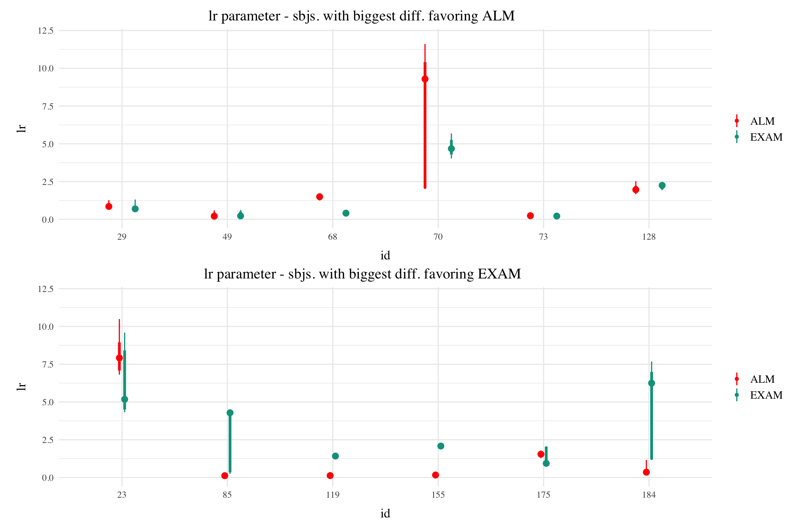

# HTW Model
Thomas Gorman
last-modified

<link href="../site_libs/tabwid-1.1.3/tabwid.css" rel="stylesheet" />

## Introduction

# Introduction

A longstanding issue across both science and instruction has been to
understand how various aspects of an educational curriculum or training
program influence learning acquisition and generalization. One such
aspect, which has received a great deal of research attention, is the
variability of examples experienced during training (Raviv et al.,
2022). The influence of training variation has been studied in numerous
domains, including category learning (Cohen et al., 2001; Posner &
Keele, 1968), visuomotor learning (Berniker et al., 2014 ; Schmidt,
1975), language learning (Perry et al., 2010), and education
(Braithwaite & Goldstone, 2015; Guo et al., 2014). The pattern of
results is complex, with numerous studies finding both beneficial (Braun
et al., 2009; Catalano & Kleiner, 1984; Roller et al., 2001), as well as
null or negative effects (Brekelmans et al., 2022 ; Hu & Nosofsky, 2024;
Van Rossum, 1990). The present study seeks to contribute to the large
body of existing research by examining the influence of variability in
visuomotor function learning - a domain in which it has been relatively
under-studied.

## Function Learning and Extrapolation

The study of human function learning investigates how people learn
relationships between continuous input and output values. Function
learning is studied both in tasks where individuals are exposed to a
sequence of input/output pairs (DeLosh et al., 1997; McDaniel et al.,
2013), or situations where observers are presented with a an incomplete
scatterplot or line graph and make predictions about regions of the plot
that don’t contain data (Ciccione & Dehaene, 2021; Courrieu, 2012; Said
& Fischer, 2021; Schulz et al., 2020).

Carroll (1963) conducted the earliest work on function learning. Input
stimuli and output responses were both lines of varying length. The
correct output response was related to the length of the input line by a
linear, quadratic, or random function. Participants in the linear and
quadratic performed above chance levels during extrapolation testing,
with those in the linear condition performing the best overall. Carroll
argued that these results were best explained by a ruled based model
wherein learners form an abstract representation of the underlying
function. Subsequent work by Brehmer (1974),testing a wider array of
functional forms, provided further evidence for superior extrapolation
in tasks with linear functions. Brehmer argued that individuals start
out with an assumption of a linear function, but given sufficient error
will progressively test alternative hypothesis with polynomials of
greater degree. Koh & Meyer (1991) employed a visuomotor function
learning task, wherein participants were trained on examples from an
unknown function relating the length of an input line to the duration of
a response (time between keystrokes). In this domain, participants
performed best when the relation between line length and response
duration was determined by a power, as opposed to linear function. Koh &
Meyer developed the log-polynomial adaptive-regression model to account
for their results.

The first significant challenge to the rule-based accounts of function
learning was put forth by DeLosh et al. (1997) . In their task,
participants learned to associate stimulus magnitudes with response
magnitudes that were related via either linear, exponential, or
quadratic function. Participants approached ceiling performance by the
end of training in each function condition, and were able to correctly
respond in interpolation testing trials. All three conditions
demonstrated some capacity for extrapolation, however participants in
the linear condition tended to underestimate the true function, while
exponential and quadratic participants reliably overestimated the true
function on extrapolation trials. Extrapolation and interpolation
performance are depicted in
<a href="#fig-delosh-extrap" class="quarto-xref">Figure 1</a>.

The authors evaluated both of the rule-based models introduced in
earlier research (with some modifications enabling trial-by-trial
learning). The polynomial hypothesis testing model (Brehmer, 1974;
Carroll, 1963) tended to mimic the true function closely in
extrapolation, and thus offered a poor account of the human data. The
log-polynomial adaptive regression model (Koh & Meyer, 1991) was able to
mimic some of the systematic deviations produced by human subjects, but
also predicted overestimation in cases where underestimation occurred.

The authors also introduced two new function-learning models. The
Associative Learning Model (ALM) and the extrapolation-association model
(EXAM). ALM is a two layer connectionist model adapted from the ALCOVE
model in the category learning literature (Kruschke, 1992). ALM belongs
to the general class of radial-basis function neural networks, and can
be considered a similarity-based model in the sense that the nodes in
the input layer of the network are activated as a function of distance.
The EXAM model retains the same similarity based activation and
associative learning mechanisms as ALM, while being augmented with a
linear rule response mechanism. When presented with novel stimuli, EXAM
will retrieve the most similar input-output examples encountered during
training, and from those examples compute a local slope. ALM was able to
provide a good account of participant training and interpolation data in
all three function conditions, however it was unable to extrapolate.
EXAM, on the other hand, was able to reproduce both the extrapolation
underestimation, as well as the quadratic and exponential overestimation
patterns exhibited by the human participants. Subsequent research
identified some limitations in EXAM’s ability to account for cases where
human participants learn and extrapolate sinusoidal function Bott & Heit
(2004) or to scenarios where different functions apply to different
regions of the input space Kalish et al. (2004), though EXAM has been
shown to provide a good account of human learning and extrapolation in
tasks with bi-linear, V shaped input spaces Mcdaniel et al. (2009).

### Variability and Function Learning

The influence of variability on function learning tasks has received
relatively little attention. The study by DeLosh et al. (1997)
(described in detail above) did include a variability manipulation
(referred to as density in their paper), wherein participants were
trained with either either 8, 20, or 50 unique input-output pairs, with
the total number of training trials held constant. They found a minimal
influence of variability on training performance, and no difference
between groups in interpolation or extrapolation, with all three
variability conditions displaying accurate interpolation, and linearly
biased extrapolation that was well accounted for by the EXAM model.

In the domain of visuomotor learning, van Dam & Ernst (2015) employed a
task which required participants to learn a linear function between the
spikiness of shape stimuli and the correct horizontal position to make a
rapid pointing response. The shapes ranged from very spiky to completely
circular at the extreme ends of the space. Participants trained with
intermediate shapes from a lower variation (2 shapes) or higher
variation (5 shapes) condition, with the 2 items of the lower varied
condition matching the items used on the extreme ends of the higher
variation training space. Learning was significantly slower in the
higher variation group. However, the two conditions did not differ when
tested with novel shapes, with both groups producing extrapolation
responses of comparable magnitudes to the most similar training item,
rather than in accordance with the true linear function. The authors
accounted for both learning and extrapolation performance with a
Bayesian learning model. Similar to ALM, the bayesian model assumes that
generalization occurs as a Gaussian function of the distance between
stimuli. However unlike ALM, the bayesian learning model utilizes more
elaborate probabilistic stimulus representations, with a separate Kalman
Filter for each shape stimulus.

## Overview Of Present Study

The present study investigates the influence of training variability on
learning, generalization, and extrapolation in a uni-dimensional
visuomotor function learning task. To the best of our knowledge, this
research is the first to employ the classic constant vs. varied training
manipulation, commonly used in the literature on the benefits of
variability, in the context of a uni-dimensional function learning task.
Across three experiments, we compare constant and varied training
conditions in terms of learning performance, extrapolation accuracy, and
the ability to reliably discriminate between stimuli.

To account for the empirical results, we will apply a series of
computational models, including the Associative Learning Model (ALM) and
the Extrapolation-Association Model (EXAM). Notably, this study is the
first to employ approximate Bayesian computation (ABC) to fit these
models to individual subject data, enabling us to thoroughly investigate
the full range of posterior predictions of each model, and to examine
the the ability of these influential models of function learning to
account for both the group level and individual level data.

## Methods

## Methods

Participants A total of 166 participants (XXX% female, XXX% male) were
recruited from the Indiana University Introductory Psychology Course.
The average age of participants was XXX years (SD = XXX). Participants
were randomly assigned to one of two training conditions: varied
training or constant training.

Design The experiment employed a 2 (Training Condition: varied
vs. constant).

Procedure Upon arrival at the laboratory, participants were provided
with a description of the experiment and signed informed consent forms.
They were then seated in front of a computer equipped with a mouse and
were given instructions on how to perform the “Hit The Wall” (HTW)
visuomotor extrapolation task.

The HTW task involved launching projectiles to hit a target displayed on
the computer screen. Participants completed a total of 90 trials during
the training stage. In the varied training condition, participants
encountered three velocity bands (800-1000, 1000-1200, and 1200-1400).
In contrast, participants in the constant training condition encountered
only one velocity band (800-1000).

During the training stage, participants in both conditions also
completed “no feedback” trials, where they received no information about
their performance. These trials were randomly interleaved with the
regular training trials.

Following the training stage, participants proceeded to the testing
stage, which consisted of three phases. In the first phase, participants
completed “no-feedback” testing from three novel extrapolation bands
(100-300, 350-550, and 600-800), with each band consisting of 15 trials.

In the second phase of testing, participants completed “no-feedback”
testing from the three velocity bands used during the training stage
(800-1000, 1000-1200, and 1200-1400). In the constant training
condition, two of these bands were novel, while in the varied training
condition, all three bands were encountered during training.

The third and final phase of testing involved “feedback” testing for
each of the three extrapolation bands (100-300, 350-550, and 600-800),
with each band consisting of 10 trials. Participants received feedback
on their performance during this phase.

Throughout the experiment, participants’ performance was measured by
calculating the distance between the produced x-velocity of the
projectiles and the closest edge of the current velocity band. Lower
distances indicated better performance.

After completing the experiment, participants were debriefed and
provided with an opportunity to ask questions about the study.

## HTW Task

- need to create a demo version without consent form. And maybe separate
  windows for the different versions.

Experimental Task for the HTW Project. Programmed in Javascript, and
making use of phaser.js.

## Experiment 1

### Analyses Strategy

All data processing and statistical analyses were performed in R version
4.32 Team (2020). To assess differences between groups, we used Bayesian
Mixed Effects Regression. Model fitting was performed with the brms
package in R Bürkner (2017), and descriptive stats and tables were
extracted with the BayestestR package Makowski et al. (2019). Mixed
effects regression enables us to take advantage of partial pooling,
simultaneously estimating parameters at the individual and group level.
Our use of Bayesian, rather than frequentist methods allows us to
directly quantify the uncertainty in our parameter estimates, as well as
avoiding convergence issues common to the frequentist analogues of our
mixed models.

Each model was set to run with 4 chains, 5000 iterations per chain, with
the first 2500 discarded as warmup chains. Rhat values were within an
acceptable range, with values \<=1.02 (see appendix for diagnostic
plots). We used uninformative priors for the fixed effects of the model
(condition and velocity band), and weakly informative Student T
distributions for for the random effects. For each model, we report 1)
the mean values of the posterior distribution for the parameters of
interest, 2) the lower and upper credible intervals (CrI), and the
probability of direction value (pd).

| Group Comparison         | Code                                                  | Data                 |
|--------------------------|-------------------------------------------------------|----------------------|
| End of Training Accuracy | `brm(dist ~ condit)`                                  | Final Training Block |
| Test Accuracy            | `brm(dist ~ condit * bandType + (1|id) + (1|bandInt)` | All Testing trials   |
| Band Discrimination      | `brm(vx ~ condit * band +(1 + bandInt|id)`            | All Testing Trials   |

  

In each experiment we compare varied and constant conditions in terms
of 1) accuracy in the final training block; 2) testing accuracy as a
function of band type (trained vs. extrapolation bands); 3) extent of
discrimination between all six testing bands. We quantified accuracy as
the absolute deviation between the response velocity and the nearest
boundary of the target band. Thus, when the target band was velocity
600-800, throws of 400, 650, and 900 would result in deviation values of
200, 0, and 100, respectively. The degree of discrimination between
bands was index by fitting a linear model predicting the response
velocity as a function of the target velocity. Participants who reliably
discriminated between velocity bands tended to haves slope values ~1,
while participants who made throws irrespective of the current target
band would have slopes ~0.

### Results

| Term         | Estimate | 95% CrI Lower | 95% CrI Upper |  pd |
|:-------------|---------:|--------------:|--------------:|----:|
| Intercept    |   106.34 |         95.46 |        117.25 |   1 |
| conditVaried |    79.64 |         57.92 |        101.63 |   1 |

  

*Training*. <a href="#fig-e1-train-dev" class="quarto-xref">Figure 3</a>
displays the average deviations across training blocks for the varied
group, which trained on three velocity bands, and the constant group,
which trained on one velocity band. To compare the training conditions
at the end of training, we analyzed performance on the 800-1000 velocity
band, which both groups trained on. The full model results are shown in
Table 1. The varied group had a significantly greater deviation than the
constant group in the final training block, ($\beta$ = 79.64, 95% CrI
\[57.92, 101.63\]; pd = 100%).

| Term                               | Estimate | 95% CrI Lower | 95% CrI Upper |  pd |
|:-----------------------------------|---------:|--------------:|--------------:|----:|
| Intercept                          |   152.55 |         70.63 |        229.85 | 1.0 |
| conditVaried                       |    39.00 |        -21.10 |        100.81 | 0.9 |
| bandTypeExtrapolation              |    71.51 |         33.24 |        109.60 | 1.0 |
| conditVaried:bandTypeExtrapolation |    66.46 |         32.76 |         99.36 | 1.0 |

*Testing.* To compare accuracy between groups in the testing stage, we
fit a Bayesian mixed effects model predicting deviation from the target
band as a function of training condition (varied vs. constant) and band
type (trained vs. extrapolation), with random intercepts for
participants and bands. The model results are shown in
<a href="#tbl-e1-bmm-dist" class="quarto-xref">Table 2</a>. The main
effect of training condition was not significant ($\beta$ = 39, 95% CrI
\[-21.1, 100.81\]; pd = 89.93%). The extrapolation testing items had a
significantly greater deviation than the training bands ($\beta$ =
71.51, 95% CrI \[33.24, 109.6\]; pd = 99.99%). Most importantly, the
interaction between training condition and band type was significant
($\beta$ = 66.46, 95% CrI \[32.76, 99.36\]; pd = 99.99%), As shown in
<a href="#fig-e1-test-dev" class="quarto-xref">Figure 4</a>, the varied
group had disproportionately larger deviations compared to the constant
group in the extrapolation bands.

  

| Term         | Estimate | 95% CrI Lower | 95% CrI Upper |   pd |
|:-------------|---------:|--------------:|--------------:|-----:|
| Intercept    |   408.55 |        327.00 |        490.61 | 1.00 |
| conditVaried |   164.05 |         45.50 |        278.85 | 1.00 |
| Band         |     0.71 |          0.62 |          0.80 | 1.00 |
| condit\*Band |    -0.14 |         -0.26 |         -0.01 | 0.98 |

Finally, to assess the ability of both conditions to discriminate
between velocity bands, we fit a model predicting velocity as a function
of training condition and velocity band, with random intercepts and
random slopes for each participant. See
<a href="#tbl-e1-bmm-vx" class="quarto-xref">Table 4</a> for the full
model results. The estimated coefficient for training condition ($\beta$
= 164.05, 95% CrI \[45.5, 278.85\]) suggests that the varied group tends
to produce harder throws than the constant group, but is not in and of
itself useful for assessing discrimination. Most relevant to the issue
of discrimination is the coefficient on the Band predictor ($\beta$ =
0.71 95% CrI \[0.62, 0.8\]). Although the median slope does fall
underneath the ideal of value of 1, the fact that the 95% credible
interval does not contain 0 provides strong evidence that participants
exhibited some discrimination between bands. The estimate for the
interaction between slope and condition ($\beta$ = -0.14, 95% CrI
\[-0.26, -0.01\]), suggests that the discrimination was somewhat
modulated by training condition, with the varied participants showing
less sensitivity between bands than the constant condition. This
difference is depicted visually in
<a href="#fig-e1-test-vx" class="quarto-xref">Figure 5</a>.

## E1 Discussion

In Experiment 1, we investigated how variability in training influenced
participants’ ability learn and extrapolate in a visuomotor task. Our
findings that training with variable conditions rresulted in lower final
training performance is consistent with much of the prior researchon the
influence of training variability (Raviv et al., 2022; Soderstrom &
Bjork, 2015), and is particularly unsurprising in the present work,
given that the constant group received three times the amount of
training on the velocity band common to the two conditions.

More importantly, the varied training group exhibited significantly
larger deviations from the target velocity bands during the testing
phase, particularly for the extrapolation bands that were not
encountered by either condition during training.

## Experiment 2

### Methods & Procedure

The task and procedure of Experiment was identical to Experiment 1, with
the exception that the training and testing bands were reversed (see
<a href="#fig-design-e2" class="quarto-xref">Figure 6</a>). The Varied
group trained on bands 100-300, 350-550, 600-800, and the constant group
trained on band 600-800. Both groups were tested from all six bands. A
total of 110 participants completed the experiment (Varied: 55,
Constant: 55).

### Results

| Term         | Estimate | 95% CrI Lower | 95% CrI Upper |  pd |
|:-------------|---------:|--------------:|--------------:|----:|
| Intercept    |    91.01 |         80.67 |        101.26 |   1 |
| conditVaried |    36.15 |         16.35 |         55.67 |   1 |

  

*Training*. <a href="#fig-e2-train-dev" class="quarto-xref">Figure 7</a>
presents the deviations across training blocks for both constant and
varied training groups. We again compared training performance on the
band common to both groups (600-800). The full model results are shown
in Table 1. The varied group had a significantly greater deviation than
the constant group in the final training block, ( $\beta$ = 36.15, 95%
CrI \[16.35, 55.67\]; pd = 99.95%).

| Term                               | Estimate | 95% CrI Lower | 95% CrI Upper |   pd |
|:-----------------------------------|---------:|--------------:|--------------:|-----:|
| Intercept                          |   190.91 |        125.03 |        259.31 | 1.00 |
| conditVaried                       |   -20.58 |        -72.94 |         33.08 | 0.78 |
| bandTypeExtrapolation              |    38.09 |         -6.94 |         83.63 | 0.95 |
| conditVaried:bandTypeExtrapolation |    82.00 |         41.89 |        121.31 | 1.00 |

   

*Testing Accuracy.* The analysis of testing accuracy examined deviations
from the target band as influenced by training condition (Varied
vs. Constant) and band type (training vs. extrapolation bands). The
results, summarized in
<a href="#tbl-e2-bmm-dist" class="quarto-xref">Table 6</a>, reveal no
significant main effect of training condition ($\beta$ = -20.58, 95% CrI
\[-72.94, 33.08\]; pd = 77.81%). However, the interaction between
training condition and band type was significant ($\beta$ = 82, 95% CrI
\[41.89, 121.31\]; pd = 100%), with the varied group showing
disproportionately larger deviations compared to the constant group on
the extrapolation bands (see
<a href="#fig-e2-test-dev" class="quarto-xref">Figure 8</a>).

| Term         | Estimate | 95% CrI Lower | 95% CrI Upper |   pd |
|:-------------|---------:|--------------:|--------------:|-----:|
| Intercept    |   362.64 |        274.85 |        450.02 | 1.00 |
| conditVaried |    -8.56 |       -133.97 |        113.98 | 0.55 |
| Band         |     0.71 |          0.58 |          0.84 | 1.00 |
| condit\*Band |    -0.06 |         -0.24 |          0.13 | 0.73 |

*Testing Discrimination.* Finally, to assess the ability of both
conditions to discriminate between velocity bands, we fit a model
predicting velocity as a function of training condition and velocity
band, with random intercepts and random slopes for each participant. The
full model results are shown in
<a href="#tbl-e2-bmm-vx" class="quarto-xref">Table 8</a>. The overall
slope on target velocity band predictor was significantly positive,
($\beta$ = 0.71, 95% CrI \[0.58, 0.84\]; pd= 100%), indicating that
participants exhibited discrimination between bands. The interaction
between slope and condition was not significant, ($\beta$ = -0.06, 95%
CrI \[-0.24, 0.13\]; pd= 72.67%), suggesting that the two conditions did
not differ in their ability to discriminate between bands (see
<a href="#fig-e2-test-vx" class="quarto-xref">Figure 9</a>).

## E2 Discussion

Experiment 2 extended the findings of Experiment 1 by examining the
effects of training variability on extrapolation performance in a
visuomotor function learning task, but with reversed training and
testing bands. Similar to Experiment 1, the Varied group exhibited
poorer performance during training and testing. However unlike
experiment 1, the Varied group did not show a significant difference in
discrimination between bands.

## Experiment 3

### Methods & Procedure

The major adjustment of Experiment 3 is for participants to receive
ordinal feedback during training, in contrast to the continuous feedback
of the prior experiments. After each training throw, participants are
informed whether a throw was too soft, too hard, or correct (i.e. within
the target velocity range). All other aspects of the task and design are
identical to Experiments 1 and 2. We utilized the order of training and
testing bands from both of the prior experiments, thus assigning
participants to both an order condition (Original or Reverse) and a
training condition (Constant or Varied). Participants were once again
recruited from the online Indiana University Introductory Psychology
Course pool. Following exclusions, 195 participants were included in the
final analysis, n=51 in the Constant-Original condition, n=59 in the
Constant-Reverse condition, n=39 in the Varied-Original condition, and
n=46 in the Varied-Reverse condition.

### Results

| Term                          | Estimate | 95% CrI Lower | 95% CrI Upper |   pd |
|:------------------------------|---------:|--------------:|--------------:|-----:|
| Intercept                     |   121.86 |        109.24 |        134.60 | 1.00 |
| conditVaried                  |    64.93 |         36.99 |         90.80 | 1.00 |
| bandOrderReverse              |     1.11 |        -16.02 |         18.16 | 0.55 |
| conditVaried:bandOrderReverse |   -77.02 |       -114.16 |        -39.61 | 1.00 |

*Training*.
<a href="#fig-e3-train-dev" class="quarto-xref">Figure 10</a> displays
the average deviations from the target band across training blocks, and
<a href="#tbl-e3-train-dist" class="quarto-xref">Table 9</a> shows the
results of the Bayesian regression model predicting the deviation from
the common band at the end of training (600-800 for reversed order, and
800-1000 for original order conditions). The main effect of training
condition is significant, with the varied condition showing larger
deviations ( $\beta$ = 64.93, 95% CrI \[36.99, 90.8\]; pd = 100%). The
main effect of band order is not significant $\beta$ = 1.11, 95% CrI
\[-16.02, 18.16\]; pd = 55.4%, however the interaction between training
condition and band order is significant, with the varied condition
showing greater accuracy in the reverse order condition ( $\beta$ =
-77.02, 95% CrI \[-114.16, -39.61\]; pd = 100%).

| Term                                                | Estimate | 95% CrI Lower | 95% CrI Upper |   pd |
|:----------------------------------------------------|---------:|--------------:|--------------:|-----:|
| Intercept                                           |   288.65 |        199.45 |        374.07 | 1.00 |
| conditVaried                                        |   -40.19 |       -104.68 |         23.13 | 0.89 |
| bandTypeExtrapolation                               |   -23.35 |        -57.28 |         10.35 | 0.92 |
| bandOrderReverse                                    |   -73.72 |       -136.69 |        -11.07 | 0.99 |
| conditVaried:bandTypeExtrapolation                  |    52.66 |         14.16 |         90.23 | 1.00 |
| conditVaried:bandOrderReverse                       |   -37.48 |       -123.28 |         49.37 | 0.80 |
| bandTypeExtrapolation:bandOrderReverse              |    80.69 |         30.01 |        130.93 | 1.00 |
| conditVaried:bandTypeExtrapolation:bandOrderReverse |    30.42 |        -21.00 |         81.65 | 0.87 |

*Testing Accuracy.*
<a href="#tbl-e3-bmm-dist" class="quarto-xref">Table 10</a> presents the
results of the Bayesian mixed efects model predicting absolute deviation
from the target band during the testing stage. There was no significant
main effect of training condition,$\beta$ = -40.19, 95% CrI \[-104.68,
23.13\]; pd = 89.31%, or band type,$\beta$ = -23.35, 95% CrI \[-57.28,
10.35\]; pd = 91.52%. However the effect of band order was significant,
with the reverse order condition showing lower deviations, $\beta$ =
-73.72, 95% CrI \[-136.69, -11.07\]; pd = 98.89%. The interaction
between training condition and band type was also significant $\beta$ =
52.66, 95% CrI \[14.16, 90.23\]; pd = 99.59%, with the varied condition
showing disproprionately large deviations on the extrapolation bands
compared to the constant group. There was also a significant interaction
between band type and band order, $\beta$ = 80.69, 95% CrI \[30.01,
130.93\]; pd = 99.89%, such that the reverse order condition showed
larger deviations on the extrapolation bands. No other interactions were
significant.

| Term                                  | Estimate | 95% CrI Lower | 95% CrI Upper |   pd |
|:--------------------------------------|---------:|--------------:|--------------:|-----:|
| Intercept                             |   601.83 |        504.75 |        699.42 | 1.00 |
| conditVaried                          |    12.18 |       -134.94 |        162.78 | 0.56 |
| bandOrderReverse                      |    13.03 |       -123.89 |        144.67 | 0.58 |
| Band                                  |     0.49 |          0.36 |          0.62 | 1.00 |
| conditVaried:bandOrderReverse         |  -338.15 |       -541.44 |       -132.58 | 1.00 |
| conditVaried:Band                     |    -0.04 |         -0.23 |          0.15 | 0.67 |
| bandOrderReverse:bandInt              |    -0.10 |         -0.27 |          0.08 | 0.86 |
| conditVaried:bandOrderReverse:bandInt |     0.42 |          0.17 |          0.70 | 1.00 |

*Testing Discrimination.* The full results of the discrimination model
are presented in
<a href="#tbl-e3-bmm-dist" class="quarto-xref">Table 10</a>. For the
purposes of assessing group differences in discrimination, only the
coefficients including the band variable are of interest. The baseline
effect of band represents the slope cofficient for the constant
training - original order condition, this effect was significant $\beta$
= 0.49, 95% CrI \[0.36, 0.62\]; pd = 100%. Neither of the two way
interactions reached significance, $\beta$ = -0.04, 95% CrI \[-0.23,
0.15\]; pd = 66.63%, $\beta$ = -0.1, 95% CrI \[-0.27, 0.08\]; pd =
86.35%. However, the three way interaction between training condition,
band order, and target band was significant, $\beta$ = 0.42, 95% CrI
\[0.17, 0.7\]; pd = 99.96% - indicating that the varied condition showed
a greater slope coefficient on the reverse order bands, compared to the
constant condition - this is clearly shown in
<a href="#fig-e3-test-vx" class="quarto-xref">Figure 12</a>, where the
steepness of the best fitting line for the varied-reversed condition is
noticably steeper than the other conditions.

## Results Summary

## Overall Summary of Experiments 1-3

Across three experiments, we investigated the impact of training
variability on learning, transfer, and extrapolation in a visuomotor
function learning task. In Experiment 1, participants in the varied
training condition, who experienced a wider range of velocity bands
during training, showed lower accuracy at the end of training compared
to those in the constant training condition. Crucially, during the
testing phase, the varied group exhibited significantly larger
deviations from the target velocity bands, particularly for the
extrapolation bands that were not encountered during training. The
varied group also showed less discrimination between velocity bands, as
evidenced by shallower slopes when predicting response velocity from
target velocity band.

Experiment 2 extended these findings by reversing the order of the
training and testing bands. Similar to Experiment 1, the varied group
demonstrated poorer performance during both training and testing phases.
However, unlike Experiment 1, the varied group did not show a
significant difference in discrimination between bands compared to the
constant group.

In Experiment 3, we introduced an ordinal feedback system during
training, in contrast to the continuous feedback provided in the
previous experiments. Participants were assigned to both an order
condition (original or reverse) and a training condition (constant or
varied). The varied condition showed larger deviations at the end of
training, consistent with the previous experiments. Interestingly, there
was a significant interaction between training condition and band order,
with the varied condition showing greater accuracy in the reverse order
condition. During testing, the varied group once again exhibited larger
deviations, particularly for the extrapolation bands. The reverse order
conditions showed smaller deviations compared to the original order
conditions. Discrimination between velocity bands was poorer for the
varied group in the original order condition, but not in the reverse
order condition.

In summary, these experiments consistently demonstrated that training
with greater variability led to lower accuracy during both training and
testing phases, with the detrimental effect being more pronounced for
extrapolation items. The varied training condition also tended to show
less discrimination between velocity bands, although this effect was
modulated by the order of the training and testing bands. These findings
suggest that while variable training can hinder initial learning, it may
have differential effects on transfer and extrapolation depending on the
specific task structure and the range of stimuli encountered during
training and testing.

## Computational Model



# Modeling Approach

In project 1, I applied model-based techniques to quantify and control
for the similarity between training and testing experience, which in
turn enabled us to account for the difference between varied and
constant training via an extended version of a similarity based
generalization model. In project 2, I will go a step further,
implementing a full process model capable of both 1) producing novel
responses and 2) modeling behavior in both the learning and testing
stages of the experiment. For this purpose, we will apply the
associative learning model (ALM) and the EXAM model of function learning
(DeLosh et al., 1997). ALM is a simple connectionist learning model
which closely resembles Kruschke’s ALCOVE model (Kruschke, 1992), with
modifications to allow for the generation of continuous responses.

## ALM & Exam Description

ALM is a localist neural network model (Page, 2000), with each input
node corresponding to a particular stimulus, and each output node
corresponding to a particular response value. The units in the input
layer activate as a function of their Gaussian similarity to the input
stimulus. So, for example, an input stimulus of value 55 would induce
maximal activation of the input unit tuned to 55. Depending on the value
of the generalization parameter, the nearby units (e.g. 54 and 56; 53
and 57) may also activate to some degree. ALM is structured with input
and output nodes that correspond to regions of the stimulus space, and
response space, respectively. The units in the input layer activate as a
function of their similarity to a presented stimulus. As was the case
with the exemplar-based models, similarity in ALM is exponentially
decaying function of distance. The input layer is fully connected to the
output layer, and the activation for any particular output node is
simply the weighted sum of the connection weights between that node and
the input activations. The network then produces a response by taking
the weighted average of the output units (recall that each output unit
has a value corresponding to a particular response). During training,
the network receives feedback which activates each output unit as a
function of its distance from the ideal level of activation necessary to
produce the correct response. The connection weights between input and
output units are then updated via the standard delta learning rule,
where the magnitude of weight changes are controlled by a learning rate
parameter. The EXAM model is an extension of ALM, with the same learning
rule and representational scheme for input and output units. The primary
difference is that EXAM includes a linear extrapolation mechanism for
generating novel responses during testing, a modification necessary to
account for human extrapolation patterns in past research Brown &
Lacroix (2017). Although this extrapolation rule departs from a strictly
similarity-based generalization mechanism, EXAM is distinct from pure
rule-based models in that it remains constrained by the weights learned
during training.

See <a href="#tbl-alm-exam" class="quarto-xref">Table 12</a> for a full
specification of the equations that define ALM and EXAM.

|                    | **ALM Response Generation**                                        |                                                                                               |
|--------------------|--------------------------------------------------------------------|-----------------------------------------------------------------------------------------------|
| Input Activation   | $a_i(X) = \frac{e^{-c(X-X_i)^2}}{\sum_{k=1}^M e^{-c(X-X_k)^2}}$    | Input nodes activate as a function of Gaussian similarity to stimulus                         |
| Output Activation  | $O_j(X) = \sum_{k=1}^M w_{ji} \cdot a_i(X)$                        | Output unit $O_j$ activation is the weighted sum of input activations and association weights |
| Output Probability | $P[Y_j|X] = \frac{O_j(X)}{\sum_{k=1}^M O_k(X)}$                    | The response, $Y_j$ probabilites computed via Luce’s choice rule                              |
| Mean Output        | $m(X) = \sum_{j=1}^L Y_j \cdot \frac{O_j(x)}{\sum_{k=1}^M O_k(X)}$ | Weighted average of probabilities determines response to X                                    |
|                    | **ALM Learning**                                                   |                                                                                               |
| Feedback           | $f_j(Z) = e^{-c(Z-Y_j)^2}$                                         | feedback signal Z computed as similarity between ideal response and observed response         |
| magnitude of error | $\Delta_{ji}=(f_{j}(Z)-o_{j}(X))a_{i}(X)$                          | Delta rule to update weights.                                                                 |
| Update Weights     | $w_{ji}^{new}=w_{ji}+\eta\Delta_{ji}$                              | Updates scaled by learning rate parameter $\eta$.                                             |
|                    | **EXAM Extrapolation**                                             |                                                                                               |
| Instance Retrieval | $P[X_i|X] = \frac{a_i(X)}{\sum_{k=1}^M a_k(X)}$                    | Novel test stimulus $X$ activates input nodes $X_i$                                           |
| Slope Computation  | $S =$ $\frac{m(X_{1})-m(X_{2})}{X_{1}-X_{2}}$                      | Slope value, $S$ computed from nearest training instances                                     |
| Response           | $E[Y|X_i] = m(X_i) + S \cdot [X - X_i]$                            | ALM response $m(X_i)$ adjusted by slope.                                                      |

## Model Fitting Strategy

To fit ALM and EXAM to our participant data, we employ a similar method
to Mcdaniel et al. (2009), wherein we examine the performance of each
model after being fit to various subsets of the data. Each model was fit
to the data in with separate procedures: 1) fit to maximize predictions
of the testing data, 2) fit to maximize predictions of both the training
and testing data, 3) fit to maximize predictions of the just the
training data. We refer to this fitting manipulations as “Fit Method” in
the tables and figures below. It should be emphasized that for all three
fit methods, the ALM and EXAM models behave identically - with weights
updating only during the training phase.Models to were fit separately to
the data of each individual participant. The free parameters for both
models are the generalization ($c$) and learning rate ($lr$) parameters.
Parameter estimation was performed using approximate bayesian
computation (ABC), which we describe in detail below.

### Approximate Bayesian Computation

To estimate parameters, we used approximate bayesian computation (ABC),
enabling us to obtain an estimate of the posterior distribution of the
generalization and learning rate parameters for each individual. ABC
belongs to the class of simulation-based inference methods (Cranmer et
al., 2020), which have begun being used for parameter estimation in
cognitive modeling relatively recently (Kangasrääsiö et al., 2019;
Turner et al., 2016; Turner & Van Zandt, 2012). Although they can be
applied to any model from which data can be simulated, ABC methods are
most useful for complex models that lack an explicit likelihood function
(e.g. many neural network and evidence accumulation models).

The general ABC procedure is to 1) define a prior distribution over
model parameters. 2) sample candidate parameter values, $\theta^*$, from
the prior. 3) Use $\theta^*$ to generate a simulated dataset,
$Data_{sim}$. 4) Compute a measure of discrepancy between the simulated
and observed datasets, $discrep$($Data_{sim}$, $Data_{obs}$). 5) Accept
$\theta^*$ if the discrepancy is less than the tolerance threshold,
$\epsilon$, otherwise reject $\theta^*$. 6) Repeat until desired number
of posterior samples are obtained.

Although simple in the abstract, implementations of ABC require
researchers to make a number of non-trivial decisions as to i) the
discrepancy function between observed and simulated data, ii) whether to
compute the discrepancy between trial level data, or a summary statistic
of the datasets, iii) the value of the minimum tolerance $\epsilon$
between simulated and observed data. For the present work, we follow the
guidelines from previously published ABC tutorials (Farrell &
Lewandowsky, 2018; Turner & Van Zandt, 2012). For the test stage, we
summarized datasets with mean velocity of each band in the observed
dataset as $V_{obs}^{(k)}$ and in the simulated dataset as
$V_{sim}^{(k)}$, where $k$ represents each of the six velocity bands.
For computing the discrepancy between datasets in the training stage, we
aggregated training trials into three equally sized blocks (separately
for each velocity band in the case of the varied group). After obtaining
the summary statistics of the simulated and observed datasets, the
discrepancy was computed as the mean of the absolute difference between
simulated and observed datasets
(<a href="#eq-discrep-test" class="quarto-xref">Equation 1</a> and
<a href="#eq-discrep-train" class="quarto-xref">Equation 2</a>). For the
models fit to both training and testing data, discrepancies were
computed for both stages, and then averaged together.

$$
discrep_{Test}(Data_{sim}, Data_{obs}) = \frac{1}{6} \sum_{k=1}^{6} |V_{obs}^{(k)} - V_{sim}^{(k)}|
 \qquad(1)$$

$$
\begin{aligned} \\
discrep_{Train,constant}(Data_{sim}, Data_{obs}) = \frac{1}{N_{blocks}} \sum_{j=1}^{N_{blocks}} |V_{obs,constant}^{(j)} - V_{sim,constant}^{(j)}| \\ \\
discrep_{Train,varied}(Data_{sim}, Data_{obs}) = \frac{1}{N_{blocks} \times 3} \sum_{j=1}^{N_{blocks}} \sum_{k=1}^{3} |V_{obs,varied}^{(j,k)} - V_{sim,varied}^{(j,k)}|
\end{aligned}
 \qquad(2)$$

The final component of our ABC implementation is the determination of an
appropriate value of $\epsilon$. The setting of $\epsilon$ exerts strong
influence on the approximated posterior distribution. Smaller values of
$\epsilon$ increase the rejection rate, and improve the fidelity of the
approximated posterior, while larger values result in an ABC sampler
that simply reproduces the prior distribution. Because the individual
participants in our dataset differed substantially in terms of the
noisiness of their data, we employed an adaptive tolerance setting
strategy to tailor $\epsilon$ to each individual. The initial value of
$\epsilon$ was set to the overall standard deviation of each individuals
velocity values. Thus, sampled parameter values that generated simulated
data within a standard deviation of the observed data were accepted,
while worse performing parameters were rejected. After every 300 samples
the tolerance was allowed to increase only if the current acceptance
rate of the algorithm was less than 1%. In such cases, the tolerance was
shifted towards the average discrepancy of the 5 best samples obtained
thus far. To ensure the acceptance rate did not become overly
permissive, $\epsilon$ was also allowed to decrease every time a sample
was accepted into the posterior.

For each of the 156 participants from Experiment 1, the ABC algorithm
was run until 200 samples of parameters were accepted into the posterior
distribution. Obtaining this number of posterior samples required an
average of 205,000 simulation runs per participant. Fitting each
combination of participant, Model (EXAM & ALM), and fitting method (Test
only, Train only, Test & Train) required a total of 192 million
simulation runs. To facilitate these intensive computational demands, we
used the Future Package in R (Bengtsson, 2021), allowing us to
parallelize computations across a cluster of ten M1 iMacs, each with 8
cores.

### Modelling Results

### Group level aggregations

<table data-quarto-disable-processing='true' class='cl-43dd0110'><thead><tr style="overflow-wrap:break-word;"><th class="cl-43db1f76">
Fit_Method
</th><th class="cl-43db1f77">
Model
</th><th class="cl-43db1f80">

</th><th class="cl-43db1f8a">
Constant
</th><th class="cl-43db1f80">

</th><th class="cl-43db1f8b">
Varied
</th></tr></thead><tbody><tr style="overflow-wrap:break-word;"><td  rowspan="2"class="cl-43db1f8c">
Fit to Test Data
</td><td class="cl-43db1f94">
ALM
</td><td class="cl-43db1f9e">

</td><td class="cl-43db1f9f">
276.7
</td><td class="cl-43db1f9e">

</td><td class="cl-43db1fa0">
231.2
</td></tr><tr style="overflow-wrap:break-word;"><td class="cl-43db1f94">
EXAM
</td><td class="cl-43db1f9e">

</td><td class="cl-43db1f9f">
215.9
</td><td class="cl-43db1f9e">

</td><td class="cl-43db1fa0">
215.0
</td></tr><tr style="overflow-wrap:break-word;"><td  rowspan="2"class="cl-43db1fa8">
Fit to Test &amp; Training Data
</td><td class="cl-43db1fa9">
ALM
</td><td class="cl-43db1faa">

</td><td class="cl-43db1fb2">
288.2
</td><td class="cl-43db1faa">

</td><td class="cl-43db1fbc">
268.3
</td></tr><tr style="overflow-wrap:break-word;"><td class="cl-43db1fa9">
EXAM
</td><td class="cl-43db1faa">

</td><td class="cl-43db1fb2">
228.6
</td><td class="cl-43db1faa">

</td><td class="cl-43db1fbc">
250.7
</td></tr><tr style="overflow-wrap:break-word;"><td  rowspan="2"class="cl-43db1fbd">
Fit to Training Data
</td><td class="cl-43db1fa9">
ALM
</td><td class="cl-43db1faa">

</td><td class="cl-43db1fb2">
528.1
</td><td class="cl-43db1faa">

</td><td class="cl-43db1fbc">
368.7
</td></tr><tr style="overflow-wrap:break-word;"><td class="cl-43db1fbe">
EXAM
</td><td class="cl-43db1faa">

</td><td class="cl-43db1fc6">
340.3
</td><td class="cl-43db1faa">

</td><td class="cl-43db1fc7">
370.9
</td></tr></tbody></table>

The posterior distributions of the $c$ and $lr$ parameters are shown
<a href="#fig-htw-post-dist" class="quarto-xref">Figure 16</a>
(i.e. these plots combine all the posterior samples from all of the
subjects). There were substantial individual differences in the
posteriors of both parameters, with the within-group individual
differences generally swamped any between-group or between-model
differences. The magnitude of these individual differences remains even
if we consider only the single best parameter set for each subject.

We used the posterior distribution of $c$ and $lr$ parameters to
generate a posterior predictive distribution of the observed data for
each participant, which then allows us to compare the empirical data to
the full range of predictions from each model. Model residuals are shown
in the upper panels of
<a href="#fig-htw-resid-pred" class="quarto-xref">Figure 15</a>. The
pattern of training stage residual errors are unsurprising across the
combinations of models and fitting method . Differences between ALM and
EXAM are generally minor (the two models have identical learning
mechanisms). The differences in the magnitude of residuals across the
three fitting methods are also straightforward, with massive errors for
the ‘fit to Test Only’ model, and the smallest errors for the ‘fit to
train only’ models. It is also noteworthy that the residual errors are
generally larger for the first block of training, which is likely due to
the initial values of the ALM weights being unconstrained by whatever
initial biases participants tend to bring to the task. Future work may
explore the ability of the models to capture more fine grained aspects
of the learning trajectories. However for the present purposes, our
primary interest is in the ability of ALM and EXAM to account for the
testing patterns while being constrained, or not constrained, by the
training data. All subsequent analyses and discussion will thus focus on
the testing stage.

The residuals of the model predictions for the testing stage
(<a href="#fig-htw-resid-pred" class="quarto-xref">Figure 15</a>) also
show a sensible pattern across fitting methods - with models fit only to
the test data showing the best performance, followed by models fit to
both training and test data, and with models fit only to the training
data showing the worst performance (note that y axes are scaled
different between plots). Unsurprisingly, the advantage of EXAM is
strongest for extrapolation positions (the three smallest bands for both
groups - as well as the two highest bands for the Constant group).
Although EXAM tends to perform better for both Constant and Varied
participants (see also
<a href="#tbl-htw-modelError" class="quarto-xref">Table 13</a>), the
relative advantage of EXAM is generally larger for the Constant group -
a pattern consistent across all three fitting methods.

Panel B of
<a href="#fig-htw-resid-pred" class="quarto-xref">Figure 15</a> directly
compares the aggregated observed data to the posterior predictive
distributions for the testing stage. Of interest are a) the extent to
which the median estimates of the ALM and EXAM posteriors deviate from
the observed medians for each velocity band; b) the ability of ALM and
EXAM to discriminate between velocity bands; c) the relative performance
of models that are constrained by the training data (i.e. the ‘fit to
train only’ and ‘fit to both’ models) compared to the ‘fit to test only’
models; and d) the extent to which the variance of the posterior
predictive distributions mimics the variance of the observed data.

Considering first the models fit to only the testing data, which reflect
the best possible performance of ALM and EXAM at capturing the
group-aggregated testing patterns. For the varied group, both ALM and
EXAM are able to capture the median values of the observed data within
the 66% credible intervals, and the spread of model predictions
generally matches that of the observed data. For the constant group,
only EXAM is able to capture the median range of values across the
velocity bands, with ALM generally underestimating human velocoties in
the upper bands, and overestimating in the lower bands. In the case of
band 100, the median ALM prediction appears to match that of our
participants - however this is due to a large subset of participants
have ALM predictions near 0 for band 100, a pattern we will explore
further in our considertation of individual patterns below. Models fit
to both training and testing data show a similar pattern to only the
testing data display the same basic pattern as those fit to only the
testing data, albeit with slightly larger residuals. However models fit
to only the training data display markedly worse performance at
accounting for the key testing patterns.

- \*\* explain how the constant group ALM predictions for band 100 look
  deceptively good due to aggregation of a large subset of subjects
  having ALM predictions of 0 for vb100, and a large subset with ALM
  predictions close to their position 800 value. This is relected by
  much greater variance of the ALM esimates in the posterior predictive
  plot

- \*\* comment on how much constrained by the training data has a worse
  impact on the EXAM predictions for varied than for constant - perhaps
  due to the varied training data being much noisier than the constant
  training data.

- \*\* comment on EXAM doing a better job mimicing the within-condition
  variance of the observed data

- \*\* comment on the % of Constant subjects being best accounted for by
  EXAM being higher.

- \*\* does EXAM do better for the Constant group because the constant
  group performs better? Or does training with a single example
  encourage an exam sort of strategy?

## Deviation Predictions

### Accounting for individual patterns

To more accurately assess the relative abilities of ALM and EXAM to
capture important empirical patterns - we will now examine the
predictions of both models for the subset of individual participants
shown in <a href="#fig-htw-indv-pred" class="quarto-xref">Figure 17</a>.
Panel A presents three varied and constant participants who demonstrated
a reasonable degree of discrimination between the 6 velocity bands
during testing.

- \*\* comment on the different ways ALM can completely fail to mimic
  discrimination patterns (sbj. 35; sbj. 137),and on how it can
  sometimes partially succeed (sbj. 11; 14,74)

- \*\* comment on how EXAM can somtimes mimic non-monotonic spacing
  between bands due to associative stregth from training (i.e. subject
  47)

- \*\* compare c values to slope parameters from the statistical models
  earlier in paper

#### Subjects with biggest differential favoring ALM

#### Subjects with biggest differential favoring EXAM

#### Subjects with no clear best model

### To add to appendix

<table data-quarto-disable-processing='true' class='cl-4d402214'><thead><tr style="overflow-wrap:break-word;"><th  rowspan="2"class="cl-4d3dd9aa">
Fit_Method
</th><th  rowspan="2"class="cl-4d3dd9b4">
x
</th><th class="cl-4d3dd9b5">

</th><th  colspan="3"class="cl-4d3dd9be">
Constant
</th><th class="cl-4d3dd9b5">

</th><th  colspan="3"class="cl-4d3dd9be">
Varied
</th></tr><tr style="overflow-wrap:break-word;"><th class="cl-4d3dd9d3">

</th><th class="cl-4d3dd9dc">
ALM
</th><th class="cl-4d3dd9d3">

</th><th class="cl-4d3dd9e6">
EXAM
</th><th class="cl-4d3dd9d3">

</th><th class="cl-4d3dd9dc">
ALM
</th><th class="cl-4d3dd9d3">

</th><th class="cl-4d3dd9e6">
EXAM
</th></tr></thead><tbody><tr style="overflow-wrap:break-word;"><td  rowspan="6"class="cl-4d3dd9e7">
Test
</td><td class="cl-4d3dd9fa">
100
</td><td class="cl-4d3dd9fb">

</td><td class="cl-4d3dda04">
203.3
</td><td class="cl-4d3dd9fb">

</td><td class="cl-4d3dda05">
191.4
</td><td class="cl-4d3dd9fb">

</td><td class="cl-4d3dda04">
233.5
</td><td class="cl-4d3dd9fb">

</td><td class="cl-4d3dda05">
194.8
</td></tr><tr style="overflow-wrap:break-word;"><td class="cl-4d3dd9fa">
350
</td><td class="cl-4d3dd9fb">

</td><td class="cl-4d3dda04">
249.8
</td><td class="cl-4d3dd9fb">

</td><td class="cl-4d3dda05">
169.0
</td><td class="cl-4d3dd9fb">

</td><td class="cl-4d3dda04">
213.2
</td><td class="cl-4d3dd9fb">

</td><td class="cl-4d3dda05">
193.5
</td></tr><tr style="overflow-wrap:break-word;"><td class="cl-4d3dd9fa">
600
</td><td class="cl-4d3dd9fb">

</td><td class="cl-4d3dda04">
264.1
</td><td class="cl-4d3dd9fb">

</td><td class="cl-4d3dda05">
199.5
</td><td class="cl-4d3dd9fb">

</td><td class="cl-4d3dda04">
222.4
</td><td class="cl-4d3dd9fb">

</td><td class="cl-4d3dda05">
219.2
</td></tr><tr style="overflow-wrap:break-word;"><td class="cl-4d3dd9fa">
800
</td><td class="cl-4d3dd9fb">

</td><td class="cl-4d3dda04">
218.2
</td><td class="cl-4d3dd9fb">

</td><td class="cl-4d3dda05">
214.3
</td><td class="cl-4d3dd9fb">

</td><td class="cl-4d3dda04">
243.9
</td><td class="cl-4d3dd9fb">

</td><td class="cl-4d3dda05">
222.9
</td></tr><tr style="overflow-wrap:break-word;"><td class="cl-4d3dda0f">
1,000
</td><td class="cl-4d3dda18">

</td><td class="cl-4d3dda19">
315.9
</td><td class="cl-4d3dda18">

</td><td class="cl-4d3dda1a">
245.3
</td><td class="cl-4d3dda18">

</td><td class="cl-4d3dda19">
224.4
</td><td class="cl-4d3dda18">

</td><td class="cl-4d3dda1a">
222.3
</td></tr><tr style="overflow-wrap:break-word;"><td class="cl-4d3dda23">
1,200
</td><td class="cl-4d3dda2c">

</td><td class="cl-4d3dda2d">
409.1
</td><td class="cl-4d3dda2c">

</td><td class="cl-4d3dda2e">
275.9
</td><td class="cl-4d3dda2c">

</td><td class="cl-4d3dda2d">
249.8
</td><td class="cl-4d3dda2c">

</td><td class="cl-4d3dda2e">
237.2
</td></tr><tr style="overflow-wrap:break-word;"><td  rowspan="6"class="cl-4d3dda36">
Test_Train
</td><td class="cl-4d3dda37">
100
</td><td class="cl-4d3dda38">

</td><td class="cl-4d3dda40">
195.0
</td><td class="cl-4d3dda38">

</td><td class="cl-4d3dda4a">
213.2
</td><td class="cl-4d3dda38">

</td><td class="cl-4d3dda40">
238.1
</td><td class="cl-4d3dda38">

</td><td class="cl-4d3dda4a">
217.2
</td></tr><tr style="overflow-wrap:break-word;"><td class="cl-4d3dda37">
350
</td><td class="cl-4d3dda38">

</td><td class="cl-4d3dda40">
241.4
</td><td class="cl-4d3dda38">

</td><td class="cl-4d3dda4a">
183.9
</td><td class="cl-4d3dda38">

</td><td class="cl-4d3dda40">
241.0
</td><td class="cl-4d3dda38">

</td><td class="cl-4d3dda4a">
207.1
</td></tr><tr style="overflow-wrap:break-word;"><td class="cl-4d3dda37">
600
</td><td class="cl-4d3dda38">

</td><td class="cl-4d3dda40">
255.3
</td><td class="cl-4d3dda38">

</td><td class="cl-4d3dda4a">
190.5
</td><td class="cl-4d3dda38">

</td><td class="cl-4d3dda40">
270.5
</td><td class="cl-4d3dda38">

</td><td class="cl-4d3dda4a">
230.0
</td></tr><tr style="overflow-wrap:break-word;"><td class="cl-4d3dda37">
800
</td><td class="cl-4d3dda38">

</td><td class="cl-4d3dda40">
244.9
</td><td class="cl-4d3dda38">

</td><td class="cl-4d3dda4a">
222.0
</td><td class="cl-4d3dda38">

</td><td class="cl-4d3dda40">
270.3
</td><td class="cl-4d3dda38">

</td><td class="cl-4d3dda4a">
257.9
</td></tr><tr style="overflow-wrap:break-word;"><td class="cl-4d3dda0f">
1,000
</td><td class="cl-4d3dda18">

</td><td class="cl-4d3dda19">
355.3
</td><td class="cl-4d3dda18">

</td><td class="cl-4d3dda1a">
265.1
</td><td class="cl-4d3dda18">

</td><td class="cl-4d3dda19">
276.0
</td><td class="cl-4d3dda18">

</td><td class="cl-4d3dda1a">
272.2
</td></tr><tr style="overflow-wrap:break-word;"><td class="cl-4d3dda23">
1,200
</td><td class="cl-4d3dda2c">

</td><td class="cl-4d3dda2d">
437.3
</td><td class="cl-4d3dda2c">

</td><td class="cl-4d3dda2e">
297.0
</td><td class="cl-4d3dda2c">

</td><td class="cl-4d3dda2d">
313.8
</td><td class="cl-4d3dda2c">

</td><td class="cl-4d3dda2e">
319.9
</td></tr><tr style="overflow-wrap:break-word;"><td  rowspan="6"class="cl-4d3dda4b">
Train
</td><td class="cl-4d3dda4c">
100
</td><td class="cl-4d3dda54">

</td><td class="cl-4d3dda5e">
519.3
</td><td class="cl-4d3dda54">

</td><td class="cl-4d3dda68">
430.2
</td><td class="cl-4d3dda54">

</td><td class="cl-4d3dda5e">
495.7
</td><td class="cl-4d3dda54">

</td><td class="cl-4d3dda68">
498.8
</td></tr><tr style="overflow-wrap:break-word;"><td class="cl-4d3dda4c">
350
</td><td class="cl-4d3dda54">

</td><td class="cl-4d3dda5e">
466.6
</td><td class="cl-4d3dda54">

</td><td class="cl-4d3dda68">
310.9
</td><td class="cl-4d3dda54">

</td><td class="cl-4d3dda5e">
398.6
</td><td class="cl-4d3dda54">

</td><td class="cl-4d3dda68">
405.2
</td></tr><tr style="overflow-wrap:break-word;"><td class="cl-4d3dda4c">
600
</td><td class="cl-4d3dda54">

</td><td class="cl-4d3dda5e">
445.4
</td><td class="cl-4d3dda54">

</td><td class="cl-4d3dda68">
243.0
</td><td class="cl-4d3dda54">

</td><td class="cl-4d3dda5e">
347.3
</td><td class="cl-4d3dda54">

</td><td class="cl-4d3dda68">
349.0
</td></tr><tr style="overflow-wrap:break-word;"><td class="cl-4d3dda4c">
800
</td><td class="cl-4d3dda54">

</td><td class="cl-4d3dda5e">
260.9
</td><td class="cl-4d3dda54">

</td><td class="cl-4d3dda68">
261.2
</td><td class="cl-4d3dda54">

</td><td class="cl-4d3dda5e">
298.5
</td><td class="cl-4d3dda54">

</td><td class="cl-4d3dda68">
300.0
</td></tr><tr style="overflow-wrap:break-word;"><td class="cl-4d3dda0f">
1,000
</td><td class="cl-4d3dda18">

</td><td class="cl-4d3dda19">
667.3
</td><td class="cl-4d3dda18">

</td><td class="cl-4d3dda1a">
352.9
</td><td class="cl-4d3dda18">

</td><td class="cl-4d3dda19">
311.0
</td><td class="cl-4d3dda18">

</td><td class="cl-4d3dda1a">
311.0
</td></tr><tr style="overflow-wrap:break-word;"><td class="cl-4d3dda86">
1,200
</td><td class="cl-4d3dda2c">

</td><td class="cl-4d3dda87">
809.3
</td><td class="cl-4d3dda2c">

</td><td class="cl-4d3dda90">
443.5
</td><td class="cl-4d3dda2c">

</td><td class="cl-4d3dda87">
361.3
</td><td class="cl-4d3dda2c">

</td><td class="cl-4d3dda90">
361.3
</td></tr></tbody></table>

# General Discussion

## Comparison to Project 1

### Differences between the tasks

There are a number of differences between Project 1’s Hit The Target
(HTT), and Project 2’s Hit The Wall (HTW) tasks.

- Task Space Complexity: In HTW, the task space is also almost perfectly
  smooth, at least for the continuous feedback subjects, if they throw
  100 units too hard, they’ll be told that they were 100 units too hard.
  Whereas in HTT,  it was possible to produce xy velocity combinations
  that were technically closer to the empirical solution space than
  other throws, but which resulted in worse feedback due to striking the
  barrier.

- Perceptual Distinctiveness: HTT offers perceptually distinct varied
  conditions that directly relate to the task’s demands, which may
  increase the sallience between training positions encounted by the
  varied group. In contrast, HTW’s varied conditions differ only in the
  numerical values displayed, lacking the same level of perceptual
  differentiation. Conversely in HTW, the only difference between
  conditions for the varied group are the numbers displayed at the top
  of the screen which indicate the current target band(e.g. 800-1000, or
  1000-1200)

- In HTW, our primary testing stage of interest has no feedback, whereas
  in HTT testing always included feedback (the intermittent testing in
  HTT expt 1 being the only exception). Of course, we do collect testing
  with feedback data at the end of HTW, but we haven’t focused on that
  data at all in our modelling work thus far. It’s also interesting to
  recall that the gap between varied and constant in HTW does seem to
  close substantially in the testing-with-feedback stage. The difference
  between no-feedback and feedback testing might be relevant if the
  benefits of variation have anything to do with improving subsequent
  learning (as opposed to subsequent immediate performance), OR if the
  benefits of constant training rely on having the most useful anchor,
  having the most useful anchor might be a lot less helpful if you’re
  getting feedback from novel positions and can thus immediately begin
  to form position-specific anchors for the novelties, rather than
  relying on a training anchor. 

- HTW and HTT both have a similar amount of training trials (~200), and
  thus the constant groups acquire a similar amount of experience with
  their single position/velocity in both experiments. However, the
  varied conditions in both HTT experiments train on 2 positions,
  whereas the varied group in HTW trains on 3 velocity bands. This means
  that in HTT the varied group gets half as much experience on any one
  position as the constant group, and in HTW they only get 1/3 as much
  experience in any one position. There are likely myriad ways in which
  this might impact the success of the varied group regardless of how
  you think the benefits of variation might be occurring, e.g. maybe
  they also need to develop a coherent anchor, maybe they need more
  experience in order to extract a function, or more experience in order
  to properly learn to tune their c parameter. 

## References

Bengtsson, H. (2021). A Unifying Framework for Parallel and Distributed
Processing in R using Futures. *The R Journal*, *13*(2), 208.
<https://doi.org/10.32614/RJ-2021-048>

Berniker, M., Mirzaei, H., & Kording, K. P. (2014). The effects of
training breadth on motor generalization. *Journal of Neurophysiology*,
*112*(11), 2791–2798. <https://doi.org/10.1152/jn.00615.2013>

Bott, L., & Heit, E. (2004). Nonmonotonic Extrapolation in Function
Learning. *Journal of Experimental Psychology: Learning, Memory, and
Cognition*, *30*(1), 38–50. <https://doi.org/10.1037/0278-7393.30.1.38>

Braithwaite, D. W., & Goldstone, R. L. (2015). Effects of Variation and
Prior Knowledge on Abstract Concept Learning. *Cognition and
Instruction*, *33*(3), 226–256.
<https://doi.org/10.1080/07370008.2015.1067215>

Braun, D. A., Aertsen, A., Wolpert, D. M., & Mehring, C. (2009). Motor
Task Variation Induces Structural Learning. *Current Biology*, *19*(4),
352–357. <https://doi.org/10.1016/j.cub.2009.01.036>

Brehmer, B. (1974). Hypotheses about relations between scaled variables
in the learning of probabilistic inference tasks. *Organizational
Behavior and Human Performance*, *11*(1), 1–27.
<https://doi.org/10.1016/0030-5073(74)90002-6>

Brekelmans, G., Lavan, N., Saito, H., Clayards, M., & Wonnacott, E.
(2022). Does high variability training improve the learning of
non-native phoneme contrasts over low variability training? A
replication. *Journal of Memory and Language*, *126*, 104352.
<https://doi.org/10.1016/j.jml.2022.104352>

Brown, M. A., & Lacroix, G. (2017). Underestimation in linear function
learning: Anchoring to zero or x-y similarity? *Canadian Journal of
Experimental Psychology/Revue Canadienne de Psychologie Expérimentale*,
*71*(4), 274–282. <https://doi.org/10.1037/cep0000129>

Bürkner, P.-C. (2017). Brms: An R Package for Bayesian Multilevel Models
Using Stan. *Journal of Statistical Software*, *80*, 1–28.
<https://doi.org/10.18637/jss.v080.i01>

Carroll, J. D. (1963). Functional Learning: The Learning of Continuous
Functional Mappings Relating Stimulus and Response Continua. *ETS
Research Bulletin Series*, *1963*(2), i–144.
<https://doi.org/10.1002/j.2333-8504.1963.tb00958.x>

Catalano, J. F., & Kleiner, B. M. (1984). Distant Transfer in Coincident
Timing as a Function of Variability of Practice. *Perceptual and Motor
Skills*, *58*(3), 851–856. <https://doi.org/10.2466/pms.1984.58.3.851>

Ciccione, L., & Dehaene, S. (2021). Can humans perform mental regression
on a graph? Accuracy and bias in the perception of scatterplots.
*Cognitive Psychology*, *128*, 101406.
<https://doi.org/10.1016/j.cogpsych.2021.101406>

Cohen, A. L., Nosofsky, R. M., & Zaki, S. R. (2001). Category
variability, exemplar similarity, and perceptual classification. *Memory
& Cognition*, *29*(8), 1165–1175. <https://doi.org/10.3758/BF03206386>

Courrieu, P. (2012). Quick approximation of bivariate functions.
*British Journal of Mathematical and Statistical Psychology*, *65*(1),
89–121. <https://doi.org/10.1111/j.2044-8317.2011.02016.x>

Cranmer, K., Brehmer, J., & Louppe, G. (2020). The frontier of
simulation-based inference. *Proceedings of the National Academy of
Sciences*, *117*(48), 30055–30062.
<https://doi.org/10.1073/pnas.1912789117>

DeLosh, E. L., McDaniel, M. A., & Busemeyer, J. R. (1997).
Extrapolation: The Sine Qua Non for Abstraction in Function Learning.
*Journal of Experimental Psychology: Learning, Memory, and Cognition*,
*23*(4), 19. <https://doi.org/10.1037/0278-7393.23.4.968>

Farrell, S., & Lewandowsky, S. (2018). *Computational Modeling of
Cognition and Behavior:* (1st ed.). Cambridge University Press.
<https://doi.org/10.1017/CBO9781316272503>

Guo, J.-P., Yang, L.-Y., & Ding, Y. (2014). Effects of example
variability and prior knowledge in how students learn to solve
equations. *European Journal of Psychology of Education*, *29*(1),
21–42. <https://www.jstor.org/stable/43551124>

Hu, M., & Nosofsky, R. M. (2024). High-variability training does not
enhance generalization in the prototype-distortion paradigm. *Memory &
Cognition*, 1–16. <https://doi.org/10.3758/s13421-023-01516-1>

Kalish, M. L., Lewandowsky, S., & Kruschke, J. K. (2004). Population of
Linear Experts: Knowledge Partitioning and Function Learning.
*Psychological Review*, *111*(4), 1072–1099.
<https://doi.org/10.1037/0033-295X.111.4.1072>

Kangasrääsiö, A., Jokinen, J. P. P., Oulasvirta, A., Howes, A., & Kaski,
S. (2019). Parameter Inference for Computational Cognitive Models with
Approximate Bayesian Computation. *Cognitive Science*, *43*(6), e12738.
<https://doi.org/10.1111/cogs.12738>

Koh, K., & Meyer, D. E. (1991). Function learning: Induction of
continuous stimulus-response relations. *Journal of Experimental
Psychology: Learning, Memory, and Cognition*, *17*(5), 811.
<https://doi.org/10.1037/0278-7393.17.5.811>

Kruschke, J. K. (1992). ALCOVE: An exemplar-based connectionist model of
Category Learning. *Psychological Review*, *99*(1).
<https://doi.org/10.1037/0033-295X.99.1.22>

Makowski, D., Ben-Shachar, M. S., & Lüdecke, D. (2019).
bayestestR: Describing Effects and their
Uncertainty, Existence and Significance within the Bayesian Framework.
*Journal of Open Source Software*, *4*(40), 1541.
<https://doi.org/10.21105/joss.01541>

Mcdaniel, M. A., Dimperio, E., Griego, J. A., & Busemeyer, J. R. (2009).
Predicting transfer performance: A comparison of competing function
learning models. *Journal of Experimental Psychology. Learning, Memory,
and Cognition*, *35*, 173–195. <https://doi.org/10.1037/a0013982>

McDaniel, M. A., Fadler, C. L., & Pashler, H. (2013). Effects of spaced
versus massed training in function learning. *Journal of Experimental
Psychology: Learning, Memory, and Cognition*, *39*(5), 1417–1432.
<https://doi.org/10.1037/a0032184>

Page, M. (2000). Connectionist modelling in psychology: A localist
manifesto. *Behavioral and Brain Sciences*, *23*(4), 443–467.
<https://doi.org/10.1017/S0140525X00003356>

Perry, L. K., Samuelson, L. K., Malloy, L. M., & Schiffer, R. N. (2010).
Learn Locally, Think Globally: Exemplar Variability Supports
Higher-Order Generalization and Word Learning. *Psychological Science*,
*21*(12), 1894–1902. <https://doi.org/10.1177/0956797610389189>

Posner, M. I., & Keele, S. W. (1968). On the genesis of abstract ideas.
*Journal of Experimental Psychology*, *77*(3), 353–363.
<https://doi.org/10.1037/h0025953>

Raviv, L., Lupyan, G., & Green, S. C. (2022). How variability shapes
learning and generalization. *Trends in Cognitive Sciences*,
S1364661322000651. <https://doi.org/10.1016/j.tics.2022.03.007>

Roller, C. A., Cohen, H. S., Kimball, K. T., & Bloomberg, J. J. (2001).
Variable practice with lenses improves visuo-motor plasticity.
*Cognitive Brain Research*, *12*(2), 341–352.
<https://doi.org/10.1016/S0926-6410(01)00077-5>

Said, N., & Fischer, H. (2021). Extrapolation accuracy underestimates
rule learning: Evidence from the function-learning paradigm. *Acta
Psychologica*, *218*, 103356.
<https://doi.org/10.1016/j.actpsy.2021.103356>

Schmidt, R. A. (1975). A schema theory of discrete motor skill learning.
*Psychological Review*, *82*(4), 225–260.
<https://doi.org/10.1037/h0076770>

Schulz, E., Quiroga, F., & Gershman, S. J. (2020). Communicating
Compositional Patterns. *Open Mind*, *4*, 25–39.
<https://doi.org/10.1162/opmi_a_00032>

Soderstrom, N. C., & Bjork, R. A. (2015). Learning versus performance:
An integrative review. *Perspectives on Psychological Science*, *10*(2),
176–199. <https://doi.org/10.1177/1745691615569000>

Team, R. C. (2020). *R: A Language and Environment for Statistical
Computing*. R: A Language and Environment for Statistical Computing.

Turner, B. M., Sederberg, P. B., & McClelland, J. L. (2016). Bayesian
analysis of simulation-based models. *Journal of Mathematical
Psychology*, *72*, 191–199. <https://doi.org/10.1016/j.jmp.2014.10.001>

Turner, B. M., & Van Zandt, T. (2012). A tutorial on approximate
Bayesian computation. *Journal of Mathematical Psychology*, *56*(2),
69–85. <https://doi.org/10.1016/j.jmp.2012.02.005>

van Dam, L. C. J., & Ernst, M. O. (2015). Mapping Shape to Visuomotor
Mapping: Learning and Generalisation of Sensorimotor Behaviour Based on
Contextual Information. *PLOS Computational Biology*, *11*(3), e1004172.
<https://doi.org/10.1371/journal.pcbi.1004172>

Van Rossum, J. H. A. (1990). Schmidt’s schema theory: The empirical base
of the variability of practice hypothesis. *Human Movement Science*,
*9*(3-5), 387–435. <https://doi.org/10.1016/0167-9457(90)90010-B>

