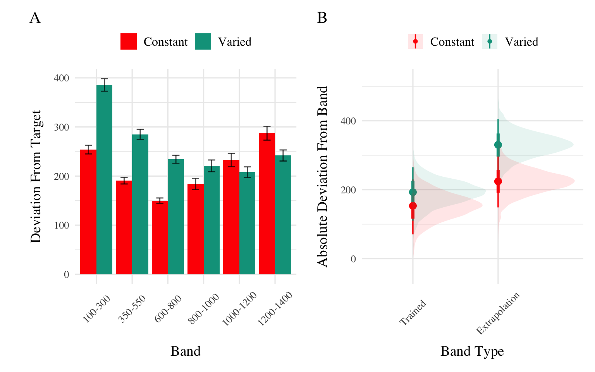
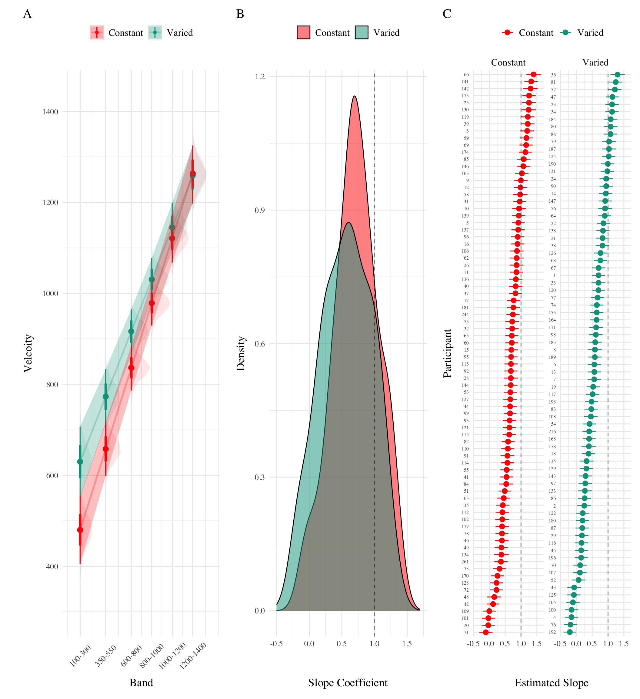
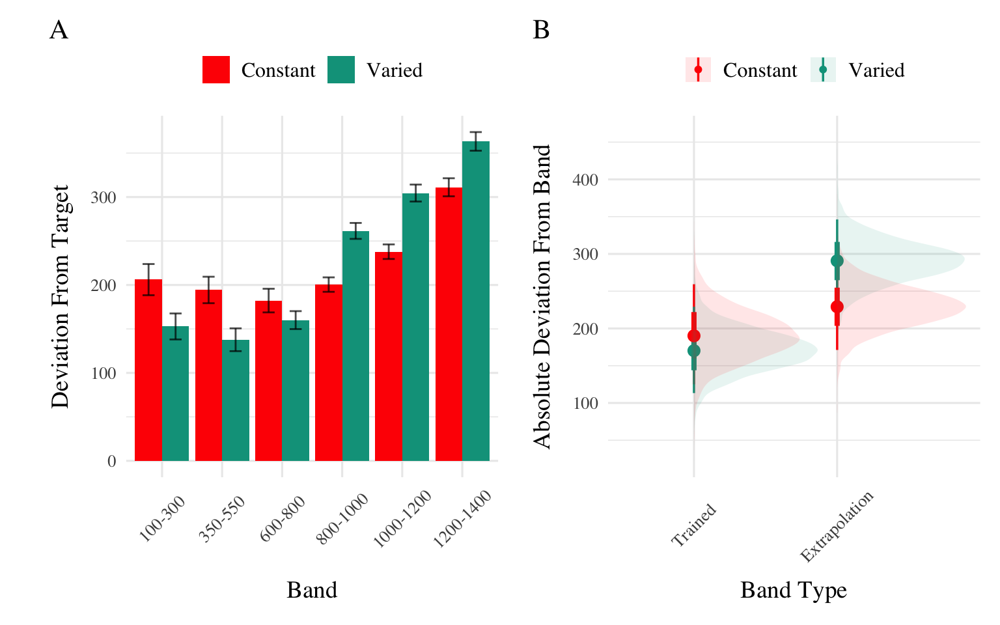
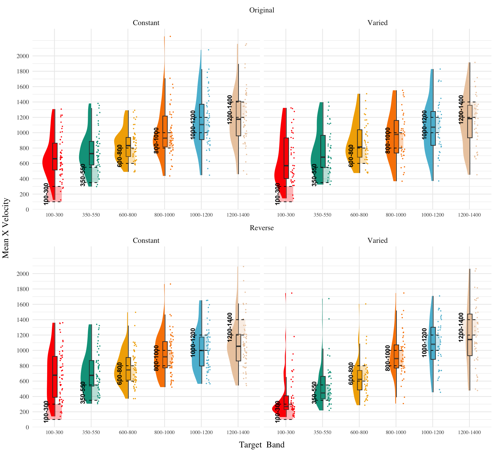

# Experiment 3
Thomas Gorman
2024-03-19

## Experiment 1

### Analyses Strategy

All data processing and statistical analyses were performed in R version
4.32 Team (2020). To assess differences between groups, we used Bayesian
Mixed Effects Regression. Model fitting was performed with the brms
package in R Bürkner (2017), and descriptive stats and tables were
extracted with the BayestestR package Makowski et al. (2019). Mixed
effects regression enables us to take advantage of partial pooling,
simultaneously estimating parameters at the individual and group level.
Our use of Bayesian, rather than frequentist methods allows us to
directly quantify the uncertainty in our parameter estimates, as well as
avoiding convergence issues common to the frequentist analogues of our
mixed models.

Each model was set to run with 4 chains, 5000 iterations per chain, with
the first 2500 discarded as warmup chains. Rhat values were within an
acceptable range, with values \<=1.02 (see appendix for diagnostic
plots). We used uninformative priors for the fixed effects of the model
(condition and velocity band), and weakly informative Student T
distributions for for the random effects. For each model, we report 1)
the mean values of the posterior distribution for the parameters of
interest, 2) the lower and upper credible intervals (CrI), and the
probability of direction value (pd).

| Group Comparison         | Code                                                  | Data                 |
|--------------------------|-------------------------------------------------------|----------------------|
| End of Training Accuracy | `brm(dist ~ condit)`                                  | Final Training Block |
| Test Accuracy            | `brm(dist ~ condit * bandType + (1|id) + (1|bandInt)` | All Testing trials   |
| Band Discrimination      | `brm(vx ~ condit * band +(1 + bandInt|id)`            | All Testing Trials   |

  

In each experiment we compare varied and constant conditions in terms
of 1) accuracy in the final training block; 2) testing accuracy as a
function of band type (trained vs. extrapolation bands); 3) extent of
discrimination between all six testing bands. We quantified accuracy as
the absolute deviation between the response velocity and the nearest
boundary of the target band. Thus, when the target band was velocity
600-800, throws of 400, 650, and 900 would result in deviation values of
200, 0, and 100, respectively. The degree of discrimination between
bands was index by fitting a linear model predicting the response
velocity as a function of the target velocity. Participants who reliably
discriminated between velocity bands tended to haves slope values ~1,
while participants who made throws irrespective of the current target
band would have slopes ~0.

### Results

| Term         | Estimate | 95% CrI Lower | 95% CrI Upper |  pd |
|:-------------|---------:|--------------:|--------------:|----:|
| Intercept    |   106.34 |         95.46 |        117.25 |   1 |
| conditVaried |    79.64 |         57.92 |        101.63 |   1 |

  

*Training*. <a href="#fig-e1-train-dev" class="quarto-xref">Figure 1</a>
displays the average deviations across training blocks for the varied
group, which trained on three velocity bands, and the constant group,
which trained on one velocity band. To compare the training conditions
at the end of training, we analyzed performance on the 800-1000 velocity
band, which both groups trained on. The full model results are shown in
Table 1. The varied group had a significantly greater deviation than the
constant group in the final training block, ($\beta$ = 79.64, 95% CrI
\[57.92, 101.63\]; pd = 100%).

| Term                               | Estimate | 95% CrI Lower | 95% CrI Upper |  pd |
|:-----------------------------------|---------:|--------------:|--------------:|----:|
| Intercept                          |   152.55 |         70.63 |        229.85 | 1.0 |
| conditVaried                       |    39.00 |        -21.10 |        100.81 | 0.9 |
| bandTypeExtrapolation              |    71.51 |         33.24 |        109.60 | 1.0 |
| conditVaried:bandTypeExtrapolation |    66.46 |         32.76 |         99.36 | 1.0 |

*Testing.* To compare accuracy between groups in the testing stage, we
fit a Bayesian mixed effects model predicting deviation from the target
band as a function of training condition (varied vs. constant) and band
type (trained vs. extrapolation), with random intercepts for
participants and bands. The model results are shown in
<a href="#tbl-e1-bmm-dist" class="quarto-xref">Table 2</a>. The main
effect of training condition was not significant ($\beta$ = 39, 95% CrI
\[-21.1, 100.81\]; pd = 89.93%). The extrapolation testing items had a
significantly greater deviation than the training bands ($\beta$ =
71.51, 95% CrI \[33.24, 109.6\]; pd = 99.99%). Most importantly, the
interaction between training condition and band type was significant
($\beta$ = 66.46, 95% CrI \[32.76, 99.36\]; pd = 99.99%), As shown in
<a href="#fig-e1-test-dev" class="quarto-xref">Figure 3</a>, the varied
group had disproportionately larger deviations compared to the constant
group in the extrapolation bands.

  

| Term         | Estimate | 95% CrI Lower | 95% CrI Upper |   pd |
|:-------------|---------:|--------------:|--------------:|-----:|
| Intercept    |   408.55 |        327.00 |        490.61 | 1.00 |
| conditVaried |   164.05 |         45.50 |        278.85 | 1.00 |
| Band         |     0.71 |          0.62 |          0.80 | 1.00 |
| condit\*Band |    -0.14 |         -0.26 |         -0.01 | 0.98 |

Finally, to assess the ability of both conditions to discriminate
between velocity bands, we fit a model predicting velocity as a function
of training condition and velocity band, with random intercepts and
random slopes for each participant. See
<a href="#tbl-e1-bmm-vx" class="quarto-xref">Table 4</a> for the full
model results. The estimated coefficient for training condition ($\beta$
= 164.05, 95% CrI \[45.5, 278.85\]) suggests that the varied group tends
to produce harder throws than the constant group, but is not in and of
itself useful for assessing discrimination. Most relevant to the issue
of discrimination is the coefficient on the Band predictor ($\beta$ =
0.71 95% CrI \[0.62, 0.8\]). Although the median slope does fall
underneath the ideal of value of 1, the fact that the 95% credible
interval does not contain 0 provides strong evidence that participants
exhibited some discrimination between bands. The estimate for the
interaction between slope and condition ($\beta$ = -0.14, 95% CrI
\[-0.26, -0.01\]), suggests that the discrimination was somewhat
modulated by training condition, with the varied participants showing
less sensitivity between bands than the constant condition. This
difference is depicted visually in
<a href="#fig-e1-test-vx" class="quarto-xref">Figure 4</a>.

## E1 Discussion

In Experiment 1, we investigated how variability in training influenced
participants’ ability learn and extrapolate in a visuomotor task. Our
findings that training with variable conditions rresulted in lower final
training performance is consistent with much of the prior researchon the
influence of training variability (Raviv et al., 2022; Soderstrom &
Bjork, 2015), and is particularly unsurprising in the present work,
given that the constant group received three times the amount of
training on the velocity band common to the two conditions.

More importantly, the varied training group exhibited significantly
larger deviations from the target velocity bands during the testing
phase, particularly for the extrapolation bands that were not
encountered by either condition during training.

## Experiment 2

### Methods & Procedure

The task and procedure of Experiment was identical to Experiment 1, with
the exception that the training and testing bands were reversed (see
<a href="#fig-design-e2" class="quarto-xref">Figure 5</a>). The Varied
group trained on bands 100-300, 350-550, 600-800, and the constant group
trained on band 600-800. Both groups were tested from all six bands. A
total of 110 participants completed the experiment (Varied: 55,
Constant: 55).

### Results

| Term         | Estimate | 95% CrI Lower | 95% CrI Upper |  pd |
|:-------------|---------:|--------------:|--------------:|----:|
| Intercept    |    91.01 |         80.67 |        101.26 |   1 |
| conditVaried |    36.15 |         16.35 |         55.67 |   1 |

  

*Training*. <a href="#fig-e2-train-dev" class="quarto-xref">Figure 6</a>
presents the deviations across training blocks for both constant and
varied training groups. We again compared training performance on the
band common to both groups (600-800). The full model results are shown
in Table 1. The varied group had a significantly greater deviation than
the constant group in the final training block, ( $\beta$ = 36.15, 95%
CrI \[16.35, 55.67\]; pd = 99.95%).

| Term                               | Estimate | 95% CrI Lower | 95% CrI Upper |   pd |
|:-----------------------------------|---------:|--------------:|--------------:|-----:|
| Intercept                          |   190.91 |        125.03 |        259.31 | 1.00 |
| conditVaried                       |   -20.58 |        -72.94 |         33.08 | 0.78 |
| bandTypeExtrapolation              |    38.09 |         -6.94 |         83.63 | 0.95 |
| conditVaried:bandTypeExtrapolation |    82.00 |         41.89 |        121.31 | 1.00 |

   

*Testing Accuracy.* The analysis of testing accuracy examined deviations
from the target band as influenced by training condition (Varied
vs. Constant) and band type (training vs. extrapolation bands). The
results, summarized in
<a href="#tbl-e2-bmm-dist" class="quarto-xref">Table 6</a>, reveal no
significant main effect of training condition ($\beta$ = -20.58, 95% CrI
\[-72.94, 33.08\]; pd = 77.81%). However, the interaction between
training condition and band type was significant ($\beta$ = 82, 95% CrI
\[41.89, 121.31\]; pd = 100%), with the varied group showing
disproportionately larger deviations compared to the constant group on
the extrapolation bands (see
<a href="#fig-e2-test-dev" class="quarto-xref">Figure 7</a>).

| Term         | Estimate | 95% CrI Lower | 95% CrI Upper |   pd |
|:-------------|---------:|--------------:|--------------:|-----:|
| Intercept    |   362.64 |        274.85 |        450.02 | 1.00 |
| conditVaried |    -8.56 |       -133.97 |        113.98 | 0.55 |
| Band         |     0.71 |          0.58 |          0.84 | 1.00 |
| condit\*Band |    -0.06 |         -0.24 |          0.13 | 0.73 |

*Testing Discrimination.* Finally, to assess the ability of both
conditions to discriminate between velocity bands, we fit a model
predicting velocity as a function of training condition and velocity
band, with random intercepts and random slopes for each participant. The
full model results are shown in
<a href="#tbl-e2-bmm-vx" class="quarto-xref">Table 8</a>. The overall
slope on target velocity band predictor was significantly positive,
($\beta$ = 0.71, 95% CrI \[0.58, 0.84\]; pd= 100%), indicating that
participants exhibited discrimination between bands. The interaction
between slope and condition was not significant, ($\beta$ = -0.06, 95%
CrI \[-0.24, 0.13\]; pd= 72.67%), suggesting that the two conditions did
not differ in their ability to discriminate between bands (see
<a href="#fig-e2-test-vx" class="quarto-xref">Figure 8</a>).

## E2 Discussion

Experiment 2 extended the findings of Experiment 1 by examining the
effects of training variability on extrapolation performance in a
visuomotor function learning task, but with reversed training and
testing bands. Similar to Experiment 1, the Varied group exhibited
poorer performance during training and testing. However unlike
experiment 1, the Varied group did not show a significant difference in
discrimination between bands.

## Experiment 3

### Methods & Procedure

The major adjustment of Experiment 3 is for participants to receive
ordinal feedback during training, in contrast to the continuous feedback
of the prior experiments. After each training throw, participants are
informed whether a throw was too soft, too hard, or correct (i.e. within
the target velocity range). All other aspects of the task and design are
identical to Experiments 1 and 2. We utilized the order of training and
testing bands from both of the prior experiments, thus assigning
participants to both an order condition (Original or Reverse) and a
training condition (Constant or Varied). Participants were once again
recruited from the online Indiana University Introductory Psychology
Course pool. Following exclusions, 195 participants were included in the
final analysis, n=51 in the Constant-Original condition, n=59 in the
Constant-Reverse condition, n=39 in the Varied-Original condition, and
n=46 in the Varied-Reverse condition.

### Results

| Term                          | Estimate | 95% CrI Lower | 95% CrI Upper |   pd |
|:------------------------------|---------:|--------------:|--------------:|-----:|
| Intercept                     |   121.86 |        109.24 |        134.60 | 1.00 |
| conditVaried                  |    64.93 |         36.99 |         90.80 | 1.00 |
| bandOrderReverse              |     1.11 |        -16.02 |         18.16 | 0.55 |
| conditVaried:bandOrderReverse |   -77.02 |       -114.16 |        -39.61 | 1.00 |

*Training*. **?@fig-e3-train-dev** displays the average deviations from
the target band across training blocks, and
<a href="#tbl-e3-train-dist" class="quarto-xref">Table 9</a> shows the
results of the Bayesian regression model predicting the deviation from
the common band at the end of training (600-800 for reversed order, and
800-1000 for original order conditions). The main effect of training
condition is significant, with the varied condition showing larger
deviations ( $\beta$ = 64.93, 95% CrI \[36.99, 90.8\]; pd = 100%). The
main effect of band order is not significant $\beta$ = 1.11, 95% CrI
\[-16.02, 18.16\]; pd = 55.4%, however the interaction between training
condition and band order is significant, with the varied condition
showing greater accuracy in the reverse order condition ( $\beta$ =
-77.02, 95% CrI \[-114.16, -39.61\]; pd = 100%).

| Term                                                | Estimate | 95% CrI Lower | 95% CrI Upper |   pd |
|:----------------------------------------------------|---------:|--------------:|--------------:|-----:|
| Intercept                                           |   288.65 |        199.45 |        374.07 | 1.00 |
| conditVaried                                        |   -40.19 |       -104.68 |         23.13 | 0.89 |
| bandTypeExtrapolation                               |   -23.35 |        -57.28 |         10.35 | 0.92 |
| bandOrderReverse                                    |   -73.72 |       -136.69 |        -11.07 | 0.99 |
| conditVaried:bandTypeExtrapolation                  |    52.66 |         14.16 |         90.23 | 1.00 |
| conditVaried:bandOrderReverse                       |   -37.48 |       -123.28 |         49.37 | 0.80 |
| bandTypeExtrapolation:bandOrderReverse              |    80.69 |         30.01 |        130.93 | 1.00 |
| conditVaried:bandTypeExtrapolation:bandOrderReverse |    30.42 |        -21.00 |         81.65 | 0.87 |

*Testing Accuracy.*
<a href="#tbl-e3-bmm-dist" class="quarto-xref">Table 10</a> presents the
results of the Bayesian mixed efects model predicting absolute deviation
from the target band during the testing stage. There was no significant
main effect of training condition,$\beta$ = -40.19, 95% CrI \[-104.68,
23.13\]; pd = 89.31%, or band type,$\beta$ = -23.35, 95% CrI \[-57.28,
10.35\]; pd = 91.52%. However the effect of band order was significant,
with the reverse order condition showing lower deviations, $\beta$ =
-73.72, 95% CrI \[-136.69, -11.07\]; pd = 98.89%. The interaction
between training condition and band type was also significant $\beta$ =
52.66, 95% CrI \[14.16, 90.23\]; pd = 99.59%, with the varied condition
showing disproprionately large deviations on the extrapolation bands
compared to the constant group. There was also a significant interaction
between band type and band order, $\beta$ = 80.69, 95% CrI \[30.01,
130.93\]; pd = 99.89%, such that the reverse order condition showed
larger deviations on the extrapolation bands. No other interactions were
significant.

### Discimination

| Term                                  | Estimate | 95% CrI Lower | 95% CrI Upper |   pd |
|:--------------------------------------|---------:|--------------:|--------------:|-----:|
| Intercept                             |   601.83 |        504.75 |        699.42 | 1.00 |
| conditVaried                          |    12.18 |       -134.94 |        162.78 | 0.56 |
| bandOrderReverse                      |    13.03 |       -123.89 |        144.67 | 0.58 |
| Band                                  |     0.49 |          0.36 |          0.62 | 1.00 |
| conditVaried:bandOrderReverse         |  -338.15 |       -541.44 |       -132.58 | 1.00 |
| conditVaried:Band                     |    -0.04 |         -0.23 |          0.15 | 0.67 |
| bandOrderReverse:bandInt              |    -0.10 |         -0.27 |          0.08 | 0.86 |
| conditVaried:bandOrderReverse:bandInt |     0.42 |          0.17 |          0.70 | 1.00 |

*Testing Discrimination.* The full results of the discrimination model
are presented in
<a href="#tbl-e3-bmm-dist" class="quarto-xref">Table 10</a>. For the
purposes of assessing group differences in discrimination, only the
coefficients including the band variable are of interest. The baseline
effect of band represents the slope cofficient for the constant
training - original order condition, this effect was significant $\beta$
= 0.49, 95% CrI \[0.36, 0.62\]; pd = 100%. Neither of the two way
interactions reached significance, $\beta$ = -0.04, 95% CrI \[-0.23,
0.15\]; pd = 66.63%, $\beta$ = -0.1, 95% CrI \[-0.27, 0.08\]; pd =
86.35%. However, the three way interaction between training condition,
band order, and target band was significant, $\beta$ = 0.42, 95% CrI
\[0.17, 0.7\]; pd = 99.96% - indicating that the varied condition showed
a greater slope coefficient on the reverse order bands, compared to the
constant condition - this is clearly shown in
<a href="#fig-e3-test-vx" class="quarto-xref">Figure 10</a>, where the
steepness of the best fitting line for the varied-reversed condition is
noticably steeper than the other conditions.

## References

Bürkner, P.-C. (2017). Brms: An R Package for Bayesian Multilevel Models
Using Stan. *Journal of Statistical Software*, *80*, 1–28.
<https://doi.org/10.18637/jss.v080.i01>

Makowski, D., Ben-Shachar, M. S., & Lüdecke, D. (2019).
bayestestR: Describing Effects and their
Uncertainty, Existence and Significance within the Bayesian Framework.
*Journal of Open Source Software*, *4*(40), 1541.
<https://doi.org/10.21105/joss.01541>

Raviv, L., Lupyan, G., & Green, S. C. (2022). How variability shapes
learning and generalization. *Trends in Cognitive Sciences*,
S1364661322000651. <https://doi.org/10.1016/j.tics.2022.03.007>

Soderstrom, N. C., & Bjork, R. A. (2015). Learning versus performance:
An integrative review. *Perspectives on Psychological Science*, *10*(2),
176–199. <https://doi.org/10.1177/1745691615569000>

Team, R. C. (2020). *R: A Language and Environment for Statistical
Computing*. R: A Language and Environment for Statistical Computing.

